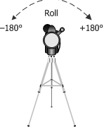

# KSPROPERTY\_CAMERACONTROL\_ROLL

User-mode clients use the KSPROPERTY\_CAMERACONTROL\_ROLL property to get or set a camera's roll setting. This property is optional.

## 

### Usage Summary Table

<table>
<colgroup>
<col width="20%" />
<col width="20%" />
<col width="20%" />
<col width="20%" />
<col width="20%" />
</colgroup>
<thead>
<tr class="header">
<th>Get</th>
<th>Set</th>
<th>Target</th>
<th>Property descriptor type</th>
<th>Property value type</th>
</tr>
</thead>
<tbody>
<tr class="odd">
<td>
Yes
</td>
<td>
Yes
</td>
<td>
Filter or node
</td>
<td>
<a href="https://msdn.microsoft.com/library/windows/hardware/ff564439" data-raw-source="[&lt;strong&gt;KSPROPERTY_CAMERACONTROL_S&lt;/strong&gt;](https://msdn.microsoft.com/library/windows/hardware/ff564439)"><strong>KSPROPERTY_CAMERACONTROL_S</strong></a> or <a href="https://msdn.microsoft.com/library/windows/hardware/ff564420" data-raw-source="[&lt;strong&gt;KSPROPERTY_CAMERACONTROL_NODE_S&lt;/strong&gt;](https://msdn.microsoft.com/library/windows/hardware/ff564420)"><strong>KSPROPERTY_CAMERACONTROL_NODE_S</strong></a>
</td>
<td>
LONG
</td>
</tr>
</tbody>
</table>

 

The property value (operation data) is a LONG that specifies a camera's roll setting. This value is expressed in degrees.

Positive values cause a clockwise rotation of the camera along the image-viewing axis. Negative values cause a counterclockwise rotation of the camera, as shown in the following illustration.

Every video capture minidriver that supports this property must define a range and default value for this property. The range for the device must be -180 through +180 and the default value must be 0.

Remarks
-------

The **Value** member of the KSPROPERTY\_CAMERACONTROL\_S structure specifies the roll setting.

Requirements
------------

<table>
<colgroup>
<col width="50%" />
<col width="50%" />
</colgroup>
<tbody>
<tr class="odd">
<td>
Header
</td>
<td>Ksmedia.h (include Ksmedia.h)</td>
</tr>
</tbody>
</table>

## See also

[**KSPROPERTY**](https://docs.microsoft.com/windows-hardware/drivers/ddi/content/ks/ns-ks-ksidentifier)

[**KSPROPERTY\_CAMERACONTROL\_S**](https://msdn.microsoft.com/library/windows/hardware/ff564439)

 

 

