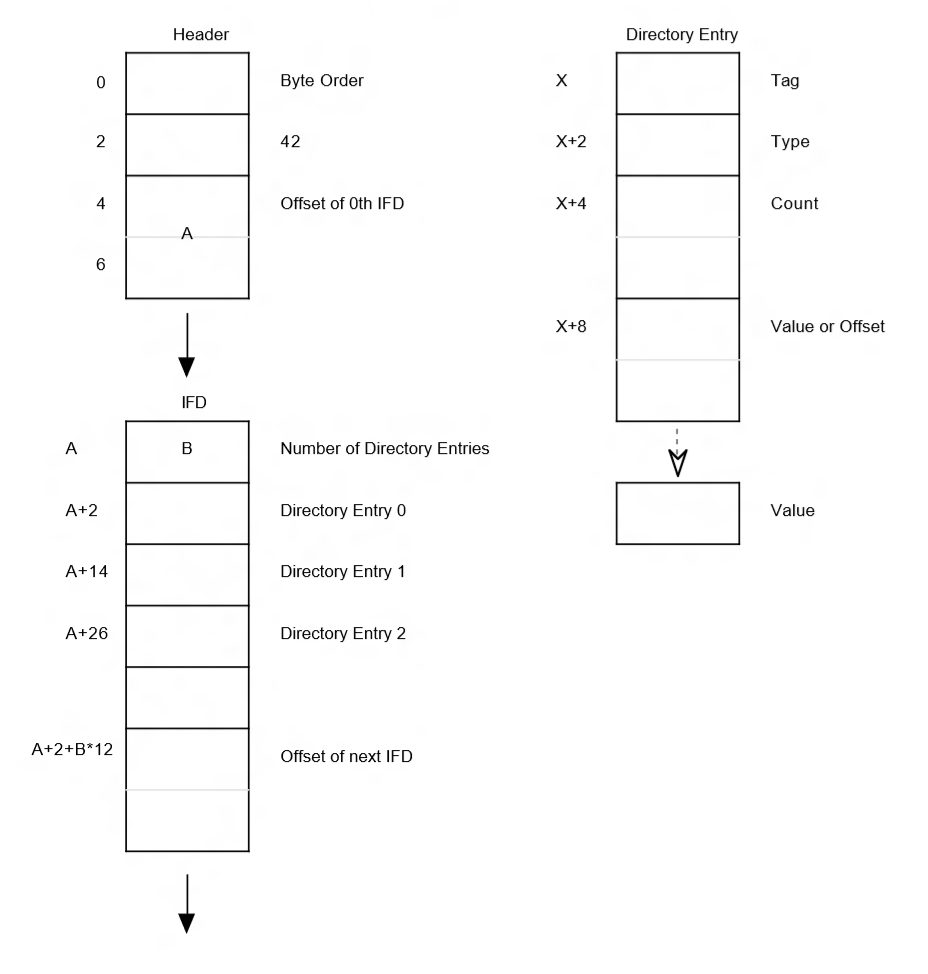

# Capture Stats Metadata Attributes

The table below summarizes the available capture stats IMFAttributes for
the MFT0's **MFSampleExtension\_CaptureMetaData** metadata attribute bag for preview, video, and still capture.

The capture stats listed for still is mandatory for every photo captured
unless otherwise indicated. The capture stats listed for preview and video
should be delivered as the best effort and the driver may or may not
deliver all capture stats on all frames based on the availability and
performance considerations.

| Name                                                                                              | Type             | Pin                   | Description            |
| ------------------------------------------------------------------------------------------------- | ---------------- | --------------------- | ---------------------- |
| [MF\_CAPTURE\_METADATA\_FOCUSSTATE](#mf_capture_metadata_focusstate)                              | UINT32           | Preview               | This attribute contains the current focus state which can take one of the following values. |
| [MF\_CAPTURE\_METADATA\_SENSORFRAMERATE](#mf_capture_metadata_sensorframerate)                    | UINT64           | Preview               | This attribute contains the measured sensor readout rate in hertz when a preview frame is captured, which consists of a numerator value in the upper 32 bit and a denominator value in the lower 32 bit. |
| [MF\_CAPTURE\_METADATA\_FACEROIS](#mf_capture_metadata_facerois)                                  | Blob             | Preview, Video        | This attribute contains the face rectangle info detected by the driver. |
| [MF\_CAPTURE\_METADATA\_FACEROITIMESTAMPS](#mf_capture_metadata_faceroitimestamps)                | Blob             | Preview, Video        | This attribute contains the time stamp info for the face ROIs identified in **MF\_CAPTURE\_METADATA\_FACEROIS**. |
| [MF\_CAPTURE\_METADATA\_FACEROICHARACTERIZATIONS](#mf_capture_metadata_faceroicharacterizations)  | Blob             | Preview, Video        | This attribute contains the blink and\\or facial expression state for the face ROIs identified in **MF\_CAPTURE\_METADATA\_FACEROIS**. |
| [MF\_CAPTURE\_METADATA\_EXPOSURE\_TIME](#mf_capture_metadata_exposure_time)                       | UINT64           | Preview, Still        | This attribute contains the exposure time applied in 100 nanoseconds |
| [MF\_CAPTURE\_METADATA\_EXPOSURE\_COMPENSATION](#mf_capture_metadata_exposure_compensation)       | Blob             | Preview, Still        | This attribute contains an EV compensation step flag and an EV compensation value in units of the step that was applied to the driver when the photo was captured. |
| [MF\_CAPTURE\_METADATA\_ISO\_SPEED](#mf_capture_metadata_iso_speed)                               | UINT32           | Preview, Still        | This attribute contains the ISO speed value applied as an integer. |
| [MF\_CAPTURE\_METADATA\_LENS\_POSITION](#mf_capture_metadata_lens_position)                       | UINT32           | Preview, Still        | This attribute contains the logical lens position when focus was applied to the photo captured. This value does not have a specific unit. |
| [MF\_CAPTURE\_METADATA\_SCENE\_MODE](#mf_capture_metadata_scene_mode)                             | UINT64           | Still                 | This attribute contains the scene mode applied as a **UINT64KSCAMERA_EXTENDEDPROP_SCENEMODE_XXX** flag. |
| [MF\_CAPTURE\_METADATA\_FLASH](#mf_capture_metadata_flash)                                        | UINT32 (Boolean) | Preview, Still        | This attribute contains a Boolean value that contains the flash state. A value of 1 specifies that the flash is on and a value of 0 specifies that the flash is off for the photo captured. |
| [MF\_CAPTURE\_METADATA\_FLASH\_POWER](#mf_capture_metadata_flash_power)                           | UINT32           | Still                 | \[Optional\] This attribute contains the flash power applied as a percentage value between 0 and 100. |
| [MF\_CAPTURE\_METADATA\_WHITEBALANCE](#mf_capture_metadata_whitebalance)                          | UINT32 (Kelvin)  | Preview, Still        | This attribute contains the white balance applied as a value in Kelvin. |
| [MF\_CAPTURE\_METADATA\_ZOOMFACTOR](#mf_capture_metadata_zoomfactor)                              | UINT32 (Q16)     | Still                 | This attribute contains the zoom value applied and is the same value that can be queried from [**KSPROPERTY_CAMERACONTROL_EXTENDED_ZOOM**](./ksproperty-cameracontrol-extended-zoom.md) in a GET call. The value must be in Q16. |
| [MF\_CAPTURE\_METADATA\_EXIF](#mf_capture_metadata_exif)                                          | Blob             | Still                 | \[Optional\] This attribute contains EXIF metadata as specified in the [blob definition section](#blob-definition) |
| [MF\_CAPTURE\_METADATA\_REQUESTED\_FRAME\_SETTING\_ID](#mf_capture_metadata_requested_frame_setting_id) | UINT32           | Still                | \[Optional\] This attribute contains the frame ID for the corresponding frame in the variable photo sequence. This attribute is only set for a variable photo sequence capture. |
| [MF\_CAPTURE\_METADATA\_ISO\_GAINS](#mf_capture_metadata_iso_gains)                               | Blob             | Preview               | This attribute contains the analog and digital gains applied to the senor when the preview frame was captured. This is unitless. |
| [MF\_CAPTURE\_METADATA\_WHITEBALANCE\_GAINS](#mf_capture_metadata_whitebalance_gains)             | Blob             | Preview               | This attribute contains the white balance gains applied to R, G, B by the sensor and\\or ISP when the preview frame was captured. This is a unitless. |
| [MF\_CAPTURE\_METADATA\_HISTOGRAM](#mf_capture_metadata_histogram)                                | Blob             | Preview               | This attribute contains the histogram when apreview frame is captured. |
| [MF\_CAPTURE\_METADATA\_FRAME\_ILLUMINATION](#mf_capture_metadata_frame_illumination)             | UINT64           | IR Pin used for Hello | This attribute for IR cameras specifies whether the frames are using active IR illumination and should be used in conjunction with **FACEAUTH_MODE_ALTERNATIVE_FRAME_ILLUMINATION**. |
| Any Custom GUID                                                                                   | Any variant type |                       | This attribute contains the custom data associated with the custom GUID |

## MF_CAPTURE_METADATA_FOCUSSTATE

MF\_CAPTURE\_METADATA\_FOCUSSTATE attribute contains the current focus
state which can take one of the following values.

```cpp
typedef enum
{
    KSCAMERA_EXTENDEDPROP_FOCUSSTATE_UNINITIALIZED = 0,
    KSCAMERA_EXTENDEDPROP_FOCUSSTATE_LOST,
    KSCAMERA_EXTENDEDPROP_FOCUSSTATE_SEARCHING,
    KSCAMERA_EXTENDEDPROP_FOCUSSTATE_FOCUSED,
    KSCAMERA_EXTENDEDPROP_FOCUSSTATE_FAILED,
} KSCAMERA_EXTENDEDPROP_FOCUSSTATE;
```

## MF_CAPTURE_METADATA_SENSORFRAMERATE

MF\_CAPTURE\_METADATA\_SENSORFRAMERATE attribute contains the measured
sensor readout rate in hertz when a preview frame is captured, which
consists of a numerator value in the upper 32 bit and a denominator
value in the lower 32 bit.

## MF_CAPTURE_METADATA_FACEROIS

MF\_CAPTURE\_METADATA\_FACEROIS attribute contains the face rectangle
info detected by the driver. By default driver\\MFT0 should provide the
face info on preview stream. If driver advertises the capability on
other streams, driver\\MFT must provide the face info on the
corresponding streams if the application enables face detection on those
streams. When video stabilization is enabled on driver, the face info
should be provided post the video stabilization. The data structures
below describe the blob format for MF\_CAPTURE\_METADATA\_FACEROIS. The
dominate face must be the first FaceRectInfo in the blob.

```cpp
typedef struct tagFaceRectInfoBlobHeader
{
    ULONG Size;             // Size of this header + all FaceRectInfo following
    ULONG Count;            // Number of FaceRectInfo’s in the blob
} FaceRectInfoBlobHeader;

typedef struct tagFaceRectInfo
{
    RECT Region;            // Relative coordinates on the frame that face detection is running (Q31 format)
    LONG ConfidenceLevel;   // Confidence level of the region being a face ([0, 100])
} FaceRectInfo;
```

Note that FaceRectinfoBlobHeader and FaceRectInfo structs only describe
the blob format for the MF\_CAPTURE\_METADATA\_FACEROIS attribute. The
metadata item structure for face ROIs (KSCAMERA\_METADATA\_ITEMHEADER +
face ROIs metadata payload) is up to driver and must be 8-byte aligned.

By design, if a stream is configured with face detection enabled and the
scene in question does not contain any faces during capture, the driver
is still required to attach a “dummy” MF\_CAPTURE\_METADATA\_FACEROIS
attribute to each sample which has no face information associated with
it. (A “dummy” face ROI attribute has the *Count* field of the
*FaceRectInfoBlobHeader* structure set to zero.)

## MF_CAPTURE_METADATA_FACEROITIMESTAMPS

MF\_CAPTURE\_METADATA\_FACEROITIMESTAMPS attribute contains the time
stamp info for the face ROIs identified in
MF\_CAPTURE\_METADATA\_FACEROIS. For the device that cannot provide the
time stamp for face ROIs, this attribute should be omitted.

The data structure below describes the blob format for
MF\_CAPTURE\_METADATA\_FACEROITIMESTAMPS.

```cpp
typedef struct tagMetadataTimeStamps
{
    ULONG Flags;            // Bitwise OR of MF_METADATATIMESTAMPS_XXX flags
    LONGLONG Device;        // QPC time for the sample where the face rect is derived from (in 100ns)
    LONGLONG Presentation;  // PTS for the sample where the face rect is derived from (in 100ns)
} MetadataTimeStamps;
```

For Flags field, we will define the following bit flags to indicate
which time stamp is valid. MFT0 must set Flags to
MF\_METADATATIEMSTAMPS\_DEVICE and the appropriate QPC time for Device,
if the driver provides the timestamp metadata for the face ROIs.

\#define MF\_METADATATIMESTAMPS\_DEVICE 0x00000001

\#define MF\_METADATATIMESTAMPS\_PRESENTATION 0x00000002

Note that MetadataTimeStamps struct only describes the blob format for
the MF\_CAPTURE\_METADATA\_FACEROITIMESTAMPS attribute. The metadata
item structure for timestamp (KSCAMERA\_METADATA\_ITEMHEADER + timestamp
metadata payload) is up to driver and must be 8-byte aligned.

## MF_CAPTURE_METADATA_FACEROICHARACTERIZATIONS

MF\_CAPTURE\_METADATA\_FACEROICHARACTERIZATIONS attribute contains the
blink and\\or facial expression state for the face ROIs identified in
MF\_CAPTURE\_METADATA\_FACEROIS.  For the device that doesn’t support
blink and\\or facial expression detection, this attribute should be
omitted.

The data structure below describes the blob format for
MF\_CAPTURE\_METADATA\_FACEROICHARACTERIZATIONS.

Note that FaceCharacterizationBlobHeader and FaceCharacterization
structs only describe the blob format for the
MF\_CAPTURE\_METADATA\_FACEROICHARACTERIZATIONS attribute. The metadata
item structure for the face characterizations
(KSCAMERA\_METADATA\_ITEMHEADER + face characterizations metadata
payload) is up to driver and must be 8-byte aligned.

```cpp
typedef struct tagFaceCharacterizationBlobHeader
{
    ULONG Size;     // Size of this header + all FaceCharacterization following
    ULONG Count;    // Number of FaceCharacterization’s in the blob. Must match the number of FaceRectInfo’s in FaceRectInfoBlobHeader
} FaceCharacterizationBlobHeader;

typedef struct tagFaceCharacterization
{
    ULONG BlinkScoreLeft;   // [0, 100]. 0 indicates no blink for the left eye. 100 indicates definite blink for the left eye
    ULONG BlinkScoreRight;  // [0, 100]. 0 indicates no blink for the right eye. 100 indicates definite blink for the right eye
    ULONG FacialExpression; // Any one of the MF_METADATAFACIALEXPRESSION_XXX defined
    ULONG FacialExpressionScore; // [0, 100]. 0 indicates no such facial expression as identified. 100 indicates definite such facial expression as defined
} FaceCharacterization;
```

The following defines the possible facial expression that can be
detected.  

```cpp
#define MF_METADATAFACIALEXPRESSION_SMILE             0x00000001
```

If MF\_CAPTURE\_METADATA\_FACEROICHARACTERIZATIONS attribute presents,
the number and the order of FaceCharacterization entries in its blob
must match the number and the order of the FaceRectInfo entries in the
blob of MF\_CAPTURE\_METADATA\_FACEROIS.   Each FaceCharacterization
entry represents the blink and\\or facial expression state of the face
in the corresponding FaceRectInfo entry at the same index.

The figure below illustrates the layouts of a face characterizations
blob and a face ROIs blob of four faces with the first one neither
blinking nor smiling, the second one blinking left eye, the third one
smiling, and the fourth one both blinking (both eyes) and smiling.

## MF_CAPTURE_METADATA_EXPOSURE_TIME

MF\_CAPTURE\_METADATA\_EXPOSURE\_TIME attribute contains the exposure
time applied to the sensor when preview and\\or photo frame was captured
which is a UINT64 and is in 100ns.

## MF_CAPTURE_METADATA_EXPOSURE_COMPENSATION

MF\_CAPTURE\_METADATA\_EXPOSURE\_COMPENSATION attribute contains an EV
compensation step flag and an EV Compensation value in units of the step
applied to the sensor when preview and\\or photo frame was captured.

The data structure below describes the blob format for
MF\_CAPTURE\_METADATA\_EXPOSURE\_COMPENSATION.

```cpp
typedef struct tagCapturedMetadataExposureCompensation
{
    UINT64 Flags;   // KSCAMERA_EXTENDEDPROP_EVCOMP_XXX step flag
    INT32 Value;    // EV Compensation value in units of the step
} CapturedMetadataExposureCompensation;
```

Note that CapturedMetadataExposureCompensation struct only describes the
blob format for the MF\_CAPTURE\_METADATA\_EXPOSURE\_COMPENSATION
attribute. The metadata item structure for EV compensation
(KSCAMERA\_METADATA\_ITEMHEADER + EV compensation metadata payload) is
up to driver and must be 8-byte aligned.

## MF_CAPTURE_METADATA_ISO_SPEED

MF\_CAPTURE\_METADATA\_ISO\_SPEED attributes contains the ISO speed
value applied to the sensor when preview and\\or photo frame was
captured. This is unitless.

## MF_CAPTURE_METADATA_ISO_GAINS

MF\_CAPTURE\_METADATA\_ISO\_GAINS attribute contains the analog and
digital gains applied to the senor when the preview frame was captured.
This is unitless.

The data structure below describes the blob format for
MF\_CAPTURE\_METADATA\_ISO\_GAINS.

```cpp
typedef struct tagCapturedMetadataISOGains
{
    FLOAT AnalogGain;
    FLOAT DigitalGain;
} CapturedMetadataISOGains;
```

Note that CapturedMetadataISOGains struct only describes the blob format
for the MF\_CAPTURE\_METADATA\_ISO\_GAINS attribute. The metadata item
structure for ISO gains (KSCAMERA\_METADATA\_ITEMHEADER + ISO gains
metadata payload) is up to driver and must be 8-byte aligned.

## MF_CAPTURE_METADATA_LENS_POSITION

MF\_CAPTURE\_METADATA\_LENS\_POSITION attribute contains the logical
lens position when preview and\\or photo frame was captured, which is
unitless. This is the same value that can be queried from
KSPROPERTY\_CAMERACONTROL\_EXTENDED\_FOCUS in a GET call.

## MF_CAPTURE_METADATA_SCENE_MODE

MF\_CAPTURE\_METADATA\_SCENE\_MODE attribute contains the scene mode
applied to the photo captured which is a 64bit
KSCAMERA\_EXTENDEDPROP\_SCENEMODE\_XXX flag.

## MF_CAPTURE_METADATA_FLASH

MF\_CAPTURE\_METADATA\_FLASH attribute contains a boolean value when
preview and\\or photo frame was captured, with 1 meaning flash on and 0
meaning flash off.

## MF_CAPTURE_METADATA_FLASH_POWER

MF\_CAPTURE\_METADATA\_FLASH\_POWER attribute contains the flash power
applied to the photo captured which is a value in the range of \[0,
100\]. This attribute should be omitted if the driver does not support
adjustable power for flash.

## MF_CAPTURE_METADATA_WHITEBALANCE

MF\_CAPTURE\_METADATA\_WHITEBALANCE attribute contains the white balance
applied to the sensor when preview and\\or photo frame was captured,
which is a value in Kevin.

## MF_CAPTURE_METADATA_WHITEBALANCE_GAINS

MF\_CAPTURE\_METADATA\_WHITEBALANCE\_GAINS attribute contains the white
balance gains applied to R, G, B by the sensor and\\or ISP when the
preview frame was captured. This is a unitless.

The data structure below describes the blob format for
MF\_CAPTURE\_METADATA\_WHITEBALANCE\_GAINS.

```cpp
typedef struct tagCapturedMetadataWhiteBalanceGains
{
    FLOAT R;
    FLOAT G;
    FLOAT B;
} CapturedMetadataWhiteBalanceGains;
```

Note that CapturedMetadataWhiteBalanceGains struct only describes the
blob format for the MF\_CAPTURE\_METADATA\_WHITEBALANCE\_GAINS
attribute. The metadata item structure for white balance gains
(KSCAMERA\_METADATA\_ITEMHEADER + white balance gains metadata payload)
is up to driver and must be 8-byte aligned.

## MF_CAPTURE_METADATA_ZOOMFACTOR

MF\_CAPTURE\_METADATA\_ZOOMFACTOR attribute contains the zoom value
applied to the photo captured which is the same value that can be
queried from KSPROPERTY\_CAMERACONTROL\_EXTENDED\_ZOOM in a GET call.
This should be in Q16.

## MF_CAPTURE_METADATA_EXIF

MF\_CAPTURE\_METADATA\_EXIF contains EXIF metadata as specified in
Section 3.1 (Blob definition). MFT0 shall extract the raw EXIF metadata,
which is identified as a custom metadata item (MetadataId \>=
MetadataId\_Custom\_Start), from the
MF\_CAPTURE\_METADATA\_FRAME\_RAWSTREAM buffer provided by the driver.
MFT0 shall then convert the raw data into a MF\_CAPTURE\_METADATA\_EXIF
attribute.

### Blob definition

The blob shall consist of a complete TIFF header, 0th IFD and EXIF
sub-IFD as defined by the EXIF 2.3 and TIFF 6.0 specifications. The blob
shall not contain any data before the TIFF header. The blob shall not
contain any data after the end of the 0th IFD. For example, it is not
valid to include an IFD containing thumbnail data.

The following diagram, copied from the TIFF specification, illustrates
the expected memory layout:



The following are requirements that are consistent with the EXIF and
TIFF specifications but are called out for emphasis:

- The byte order shall be either little endian (“II”) or big endian(“MM”).
- Pointers (“byte offsets” in the TIFF specification) shall be relative to
  the beginning of the TIFF header.

The following are requirements that are more restrictive than the EXIF
and TIFF specifications:

- The offset to the next IFD shall be 0, i.e. no additional IFDs are pointed to.
- The TIFF header and 0th IFD shall be contiguous, i.e. the offset to the 0th
  IFD as stored in bytes 4-7 shall be 0x8.

### Mandatory EXIF metadata

The section below describes EXIF metadata that must be included in
MF\_CAPTURE\_METADATA\_EXIF .

| Name                  | EXIF Tag  | Description                                                           |
| --------------------- | --------- | --------------------------------------------------------------------- |
| Orientation           | 274       | Image orientation viewed in terms of rows and columns. See EXIF spec for complete description |
| Make                  | 271       | The manufacturer of the recording equipment                           |
| Model                 | 272       | The model name or the model number of the device                      |
| XResolution           | 282       | The number of pixels per resolution unit in the ImageWidth direction  |
| YResolution           | 283       | The number of pixels per resolution unit in the ImageLength direction |
| ResolutionUnit        | 296       | The unit for measuring XResolution and YResolution                    |
| Software              | 305       | Name and version of the firmware                                      |
| ColorSpace            | 40961     | The color space information, typically sRGB                           |
| SubsSecTimeOriginal   | 37521     | Records fractions of seconds associated with DateTimeOriginal tag     |
| SubSecTimeDigitized   | 37522     | Records fractions of seconds associated with DateTimeDigitized tag    |
| ExposureTime          | 33434     | Exposure time in seconds (accurate to 0.001s)                         |
| FNumber               | 33437     | The F number used for capture                                         |
| ISOSpeedRatings       | 34855     | ISO speed value as defined in ISO 12322, saturation based             |
| DateTimeOriginal      | 36867     | Date and time when the original image data was generated              |
| DateTimeDIgitized     | 36868     | The date and time when theimage as stored as digital data             |
| Shutter SpeedValue    | 37377     | Shutter speed in Additive System of Photographic Exposure (APEX) units|
| Aperture Value        | 37378     | The lens aperture in APEX units                                       |
| ExposureBias Value    | 37380     | Exposure Bias value in APEX units                                     |
| MeteringMode          | 37383     | AE metering mode (see EXIF spec)                                      |
| LightSource           | 37384     | The kind of light source (see EXIF spec)                              |
| Flash                 | 37385     | Status of the flash during image capture                              |
| FocalLength           | 37386     | The actual focal length of the lens                                   |
| ExposureMode          | 41986     | Exposure Mode during capture                                          |
| WhiteBalance          | 41987     | White balance mode during capture                                     |
| DigitalZoomRatio      | 41988     | Digital zoom ratio during image capture                               |
| FocalLengthIn35mmFilm | 41989     | 35 mm equivalent focal length                                         |
| SceneCaptureType      | 41990     | Type of scene that was shot                                           |

### Optional/OEM-defined metadata

The camera driver may include any additional metadata in the form of
custom EXIF tags as long as it conforms to the EXIF specification and is
stored in either the 0th TIFF IFD or the EXIF sub-IFD.

### MakerNote requirements and binary layout expectations

The camera driver may include manufacturer-proprietary information in
the form of a maker note (tag 37500). The maker note must not contain
any pointers to, or otherwise rely on, data that is outside of the maker
note itself, including the start of the file and the position of the
TIFF header. In addition, it must not make assumptions about the
endianness of the file as specified in the TIFF header.

In general, the operating system makes no guarantees that the binary
layout of the metadata blob is preserved when it is written to the
output JPEG stream. It only guarantees that the metadata is written out
in conformance with the EXIF specification. For example, it only
guarantees that the maker note is copied as a contiguous block and is
identified by the correct IFD tag, type, and offset.

### Usage with WIC JPEG encoder

The intended usage of MF\_CAPTURE\_METADATA\_EXIF is with the
OS-provided Windows Imaging Component (WIC) JPEG encoder. Windows Camera
pipeline uses the Windows WIC JPEG encoder to consume EXIF metadata
obtained from MF\_CAPTURE\_METADATA\_EXIF and muxes this with image
pixel data into a JPEG file when the application is not capturing a JPEG
directly from camera, but configured pipeline to capture to NV12/YUY2
and get encoded by the OS

## MF_CAPTURE_METADATA_REQUESTED_FRAME_SETTING_ID

MF\_CAPTURE\_METADATA\_REQUESTED\_FRAME\_SETTING_ID attribute contains the
frame ID for the corresponding frame in the variable photo sequence. This
attribute is only set for a variable photo sequence capture.

## MF_CAPTURE_METADATA_FRAME_ILLUMINATION

MF\_CAPTURE\_METADATA\_FRAME\_ILLUMINATION attribute for IR cameras
specifies whether the frames is using active IR illumination and should
be used in conjunction with
FACEAUTH\_MODE\_ALTERNATIVE\_FRAME\_ILLUMINATION. It is only used for IR
samples and should not be present on RGB frames if the camera supports
both IR and color samples.

Value should be set to 0xXXXXXXXXXXXXXXX1 if frame was captured when
active illumination was on and set to 0xXXXXXXXXXXXXXXX0 if no
illumination was present when capturing the frame.

## MF_CAPTURE_METADATA_HISTOGRAM

MF\_CAPTURE\_METADATA\_HISTOGRAM attribute contains the histogram when apreview frame is captured.

The data structures below describe the blob format for MF\_CAPTURE\_METADATA\_HISTOGRAM.

```cpp
typedef struct tagHistogramGrid
{
    ULONG Width;    // Width of the sensor output that histogram is collected from
    ULONG Height;   // Height of the sensor output that histogram is collected from
    RECT Region;    // Absolute coordinates of the region on the sensor output that the histogram is collected for
} HistogramGrid;

typedef struct tagHistogramBlobHeader
{
    ULONG Size;         // Size of the entire histogram blob in bytes
    ULONG Histograms;   // Number of histograms in the blob. Each histogram is identified by a HistogramHeader
} HistogramBlobHeader;

typedef struct tagHistogramHeader
{
    ULONG Size;         // Size of this header + (HistogramDataHeader + histogram data following) * number of channels available
    ULONG Bins;         // Number of bins in the histogram
    ULONG FourCC;       // Color space that the histogram is collected from
    ULONG ChannelMasks; // Masks of the color channels that the histogram is collected for
    HistogramGrid Grid; // Grid that the histogram is collected from
} HistogramHeader;

typedef struct tagHistogramDataHeader
{
    ULONG Size;         // Size in bytes of this header + histogram data following
    ULONG ChannelMask;  // Mask of the color channel for the histogram data
    ULONG Linear;       // 1, if linear; 0 nonlinear
} HistogramDataHeader;
```

For ChannelMasks field, we will define the following bitmasks to
indicate the available channels in the histogram.

```cpp
#define MF_HISTOGRAM_CHANNEL_Y  0x00000001
#define MF_HISTOGRAM_CHANNEL_R  0x00000002
#define MF_HISTOGRAM_CHANNEL_G  0x00000004
#define MF_HISTOGRAM_CHANNEL_B  0x00000008
#define MF_HISTOGRAM_CHANNEL_Cb 0x00000010
#define MF_HISTOGRAM_CHANNEL_Cr 0x00000020
```

Notes:

1. Each blob can contain multiple histograms collected from different
   regions or different color spaces of the same frame
2. Each histogram in the blob is identified by its own HistogramHeader
3. Each histogram has its own region and sensor output size associated.
   For full frame histogram, the region will match the sensor output
   size specified in HistogramGrid.
4. Histogram data for all available channels are grouped under one
   histogram. Histogram data for each channel is identified by a
   HistogramDataHeader immediate above the data. ChannelMasks indicate
   how many and what channels are having the histogram data, which is
   the bitwise OR of the supported MF\_HISTOGRAM\_CHANNEL\_XXX bitmasks
   as defined above. ChannelMask indicates what channel the data is
   for, which is identified by any one of the
   MF\_HISTOGRAM\_CHANNEL\_XXX bitmasks defined above.

The figure below illustrates the layout of a histogram blob with a full
frame Y-only histogram.

Histogram data is an array of ULONG with each entry representing the
number of pixels falling under a set of tonal values as categorized by
the bin. The data in the array should start from bin 0 to bin N-1, where
N is the number of bins in the histogram, i.e.,
HistogramBlobHeader.Bins.

The figure below illustrates the layout of the histogram data section.

The figure below illustrates the layout of a histogram blob with a
full-frame YRGB histogram with four channels.

The figure below illustrates the layout of a histogram blob with a
Y-only histogram followed by a RGB histogram with three channels.

For Threshold, at minimum a full frame histogram with Y channel must be
provided which should be the first histogram in the histogram blob, if
KSPROPERTY\_CAMERACONTROL\_EXTENDED\_HISTOGRAM is supported.

Note that HistogramBlobHeader, HistogramHeader, HistogramDataHeader and
Histogram data only describe the blob format for the
MF\_CAPTURE\_METADATA\_HISTOGRAM attribute. The metadata item structure
for the histogram (KSCAMERA\_METADATA\_ITEMHEADER + all histogram
metadata payload) is up to driver and must be 8-byte aligned.

## Histogram Metadata Control

KSPROPERTY\_CAMERACONTROL\_EXTENDED\_HISTOGRAM is a property ID that
will be used to control the histogram metadata produced by the driver.
This is a pin level control for preview pin only and is defined as
following:

```cpp
typedef enum {
    …
#if (NTDDI_VERSION >= NTDDI_WIN8)
    KSPROPERTY_CAMERACONTROL_EXTENDED_HISTOGRAM
#endif
} KSPROPERTY_CAMERACONTROL_EXTENDED_PROPERTY;
```

For KSCAMERA\_EXTENDEDPROP\_HEADER, we will define the following bit
flags to control the histogram metadata in driver. The default is OFF.

```cpp
#define KSCAMERA_EXTENDEDPROP_HISTOGRAM_OFF 0x0000000000000000
#define KSCAMERA_EXTENDEDPROP_HISTOGRAM_ON  0x0000000000000001
```

This control must be used before the
KSPROPERTY\_CAMERACONTROL\_EXTENDED\_METADATA control to ensure the
proper sized metadata buffer is allocated.

If set to HISTOGRAM\_OFF, the driver shall not deliver the histogram
metadata on preview pin. The driver should not include the histogram
metadata size in its metadata buffer size requirement.

If set to HISTOGRAM\_ON, the driver shall deliver the histogram metadata
on preview pin. The driver must include the histogram metadata size in
its metadata buffer size requirement.

If the driver does not have the capability to produce histogram
metadata, the driver should not implement this control. If the driver
supports this control, it must also support
KSPROPERTY\_CAMERACONTROL\_EXTENDED\_METADATA control.

The SET call of this control has no effect when the preview pin is inany
state higher than the KSSTATE\_STOP state. The driver shall reject the
SET call received if preview is not in the stop state and returns
STATUS\_INVALID\_DEVICE\_STATE. In a GET call, driver should return the
current settings in Flags field.

This is a synchronous control. There are no capabilities defined for
this control.

### KSCAMERA_EXTENDEDPROP_HEADER

#### Version

Must be 1.

#### PinId

Must be the Pin ID associated with the preview pin.

#### Size

Must be `sizeof(KSCAMERA_EXTENDEDPROP_HEADER) + sizeof(KSCAMERA_EXTENDEDPROP_VALUE)`

#### Result

Indicates the error results of the last SET operation. If no SET operation has taken place, this must be 0.

#### Capability

Must be 0.

#### Flags

This is a read/write field. This can be any one of the `KSCAMERA_EXTENDEDPROP_HISTOGRAM_XXX` flags defined above.

### KSCAMERA_EXTENDEDPROP_VALUE

Not used