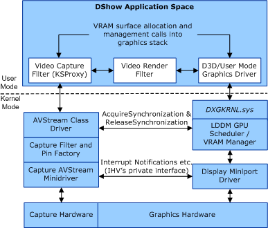

# Overview of VRAM Capture in AVStream

To support capture to VRAM, the vendor adds functionality within the Windows Vista display driver stack. Specifically, the vendor supplies a pin-centric AVStream minidriver that supports specific KS properties. While it is possible to include the AVStream functionality within the display miniport driver, Microsoft recommends that the minidriver instead be subordinate to the display miniport driver. To view a diagram that explains how the display miniport driver fits into the Windows Vista display driver stack, go to the Windows Vista Display Driver Model Architecture topic.

This documentation describes how to implement such a separate stand-alone capture minidriver.

A capture driver can send data to any DXVA2-aware downstream filter, for example, a renderer or an encoder.

The following diagram shows how a VRAM capture-enabled AVStream minidriver interacts with the display miniport driver and with other modules.

 

 

