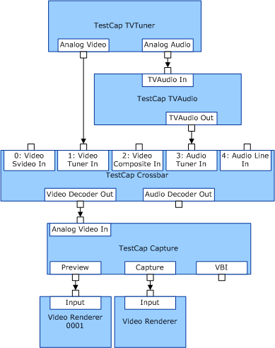

# PCI-Based TV Capture

PCI-based capture devices with TV/radio tuners, TV audio, and crossbars require complex filter graphs, and have hardware that is often capable of bus mastering separate preview and capture streams, each with a potentially different color space and frame dimensions. Such devices can also provide separate streams for VBI or timecode.

The following diagram shows separate renderers connected to the preview and capture streams.

The [PROPSETID\_ALLOCATOR\_CONTROL](https://msdn.microsoft.com/library/windows/hardware/ff567792) property set is specific to this type of filter graph.

An optional variation for this type of filter graph is to connect the preview pin to the Video Mixer/Renderer (VMR) DirectShow filter instead of the standard video renderer by using the [**KS\_VIDEOINFOHEADER2**](https://msdn.microsoft.com/library/windows/hardware/ff567702) structure format. When configured in this mode, with a display device that supports the video port manager (VPM) and [video port extensions](video-port-based-capture.md) (VPEs) kernel-mode video transport, buffers are passed to the capture device along with the Microsoft DirectDraw surface handles in the [**KS\_FRAME\_INFO**](https://msdn.microsoft.com/library/windows/hardware/ff567645) structure.

The video capture minidriver then can retain ownership of the buffers indefinitely -- locking, filling, unlocking, and flipping the surfaces as they are captured. The minidriver must register for notifications that indicate loss of surfaces while running full-screen MS-DOS applications or exclusive-mode games. In these cases, the minidriver should complete the buffers back to the capture filter.

If your video capture hardware includes an FM radio tuner, see [Video Capture Devices with Radio Tuners](video-capture-devices-with-radio-tuners.md).

 

 

