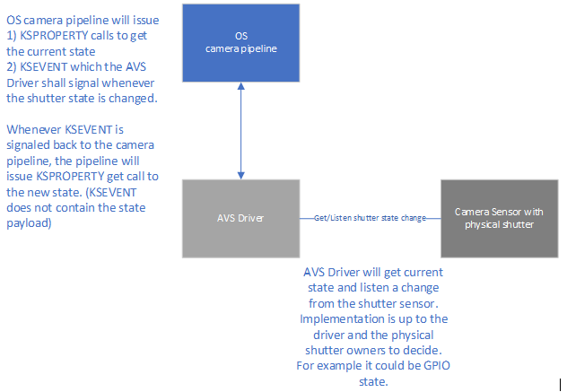

# Privacy shutter/switch notification

Some camera manufacturers may wish to include physical shutters or kill switches that can block the camera using a physical control unable to be overridden by software. These features are not encouraged due to the risk of inadvertent activation and resulting customer confusion, but if implemented, they must follow the guidance described in [Camera privacy shutters and kill switches](camera-privacy-controls.md), including to report the state of the shutter/switch. 

When a shutter is closed or a kill switch is active, the camera continues to be fully functional to Windows and applications using existing camera APIs, but the image or video stream will be black or dark (or replaced with a static image, such as a picture of the device with an arrow pointing to the location of the physical control). This raises potential issues where applications that are accessing the camera are not aware that the camera is occluded, and end users who unintentionally activated the physical control may be confused about why their camera is not working as expected.

To address these concerns, cameras implementing shutters or kill switches must implement a mechanism to detect the state of the shutter/switch and report it to the operating system. This topic provides guidance for OEMs and ODMs that will be implementing this reporting mechanism, and also describes the controls and structures that camera driver developers will use to publish the shutter/switch state to the OS.

In addition to the privacy shutter/switch notification feature, the OS implements camera occlusion detection where a front faced camera (FFC) is occluded by the device lid when the [lid switch close action](/windows-hardware/customize/power-settings/power-button-and-lid-settings-lid-switch-close-action) is set to "Do Nothing", for example, a computer will not go to sleep or power off when the lid is closed. An example scenario could be a docked laptop with external monitors in use while the laptop's lid is closed. There may be some device form factors where this behavior is not wanted, therefore, a mechanism to opt-out of device lid occlusion detection is defined below.

## Architectural overview

The [**KSPROPERTY_CAMERACONTROL_PRIVACY**](./ksproperty-cameracontrol-privacy.md) control is used when the OS is querying the current state from a camera driver. It should only be used as a Get property. Driver developers must not support the **KSPROPERTY_CAMERACONTROL_PRIVACY** control Set property in their drivers.

> [!NOTE]
> Cameras implementing privacy shutters or kill switches must conform to the requirements described in [Camera privacy shutters and kill switches](camera-privacy-controls.md).

In the USB Video Class (UVC) driver, the **KSPROPERTY_CAMERACONTROL_PRIVACY** control is mapped to the **CT_PRIVACY_CONTROL** property defined in the [UVC v1.5 Class Specification](https://www.usb.org/sites/default/files/USB_Video_Class_1_5.zip).



In addition to the use of the existing **KSPROPERTY** control, **KSPROPERTY_CAMERACONTROL_PRIVACY**, a new **KSEVENT** calling flow is introduced so the camera driver can signal when the camera's privacy shutter/switch state is changed if there are clients registering for that **KSEVENT**.

The **KSEVENT** is issued by using the same Set GUID and Id as the **KSPROPERTY** is using.

To clarify what is shown in the diagram above, the OS is expecting the AVS driver to implement mechanism, if the driver developer chooses to support this feature, to get and listen state changes that the shutter sensor is generating. The OS queries the state via the **KSPROPERTY** get method and issue a waiting **KSEVENT** that the driver will signal when the shutter state is changed. The shutter/switch state change must not prevent the camera from functioning, for example, to cause an error situation.

**NOTE:** If the AVS driver supports this feature but the underlying hardware does not, the AVS driver shall return not supported error when the OS issues the **KSEVENT** registration.

## Sensing and Reporting methods

Some cameras sense shutter state using a pixel analysis algorithm running in the Image Signal Processor (ISP) firmware. This imposes a limitation on those cameras that the camera must be actively streaming to sense and report the shutter state. See [Shutter state sensing and reporting](camera-privacy-controls.md#shutter-state-sensing-and-reporting) for more details about when and how the camera must report its shutter/switch state.

Similarly, application developers utilizing the camera occlusion signal must not utilize the reported shutter state unless the camera is actively streaming. See [CameraOcclusionInfo Class](/uwp/api/windows.media.devices.cameraocclusioninfo?view=winrt-22000&preserve-view=true) for more details.

## KSPROPERTY

### Usage Summary Table (KSPROPERTY)

| **Get** | **Set** | **Target** | **Property descriptor type** | **Property value type** |
|--|--|--|--|--|
| Yes | No | Filter | [**KSPROPERTY_CAMERACONTROL_S**](/windows-hardware/drivers/ddi/ksmedia/ns-ksmedia-ksproperty_cameracontrol_s) | LONG |

The property value (operation data) is a LONG that specifies whether privacy mode is enabled or disabled:

- A value of 0 indicates that the camera sensor can capture video images

- A value of 1 indicates that the camera sensor is prevented from capturing video images

The **KSPROPERTY_CAMERA_CONTROL_S** structure must be filled as follows:

| Structure member | Value |
|--|--|
| **KSPROPERTY.Set** | Must be [**PROPSETID_VIDCAP_CAMERACONTROL**](./propsetid-vidcap-cameracontrol.md) |
| **KSPROPERTY.Id** | Must be [**KSPROPERTY_CAMERACONTROL_PRIVACY**](./ksproperty-cameracontrol-privacy.md) |
| **KSPROPERTY.Flags** | Must be **KSPROPERTY_TYPE_GET** |
| **Value** | Initialize to 0 |
| **Flags** | Ignored, set to 0 |
| **Capabilities** | Ignored, set to 0 |

## KSEVENT

### Usage Summary Table (KSEVENT)

| **Get** | **Set** | **Target** | **Event descriptor type** | **Event value type** |
|--|--|--|--|--|
| No | Yes | Filter | [**KSEVENT**](./ksevent-structure.md) | [**KSEVENTDATA**](/windows-hardware/drivers/ddi/ks/ns-ks-kseventdata) |

The **KSEVENT** structure must be filled as follows:

| Structure member | Value |
|--|--|
| **Set** | Must be [**PROPSETID_VIDCAP_CAMERACONTROL**](./propsetid-vidcap-cameracontrol.md) |
| **Id** | Must be [**KSPROPERTY_CAMERACONTROL_PRIVACY**](./ksproperty-cameracontrol-privacy.md) |
| **Flags** | **KSEVENT_TYPE_ENABLE** |

The **KSEVENTDATA** structure must be filled as follows:

| Structure member | Value |
|--|--|
| **NotificationType** | Must be **KSEVENTF_EVENT_HANDLE** |

## Opt out of device lid occlusion detection

To opt out of the device lid occlusion detection, OEMs can define the following Device Property Key:

```output
DEVPROPKEY

    DEVPROPGUID = {3AB8560B-EFCF-43C1-A7EC-130E46857AF4}

    DEVPROPID = 2

DEVPROPTYPE = DEVPROP_TYPE_UINT32

PropertyBuffer = (ULONG) 1

PropertyBufferSize = sizeof(ULONG)
```

> [!NOTE]
> Setting the PropertyBuffer value to 0 is the same as not defining the Device Property Key at all.

The Device Property Key can be provided either in a driver INF file by using [**AddProperty**](../install/inf-addproperty-directive.md) or by using an MS OS descriptor if there is no INF file, for example, a USB camera using the UVC inbox camera driver.

### INF AddProperty example

```inf
[OptOutLidOcclusionSampleAddPropertySection]

{3AB8560B-EFCF-43C1-A7EC-130E46857AF4},2,7,,1
```

### MS OS descriptor example

```cpp
UCHAR Example2_MSOS20DescriptorSet_UVCDevicePropertyKeyForLidOcclusionOptOut[0x76] =
{
    //
    // Microsoft OS 2.0 Descriptor Set Header
    //
    0x0A, 0x00, // wLength of MSOS20_SET_HEADER_DESCRIPTOR (10 bytes)
    0x00, 0x00, // wDescriptorType MSOS20_SET_HEADER_DESCRIPTOR
    0x00, 0x00, 0x00, 0x0A, // dwWindowsVersion – 0x10000000 for Windows 10
    0x76, 0x00, // wTotalLength – 0x76(118) bytes
    
    //
    // Microsoft OS 2.0 Registry Value Feature Descriptor
    //
    0x6C, 0x00, // wLength - 0x6C(108) bytes
    0x04, 0x00, // wDescriptorType – MSOS20_FEATURE_REG_PROPERTY
    0x04, 0x00, // wPropertyDataType - 4 for REG_DWORD_LITTLE_ENDIAN
    0x5E, 0x00, // wPropertyNameLength – 0x5E(94) bytes
    'D', 0x00, 'K', 0x00, // Property Name – DKEY-{3AB8560B-EFCF-43C1-A7EC-130E46857AF4},2
    'E', 0x00, 'Y', 0x00,
    '-', 0x00, '{', 0x00,
    '3', 0x00, 'A', 0x00,
    'B', 0x00, '8', 0x00,
    '5', 0x00, '6', 0x00,
    '0', 0x00, 'B', 0x00,
    '-', 0x00, 'E', 0x00,
    'F', 0x00, 'C', 0x00,
    'F', 0x00, '-', 0x00,
    '4', 0x00, '3', 0x00,
    'C', 0x00, '1', 0x00,
    '-', 0x00, 'A', 0x00,
    '7', 0x00, 'E', 0x00,
    'C', 0x00, '-', 0x00,
    '1', 0x00, '3', 0x00,
    '0', 0x00, 'E', 0x00,
    '4', 0x00, '6', 0x00,
    '8', 0x00, '5', 0x00,
    '7', 0x00, 'A', 0x00,
    'F', 0x00, '4', 0x00,
    '}', 0x00, ',', 0x00,
    '2', 0x00, 0x00, 0x00,
    0x00, 0x00,
    0x04, 0x00, // wPropertyDataLength – 4 bytes
    0x01, 0x00, 0x00, 0x00 // PropertyData – 0x00000001 (1)
};
```

## See also

[KSPROPERTY_CAMERACONTROL_PRIVACY](./ksproperty-cameracontrol-privacy.md)

[KSPROPERTY_CAMERA_CONTROL_S](/windows-hardware/drivers/ddi/ksmedia/ns-ksmedia-ksproperty_cameracontrol_s)

[KSPROPERTY](./ksproperty-structure.md)

[KSEVENT](./ksevent-structure.md)

[KSEVENTDATA](/windows-hardware/drivers/ddi/ks/ns-ks-kseventdata)

[PROPSETID_VIDCAP_CAMERACONTROL](./propsetid-vidcap-cameracontrol.md)
