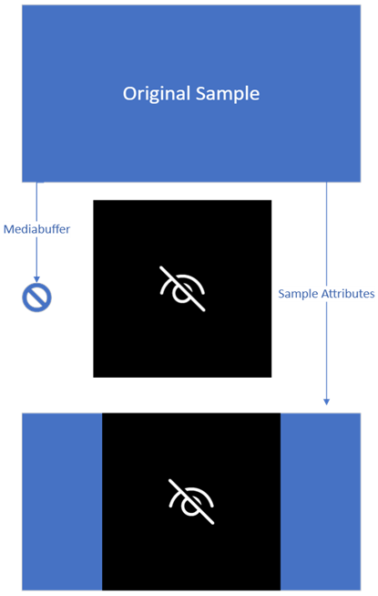

# Privacy shutter replacement image

This article explains how to enable image replacement for a camera that supports shutter state reporting. It also describes how to provide a custom replacement image.

Camera drivers that had privacy shutters/switches before this feature implementation provided samples from the camera sensor or have to implement a proprietary functionality to detect shutter state and replace the sample itself. This feature allows the camera driver to rely on the OS to replace the image in the sample with either an OS provided solution, or a custom image provided by the Camera driver.

Starting in Windows 11, version 21H2, the Windows Hardware Compatibility Program (WHCP) requires cameras that come with privacy shutters or killing switches to report the camera shutter state. This requirement allows the operating system and applications to know the current state of the shutter and is used to provide helpful user guidance on how to change the state of the shutter. OEM partners use this mechanism to build functionality into their drivers to replace the image coming from the camera with something that is informative to the users. This feature allows an OEM to utilize this same functionality without having to write proprietary code inside a DeviceMFT.

## Requirements

This feature is only implemented by cameras that have privacy shutters/kill switches. Implementation details for privacy shutters are described in the [Privacy shutter/switch notification](privacy-shutter-notification.md) article.

Devices that want to support a custom image for image replacement must also provide a signed binary, part of their driver package that contains their replacement image.

Due to image replacement overwriting the existing output buffer, this requires that the device is outputting uncompressed frames. In the case of compressed frames, such as MJPEG and JPEG, no image replacement will occur and the original image from the driver will instead be delivered.

## Implementation overview

Image replacement occurs when a device sends the notification that shutter for the device is closed. If the shutter state is closed and image replacement is enabled, the camera pipeline loads the replacement image, either from a custom image provided by the camera driver or using the inbox replacement image shown here.


When loaded, the pipeline translates the image into an output buffer that matches the same resolution and mediatype of the currently selected mediatype of the camera driver. If the resolutions differ, the image is scaled up or down, but isn't stretched outside of its existing aspect ratio.

From that point, until the shutter state is changed to open, all samples delivered by camera driver have their metadata and sample attributes copied into a new sample and their mediabuffer discarded. A new mediabuffer is copied from translated shutter image and used instead. This new sample will then be sent through the pipeline as if it was the original sample.



## Implementation guide

To enable image replacement, the following registry entry must be added to the device interface node of the camera, with a value set to 1.

| Regkey Type | Regkey Name | Regkey Value |
|--|--|--|
| REG_DWORD | EnableImageReplacement | 0x1 |

For a driver INF, this can be added as shown here.

```inf
...

[Device.AddReg]
HKR,,EnableImageReplacement,%REG_DWORD%,1

...

[Strings]
REG_DWORD=0x00010001
```

For the MS-OS Descriptor, this could be added as the following name:

`UVC-EnableImageReplacement`

### Custom image

For custom image replacement, the driver must provide the following:

1. One or more image files of format BMP type ARGB32 with a size of 1000 x 1000 pixels. In this example, it is "TestImage.bmp".

1. A resource DLL, with the image file contained as a resource. In this example, it SampleSocMFT.dll.

The driver provided image files must be an ARGB32 image of 1000 x 1000 pixels. This replaces the image shown in the implementation overview. All other changes to the sample occur as described, only the image being replaced is custom to the driver. The resource DLL must be part of the driver package, and must be signed. For most devices, this means placing it in the Driver DeviceMFT.

To add the image file to the resource DLL, modify the project's resource file *.rc with the following as an example.

```cpp
#ifdef ID_REPLACEMENT_IMAGE
#define ID_REPLACEMENT_IMAGE    200
#endif

ID_REPLACEMENT_IMAGE     RCDATA    "TestImage.bmp"
```

The next step is to modify the driver INF. If the resource DLL used is new, it has to be part of the CopyFiles directive. Finally, three additional AddReg directives must be added.

```inf
[SourceDisksFiles]
AvsCameraSim.sys=1
SampleSocMFT.dll=1

[DestinationDir]
AvsCameraSim.CopySys=13
AvsCameraSim.CopyDMFT=13

[AvsCameraSim.CopySys]
AvsCameraSim.sys

[AvsCameraSim.CopyDMFT]
SampleSocMFT.dll

[AvsCameraSim]
Include=ks.inf, kscaptur.inf
Needs=KS.registration, KSCaptur.Registration.NT
CopyFiles=AvsCameraSim.CopySys, AvsCameraSim.CopyDMFT
AddReg=AvsCameraSim.AddReg

[AvsCameraSim.AddReg]
HKR,,CameraImageResource,,%13%\%DMFT.NAME%
HKR,,CameraImageResourceID,%REG_DWORD%,%ResourceID%
HKR,,EnableImageReplacement,%REG_DWORD%,1

[Strings]
DMFT.Name="SampleSocMFT.dll"
REG_DWORD=0x00010001

;localizable
ResourceID=200

...
```

The INF ResourceID and ID_REPLACEMENT_IMAGE identifier for the resource must be matched. These values can be adjusted such that a single resource DLL can contain multiple resource IDs and multiple images, and an INF can be localized to select the correct resource ID.

### Custom image border

For custom images that don't desire a black border when letterboxing occurs, they can specify an [MFARGB](/windows/win32/api/mfobjects/ns-mfobjects-mfargb) structure through the registry that customizes the border color of the replacement sample.

| Regkey Type | Regkey Name | Regkey Value |
|--|--|--|
| REG_BINARY | CameraImageBackgroundColor | 0x1 |

For a driver INF, it can be added as shown here:

```inf
...

[Device.AddReg]
HKR,,CameraImageBackgroundColor,%REG_ BINARY%,00,00,00,FF

[Strings]
REG_BINARY=0x00000001
```
