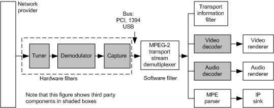

# Separating Nodes in Individual Filters

## 

The following figure of a sample DirectShow filter graph shows another way in which the control nodes can be represented as filters in a filter graph. In this sample, the tuner and demodulator control nodes are separated into individual filters. All other control nodes are as described in the [Combining Nodes in a Filter](combining-nodes-in-a-filter.md) section.

 

 

--------------------
[Send comments about this topic to Microsoft](mailto:wsddocfb@microsoft.com?subject=Documentation%20feedback%20%5Bstream\stream%5D:%20Separating%20Nodes%20in%20Individual%20Filters%20%20RELEASE:%20%288/23/2016%29&body=%0A%0APRIVACY%20STATEMENT%0A%0AWe%20use%20your%20feedback%20to%20improve%20the%20documentation.%20We%20don't%20use%20your%20email%20address%20for%20any%20other%20purpose,%20and%20we'll%20remove%20your%20email%20address%20from%20our%20system%20after%20the%20issue%20that%20you're%20reporting%20is%20fixed.%20While%20we're%20working%20to%20fix%20this%20issue,%20we%20might%20send%20you%20an%20email%20message%20to%20ask%20for%20more%20info.%20Later,%20we%20might%20also%20send%20you%20an%20email%20message%20to%20let%20you%20know%20that%20we've%20addressed%20your%20feedback.%0A%0AFor%20more%20info%20about%20Microsoft's%20privacy%20policy,%20see%20http://privacy.microsoft.com/default.aspx. "Send comments about this topic to Microsoft")

