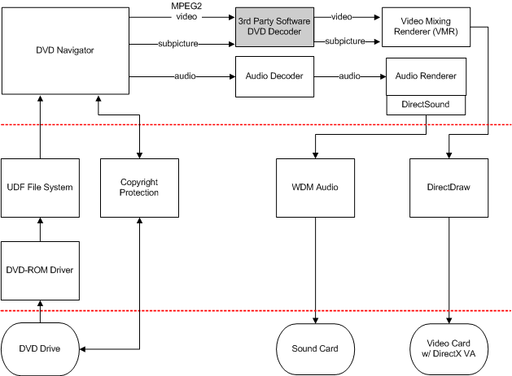

# Software-based DVD Decoding

The following diagram demonstrates a completely software-based DVD decoding and playback solution, which is presently more common than hardware-based DVD decoding and playback.

The white boxes represent software supplied by Microsoft, and the shaded box represents the component provided by software vendors. The ovals represent hardware supplied by IHVs and OEMs.

 

 

