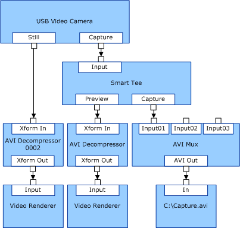

# USB-Based Camera with a Capture Button

A slightly more complex filter graph, compared to a [USB or 1394 based conferencing camera](usb-or-1394-based-conferencing-camera.md), is created for a conferencing camera whose minidriver exposes a still pin that supports a button to capture a still image. The still pin can provide a higher resolution image when the user pushes a button on the camera.

Vendors do not need to write a minidriver for their USB-based camera if it conforms to the UVC specification. Microsoft provides the [USB Video Class Driver](usb-video-class-driver.md) for such cameras. Microsoft recommends that any new USB based conferencing camera hardware be developed to follow the UVC specification.

Microsoft also provides the [USBCAMD Minidriver Library](usbcamd-minidriver-library.md) for backward compatibility. USBCAMD supports cameras with still pins. However, the USBCAMD interface is obsolete, and Microsoft has discontinued further its development.

The following diagram demonstrates a possible filter graph configuration for a USB-based camera with a still pin.

In the diagram, the still pin streams only a single image when the user pushes the button on the camera. Alternatively, the still pin can be triggered by programmatic control.

The Windows Image Acquisition (WIA) technology built on the Still Image Architecture (STI) complements the functionality provided by USBCAMD. See [Windows Image Acquisition Drivers](https://msdn.microsoft.com/library/windows/hardware/ff553346) and [Still Image Drivers](https://msdn.microsoft.com/library/windows/hardware/ff548278) for more information.

The WIA Video Snapshot filter is an addition to WIA that is shipped with Microsoft Windows XP and later operating systems. The WIA Video Snapshot filter enables still frames to be captured from the video stream.

There are two methods of capturing a still image from the device. The first is to insert the WIA Video Snapshot filter downstream from the capture filter and trigger a capture programmatically. The second is to enable still pin support by using the USBCAMD interface to develop a minidriver. The WIA Video Snapshot filter can then be triggered by pushing a button on the device.

The advantages of capturing an image from the still pin as opposed to the video stream are that the still pin can provide a higher resolution image and permit the user to capture an image by pressing a button on the device.

If still pin support isn't explicitly added to the minidriver, the WIA Video Snapshot filter can be triggered by the software, but the resolution will be the same as the video stream.

Some still pin implementations can only be rendered after the capture pin because they are based on the capture pin data formats.

For more information about WIA driver development, see the [still imaging technologies](http://go.microsoft.com/fwlink/p/?linkid=8768) website.

 

 

