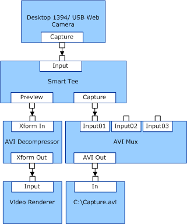

# USB or 1394-Based Conferencing Camera

A simple filter graph consists of a capture filter that exposes a single video stream with no TV/radio tuning capabilities. USB-based and 1394-based video conferencing cameras often use this configuration.

The following diagram demonstrates one of the possible filter graph configurations for a 1394-based video conferencing camera.

**Note**  : The single capture stream from the camera is replicated by a user-mode DirectShow filter (the Smart Tee filter) to provide separate capture and preview streams. This replication is performed without requiring the minidriver to copy the data.

 

Vendors do not need to write a minidriver for their USB-based camera if it conforms to the UVC specification. Microsoft provides the [USB Video Class Driver](usb-video-class-driver.md) for such cameras. Microsoft recommends that any new USB-based conferencing camera hardware be developed to follow the UVC specification.

Microsoft also provides the [USBCAMD Minidriver Library](usbcamd-minidriver-library.md) for backward compatibility. However, the USBCAMD interface is obsolete, and Microsoft has discontinued its further development.

 

 

