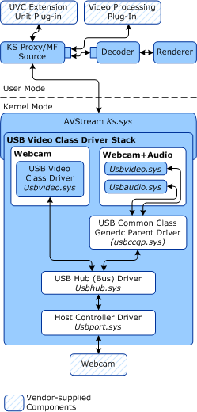

# USB Video Class Driver Stack

When vendors use the Microsoft-supplied USB Video Class driver, they provide only the hardware. Microsoft provides all driver support.

Optionally, vendors can extend the USB Video Class driver to add device-specific functionality.

The USB Video Class driver stack is shown in the following diagram:

 

 

