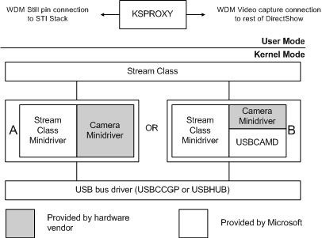

# USBCAMD2 Camera Configurations

Minidrivers to support USB cameras can be clients of the *stream.sys* class driver on their upper end and the USB bus driver on their lower end, as shown in the following diagram.

In the group **A** configuration of the diagram, the minidriver writer must interface to the *stream.sys* class driver, the camera, and the USB bus. In the goup **B** configuration, a minidriver written to use USBCAMD2 needs only to contain the code that is device-specific. That is, if you use USBCAMD2, you can focus on implementing support for video formats, property sets, image decompression, and color space conversion. The USBCAMD2 minidriver library controls the connection to the *stream.sys* class driver and the USB bus driver, thereby simplifying the process of developing a camera minidriver.

Although USBCAMD2 interfaces with the *stream.sys* class driver, which is now obsolete, developing a camera minidriver with USBCAMD2 can be easier than writing your own stand-alone *stream.sys* class or AVStream minidriver.

The primary purpose of USBCAMD2 is to support streaming video cameras, such as webcams. However, USBCAMD2 also provides support to use USB bulk and interrupt transfer pipes to capture still images sent from the camera. This feature supports USB cameras with snapshot capability to capture still frames.

If your camera primarily streams video, and optionally provides snapshot capability, then you need only to write a USBCAMD2 minidriver. Vendors of hybrid cameras (cameras that primarily take still photos, but that can also stream video) write a USBCAMD2 minidriver to support the streaming capability, and a separate Windows Image Acquisition (WIA) still camera driver to support still image storage and management. For more information about WIA and supporting digital cameras that capture still images, see [Windows Image Acquisition Drivers](https://msdn.microsoft.com/library/windows/hardware/ff553346).

The USBCAMD2 library supports cameras that use a combination of isochronous pipe(s), bulk I/O pipe(s) and/or an interrupt pipe to transfer data streams and control settings. USBCAMD2 supports cameras that implement the following USB pipe configurations:

-   A single isochronous pipe, with synchronization information, such as the start and end of video or still frames embedded in the data stream. These types of cameras can multiplex both video and still frames through the same isochronous pipe or reuse individual video frames as still frames.

-   Same as the previous configuration, with the addition of an interrupt pipe to signal notification of external trigger events to registered applications.

-   Same as the first configuration, with the addition of two bulk I/O pipes to control and retrieve still frames from the camera.

-   Two isochronous pipes. One pipe streams data and the other pipe contains synchronization information, such as the start and end of video or still frames. These cameras can also multiplex both video and still frames through the same isochronous pipe or reuse individual video frames as still frames.

-   Two bulk I/O pipes and an optional interrupt pipe. One bulk pipe streams video and the other bulk pipe transfers still images. The optional interrupt pipe signals notification of external trigger events to registered applications.

**Note**   USBCAMD2 supports cameras with a single USB interface that has multiple alternate settings. All alternate settings must have the same type and number of pipes. You specify this information in an array of type [**USBCAMD\_Pipe\_Config\_Descriptor**](https://msdn.microsoft.com/library/windows/hardware/ff568623) that you pass to [*CamConfigureEx*](https://msdn.microsoft.com/library/windows/hardware/ff557605) when you initialize and configure the camera.

 

Whereas USB 1.1 devices can be connected to a USB 2.0 bus, USBCAMD2 supports only USB 1.1 camera devices and is therefore limited to the maximum throughput of the USB 1.1 bus (for example, isochronous data transfer in *full*-speed mode). USBCAMD2 does not support the USB 2.0 *high*-speed mode for isochronous data transfer. However, if a camera implements bulk pipes only, then it could benefit from being connected to a USB 2.0 bus where there is more available bulk transfer bandwidth.

 

 

