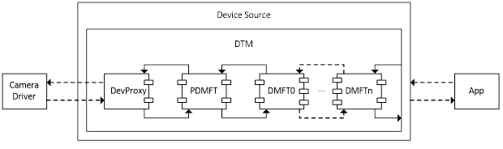
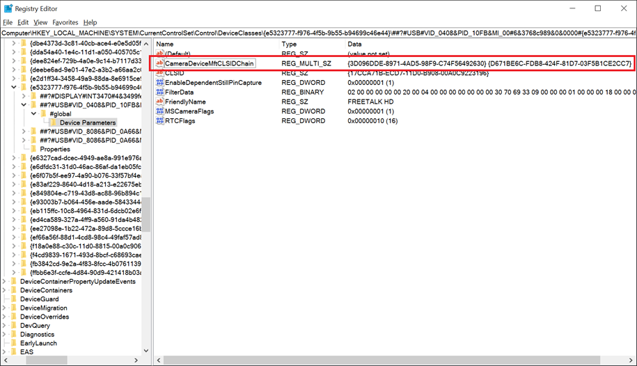
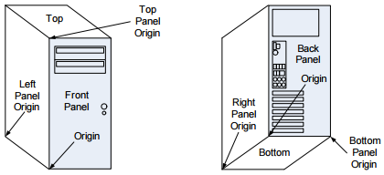
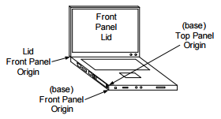
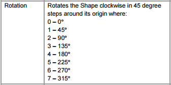

# Windows 10 UVC camera implementation guide

Windows 10 provides an inbox USB Video Class (UVC) driver for devices compliant with USB Video Class specification (versions 1.0 to 1.5). This driver supports color and sensor type cameras. This document outlines how to expose certain capabilities of a UVC compliant camera to the applications through the inbox driver.

## Terminology

| Keyword              | Description                                                                  |
|----------------------|------------------------------------------------------------------------------|
| UVC                  | USB Video Class                                                              |
| UVC driver           | USBVideo.sys driver that ships with the OS                                   |
| IR                   | Infrared                                                                     |
| Color camera         | The camera that outputs color streams (for example, RGB or YUV cameras)      |
| Sensor camera        | The camera that outputs non-color streams (for example, IR or Depth cameras) |
| BOS                  | Binary Device Object Store                                                   |
| MS OS 2.0 Descriptor | Microsoft platform specific BOS device capability descriptor                 |

## Sensor Cameras

Windows supports two categories of cameras. One is a color camera and the other one is a non-color sensor camera. RGB or YUV cameras are categorized as color cameras and non-color cameras like gray scale, IR and Depth cameras are categorized as sensor cameras. The UVC driver supports both types of cameras. We recommend the camera firmware specify a value based on which the UVC driver would register the camera under one or both supported categories.

A camera that supports color only format types should be registered under KSCATEGORY\_VIDEO\_CAMERA. A camera that supports IR or Depth-only format types should be registered under KSCATEGORY\_SENSOR\_CAMERA. A camera that supports both color and non-color format types should be registered under KSCATEGORY\_VIDEO\_CAMERA and KSCATEGORY\_SENSOR\_CAMERA. This categorization helps applications to select the camera that they want to work with.

A UVC camera can specify its category preference through attributes, **SensorCameraMode** and **SkipCameraEnumeration**, in its BOS [MS OS 2.0 Descriptor](https://docs.microsoft.com/windows-hardware/drivers/usbcon/microsoft-defined-usb-descriptors) detailed in following sections.

The attribute **SensorCameraMode** takes a value 1 or 2.

A value of 1, will register the device under KSCATEGORY\_SENSOR\_CAMERA. In addition to this specify a value of 1 for **SkipCameraEnumeration** to make the camera available to applications looking only for sensor cameras. A camera that exposes only sensor camera media types should use this value.

A value of 2 for **SensorCameraMode**, will register the device under KSCATEGORY\_SENSOR\_CAMERA & KSCATEGORY\_VIDEO\_CAMERA. This will make the camera available for applications looking for either sensor and color cameras. A camera that exposes both sensor camera and color camera media types should use this value.

We recommend you specify the above-mentioned registry value using the BOS descriptor. Refer to the [Example composite device](#example-composite-device) section below for a sample BOS descriptor with a platform specific MS OS 2.0 descriptor.

If you cannot update the device firmware as described above, you can use a custom INF and specify that your camera need to be registered as a sensor camera by specifying a value for **SensorCameraMode** and **SkipCameraEnumeration** as follows:

A custom INF file (based on the inbox UVC driver)  must include the following AddReg entries:

**SensorCameraMode**: REG\_DWORD: 1    (to register as a sensor camera)

**SkipCameraEnumeration**: REG\_DWORD: 1   (make it available only for IR applications)

An example of the custom INF section is as follows:

```INF
[USBVideo.NT.HW]
AddReg=USBVideo.HW.AddReg

[USBVideo.HW.AddReg]
HKR,, SensorCameraMode, 0x00010001,1      ; places the value under device HW
                                          ; Registry key

HKR,, SkipCameraEnumeration, 0x00010001,1 ; This makes the camera available
                                          ; only for application looking for
                                          ; IR cameras
```

If the **SensorCameraMode** and **SkipCameraEnumeration** attributes are not specified in the firmware or the INF, the camera will be registered as a color camera and will be visible only to color camera aware applications.

## IR stream

The Windows inbox USB video class (UVC) driver supports cameras that capture the scene in YUV format and transmit the pixel data over USB as uncompressed YUV or as compressed MJPEG frames.

The following format type GUIDs should be specified in the stream video format descriptor, as defined in the WDK ksmedia.h header file:

| Type | Description |
| --- | --- |
| KSDATAFORMAT\_SUBTYPE\_L8\_IR |  Uncompressed 8 bit luma plane. This type maps to [MFVideoFormat\_L8](https://docs.microsoft.com/windows/desktop/medfound/video-subtype-guids#luminance-and-depth-formats). |
| KSDATAFORMAT\_SUBTYPE\_L16\_IR | Uncompressed 16 bit luma plane. This type maps to [MFVideoFormat\_L16](https://docs.microsoft.com/windows/desktop/medfound/video-subtype-guids#luminance-and-depth-formats). |
| KSDATAFORMAT\_SUBTYPE\_MJPG\_IR | Compressed MJPEG frames. Media Foundation converts this into NV12 uncompressed frames and uses only the luma plane. |

When these format type GUIDs are specified in the guidFormat field of the frame descriptor, the Media Foundation capture pipeline marks the stream as IR stream. Applications written with Media Foundation FrameReader API will be able to consume the IR stream. No scaling or conversions of the IR frames are supported by the pipeline for IR streams.

A stream exposing IR format types must not expose RGB or Depth format types.

```cpp
// Example Format Descriptor for UVC 1.1 frame based format

typedef struct _VIDEO_FORMAT_FRAME
{
    UCHAR bLength;
    UCHAR bDescriptorType;
    UCHAR bDescriptorSubtype;
    UCHAR bFormatIndex;
    UCHAR bNumFrameDescriptors;
    GUID  guidFormat;  // this field should contain the IR subtype GUID
    UCHAR bBitsPerPixel;
    UCHAR bDefaultFrameIndex;
    UCHAR bAspectRatioX;
    UCHAR bAspectRatioY;
    UCHAR bmInterlaceFlags;
    UCHAR bCopyProtect;
    UCHAR bVariableSize;
} VIDEO_FORMAT_FRAME, *PVIDEO_FORMAT_FRAME;
```

> [!NOTE]
> IR streams will show up as regular capture streams in DShow.

## Depth stream

Windows inbox USB Video Class driver supports cameras that produce Depth streams. These cameras capture the depth information (For example, time of flight) of the scene and transmit the depth map as uncompressed YUV frames over USB. The following format type GUID should be specified in the stream video format descriptor, as defined in the WDK ksmedia.h header file:

| Type | Description |
| --- | --- |
| KSDATAFORMAT\_SUBTYPE\_D16 |  16 bit depth map values. This type is identical to [MFVideoFormat\_D16](https://docs.microsoft.com/windows/desktop/medfound/video-subtype-guids#luminance-and-depth-formats). The values are in millimeters. |

When the format type GUID is specified in the guidFormat member of the frame descriptor, the Media Foundation capture pipeline marks the stream as depth stream. Applications written with FrameReader API will be able to consume the depth stream. No scaling or conversions of the depth frames are supported by the pipeline for depth streams.

A stream exposing Depth format types must not expose RGB or IR format types.

```cpp
// Example Format Descriptor for UVC 1.1 frame based format
typedef struct _VIDEO_FORMAT_FRAME
{
    UCHAR bLength;
    UCHAR bDescriptorType;
    UCHAR bDescriptorSubtype;
    UCHAR bFormatIndex;
    UCHAR bNumFrameDescriptors;
    GUID guidFormat; // this field should contain the IR subtype GUID
    UCHAR bBitsPerPixel;
    UCHAR bDefaultFrameIndex;
    UCHAR bAspectRatioX;
    UCHAR bAspectRatioY;
    UCHAR bmInterlaceFlags;
    UCHAR bCopyProtect;
    UCHAR bVariableSize;
} VIDEO_FORMAT_FRAME, *PVIDEO_FORMAT_FRAME;
```

> [!NOTE]
> Depth streams show up as regular capture streams in DShow.

## Grouping cameras

Windows supports grouping of cameras based on their container ID to aid applications work with related cameras. For example, an IR camera and a Color camera present on the same physical device can be exposed to the OS as related cameras. This will make applications like Windows Hello to make use of the related cameras for their scenarios.

The relation between the camera functions could be specified in the camera's BOS descriptor in firmware. The UVC driver will make use of this information and expose these camera functions as related. This will make the OS camera stack expose them as a related group of cameras to the applications.

The camera firmware must specify a *UVC-FSSensorGroupID*, which is a GUID in string form with the curly parenthesis. The cameras that have the same *UVC-FSSensorGroupID* will be grouped together.

The sensor group can be given a name by specifying *UVC-FSSensorGroupName*, a Unicode string, in the firmware.

Refer to the Example composite device section below for an illustrative example BOS that specifies *UVC-FSSensorGroupID* and *UVC-FSSensorGroupName*.

If you cannot update the device firmware as described above, you can use a custom INF and specify that your camera is part of a sensor group by specifying a sensor group ID and name as follows. The custom INF file (based on the inbox UVC driver) must include the following AddReg entries:

**FSSensorGroupID**: REG_SZ: "{your sensor group ID GUID}"

**FSSensorGroupName**: REG_SZ: "your sensor group friendly name"

An example for the custom INF section would be as follows:

```INF
[USBVideo.NT.Interfaces]
AddInterface=%KSCATEGORY_CAPTURE%,GLOBAL,USBVideo.Interface
AddInterface=%KSCATEGORY_RENDER%,GLOBAL,USBVideo.Interface
AddInterface=%KSCATEGORY_VIDEO%,GLOBAL,USBVideo.Interface
AddInterface=%KSCATEGORY_RENDER_EXT%,GLOBAL,USBVideo.Interface
AddInterface=%KSCATEGORY_VIDEO_CAMERA%,GLOBAL,USBVideo.Interface

[USBVideo.Interface]
AddReg=USBVideo.Interface.AddReg

[USBVideo.Interface.AddReg]
HKR,,CLSID,,%ProxyVCap.CLSID%
HKR,,FriendlyName,,%USBVideo.DeviceDesc%
HKR,,RTCFlags,0x00010001,0x00000010
HKR,, FSSensorGroupID,0x00000000,%FSSensorGroupID%
HKR,, FSSensorGroupName,0x00000000,%FSSensorGroupName%
```

> [!NOTE]
> Sensor Groups are not supported in DShow capture pipeline.

## Method 2 or Method 3 still capture support

UVC specification does provide a mechanism to specify if the video streaming interface supports Method 1/2/3 type still image capture. To make the OS take advantage of the device's Method 2/3 still image capture support, through UVC driver, the device firmware could specify a value in the BOS descriptor.

The value to specify to enable Method 2/3 still image capture is a DWORD named *UVC-EnableDependentStillPinCapture*. Specify its value using the BOS descriptor. The [Example composite device](#example-composite-device) below illustrates enabling still image capture with an example BOS descriptor.

If you cannot update the device firmware as described above, you can use a custom INF to specify that your camera supports Method 2 or Method 3 still capture method.

The custom INF file (based on either custom UVC driver or inbox UVC driver) must include the following AddReg entry:

**EnableDependentStillPinCapture**: REG_DWORD: 0x0 (Disabled) to 0x1 (Enabled)

When this entry is set to Enabled (0x1), the capture pipeline will leverage Method 2/3 for still image capture (assuming the firmware also advertises support for Method 2/3 as specified by UVC spec).

An example for the custom INF section is as follows:

```INF
[USBVideo.NT.Interfaces]
AddInterface=%KSCATEGORY_CAPTURE%,GLOBAL,USBVideo.Interface
AddInterface=%KSCATEGORY_RENDER%,GLOBAL,USBVideo.Interface
AddInterface=%KSCATEGORY_VIDEO%,GLOBAL,USBVideo.Interface
AddInterface=%KSCATEGORY_RENDER_EXT%,GLOBAL,USBVideo.Interface
AddInterface=%KSCATEGORY_VIDEO_CAMERA%,GLOBAL,USBVideo.Interface

[USBVideo.Interface]
AddReg=USBVideo.Interface.AddReg

[USBVideo.Interface.AddReg]
HKR,,CLSID,,%ProxyVCap.CLSID%
HKR,,FriendlyName,,%USBVideo.DeviceDesc%
HKR,,RTCFlags,0x00010001,0x00000010
HKR,,EnableDependentStillPinCapture,0x00010001,0x00000001
```

## Device MFT Chaining

Device MFT is the recommended user mode plugin mechanism for IHVs and OEMs to extend the camera functionality on Windows. Prior to Windows 10, version 1703, the camera pipeline supported only one DMFT extension plugin. Starting with Windows 10, version 1703, the Windows camera pipeline supports an optional chain of DMFTs with maximum of three DMFTs. This provides greater flexibility for OEMs and IHVs to provide value-add in the form of post processing camera streams. For example, a device could use PDMFT along with an IHV DMFT and an OEM DMFT. Following figure illustrates the architecture involving a chain of DMFTs.



Capture samples flow from camera driver to DevProxy, then go through the DMFT chains. Every DMFT in the chain has a chance to process the sample. If the DMFT doesn't want to process the sample, it can act as a pass-through just pass the sample to next DMFT.

For controls like KsProperty, the call will go up stream – the last DMFT in the chain will get the call first, the call can be handled there or get passed to previous DMFT in the chain.

Errors will be propagated from DMFT to DTM then to applications. For IHV/OEM DMFTs, any one of the DMFT fails to instantiate will be a fatal error for DTM.

Requirements on DMFTs:

- The input pin count of the DMFT must match with the output pin count of previous DMFT, otherwise DTM would fail during initialization. However, the input and output pin counts of same DMFT do not need to match.

- DMFT needs to support interfaces - IMFDeviceTransform, IMFShutdown, IMFRealTimeClientEx, IKsControl and IMFMediaEventGenerator; IMFTransform may need to be supported if there is MFT0 configured or the next DMFT in the chain requires IMFTransform support.

- On 64-bit systems that do not make use of Frame Server, both 32-bit and 64-bit DMFTs must be registered. Given that a USB camera might get plugged into an arbitrary system, for "external" (or non-inbox) USB cameras, the USB camera vendor should supply both 32-bit and 64-bit DMFTs.

## Configuring the DMFT chain

A camera device can optionally supply a DMFT COM object in a DLL using a custom INF file that uses sections of the inbox USBVideo.INF.

In the custom .INF file's "Interface AddReg" section, specify the DMFT CLSIDs by adding following registry entry:

**CameraDeviceMftCLSIDChain** (REG\_MULTI\_SZ) %Dmft0.CLSID%,%Dmft.CLSID%,%Dmft2.CLSID%

As shown in the sample INF settings below (replace the %Dmft0.CLSID% and % Dmft1.CLSID% with the actual CLSID strings you are using for your DMFTs), there are maximum of 2 CLSIDs allowed in Windows 10, version 1703, and the first one is closest to DevProxy and the last one is the last DMFT in the chain.

Platform DMFT CLSID is {3D096DDE-8971-4AD5-98F9-C74F56492630}.

Some example **CameraDeviceMftCLSIDChain** settings:

- *No IHV/OEM DMFT or Platform DMFT*

  - CameraDeviceMftCLSIDChain = "" (or no need to specify this registry entry)

- *IHV/OEM DMFT*

  - CameraDeviceMftCLSIDChain = %Dmft.CLSID%

- *Platform DMFT &lt;-&gt; IHV/OEM DMFT*

  - CameraDeviceMftCLSIDChain = "{3D096DDE-8971-4AD5-98F9-C74F56492630}",%Dmft.CLSID%

  - Here is a screen shot of the result registry key for an USB camera with Platform DMFT and an DMFT (with GUID {D671BE6C-FDB8-424F-81D7-03F5B1CE2CC7}) in the chain.



- *IHV/OEM DMFT0 &lt;-&gt; IHV/OEM DMFT1*

  - CameraDeviceMftCLSIDChain = %Dmft0.CLSID%,%Dmft1.CLSID%,

> [!NOTE]
> The **CameraDeviceMftCLSIDChain** can have a maximum 2 of CLSIDs.

If **CameraDeviceMftCLSIDChain** is configured, the legacy CameraDeviceMftCLSID settings will be skipped by DTM.

If **CameraDeviceMftCLSIDChain** is not configured and the legacy CameraDeviceMftCLSID is configured, then the chain would look like (if its USB camera and supported by Platform DMFT and Platform DMFT is enabled) DevProxy &lt;–&gt; Platform DMFT &lt;–&gt; OEM/IHV DMFT or (if the camera is not supported by Platform DMFT or Platform DMFT is disabled) DevProxy &lt;-&gt; OEM/IHV DMFT.

Example INF file settings:

```INF
[USBVideo.Interface.AddReg]
HKR,,CLSID,,%ProxyVCap.CLSID%
HKR,,FriendlyName,,%USBVideo.DeviceDesc%
HKR,,RTCFlags,0x00010001,0x00000010
HKR,,EnablePlatformDmft,0x00010001,0x00000001
HKR,,DisablePlatformDmftFeatures,0x00010001,0x00000001
HKR,,CameraDeviceMftCLSIDChain, 0x00010000,%Dmft0.CLSID%,%Dmft1.CLSID%
```

## Platform Device MFT

Starting in Windows 10, version 1703, Windows provides an inbox Device MFT for UVC cameras known as Platform DMFT (PDMFT) on an opt-in basis. This DMFT allows IHVs and OEMs to take advantage of Windows provided post processing algorithms.

| Features supported by Platform DMFT | Windows Release |
|-------------------------------------|-----------------|
| Enables face-based Region of Interest (ROI) for 3A adjustments in ROI-capable USB cameras. | Windows 10, version 1703 |

> [!NOTE]
> If the camera does not support UVC 1.5 based ROI, then the PDMFT will not load even if the device opted in to use PDMFT.

A UVC camera could opt-in to use platform DMFT by specifying the EnablePlatformDmft through BOS descriptor.

The value to specify to enable Platform DMFT is a DWORD by name *UVC-EnablePlatformDmft* and specify its value using the BOS descriptor. The [Example composite device](#example-composite-device) section below illustrates enabling Platform DMFT with an example BOS descriptor.

If you cannot update the device firmware as described above, you can use a custom INF file to enable Platform DMFT for the device.

The custom INF file (based on either custom UVC driver or inbox UVC driver) must include the following AddReg entry:

**EnablePlatformDmft**: REG_DWORD: 0x0 (Disabled) to 0x1 (Enabled)

When this entry is set to Enabled (0x1), the capture pipeline will use inbox Platform DMFT for the device. The following shows an example of this custom INF section:

```INF
[USBVideo.NT.Interfaces]
AddInterface=%KSCATEGORY_CAPTURE%,GLOBAL,USBVideo.Interface
AddInterface=%KSCATEGORY_RENDER%,GLOBAL,USBVideo.Interface
AddInterface=%KSCATEGORY_VIDEO%,GLOBAL,USBVideo.Interface
AddInterface=%KSCATEGORY_RENDER_EXT%,GLOBAL,USBVideo.Interface
AddInterface=%KSCATEGORY_VIDEO_CAMERA%,GLOBAL,USBVideo.Interface

[USBVideo.Interface]
AddReg=USBVideo.Interface.AddReg

[USBVideo.Interface.AddReg]
HKR,,CLSID,,%ProxyVCap.CLSID%
HKR,,FriendlyName,,%USBVideo.DeviceDesc%
HKR,,RTCFlags,0x00010001,0x00000010
HKR,,EnablePlatformDmft,0x00010001,0x00000001
```

In Windows 10, version 1703, if a device opts in to use PDMFT then all features that are supported by the PDMFT are enabled (based on the device capabilities). Granular configuration of PDMFT features is not supported.

## Face Auth Profile via MS OS Descriptors

Windows 10 RS5 now enforces a Face Auth Profile V2 requirement for any camera with Windows Hello support. For MIPI based systems with custom camera driver stack, this support can be published either via an INF (or an Extension INF) or through a user mode plug in (Device MFT).

However, for USB Video devices, a constraint with UVC based cameras is that for Windows 10 19H1, custom camera drivers are not allowed. All UVC based cameras must use the inbox USB Video Class driver and any vendor extensions must be implemented in the form of a Device MFT.

For many OEM/ODMs, the preferred approach for camera modules is to implement much of the functionality within the module’s firmware, i.e. via Microsoft OS Descriptors.

The following cameras are supported for publish Face Auth Profile via the MSOS Descriptors (also called BOS descriptors):

- RGB only camera to be used in Sensor Group with a separate IR camera.
- IR only camera to be used in a Sensor Group with a separate RGB camera.
- RGB+IR camera with separate IR and RGB pins.

> **Note:**
> If the camera firmware cannot meet one of the three requirements detailed above, the ODM/OEM must use an Extension INF to declare Camera Profile V2.

### Example Microsoft OS Descriptor Layout

Examples are included below for the following specifications:

- Microsoft OS extended descriptors specification 1.0
- Microsoft OS 2.0 descriptors specification

### Microsoft OS Extended Descriptor 1.0 Specification

The extended properties OS descriptor has two components

- A fixed-length header section
- One or more variable length custom properties sections, which follows the header section

#### Microsoft OS 1.0 Descriptor Header Section

The Header Section describes a single custom property (Face Auth Profile).

| Offset | Field      | Size (bytes) | Value  | Description                     |
| ------ | ---------- | ------------ | ------ | ------------------------------- |
| 0      | dwLength   | 4            | \<\>   |                                 |
| 4      | bcdVersion | 2            | 0x0100 | Version 1.0                     |
| 6      | wIndex     | 2            | 0x0005 | Extended property OS descriptor |
| 8      | wCount     | 2            | 0x0001 | One custom property             |

#### Microsoft OS 1.0 Descriptor Custom Property Section

| Offset | Field                | Size (bytes) | Value                 | Description                                |
| ------ | -------------------- | ------------ | --------------------- | ------------------------------------------ |
| 0      | dwSize               | 4            | 0x00000036 (54)       | Total size (in bytes) for this property.   |
| 4      | dwPropertyDataType   | 4            | 0x00000004            | REG\_DWORD\_LITTLE\_ENDIAN                 |
| 8      | wPropertyNameLength  | 2            | 0x00000024 (36)       | Size (in bytes) of the property name.      |
| 10     | bPropertyName        | 36           | UVC-CPV2FaceAuth      | “UVC-CPV2FaceAuth” string in Unicode.      |
| 46     | dwPropertyDataLength | 4            | 0x00000004            | 4 bytes for property data (sizeof(DWORD)). |
| 50     | bPropertyData        | 4            | See Data Schema Below | See Data Schema Below.                     |

##### Payload Schema

The UVC-CPV2FaceAuth data payload is a 32-bit unsigned integer. The high order 16-bit represents the 0 based index of the media type list exposed by the RGB pin. The low order 16-bit represents the 0 based index of the media type list exposed by the IR pin.

For example, a Type 3 Camera which exposes the following media types, in the order declared from the RGB pin:

- YUY2, 640x480@30fps
- MJPG, 1280x720@30fps
- MJPG, 800x600@30fps
- MJPG, 1920x1080@30fps

And the following media type for IR:

- L8, 480x480@30fps
- L8, 480x480@15fps
- L8, 480x480@10fps

A payload value of 0x00010000, will result in the following Face Auth Profile being published:

Pin0:(RES==1280,720;FRT==30,1;SUT==MJPG)// Second media type (0x0001)  
Pin1:(RES==480,480;FRT==30,1;SUT==L8)// First media type (0x0000)

> **Note**: At the time of this writing, Windows Hello has a minimum requirement of 480x480@7.5fps for the RGB stream and 340x340@15fps for the IR stream. IHV/OEMs are required to select media types that satisfy this requirement when enabling Face Auth Profile.

##### Type 1 Camera Sample

For a Type 1 Camera, since there is no IR pin (with the expectation that a Type 1 Camera will be paired to a Type 2 Camera on the machine in a Sensor Group), only the RGB media type index is published. For the IR media type index, the low order 16-bit value of the payload must be set to 0xFFFF.

For example, if a Type 1 Camera exposed the following list of media types:

- YUY2, 640x480@30fps
- MJPG, 1280x720@30fps
- MJPG, 800x600@30fps
- MJPG, 1920x1080@30fps

To publish the CPV2FaceAuth using the MJPG, 1280x720@30fps media type, the payload must be set to 0x0001FFFF.

##### Type 2 Camera Sample

For a Type 2 Camera, the high order 16-bit must be set to 0xFFFF, with the low order 16-bit indicating the IR media type to be used.

For example, for a Type 2 Camera with the following media types:

- L8, 480x480@30fps
- L8, 480x480@15fps
- L8, 480x480@10fps

If the first media type is used for Face Auth, the value must be: 0xFFFF0000.

### Microsoft OS Extended Descriptor 2.0 Specification

MSOS Extended Descriptor 2.0 can be used to define the registry values to add Face Auth Profile support. This is done using the [Microsoft OS 2.0 Registry Property Descriptor](#microsoft-os-2.0-registry-property-descriptor).

For the UVC-CPV2FaceAuth registry entry, the following shows a sample MSOS 2.0 descriptor set:

```cpp
UCHAR Example2_MSOS20DescriptorSet_UVCFaceAuthForFutureWindows[0x3C] =
{
    //
    // Microsoft OS 2.0 Descriptor Set Header
    //
    0x0A, 0x00,               // wLength - 10 bytes
    0x00, 0x00,               // MSOS20_SET_HEADER_DESCRIPTOR
    0x00, 0x00, 0x0?, 0x06,   // dwWindowsVersion – 0x060?0000 for future Windows version
    0x3C, 0x00,               // wTotalLength – 60 bytes

    //
    // Microsoft OS 2.0 Registry Value Feature Descriptor
    //
    0x32, 0x00,               // wLength - 50 bytes
    0x04, 0x00,               // wDescriptorType – 4 for Registry Property
    0x04, 0x00,               // wPropertyDataType - 4 for REG_DWORD_LITTLE_ENDIAN
    0x30, 0x00,               // wPropertyNameLength – 36 bytes
    0x55, 0x00, 0x56, 0x00,   // Property Name - "UVC-CPV2FaceAuth"
    0x43, 0x00, 0x2D, 0x00,
    0x43, 0x00, 0x50, 0x00,
    0x56, 0x00, 0x32, 0x00,
    0x46, 0x00, 0x61, 0x00,
    0x63, 0x00, 0x65, 0x00,
    0x41, 0x00, 0x75, 0x00,
    0x74, 0x00, 0x68, 0x00,
    0x00, 0x00, 0x00, 0x00,
    0x04, 0x00,               // wPropertyDataLength – 4 bytes
    0x00, 0x00, 0x01, 0x00    // PropertyData – 0x00010000 (see Payload Schema)
}
```

When UVC-CPV2FaceAuth registry entry is added, devices do not need to publish the EnableDshowRedirection registry entry as described in this document: https://docs.microsoft.com/en-us/windows-hardware/drivers/stream/dshow-bridge-implementation-guidance-for-usb-video-class-devices.

However, if the device vendor must support older versions of Windows and/or need to enable MJPEG decompression within Frame Server, the EnableDshowRedirection registry entry must be added.

### Sensor Group Generation

When OEMs build systems using Type 1 and Type 2 Cameras to provide both RGB and IR streams for Windows Hello support, OEMs must declare the two cameras to be part of a synthesized Sensor Group.

This is done by declaring a FSSensorGroupId and FSSensorGroupName tag in an Extension INF to be created under the device interface property for each camera.

However, if Extension INF is not provided, ODMs may use the same MSOS Descriptors to publish the FSSensorGroupId and FSSensorGroupName values. The inbox Windows 10 USB Video Class driver will automatically take any MSOS Descriptor whose Payload Name has been prefixed with “UVC-“ and migrate the tag into the device interface property store (removing the “UVC-“ prefix).

So a Type 1 and Type 2 Camera which publishes the following will allow the OS to synthesize the cameras into a multi-device Sensor Group for use with Windows Hello:

> UVC-FSSensorGroupId  
> UVC-FSSensorGroupName

The payload for each tag must be a Unicode String. The UVC-FSSensorGroupId payload must be a GUID string in the following format:

> {XXXXXXXX-XXXX-XXXX-XXXX-XXXXXXXXXXXX}

The value of the GUID must be the same between the Type 1 and Type 2 Cameras and both cameras must be added to the same physical chassis. For built in cameras, the physical chassis is the computer itself. For external cameras, both Type 1 and Type 2 Camera modules must be built into the same physical device connected to the computer. 

## Custom Device Interface Categories for Sensor Groups

Starting in 19H1, Windows is providing an IHV/OEM specified extension mechanism to allow publishing synthesized Sensor Groups into any custom or pre-defined category. Generation of a Sensor Group is defined by IHV/OEMs providing a Sensor Group ID key in the custom INF:

> FSSensorGroupId: {Custom GUID}  
> FSSensorGroupName: \<Friendly Name used for Sensor Group\>

In addition to the two above AddReg entries in the INF, a new AddReg entry is defined for custom categories:

> FSSensorGroupCategoryList: {GUID};{GUID};…;{GUID}

Multiple categories are defined using a semi-colon (;) delimited GUID list.

Each device declaring a matching FSSensorGroupId, must declare the same FSSensorGroupCategoryList. If the list does not match, all lists will be ignored and the Sensor Group will be published by default into KSCATEGORY\_SENSOR\_GROUP as if no custom categories were defined.

## Camera Rotation

As different form factors computing devices are introduced, some of the physical constraints result in camera sensors being mounted in a non-traditional orientation. Because of this, it is necessary to properly describe to the OS and application, how the sensors are mounted so the resulting video can be rendered/recorded properly.

### Architectural Overview

Starting from Redstone, all camera drivers are required to explicitly specify the camera orientation regardless if the camera is mounted in accordance with the *Windows Chassis Requirements*. Specifically, a camera driver must set a newly introduced field, *Rotation*, in the ACPI \_PLD structure associated with a capture device interface:

```cpp
typedef struct _ACPI_PLD_V2_BUFFER {

    UINT32 Revision:7;
    UINT32 IgnoreColor:1;
    UINT32 Color:24;
    // …
    UINT32 Panel:3;         // Already supported by camera.
    // …
    UINT32 CardCageNumber:8;
    UINT32 Reference:1;
    UINT32 Rotation:4;      // New field, enum values:
                            // 0 – Rotate by 0° clockwise
                            // 1 – Rotate by 45° clockwise (N/A to camera)
                            // 2 – Rotate by 90° clockwise
                            // 3 – Rotate by 135° clockwise (N/A to camera)
                            // 4 – Rotate by 180° clockwise
                            // 5 – Rotate by 225° clockwise (N/A to camera)
                            // 6 – Rotate by 270° clockwise
    UINT32 Order:5;
    UINT32 Reserved:4;

    //
    // _PLD v2 definition fields.
    //

    USHORT VerticalOffset;
    USHORT HorizontalOffset;
} ACPI_PLD_V2_BUFFER, *PACPI_PLD_V2_BUFFER;
```

The definition of the Rotation field is defined as follow:

For camera, the Rotation field in an ACPI \_PLD structure specifies the number of degrees (‘0’ for 0°, ‘2’ for 90°, ‘4’ for 180°, and ‘6’ for 270°) a captured frame is rotated relative to the screen while the display is in its native orientation.

### Rotation Values

The definition of the Rotation angles is described below using the ACPI’s PLD data structure.

For those devices whose cameras and displays share the same housing (or *enclosure*/*casing*), it is possible to have these peripherals be mounted on different surfaces with each of them being rotated by a fixed yet arbitrary degrees on its respective plane. Consequently, an application needs a mechanism to describe the spatial relationship between the two peripherals such that a captured frame can be transposed onto the rendering surface in the correct orientation.

One way to solve the problem is to use the ACPI \_PLD structure which already has the concepts of *surface* and *degrees of rotation* defined. For example, the \_PLD structure already has *panel* field which specifies the surface on which a peripheral reside:





In fact, the concept of an ACPI “panel” is already adopted by Windows where:

A camera device interface is associated with a \_PLD structure with the Panel field being set accordingly if a capture device is statically mounted at a fixed location.

An application can retrieve the panel on which a capture device resides by calling the [Windows.Devices.Enumeration.DeviceInformation.EnclosureLocation.Panel](https://msdn.microsoft.com/en-us/library/windows/apps/windows.devices.enumeration.enclosurelocation.panel.aspx) property.

The ACPI \_PLD structure also has a Rotation field defined as follow:



Instead of using the definition above “as is”, we’ll further refine it to avoid ambiguity:

For camera, the Rotation field in an ACPI \_PLD structure specifies the number of degrees (‘0’ for 0°, ‘2’ for 90°, ‘4’ for 180°, and ‘6’ for 270°) a captured frame is rotated relative to the screen while the display is in its native orientation.

In Windows, one can query the native display orientation by calling the property, [Windows.Graphics.Display.DisplayInformation.NativeOrientation](https://msdn.microsoft.com/en-us/library/windows/apps/windows.graphics.display.displayinformation.nativeorientation.aspx), which returns either **Landscape** or **Portrait**:


No matter which value **NativeOrientation** returns, the logical display scanning pattern starts from the top-left corner of the display moving from left to right downwards (see Figure 5). For those devices whose default physical orientation is inexplicit, this property not only implies the location of an ACPI *Top* panel but also provides the spatial relationship between a camera output buffer and the rendering surface.

Note that, unlike camera, the **NativeOrientation** property is not based on ACPI and thus does not have a \_PLD structure. This is true even if a display is statically mounted to a device.

Given the above, the following figures illustrate the values of the \_PLD Rotation field for each hardware configuration:

#### Rotation: 0 degree clockwise


In the figure above:

- The picture on the left illustrates the scene to capture.
- The picture in the middle depicts how a scene is viewed by a CMOS sensor whose physical readout order starts from the bottom-left corner moving from left to right upwards.
- The picture on the right represents the output of the camera driver. In this example, the content of the media buffer can be rendered directly while the display is its native orientation without additional rotation. Consequently, the ACPI \_PLD Rotation field has a value of 0.

#### Rotation: 90 degrees clockwise


In this case, the content of the media buffer is rotated by 90 degrees clockwise compared to the original scene. As a result, the ACPI \_PLD Rotation field has a value of 2.

#### Rotation: 180 degrees clockwise


In this case, the content of the media buffer is rotated by 180 degrees clockwise compared to the original scene. As a result, the ACPI \_PLD Rotation field has a value of 4.

#### Rotation: 270 degrees clockwise


In this case, the content of the media buffer is rotated by 270 degrees clockwise compared to the original scene. As a result, the ACPI \_PLD Rotation field has a value of 6.

### Offset Mounting

IHV/OEMs are strongly encouraged to avoid mounting the sensor in a non-0 degree offset to maintain app compatibility. Many existing and legacy apps do not know to look for the ACPI’s PLD table, nor will attempt to correct the non-0 degree offset. Consequently, for such apps the resulting video will be rendered incorrectly.

In cases where IHV/OEMs are unable to mount the sensor in 0 degree orientation as described above, the following mitigation steps are recommended in the order of preference:

1. Correct the non-0 degree orientation within the Camera Driver (either in kernel mode with the AV stream miniport driver or in user mode using a plug in such as Device MFT or MFT0) so the resulting output frames are in the 0 degree orientation.
2. Declare the non-0 degree orientation via FSSensorOrientation tag so the Camera Pipeline can correct the captured image.
3. Declare the non-0 degree orientation in the ACPI’s PLD table as described above.

### AV Stream Miniport/Device MFT/MFT0

The ideal scenario if the sensors cannot be mounted with a 0 degree offset, is to have the AV Stream miniport driver (or the user mode plug ins in the form of either DMFT or MFT0) correct the resulting captured frame so it is exposed to the pipeline in a 0 degree offset.

When correcting the video frame from the AV Stream Miniport and/or the Device MFT/MFT0 plug in, the resulting media type declaration must be based on the corrected frame. If the sensor is mounted at a 90 degree offset so the resulting video is 9:16 aspect ratio from the sensor, but the corrected video would be 16:9, the media type must declare the 16:9 aspect ratio.

This includes the resulting stride information. This is necessary as the component responsible for doing the correction is controlled by the IHV/OEM and the camera pipeline does not have visibility into the video frame except after it has been corrected.

It is strongly encouraged that the correction be done in user mode and the API contract between the pipeline and the user mode plugin must be followed. Specifically, when using either the DMFT or MFT0, when the IMFDeviceTransform::ProcessMessage or IMFTransform::ProcessMessage is invoked with a MFT\_MESSAGE\_SET\_D3D\_MANAGER message, the user mode plugin must adhere to the following guideline:

- If no D3D manager is provided (the ulParam of the message is 0), the user mode plugin must NOT invoke any GPU operations to handle the Rotation correction. And the resulting frame must be provided in system memory.
- If D3D manager is provided (the ulParam of the message is the IUnknown of a DXGI Manager), that DXGI Manager must be used for Rotation correction and the resulting frame must be GPU memory.
- The user mode plugin must also handle the D3D manager message during runtime. When the MFT\_MESSAGE\_SET\_D3D\_MANAGER message is issued, the next frame produced by the plugin must correspond to the requested type of memory (i.e., GPU if DXGI Manager was provided, CPU otherwise).
- When the AV Stream driver (or the user mode plugin) handles the Rotation correction, the ACPI’s PLD structure’s Rotation field must be set to 0.

### FSSensorOrientation

```INF
; Defines the sensor mounting orientation offset angle in
; degrees clockwise.
FSSensorOrientation: REG_DWORD: 90, 180, 270
```

By declaring the non-0 degree orientation of the sensor via the FSSensorOrientation registry tag, the camera pipeline can correct the captured frame before presenting it to the application.

The pipeline will optimize the rotation logic by leveraging GPU or CPU resources based on the use case and app request/scenario.

#### ACPI PLD Rotation

ACPI PLD structure’s Rotation field must be 0. This is to avoid confusing applications which may use the PLD information to correct the frame.

#### Media Type Information

Media Type presented by the driver must be the uncorrected media type. When informing the camera pipeline of the non-0 degree offset using the FSSensorOrientation entry, the media type information presented by the sensor must be the uncorrected media type. For example, if the sensor is mounted 90 degree clockwise offset, so instead of 16:9 aspect ratio, the resulting video is 9:16, the 9:16 aspect ratio media type must be presented to the camera pipeline.

This is necessary to ensure the pipeline can correctly configure the counter rotation process: The pipeline needs the input media type and the desired output media type of the application.

This includes the stride information. The stride information must be presented for the uncorrected media type to the camera pipeline.

#### Registry Subkey

The FSSensorOrientation registry entry must be published on the Device Interface node. The recommended approach is to declare this as an AddReg directive during the AddInterface directive declaration in the camera driver’s INF.

The data presented in the FSSensorOrientation must be a REG\_DWORD and the only valid values accepted will be 90, 180, and 270. Any other value will be treated as 0 degrees offset (i.e., ignored).

Each value represents the sensor orientation in degrees clockwise. The camera pipeline will correct the resulting video frame by counter rotating the video by the same amount counter clockwise: i.e., a 90 degree clockwise declaration will result in a 90 degree counter clockwise rotation to bring the resulting video frame back to 0 degree offset.

#### MS OS Descriptor 1.0

For USB based cameras, FSSensorOrientation may also be published via MSOS descriptors.

<!-- FIXME: Overview of OS descriptor could be removed -->
MS OS Descriptor 1.0 has two components:

- A fixed-length header section
- One or more variable length custom properties sections, which follows the header section

##### MS OS DESCRIPTOR 1.0 Header Section

The Header Section describes a single custom property (Face Auth Profile).

| Offset | Field      | Size (bytes) | Value  | Description                     |
| ------ | ---------- | ------------ | ------ | ------------------------------- |
| 0      | dwLength   | 4            | \<\>   |                                 |
| 4      | bcdVersion | 2            | 0x0100 | Version 1.0                     |
| 6      | wIndex     | 2            | 0x0005 | Extended property OS descriptor |
| 8      | wCount     | 2            | 0x0001 | One custom property             |

##### Custom MS OS DESCRIPTOR 1.0 Property Section

| Offset | Field                | Size (bytes) | Value                              | Description                                  |
| ------ | -------------------- | ------------ | ---------------------------------- | -------------------------------------------- |
| 0      | dwSize               | 4            | 0x00000036 (54)                    | Total size (in bytes) for this property.     |
| 4      | dwPropertyDataType   | 4            | 0x00000004                         | REG\_DWORD\_LITTLE\_ENDIAN                   |
| 8      | wPropertyNameLength  | 2            | 0x00000024 (36)                    | Size (in bytes) of the property name.        |
| 10     | bPropertyName        | 50           | UVC-FSSensorOrientation            | “UVC-FSSensorOrientation” string in Unicode. |
| 60     | dwPropertyDataLength | 4            | 0x00000004                         | 4 bytes for property data (sizeof(DWORD)).   |
| 64     | bPropertyData        | 4            | Offset angle in degrees clockwise. | Valid values are 90, 180, and 270.           |

#### MS OS Descriptor 2.0

MSOS Extended Descriptor 2.0 can be used to define the registry values to add FSSensorOrientation support. This is done using the [Microsoft OS 2.0 Registry Property Descriptor](#microsoft-os-2.0-registry-property-descriptor).

For the UVC-FSSensorOrientation registry entry, the following shows a sample MSOS 2.0 descriptor set:

```cpp
UCHAR Example2_MSOS20DescriptorSet_UVCFSSensorOrientationForFutureWindows[0x3C] =
{
    //
    // Microsoft OS 2.0 Descriptor Set Header
    //
    0x0A, 0x00,                 // wLength - 10 bytes
    0x00, 0x00,                 // MSOS20_SET_HEADER_DESCRIPTOR
    0x00, 0x00, 0x0?, 0x06,     // dwWindowsVersion – 0x060?0000 for future Windows version
    0x4A, 0x00,                 // wTotalLength – 74 bytes

    //
    // Microsoft OS 2.0 Registry Value Feature Descriptor
    //
    0x40, 0x00,                 // wLength - 64 bytes
    0x04, 0x00,                 // wDescriptorType – 4 for Registry Property
    0x04, 0x00,                 // wPropertyDataType - 4 for REG_DWORD_LITTLE_ENDIAN
    0x32, 0x00,                 // wPropertyNameLength – 50 bytes
    0x55, 0x00, 0x56, 0x00,     // Property Name - "UVC-FSSensorOrientation"
    0x43, 0x00, 0x2D, 0x00,
    0x46, 0x00, 0x53, 0x00,
    0x53, 0x00, 0x65, 0x00,
    0x6E, 0x00, 0x73, 0x00,
    0x6F, 0x00, 0x72, 0x00,
    0x4F, 0x00, 0x72, 0x00,
    0x69, 0x00, 0x65, 0x00,
    0x6E, 0x00, 0x74, 0x00,
    0x61, 0x00, 0x74, 0x00,
    0x69, 0x00, 0x6F, 0x00,
    0x6E, 0x00, 0x00, 0x00,
    0x00, 0x00,
    0x04, 0x00,                 // wPropertyDataLength – 4 bytes
    0x5A, 0x00, 0x00, 0x00      // PropertyData – 0x0000005A (90 degrees offset)
}
```

### ACPI PLD Information

As an option of last resort, PLD information can be leveraged as described above to indicate to the application that the video frame must be corrected before being rendered/encoded. However, as stated, many existing applications do not use the PLD information nor handle the frame rotation, so there will be scenarios where apps may not be able to render the resulting video properly.

### Compressed/Encoded Media Types

For Compressed and/or Encoded Media Types (such as MJPG, JPEG, H264, HEVC), pipeline correct cannot be used. Because of this, Compressed/Encoded Media Types will be filtered out if the FSSensorOrientation is set to a non-zero value.

In the case of MJPG media types (such as those from a UVC camera), the Frame Server pipeline provides an auto-decoded media type (NV12 or YUY2 for DShow based applications). The auto-decoded and corrected media type will be presented, but the original MJPG format will not.

If Compressed/Encoded Media Types must be exposed to applications, IHV/ODMs must not utilize the FSSensorOrientation correction. Instead, the correction must be done by the camera driver (either in kernel mode via the AV Stream driver or in user mode via DMFT/MFT0).

## BOS and MS OS 2.0 descriptor

UVC compliant camera can specify Windows specific device configuration values in a platform capability BOS descriptor in its firmware using [Microsoft OS 2.0 Descriptors](https://msdn.microsoft.com/en-us/library/windows/hardware/dn385747.aspx). Please refer the documentation on MS OS 2.0 descriptor to understand how to specify a valid BOS descriptor that conveys the device configuration to the OS.

### Microsoft OS 2.0 Descriptor Set Header

| Offset | Field            | Size (bytes) | Description                                                                  |
| ------ | ---------------- | ------------ | ---------------------------------------------------------------------------- |
| 0      | wLength          | 2            | Length in bytes of this header, must be 10.                                  |
| 2      | wDescriptorType  | 2            | MSOS20\_SET\_HEADER\_DESCRIPTOR                                              |
| 4      | dwWindowsVersion | 4            | Windows version.                                                             |
| 8      | wTotalLength     | 2            | The size of the entire MS OS 2.0 descrioptor set including this header size. |

### Microsoft OS 2.0 Registry Property Descriptor

| Offset | Field               | Size (bytes) | Description                        |
| ------ | ------------------- | ------------ | ---------------------------------- |
| 0      | wLength             | 2            | Length in bytes of this descriptor |
| 2      | wDescriptorType     | 2            | MS\_OS\_20\_FEATURE\_REG\_PROPERTY |
| 4      | wPropertyDataType   | 2            | 0x04 (REG\_DWORD\_LITTLE\_ENDIAN)  |
| 6      | wPropertyNameLength | 2            | The length of the property name.   |
| 8      | PropertyName        | Variable     | The name of the registry property. |
| 8+M    | wPropertyDataLength | 2            | The length of the property data.   |
| 10+M   | PropertyData        | Variable     | Property Data                      |

When a valid MS OS 2.0 descriptor is specified in the firmware, the USB stack copies the configuration values into the device HW registry key show below:

```Registry
HKEY_LOCAL_MACHINE\SYSTEM\CurrentControlSet\Enum\USB\<Device ID>\<Instance ID>\Device Parameters
```

UVC driver reads the configuration values from the device HW registry key and configures the device on the OS accordingly. For example, if the firmware specifies the device to be registered as a sensor camera using a configuration value, UVC driver registers the device just under that category.

Configuring UVC devices through platform BOS descriptor is a mechanism that was enabled in Windows 10, version 1703 to help UVC device vendors to configure the device without the need of an INF file on Windows OS.

Configuring UVC devices through custom INF is still supported and that takes precedence over BOS descriptor based mechanism. While specifying device properties through INF, you do not need to add the prefix "UVC-". This prefix is only needed for device properties that are specified through BOS descriptor and that are per interface instance specific. If your device needs user mode plugins like DMFT, then you need to supply an INF for installing the DMFT. It cannot be configured using firmware.

## Currently supported configuration values through BOS descriptor

| Configuration name | Type | Description |
| --- | --- | --- |
| SensorCameraMode                              | REG\_DWORD | Register the camera under a specific category.  |
| UVC-FSSensorGroupID<br>UVC-FSSensorGroupName  | REG\_SZ    | Group cameras with the same UVC-FSSensorGroupID |
| UVC-EnableDependentStillPinCapture            | REG\_DWORD | To enable still capture Method 2/3              |
| UVC-EnablePlatformDmft                        | REG\_DWORD | To enable Platform DMFT                         |

When UVC driver sees the registry values with prefix "UVC-", it populates the device's category interface instance registry key, with the same values without the prefix. The driver will do this for any variable specified by the firmware, not just the ones listed above.

```Registry
HKEY_LOCAL_MACHINE\SYSTEM\CurrentControlSet\Control\DeviceClasses\{e5323777-f976-4f5b-9b55-b94699c46e44}\<Device Symbolic Link>\Device Parameters
```

For the OS to make use of the BOS Platform Device Capability and MS OS 2.0 descriptors, the device descriptor must specify the bcdUSB version to be 0x0210 or greater.

## Example composite device

This section provides a BOS descriptor and a MS OS 2.0 descriptor for an example composite device with two camera functions. One function is a UVC color camera and the second function is a UVC IR camera.

The sample descriptors are as follows:

1. Register the color camera function under KSCATEGORY\_VIDEO\_CAMERA

1. Register the IR camera function under KSCATEGORY\_SENSOR\_CAMERA

1. Enable color camera function still image capture

1. Associates the color and IR camera functions as a group

Upon device enumeration, the USB stack retrieves the BOS descriptor from the device. Following the BOS descriptor is a platform specific device capability.

```cpp
#include <usbspec.h>

const BYTE USBVideoBOSDescriptor[0x21] =
{
    /* BOS Descriptor */
    0x05,                       // Descriptor size
    USB_BOS_DESCRIPTOR_TYPE,    // Device descriptor type BOS
    0x21, 0x00,                 // Length 0x21 (33) this and all sub descriptors
    0x01,                       // Number of device capability descriptors

    /* Platform Device Capability Descriptor */
    0x1C,                                   // 28 bytes bLength
    USB_DEVICE_CAPABILITY_DESCRIPTOR_TYPE,  // Platform Descriptor type
    USB_DEVICE_CAPABILITY_PLATFORM,         // bDevCapabilityType PLATFORM
    0,                                      // bReserved
    0xDF, 0x60, 0xDD, 0xD8,                 // PlatformCapabilityUUID
    0x89, 0x45,                             // MS OS2.0 Descriptor
    0xC7, 0x4C,                             // D8DD60DF-4589-4CC7-9CD2-659D9E648A9F
    0x9C, 0xD2, 0x65, 0x9D, 0x9E, 0x64, 0x8A, 0x9F,
                                            // CapabilityData
    0x00, 0x00, 0x00, 0x0A,                 // dwWindowsVersion for Windows 10 and later
    0xC8, 0x02,                             // wLength 0x2C8 (712)
    0x01,                                   // bMS_VendorCode - any value. e.g. 0x01
    0x00                                    // bAltEnumCmd 0
};
```

The BOS platform capability descriptor specifies:

1. MS OS 2.0 descriptor platform capability GUID

1. A vendor control code bMS\_VendorCode (here is it set to 1. It can take any value the vendor prefers) to retrieve the MS OS 2.0 descriptor.

1. This BOS descriptor is applicable for OS version Windows 10 and later.

After seeing the BOS descriptor, the USB stack will issue the vendor specific control request to retrieve the MS OS 2.0 descriptor.

Format of the control request to retrieve MS OS 2.0 vendor-specific descriptor:

| bmRequestType | BRequest            | wValue | WIndex | wLength | Data                                   |
|---------------|---------------------|--------|--------|---------|----------------------------------------|
| 1100 0000B    | **bMS\_VendorCode** | 0x00   | 0x07   | Length  | Returned MS OS 2.0 Descriptor Set blob |

_**bmRequestType**_

- Data Transfer Direction – Device to Host

- Type – Vendor

- Recipient - Device

_**bRequest**_

The **bMS\_VendorCode** value returned in the descriptor set information structure.

_**wValue**_

Set to 0x00.

_**wIndex**_

0x7 for MS\_OS\_20\_DESCRIPTOR\_INDEX.

_**wLength**_

Length of the MS OS 2.0 descriptor set, as returned in the BOS descriptor. 0x25C (604) in this example.

The device is expected to return the MS OS 2.0 descriptor like the one specified in USBVideoMSOS20DescriptorSet.

The USBVideoMSOS20DescriptorSet describes the color and IR functions. It specifies the following MS OS 2.0 Descriptor values:

1. Set Header

1. Configuration Subset Header

1. Color Camera Function Subset Header

1. Registry Value Feature Descriptor for sensor group ID

1. Registry Value Feature Descriptor for sensor group name

1. Registry Value Feature Descriptor for enabling still image capture

1. Registry Value Feature Descriptor for enabling Platform DMFT

1. IR Camera Function Subset Header

1. Registry Value Feature Descriptor for sensor group ID

1. Registry Value Feature Descriptor for sensor group name

1. Registry Value Feature Descriptor for registering the camera as a sensor camera

The firmware will have a handler for the vendor request that will return the following MS OS 2.0 descriptor for the imaginary device described at the beginning of this section.

```cpp
UCHAR USBVideoMSOS20DescriptorSet[0x2C8] =
{
    /* Microsoft OS 2.0 Descriptor Set Header */
    0x0A, 0x00,             // wLength of MSOS20_SET_HEADER_DESCRIPTOR
    0x00, 0x00,             // wDescriptorType == MSOS20_SET_HEADER_DESCRIPTOR
    0x00, 0x00, 0x00, 0x0A, // dwWindowsVersion – 0x10000000 for Windows 10
    0xC8, 0x02,             // wTotalLength - Total length 0x2C8 (712)

    /* Microsoft OS 2.0 Configuration Subset Header */
    0x08, 0x00,             // wLength of MSOS20_SUBSET_HEADER_CONFIGURATION
    0x01, 0x00,             // wDescriptorType == MSOS20_SUBSET_HEADER_CONFIGURATION
    0x00,                   // bConfigurationValue set to the first configuration
    0x00,                   // bReserved set to 0.
    0xBE, 0x02,             // wTotalLength - Total length 0x2BE (702)

    /****************Color Camera Function******************/

    /* Microsoft OS 2.0 Function Subset Header */
    0x08, 0x00,             // wLength of MSOS20_SUBSET_HEADER_FUNCTION
    0x02, 0x00,             // wDescriptorType == MSOS20_SUBSET_HEADER_FUNCTION
    0x00,                   // bFirstInterface field of the first IAD
    0x00,                   // bReserved set to 0.
    0x6E, 0x01,             // wSubsetLength - Length 0x16E (366)

    /****************Register the Color Camera in a sensor group******************/

    /* Microsoft OS 2.0 Registry Value Feature Descriptor */
    0x80, 0x00,             // wLength 0x80 (128) in bytes of this descriptor
    0x04, 0x00,             // wDescriptorType – MSOS20_FEATURE_REG_PROPERTY
    0x01, 0x00,             // wPropertyDataType - REG_SZ
    0x28, 0x00,             // wPropertyNameLength – 0x28 (40) bytes
    'U', 0x00, 'V', 0x00,   // Property Name - "UVC-FSSensorGroupID"
    'C', 0x00, '-', 0x00,
    'F', 0x00, 'S', 0x00,
    'S', 0x00, 'e', 0x00,
    'n', 0x00, 's', 0x00,
    'o', 0x00, 'r', 0x00,
    'G', 0x00, 'r', 0x00,
    'o', 0x00, 'u', 0x00,
    'p', 0x00, 'I', 0x00,
    'D', 0x00, 0x00, 0x00,
    0x4E, 0x00,             // wPropertyDataLength – 0x4E (78) bytes
                            // FSSensorGroupID GUID in string format:
                            // "{20C94C5C-F402-4F1F-B324-0C1CF0257870}"
    '{', 0x00, '2', 0x00,   // This is just an example GUID.
    '0', 0x00, 'C', 0x00,   // You need to generate and use your
    '9', 0x00, '4', 0x00,   // own GUID for the sensor group ID
    'C', 0x00, '5', 0x00,
    'C', 0x00, '-', 0x00,
    'F', 0x00, '4', 0x00,
    '0', 0x00, '2', 0x00,
    '-', 0x00, '4', 0x00,
    'F', 0x00, '1', 0x00,
    'F', 0x00, '-', 0x00,
    'B', 0x00, '3', 0x00,
    '2', 0x00, '4', 0x00,
    '-', 0x00, '0', 0x00,
    'C', 0x00, '1', 0x00,
    'C', 0x00, 'F', 0x00,
    '0', 0x00, '2', 0x00,
    '5', 0x00, '7', 0x00,
    '8', 0x00, '7', 0x00,
    '0', 0x00, '}', 0x00,
    0x00, 0x00,

    /* Microsoft OS 2.0 Registry Value Feature Descriptor */
    0x56, 0x00,             // wLength 0x56 (86) in bytes of this descriptor
    0x04, 0x00,             // wDescriptorType – MSOS20_FEATURE_REG_PROPERTY
    0x01, 0x00,             // wPropertyDataType - REG_SZ
    0x2C, 0x00,             // wPropertyNameLength – 0x2C (44) bytes
    'U', 0x00, 'V', 0x00,   // Property Name - "UVC-FSSensorGroupName"
    'C', 0x00, '-', 0x00,
    'F', 0x00, 'S', 0x00,
    'S', 0x00, 'e', 0x00,
    'n', 0x00, 's', 0x00,
    'o', 0x00, 'r', 0x00,
    'G', 0x00, 'r', 0x00,
    'o', 0x00, 'u', 0x00,
    'p', 0x00, 'N', 0x00,
    'a', 0x00, 'm', 0x00,
    'e', 0x00, 0x00, 0x00,
    0x20, 0x00,             // wPropertyDataLength – 0x20 (32) bytes
                            // FSSensorGroupName "YourCameraGroup"
    'Y', 0x00, 'o', 0x00,
    'u', 0x00, 'r', 0x00,
    'C', 0x00, 'a', 0x00,
    'm', 0x00, 'e', 0x00,
    'r', 0x00, 'a', 0x00,
    'G', 0x00, 'r', 0x00,
    'o', 0x00, 'u', 0x00,
    'p', 0x00, 0x00, 0x00,

    /****************Enable Still Image Capture for Color Camera************/

    /* Microsoft OS 2.0 Registry Value Feature Descriptor */
    0x54, 0x00,             // wLength 0x54 (84) in bytes of this descriptor
    0x04, 0x00,             // wDescriptorType – MSOS20_FEATURE_REG_PROPERTY
    0x04, 0x00,             // wPropertyDataType - REG_DWORD
    0x46, 0x00,             // wPropertyNameLength – 0x46 (70) bytes
    'U', 0x00, 'V', 0x00,   // Property Name - "UVC-EnableDependentStillPinCapture"
    'C', 0x00, '-', 0x00,
    'E', 0x00, 'n', 0x00,
    'a', 0x00, 'b', 0x00,
    'l', 0x00, 'e', 0x00,
    'D', 0x00, 'e', 0x00,
    'p', 0x00, 'e', 0x00,
    'n', 0x00, 'd', 0x00,
    'e', 0x00, 'n', 0x00,
    't', 0x00, 'S', 0x00,
    't', 0x00, 'i', 0x00,
    'l', 0x00, 'l', 0x00,
    'P', 0x00, 'i', 0x00,
    'n', 0x00, 'C', 0x00,
    'a', 0x00, 'p', 0x00,
    't', 0x00, 'u', 0x00,
    'r', 0x00, 'e', 0x00,
    0x00, 0x00,
    0x04, 0x00,              // wPropertyDataLength – 4 bytes
    0x01, 0x00, 0x00, 0x00,   // Enable still pin capture using Method 2 or Method 3

    /****************Enable Platform DMFT for ROI-capable USB Camera************/

    /* Microsoft OS 2.0 Registry Value Feature Descriptor */
    0x3C, 0x00,             // wLength 0x3C (60) in bytes of this descriptor
    0x04, 0x00,             // wDescriptorType – MSOS20_FEATURE_REG_PROPERTY
    0x04, 0x00,             // wPropertyDataType - REG_DWORD
    0x2E, 0x00,             // wPropertyNameLength – 0x2E (46) bytes
    'U', 0x00, 'V', 0x00,   // Property Name - "UVC-EnablePlatformDmft"
    'C', 0x00, '-', 0x00,
    'E', 0x00, 'n', 0x00,
    'a', 0x00, 'b', 0x00,
    'l', 0x00, 'e', 0x00,
    'P', 0x00, 'l', 0x00,
    'a', 0x00, 't', 0x00,
    'f', 0x00, 'o', 0x00,
    'r', 0x00, 'm', 0x00,
    'D', 0x00, 'm', 0x00,
    'f', 0x00, 't', 0x00,
    0x00, 0x00,
    0x04, 0x00,              // wPropertyDataLength – 4 bytes
    0x01, 0x00, 0x00, 0x00,  // Enable Platform DMFT

    /****************IR Camera Function*********************************************/

    /* Microsoft OS 2.0 Function Subset Header */
    0x08, 0x00,             // wLength of MSOS20_SUBSET_HEADER_FUNCTION
    0x02, 0x00,             // wDescriptorType == MSOS20_SUBSET_HEADER_FUNCTION
    0x01,                   // bFirstInterface set of the second function
    0x00,                   // bReserved set to 0.
    0x48, 0x01,             // wSubsetLength - Length 0x148 (328)

    /********Register the IR Camera to the same sensor group as the Color Camera*****/

    /* Microsoft OS 2.0 Registry Value Feature Descriptor */
    0x80, 0x00,             // wLength 0x80 (128) in bytes of this descriptor
    0x04, 0x00,             // wDescriptorType – MSOS20_FEATURE_REG_PROPERTY
    0x01, 0x00,             // wPropertyDataType - REG_SZ
    0x28, 0x00,             // wPropertyNameLength – 0x28 (40) bytes
    'U', 0x00, 'V', 0x00,   // Property Name - "UVC-FSSensorGroupID"
    'C', 0x00, '-', 0x00,
    'F', 0x00, 'S', 0x00,
    'S', 0x00, 'e', 0x00,
    'n', 0x00, 's', 0x00,
    'o', 0x00, 'r', 0x00,
    'G', 0x00, 'r', 0x00,
    'o', 0x00, 'u', 0x00,
    'p', 0x00, 'I', 0x00,
    'D', 0x00, 0x00, 0x00,
    0x4E, 0x00,             // wPropertyDataLength – 78 bytes
                            // FSSensorGroupID GUID in string format:
                            // "{20C94C5C-F402-4F1F-B324-0C1CF0257870}"
    '{', 0x00, '2', 0x00,
    '0', 0x00, 'C', 0x00,
    '9', 0x00, '4', 0x00,
    'C', 0x00, '5', 0x00,
    'C', 0x00, '-', 0x00,
    'F', 0x00, '4', 0x00,
    '0', 0x00, '2', 0x00,
    '-', 0x00, '4', 0x00,
    'F', 0x00, '1', 0x00,
    'F', 0x00, '-', 0x00,
    'B', 0x00, '3', 0x00,
    '2', 0x00, '4', 0x00,
    '-', 0x00, '0', 0x00,
    'C', 0x00, '1', 0x00,
    'C', 0x00, 'F', 0x00,
    '0', 0x00, '2', 0x00,
    '5', 0x00, '7', 0x00,
    '8', 0x00, '7', 0x00,
    '0', 0x00, '}', 0x00,
    0x00, 0x00,

    /* Microsoft OS 2.0 Registry Value Feature Descriptor */
    0x56, 0x00,             // wLength 0x56 (86) in bytes of this descriptor
    0x04, 0x00,             // wDescriptorType – MSOS20_FEATURE_REG_PROPERTY
    0x01, 0x00,             // wPropertyDataType - REG_SZ
    0x2C, 0x00,             // wPropertyNameLength – 0x2C (44) bytes
    'U', 0x00, 'V', 0x00,   // Property Name - "UVC-FSSensorGroupName"
    'C', 0x00, '-', 0x00,
    'F', 0x00, 'S', 0x00,
    'S', 0x00, 'e', 0x00,
    'n', 0x00, 's', 0x00,
    'o', 0x00, 'r', 0x00,
    'G', 0x00, 'r', 0x00,
    'o', 0x00, 'u', 0x00,
    'p', 0x00, 'N', 0x00,
    'a', 0x00, 'm', 0x00,
    'e', 0x00, 0x00, 0x00,
    0x20, 0x00,             // wPropertyDataLength – 32 bytes
                            // FSSensorGroupName "YourCameraGroup"
    'Y', 0x00, 'o', 0x00,
    'u', 0x00, 'r', 0x00,
    'C', 0x00, 'a', 0x00,
    'm', 0x00, 'e', 0x00,
    'r', 0x00, 'a', 0x00,
    'G', 0x00, 'r', 0x00,
    'o', 0x00, 'u', 0x00,
    'p', 0x00, 0x00, 0x00,

    /****************Make IR camera visible to applications*********************/

    /* Microsoft OS 2.0 Registry Value Feature Descriptor */
    0x30, 0x00,             // wLength 0x30 (48) in bytes of this descriptor
    0x04, 0x00,             // wDescriptorType – MSOS20_FEATURE_REG_PROPERTY
    0x04, 0x00,             // wPropertyDataType - REG_DWORD
    0x22, 0x00,             // wPropertyNameLength – 0x22 (34) bytes
    'S', 0x00, 'e', 0x00,
    'n', 0x00, 's', 0x00,
    'o', 0x00, 'r', 0x00,
    'C', 0x00, 'a', 0x00,
    'm', 0x00, 'e', 0x00,
    'r', 0x00, 'a', 0x00,
    'M', 0x00, 'o', 0x00,
    'd', 0x00, 'e', 0x00,
    0x00, 0x00,
    0x04, 0x00,              // wPropertyDataLength – 4 bytes
    0x01, 0x00, 0x00, 0x00, // This exposes the camera to OS as an IR only camera
                            // i.e. KSCATEGORY_SENSOR_CAMERA

    /* Microsoft OS 2.0 Registry Value Feature Descriptor */
    0x3A, 0x00,             // wLength 0x3A (58) in bytes of this descriptor
    0x04, 0x00,             // wDescriptorType – MSOS20_FEATURE_REG_PROPERTY
    0x04, 0x00,             // wPropertyDataType - REG_DWORD
    0x2C, 0x00,             // wPropertyNameLength – 0x2C (44) bytes
    'S', 0x00, 'k', 0x00,
    'i', 0x00, 'p', 0x00,
    'C', 0x00, 'a', 0x00,
    'm', 0x00, 'e', 0x00,
    'r', 0x00, 'a', 0x00,
    'E', 0x00, 'n', 0x00,
    'u', 0x00, 'm', 0x00,
    'e', 0x00, 'r', 0x00,
    'a', 0x00, 't', 0x00,
    'i', 0x00, 'o', 0x00,
    'n', 0x00, 0x00, 0x00,
    0x04, 0x00,             // wPropertyDataLength – 4 bytes
    0x01, 0x00, 0x00, 0x00  // This exposes the camera to applications looking for IR only cameras
};  
```
