# Microsoft extensions to USB Video Class 1.5 specification

## 1 Overview

### 1.1 Summary

Microsoft extensions to the [USB Video Class specification](https://www.usb.org/document-library/video-class-v15-document-set) enable new controls as well as the capability to carry well-defined frame-metadata in a standard format.

### 1.2 Architecture Decisions

The USB Video Class (UVC) frame metadata support will be available to ISOCH and BULK endpoints. However, in the case of BULK endpoint, the metadata size will be limited to 240 bytes (due to the fact that all video frame data is transferred in a single video frame packet on BULK endpoints).

UVC metadata support will be only available to frame based payloads.

UVC metadata support will be available only through the Media Foundation (MF) capture pipeline.

UVC metadata will be opt-in. Every IHV/OEM that needs metadata support must enable this through a custom INF file.

UVC metadata will only support system allocated memory. VRAM or DX surfaces will not be supported.

## 2 Architectural Overview

### 2.1 Description

#### 2.2.1 Capability discovery through INF

##### 2.2.1.1 Still Image Capture – Method 2

Some existing UVC devices may not support Method 2 described in section 2.4.2.4 (Still Image Capture) of the *UVC 1.5 Class specification.pdf* that can be downloaded at the [USB Video Class specification](https://www.usb.org/document-library/video-class-v15-document-set) web site.

In Windows 10, version 1607 and earlier, the capture pipeline did not leverage Method 2, even if a device advertised support for it per the UVC 1.5 spec.

In Windows 10, version 1703, devices that leverage this method must use a custom INF file for the camera driver, but a custom INF is required for the given hardware to enable Method 2 still image capture).

Note: The camera driver can be based on the Windows USBVIDEO.SYS or can be based on a custom driver binary.

The custom INF file, based on either custom UVC driver or inbox UVC driver, should include the following AddReg entry:

**EnableDependentStillPinCapture**: REG_DWORD: 0x0 (Disabled) to 0x1 (Enabled)

When this entry is set to Enabled (0x1), the capture pipeline will leverage Method 2 for Still Image Capture (assuming the firmware also advertises support for Method 2 as specified by UVC 1.5 spec).

An example for the custom INF section would be as follows:

```INF
[USBVideo.NT.Interfaces]
AddInterface=%KSCATEGORY_CAPTURE%,GLOBAL,USBVideo.Interface
AddInterface=%KSCATEGORY_RENDER%,GLOBAL,USBVideo.Interface
AddInterface=%KSCATEGORY_VIDEO%,GLOBAL,USBVideo.Interface
AddInterface=%KSCATEGORY_RENDER_EXT%,GLOBAL,USBVideo.Interface
AddInterface=%KSCATEGORY_VIDEO_CAMERA%,GLOBAL,USBVideo.Interface

[USBVideo.Interface]
AddReg=USBVideo.Interface.AddReg

[USBVideo.Interface.AddReg]
HKR,,CLSID,,%ProxyVCap.CLSID%
HKR,,FriendlyName,,%USBVideo.DeviceDesc%
HKR,,RTCFlags,0x00010001,0x00000010
HKR,,EnableDependentStillPinCapture,0x00010001,0x00000001
```

#### 2.2.2 Extension Unit Controls

Microsoft's extension to the **USB Video Class specification** for enabling new controls is done through an extension unit identified by GUID MS_CAMERA_CONTROL_XU (referred to as Microsoft-XU).

```cpp
// {0F3F95DC-2632-4C4E-92C9-A04782F43BC8}
DEFINE_GUID(MS_CAMERA_CONTROL_XU,
    0xf3f95dc, 0x2632, 0x4c4e, 0x92, 0xc9, 0xa0, 0x47, 0x82, 0xf4, 0x3b, 0xc8);
```

A Microsoft-XU implemented by the device firmware will house the new controls defined in the following sub-sections. The following request definitions apply to all these controls unless an overriding definition is specified explicitly for that control. Refer to **UVC 1.5 Class specification.pdf** for definitions of D3, D4, GET_INFO, and so on.

GET_INFO request shall report the control without AutoUpdate and Asynchronous capabilities (i.e. D3 and D4 bits shall be set to 0).

GET_LEN request shall report the maximum length of the payload for this control (**wLength**).

GET_RES request shall report the resolution (step-size) for **qwValue/dwValue**. All other fields shall be set to 0.

GET_MIN request shall report the minimum supported value for **qwValue/dwValue**. All other fields shall be set to 0.

GET_MAX request shall report the maximum supported value for **qwValue/dwValue**. In addition, all supported flags shall be set to 1 in **bmControlFlags**. All other fields shall be set to 0.

GET_DEF and GET_CUR requests shall report the default and current settings respectively for the fields **qwValue/dwValue** and **bmControlFlags**. All other fields shall be set to 0.

A SET_CUR request is issued by host after setting all fields.

The following table maps the control selectors for Microsoft-XU to their respective values and the bit position for the *bmControls* field in Extension Unit Descriptor:

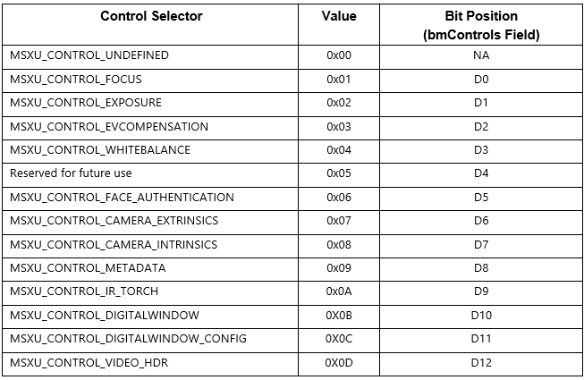

##### 2.2.2.1 Cancelable Asynchronous Controls

A Cancelable Asynchronous control is defined here by leveraging the Autoupdate capability.

GET_INFO request shall report such control as an Autoupdate Control (for example, D3 bit shall be set to 1) but not as an Asynchronous control (for example, D4 bit shall be set to 0).

For such control, a SET_CUR request can be issued to set a new value (a SET_CUR(NORMAL) request wherein **bmOperationFlags:D0** bit is set to 0) or cancel a previous SET_CUR(NORMAL) request (a SET_CUR(CANCEL) request wherein **bmOperationFlags:D0** bit is set to 1). A SET_CUR request should be completed by the device immediately as soon as the request is received (even though the hardware is not configured or converged to the new settings requested). For each SET_CUR(NORMAL) request, the device produces a corresponding Control Change interrupt for this control raised when the new settings have been applied or when a SET_CUR(CANCEL) request arrives; until this interrupt arrives, the SET_CUR(NORMAL) request will be considered to be in-progress. When a SET_CUR(NORMAL) request is in-progress, additional SET_CUR(NORMAL) requests for this particular control shall result in a failure. A SET_CUR(CANCEL) request shall always succeed. If there is nothing to cancel, then the device just does nothing.

The Control Change interrupt payload shall have the bit **bmOperationFlags:D0** set to 0 if the settings specified by SET_CUR(NORMAL) were applied (i.e. convergence happened) and set to 1 if the settings were not applied because of a SET_CUR(CANCEL) request that came after the SET_CUR(NORMAL) request (i.e. convergence hasn't happened yet).

##### 2.2.2.2 Focus Control

This control allows the host software to specify the focus settings for the camera. This is a global control that affects all endpoints on all video streaming interfaces associated with the video control interface.

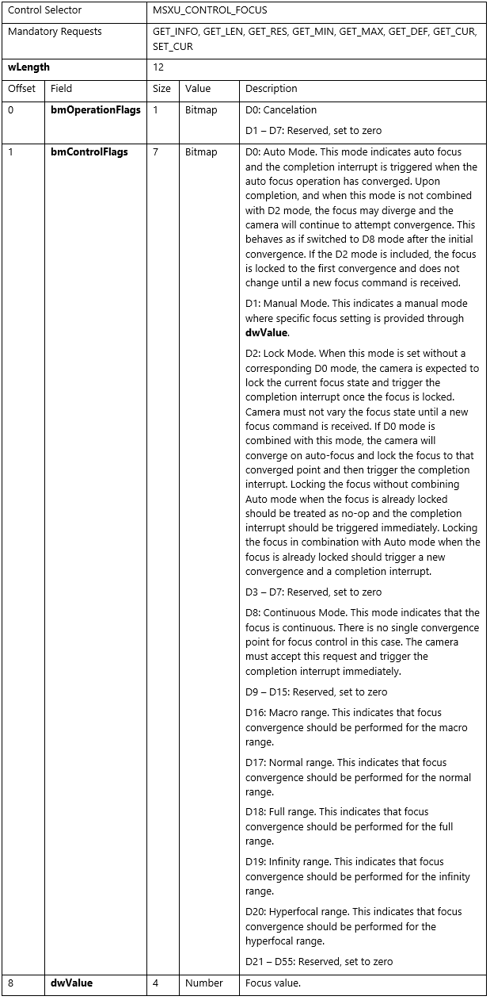

This control shall function as a Cancelable Asynchronous Control (see section 2.2.2.1 for GET_INFO request requirements and functional behavior of SET_CUR request).

GET_MAX requirement: This control shall advertise support for bits D0, D1, D2, D8 and D18 in **bmControlFlags**.

GET_DEF requirement: The default for **bmControlFlags** shall be D0 and D18 set to 1 and **dwValue** set to 0.

For GET_CUR/SET_CUR requests, the following restrictions apply for field **bmControlFlags**:

- Among D0, D1 and D8 bits, only one bit can be set; none of them being set is valid too if D2 bit is set.

- Among D16, D17, D18, D19 and D20, only one bit can be set; none of them being set is valid too.

- D1 is incompatible with all other bits currently defined (D0, D2, D8, D16, D17, D18, D19 and D20).

- D2 is incompatible with D1 and D8.

D2 is incompatible with D16, D17, D18, D19 and D20 if D0 is not set.

##### 2.2.2.3 Exposure Control

This control allows the host software to specify the exposure settings for the camera. This is a global control that affects all endpoints on all video streaming interfaces associated with the video control interface.

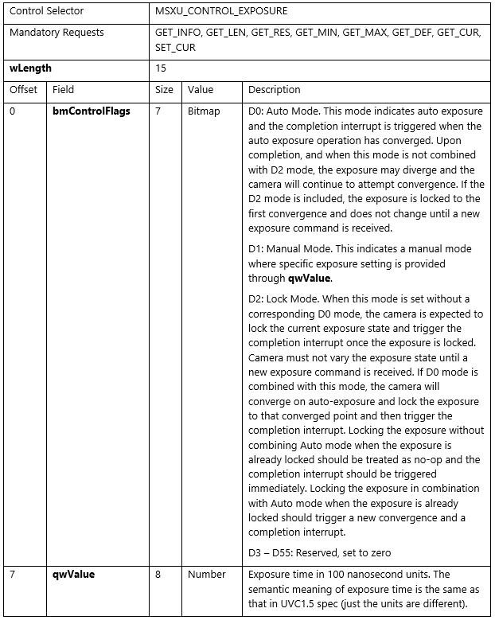

GET_INFO request shall report this control as an Asynchronous control (i.e. D4 bit shall be set to 1) but not as an AutoUpdate control (i.e. D3 bit shall be set to 0).

GET_MAX requirement: This control shall advertise support for bits D0, D1 and D2 in **bmControlFlags**.

GET_DEF requirement: The default for **bmControlFlags** shall be D0 set to 1 and **qwValue** set to 0.

For GET_CUR/SET_CUR requests, the following restrictions apply for field **bmControlFlags**:

- Among D0, D1 and D2 bits, at least one bit shall be set.

- D1 is incompatible with D0 and D2.

##### 2.2.2.4 EV Compensation Control

This control allows the host software to specify the EV compensation settings for the camera. This is a global control that affects all endpoints on all video streaming interfaces associated with the video control interface.

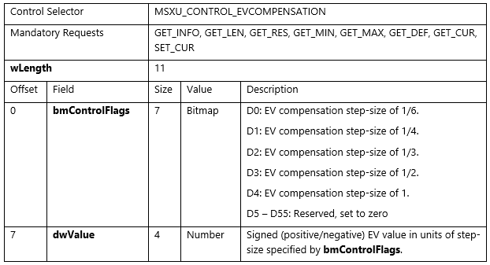

GET_INFO request shall report this control as an Asynchronous control (i.e. D4 bit shall be set to 1) but not as an AutoUpdate control (i.e. D3 bit shall be set to 0).

GET_RES request shall report all the supported resolutions (step-size) by setting corresponding bits in **bmControlFlags**. All other fields shall be set to 0.

GET_MIN and GET_MAX requests shall report the minimum and maximum supported value for **dwValue**. The bit D4 (indicating step-size of 1) shall be the one and only bit set in **bmControlFlags**. All other fields shall be set to 0.

GET_DEF, GET_CUR, SET_CUR requests shall follow the definitions in section 2.2.2.1 but shall have one and only one bit set among D0, D1, D2, D3 and D4 bits for field **bmControlFlags**. Furthermore, GET_DEF request shall have **dwValue** set to 0.

##### 2.2.2.5 White Balance Control

This control allows the host software to specify the white balance settings for the camera. This is a global control that affects all endpoints on all video streaming interfaces associated with the video control interface.

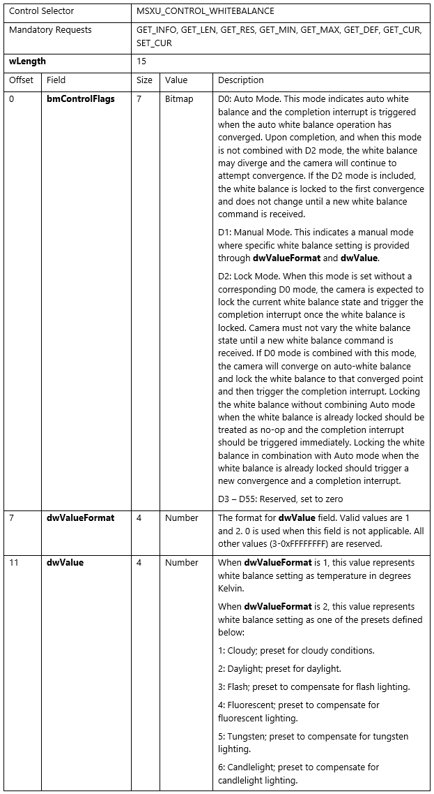

GET_INFO request shall report this control as an Asynchronous control (i.e. D4 bit shall be set to 1) but not as an AutoUpdate control (i.e. D3 bit shall be set to 0).

GET_RES, GET_MIN, GET_MAX requests shall follow the definitions in section 2.2.2.1 but shall have **dwValueFormat** set to 1.

GET_MAX requirement: This control shall advertise support for bits D0, D1 and D2 in **bmControlFlags**.

GET_DEF requirement: The default for **bmControlFlags** shall be D0 set to 1 and **dwValueFormat as well as dwValue** set to 0.

For GET_CUR/SET_CUR requests, the following restrictions apply for field **bmControlFlags**:

- Among D0, D1 and D2 bits, at least one bit shall be set.

- D1 is incompatible with D0 and D2.

##### 2.2.2.6 ISO Control

This control allows the host software to specify the ISO film speed settings for still image capture on the camera. This control is only applicable to the specified video/still endpoints (which is a subset of all video/still endpoints on all video streaming interfaces associated with the video control interface). If Method 1 for still capture is used, this control should be supported on the video endpoint. If Method 2 or Method 3 for still capture is used, this control should be supported on the still endpoint.


GET_INFO request shall report this control as an Asynchronous control (i.e. D4 bit shall be set to 1) but not as an AutoUpdate control (i.e. D3 bit shall be set to 0).

GET_RES, GET_MIN, GET_MAX, GET_DEF, GET_CUR requests shall follow the definitions in section 2.2.2.1. Also, the output of these requests shall list all and only endpoints capable of either D0 (Auto mode) or D52 (Manual mode) i.e. if an endpoint is capable of either D0 or D52, it gets listed; otherwise, it does not get listed.

##### 2.2.2.7 Face Authentication Control

This control allows the host software to specify whether the camera supports streaming modes that are used for face authentication. This control should be supported only if the camera wishes to support face authentication.

This control is only applicable to cameras that can produce Infra-Red (IR) data and is only applicable to the specified video endpoints (which is a subset of all video endpoints on all video streaming interfaces associated with the video control interface).

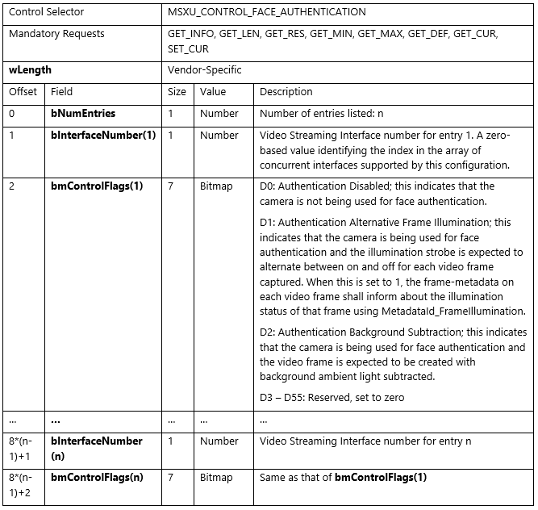

GET_RES and GET_MIN requests shall report field **bNumEntries** set to 0 and hence have no additional fields.

For a GET_MAX request, a bit set to 1 on the **bmControlFlags** field indicates that the corresponding mode is supported for that endpoint. A GET_MAX request output shall list all and only endpoints capable of either D1 or D2 (i.e. if an endpoint is capable of either D1 or D2, it gets listed; otherwise, it does not get listed). Also, no endpoint should be advertised to be capable of both D1 and D2. If an endpoint is expected to work in a general purpose manner (i.e. outside of the purpose of face authentication), then D0 should be set to 1 for that endpoint (in addition to D1/D2).

For GET_DEF / GET_CUR / SET_CUR requests, a bit set to 1 indicates that the corresponding mode is chosen for that endpoint. In these requests, one and only one bit (among D0, D1 & D2) shall be set for a particular endpoint. For the GET_DEF request that returns the default choice (which is implementation specific), if an endpoint is expected to work in a general purpose manner (i.e. outside of the purpose of face authentication), then D0 should be set to 1 by default on that endpoint; otherwise, either D1 or D2 (but not both) should be set to 1 by default. A GET_DEF / GET_CUR request output shall contain information on all endpoints listed in GET_MAX request output; however, a SET_CUR request may only include a subset of the endpoints listed in GET_MAX request output.

##### 2.2.2.8 Camera Extrinsics Control

This control allows the host software to obtain the camera extrinsics data for endpoints on video streaming interfaces associated with the video control interface. The data thus obtained for each endpoint will show up as attribute MFStreamExtension_CameraExtrinsics on the attribute store for the corresponding stream (obtained using IMFDeviceTransform::GetOutputStreamAttributes call).

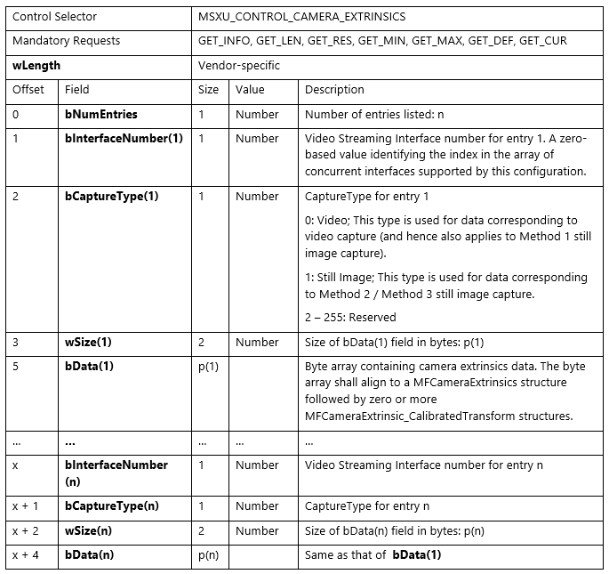

GET_RES, GET_MIN, GET_MAX, GET_CUR requests shall report field **bNumEntries** set to 0 and hence have no additional fields.

GET_DEF request shall list all endpoints that have the extrinsics information available.

##### 2.2.2.9 Camera Intrinsics Control

This control allows the host software to obtain the camera intrinsics data for endpoints on video streaming interfaces associated with the video control interface. The data thus obtained for each endpoint will show up as attribute MFStreamExtension_PinholeCameraIntrinsics on the attribute store for the corresponding stream (obtained using IMFDeviceTransform::GetOutputStreamAttributes call).

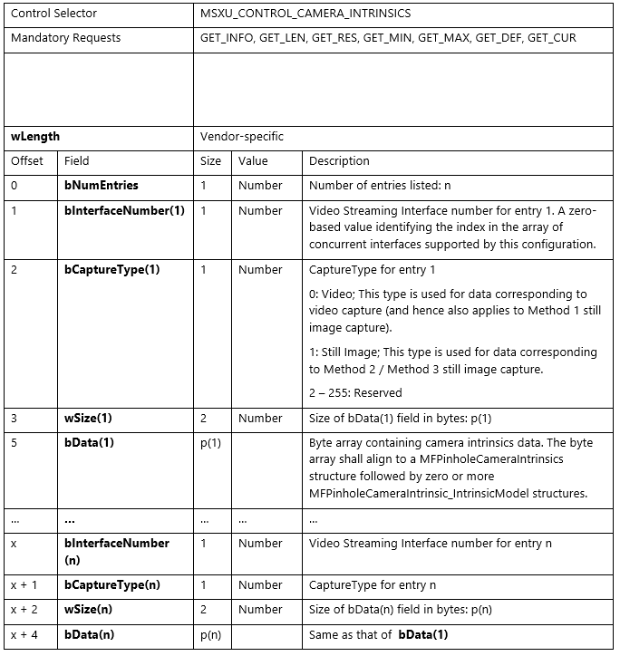

GET_RES, GET_MIN, GET_MAX, GET_CUR requests shall report field **bNumEntries** set to 0 and hence have no additional fields.

GET_DEF request shall list all endpoints that have the intrinsics information available.

##### 2.2.2.10 Metadata Control

This control allows the host software to query and control metadata produced by the camera. This is a global control that affects all endpoints on all video streaming interfaces associated with the video control interface. This control gets mapped to [**KSPROPERTY_CAMERACONTROL_EXTENDED_METADATA**](ksproperty-cameracontrol-extended-metadata.md) by the camera driver.

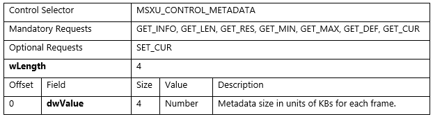

If SET_CUR request is supported by the firmware, the following applies:

- GET_MIN, GET_DEF requests shall report field dwValue set to 0.
- GET_RES request shall report field dwValue to be the same value as reported by GET_MAX request.
- When a SET_CUR request is received with dwValue set to 0, the camera shall not produce any metadata. When a SET_CUR request is received with dwValue set to be the same value as reported by GET_MAX request, the camera can produce metadata and the size of such metadata cannot exceed dwValue for any frame.

If SET_CUR request is not supported by the firmware, the following applies:

- GET_MIN, GET_DEF requests shall report field dwValue to be the same value as reported by GET_MAX request.
- GET_RES request shall report field dwValue set to 0.
- The camera can produce metadata and the total size of such metadata cannot exceed the dwValue - as reported by GET_MAX request – times 1024 bytes less the size of a UsbVideoHeader metadata payload, for any frame.  
- A UsbVideoHeader metadata payload is the sizeof(KSCAMERA_METADATA_ITEMHEADER) + sizeof(KSTREAM_UVC_METADATA) or 24 bytes.
The metadata produced shall conform to the Microsoft standard-format metadata described in section 2.2.3.

##### 2.2.2.11 IR Torch Control

This control provides a flexible means for the IR LED hardware to report the extent to which it can be controlled and provides the ability to control it.  This is a global control that affects all endpoints on all video streaming interfaces associated with the video control interface by adjusting the power to an IR lamp connected to the camera. This control gets mapped to [**KSPROPERTY_CAMERACONTROL_EXTENDED_IRTORCHMODE**](ksproperty-cameracontrol-extended-irtorchmode.md) by the camera driver.

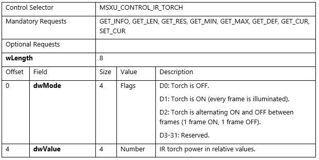

The following applies:

- GET_LEN request shall report a value of 8.
- GET_INFO request shall report a 3.  This value indicates a synchronous control that supports GET_CUR and SET_CUR.
- GET_MIN request shall report field dwMode set to 0 and dwValue set to a value indicating minimum power.  A power level of 0 may indicate OFF, but the minimum operational power level need not be 0.
- GET_RES request shall report field dwMode set to 0 and dwValue set a to a number less than or equal to GET_MAX(dwValue) – GET_MIN(dwValue) and such that GET_MAX(dwValue) – GET_MIN(dwValue) is evenly divisible by that value.  dwValue may not be zero (0).
- GET_MAX request shall report field dwMode set with bits D[0-2] set to identify the capabilities of this control.  dwMode must have bit D0 set, indicating that OFF is supported, and it must have at least one other bit set, supporting an active state.  dwValue must be set to a value indicating normal power.
- GET_DEF request shall report field dwMode set to the default mode the system should be in before streaming begins.  dwMode must be set to 2 (ON) or 4 (ALTERNATING).  dwValue should be set to the power level normally used for the FaceAuth control.  dwValue is defined by the manufacturer.
- GET_CUR request shall report field dwMode set to the current operating mode and dwValue set to the current illumination.
- When a SET_CUR request is received, the IR Torch will set the illumination to a prorate intensity using the requested operating mode.

The IR Torch must emit the [**MF_CAPTURE_METADATA_FRAME_ILLUMINATION**](standardized-extended-controls-.md) attribute for every frame.  It can provide this through a Device MFT or by including a **MetadataId_FrameIllumination** attribute in the metadata payload from the camera.  See section 2.2.3.4.4.  

This metadata's sole purpose is to indicate whether a frame is illuminated or not.  This is the same metadata required by the [**KSPROPERTY_CAMERACONTROL_EXTENDED_FACEAUTH_MODE**](ksproperty-cameracontrol-extended-faceauth-mode.md) DDI and  the **MSXU_FACE_AUTHENTICATION_CONTROL** defined in section 2.2.2.7.  

#### 2.2.3 Metadata

The design for standard-format frame-metadata builds on the UVC custom metadata design from Windows 10. In Windows 10, custom metadata is supported for UVC by using a custom INF for the camera driver (note: the camera driver can be based on the Windows USBVIDEO.SYS, but a custom INF is required for the given hardware for metadata to come through). If `MetadataBufferSizeInKB<PinIndex>` registry entry is present and non-zero, then custom metadata is supported for that pin and the value indicates the buffer size used for the metadata. The `<PinIndex>` field indicates a 0 based index of the video pin index.

In Windows 10, version 1703, a camera driver can signal support for Microsoft standard-format metadata by including the following AddReg entry:

`StandardFormatMetadata<PinIndex>`: REG_DWORD: 0x0 (NotSupported) to 0x1 (Supported)

This registry key will be read by DevProxy and informs the UVC driver that the metadata is in standard format by setting the flag KSSTREAM_METADATA_INFO_FLAG_STANDARDFORMAT in the Flags field for KSSTREAM_METADATA_INFO structure.

##### 2.2.3.1 Microsoft Standard-format Metadata

The Microsoft standard-format metadata is one or more instances of the following structure:

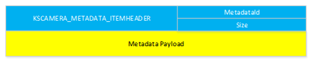

```cpp
typedef struct tagKSCAMERA_METADATA_ITEMHEADER {
    ULONG MetadataId;
    ULONG Size; // Size of this header + metadata payload following
} KSCAMERA_METADATA_ITEMHEADER, *PKSCAMERA_METADATA_ITEMHEADER;
```

The MetadataId field is filled by an identifier from the following enum definition which contains well-defined identifiers as well as custom identifiers (identifiers >= MetadataId_Custom_Start).

```cpp
typedef enum {
    MetadataId_Standard_Start = 1,
    MetadataId_PhotoConfirmation = MetadataId_Standard_Start,
    MetadataId_UsbVideoHeader,
    MetadataId_CaptureStats,
    MetadataId_CameraExtrinsics,
    MetadataId_CameraIntrinsics,
    MetadataId_FrameIllumination,
    MetadataId_Standard_End = MetadataId_FrameIllumination,
    MetadataId_Custom_Start = 0x80000000,
} KSCAMERA_MetadataId;
```

The Size field is set to sizeof(KSCAMERA_METADATA_ITEMHEADER) + sizeof(Metadata Payload).

##### 2.2.3.2 Firmware-generated standard-format metadata from USB video frame packets

During a transfer over UVC for frame based video, the video frame is packetized into a series of packets, each preceded by a UVC Payload Header. Each UVC Payload Header is defined by the USB Video Class Driver Frame Based Payload specification:

**Payload Header**

The following is a description of the payload header format for Frame Based formats.

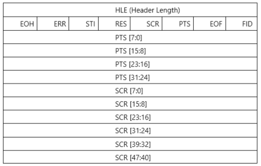

**HLE (Header length) field**

The header length field specifies the length of the header, in bytes.

**Bit field header field**

*FID: Frame Identifier*

- This bit toggles at each frame start boundary and stays constant for the rest of the frame.

*EOF: End of Frame*

- This bit indicates the end of a video frame and is set in the last video sample belonging to a frame. The use of this bit is an optimization to reduce latency in completion of a frame transfer, and is optional.

*PTS: Presentation Time Stamp*

- This bit, when set, indicates the presence of a PTS field.

*SCR: Source Clock Reference*

- This bit, when set, indicates the presence of a SCR field.

*RES: Reserved.*

- Set to 0.

*STI: Still Image*

- This bit, when set, identifies a video sample as belonging to a still image.

*ERR: Error Bit*

- This bit, when set, indicates an error in the device streaming.

*EOH: End of Header*

- This bit, when set, indicates the end of the BFH fields.

*PTS: Presentation Time Stamp, Size: 4 bytes, Value: Number*

- The PTS field is present when the PTS bit is set in the BFH[0] field. See Section 2.4.3.3 "Video and Still Image Payload Headers" in the *USB Device Class Definition for Video Devices* specification.

*SCR: Source Clock Reference, Size: 6 bytes, Value: Number*

- The SCR field is present when the SCR bit is set in the BFH[0] field. See Section 2.4.3.3 *Video and Still Image Payload Headers* in the *USB Device Class Definition for Video Devices* specification.

The HLE field in the existing UVC driver is fixed to either 2 bytes (no PTS/SCR present) or upto 12 bytes (PTS/SCR present). However, the HLE field, being a byte sized field, can potentially specify up to 255 bytes of header data. If both PTS/SCR are present, and the HLE isgreater than 12 bytes, any additional data following the first 12 bytes of the payload header is picked up as standard metadata specific to the video frame when INF entry `StandardFormatMetadata<PinIndex>` is set.

The standard-format metadata (generated by firmware) for a frame is obtained by concatenating the partial blobs found in the video frame packets representing that frame.

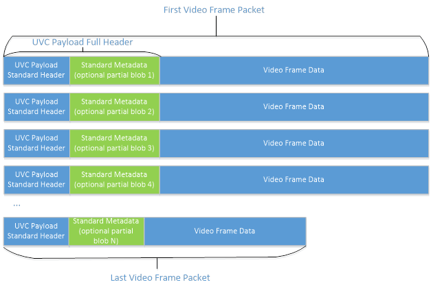

##### 2.2.3.3 Metadata buffer provided to user-mode component

The metadata buffer provided to the user mode component would have a metadata item for the UVC timestamps (generated by UVC driver) followed by firmware-generated metadata items and they are laid out as follows:


##### 2.2.3.4 Metadata format for standard metadata identifiers

The firmware can choose whether or not to produce metadata corresponding to an identifier. If the firmware chooses to produce metadata corresponding to an identifier, then that identifier's metadata shall be present on all frames emitted by the firmware.

###### 2.2.3.4.1 MetadataId_CaptureStats

The metadata format for this identifier is defined by the following structure:

```cpp
typedef struct tagKSCAMERA_METADATA_CAPTURESTATS {
    KSCAMERA_METADATA_ITEMHEADER Header;
    ULONG Flags;
    ULONG Reserved;
    ULONGLONG ExposureTime;
    ULONGLONG ExposureCompensationFlags;
    LONG ExposureCompensationValue;
    ULONG IsoSpeed;
    ULONG FocusState;
    ULONG LensPosition; // a.k.a Focus
    ULONG WhiteBalance;
    ULONG Flash;
    ULONG FlashPower;
    ULONG ZoomFactor;
    ULONGLONG SceneMode;
    ULONGLONG SensorFramerate;
} KSCAMERA_METADATA_CAPTURESTATS, *PKSCAMERA_METADATA_CAPTURESTATS;
```

The **Flags** field indicates which of the later fields in the structure are filled and have valid data. The Flags field shall not vary from frame to frame. Currently, the following flags are defined:

```cpp
#define KSCAMERA_METADATA_CAPTURESTATS_FLAG_EXPOSURETIME            0x00000001
#define KSCAMERA_METADATA_CAPTURESTATS_FLAG_EXPOSURECOMPENSATION    0x00000002
#define KSCAMERA_METADATA_CAPTURESTATS_FLAG_ISOSPEED                0x00000004
#define KSCAMERA_METADATA_CAPTURESTATS_FLAG_FOCUSSTATE              0x00000008
#define KSCAMERA_METADATA_CAPTURESTATS_FLAG_LENSPOSITION            0x00000010
#define KSCAMERA_METADATA_CAPTURESTATS_FLAG_WHITEBALANCE            0x00000020
#define KSCAMERA_METADATA_CAPTURESTATS_FLAG_FLASH                   0x00000040
#define KSCAMERA_METADATA_CAPTURESTATS_FLAG_FLASHPOWER              0x00000080
#define KSCAMERA_METADATA_CAPTURESTATS_FLAG_ZOOMFACTOR              0x00000100
#define KSCAMERA_METADATA_CAPTURESTATS_FLAG_SCENEMODE               0x00000200
#define KSCAMERA_METADATA_CAPTURESTATS_FLAG_SENSORFRAMERATE         0x00000400
```

The **Reserved** field is reserved for future and shall be set to 0.

The **ExposureTime** field contains the exposure time, in 100ns, applied to the sensor when the frame was captured. This will show up as attribute MF_CAPTURE_METADATA_EXPOSURE_TIME on the corresponding MF sample.

The **ExposureCompensationFlags** field contains the EV compensation step (exactly one of the KSCAMERA_EXTENDEDPROP_EVCOMP_XXX step flags shall be set) used to convey the EV Compensation value. The **ExposureCompensationValue** field contains the EV Compensation value in units of the step applied to the sensor when the frame was captured. These will show up as attribute MF_CAPTURE_METADATA_EXPOSURE_COMPENSATION on the corresponding MF sample.

The **IsoSpeed** field contains the ISO speed value applied to the sensor when the frame was captured. This is unitless. This will show up as attribute MF_CAPTURE_METADATA_ISO_SPEED on the corresponding MF sample.

The **FocusState** field contains the current focus state which can take one of the values defined in enum KSCAMERA_EXTENDEDPROP_FOCUSSTATE. This will show up as attribute MF_CAPTURE_METADATA_FOCUSSTATE on the corresponding MF sample.

The **LensPosition** field contains the logical lens position when the frame was captured, which is unitless. This is the same value that can be queried from KSPROPERTY_CAMERACONTROL_EXTENDED_FOCUS in a GET call. This will show up as attribute MF_CAPTURE_METADATA_LENS_POSITION on the corresponding MF sample.

The **WhiteBalance** field contains the white balance applied to the sensor when the frame was captured, which is a value in Kelvin. This will show up as attribute MF_CAPTURE_METADATA_WHITEBALANCE on the corresponding MF sample.

The **Flash** field contains a boolean value with 1 meaning flash on, and 0 meaning flash off, when frame was captured. This will show up as attribute MF_CAPTURE_METADATA_FLASH on the corresponding MF sample.

The **FlashPower** field contains the flash power applied to the frame captured which is a value in the range of [0, 100]. This field should be omitted if the driver does not support adjustable power for flash. This will show up as attribute MF_CAPTURE_METADATA_FLASH_POWER on the corresponding MF sample.

The **ZoomFactor** field contains the zoom value in Q16 format applied to the frame captured. This will show up as attribute MF_CAPTURE_METADATA_ZOOMFACTOR on the corresponding MF sample.

The **SceneMode** field contains the scene mode applied to the frame captured which is a 64bit KSCAMERA_EXTENDEDPROP_SCENEMODE_XXX flag. This will show up as attribute MF_CAPTURE_METADATA_SCENE_MODE on the corresponding MF sample.

The **SensorFramerate** field contains the measured sensor readout rate in hertz when the frame is captured, which consists of a numerator value in the upper 32 bit and a denominator value in the lower 32 bit. This will show up as attribute MF_CAPTURE_METADATA_SENSORFRAMERATE on the corresponding MF sample.

###### 2.2.3.4.2 MetadataId_CameraExtrinsics

The metadata format for this identifier involves the standard KSCAMERA_METADATA_ITEMHEADER followed by a byte-array payload. The payload should align to a [MFCameraExtrinsics](/windows/win32/api/mfapi/ns-mfapi-mfcameraextrinsics) structure followed by zero or more [MFCameraExtrinsic_CalibratedTransform](/windows/win32/api/mfapi/ns-mfapi-mfcameraextrinsic_calibratedtransform) structures. The payload must be 8-byte aligned and all unused bytes shall occur at the end of the payload and be set to 0.

###### 2.2.3.4.3 MetadataId_CameraIntrinsics

The metadata format for this identifier involves the standard KSCAMERA_METADATA_ITEMHEADER followed by a byte-array payload. The payload should align to a [MFPinholeCameraIntrinsics](/windows/win32/api/mfapi/ns-mfapi-mfpinholecameraintrinsics) structure. The payload must be 8-byte aligned and all unused bytes shall occur at the end of the payload and be set to 0.

###### 2.2.3.4.4 MetadataId_FrameIllumination

The metadata format for this identifier is defined by the following structure:

```cpp
typedef struct tagKSCAMERA_METADATA_FRAMEILLUMINATION {
    KSCAMERA_METADATA_ITEMHEADER Header;
    ULONG Flags;
    ULONG Reserved;
} KSCAMERA_METADATA_FRAMEILLUMINATION, *PKSCAMERA_METADATA_FRAMEILLUMINATION;
```

The **Flags** field indicates information about the captured frame. Currently, the following flags are defined:

```cpp
#define KSCAMERA_METADATA_FRAMEILLUMINATION_FLAG_ON 0x00000001
```

If a frame was captured when illumination was on, the flag KSCAMERA_METADATA_FRAMEILLUMINATION_FLAG_ON shall be set. Otherwise, this flag shall not be set.

The **Reserved** field is reserved for future use and shall be set to 0.