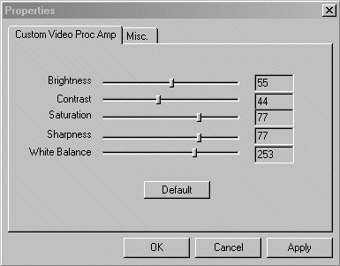

# Video Capture Property Sets

Video capture property sets group related properties of devices and streams. Whenever possible, minidrivers should implement the standard property sets defined in the *ksmedia.h* header file, such as [KSPROPSETID\_Pin](kspropsetid-pin.md) and [PROPSETID\_ALLOCATOR\_CONTROL](propsetid-allocator-control.md). Minidrivers should avoid defining new property sets if one of the standard property sets provides the same functionality.

User-mode applications typically call COM interfaces to control property settings. The COM interface then sends and receives stream and adapter property sets to the minidriver through the Win32 **DeviceIoControl** API. The reference page for each property set describes the COM interface that user-mode applications call to control the kernel streaming properties of that set.

Depending on which kernel streaming interface a minidriver uses (AVStream or the Stream class), the minidriver specifies the video capture property sets that it supports differently. For example, if a minidriver uses the AVStream interface, then it specifies its properties in a recursive hierarchy encapsulated in a [**KSPROPERTY\_SET**](https://docs.microsoft.com/windows-hardware/drivers/ddi/content/ks/ns-ks-ksproperty_set) structure. If the minidriver uses the Stream class interface, then it specifies its properties in an [**HW\_STREAM\_HEADER**](https://docs.microsoft.com/windows-hardware/drivers/ddi/content/strmini/ns-strmini-_hw_stream_header) structure. Microsoft defines several macros that driver developers can use to specify the properties that their minidriver supports, regardless of which kernel streaming interface their minidriver uses.

For more information about how to support properties and property sets if your minidriver uses the AVStream interface, see the [AVStream Filter-Centric Simulated Capture Driver (Avssamp)](https://github.com/Microsoft/Windows-driver-samples/tree/master/avstream/avssamp) and [AVStream Simulated Hardware Sample Driver (AVSHwS)](https://github.com/Microsoft/Windows-driver-samples/tree/master/avstream/avshws) sample minidrivers in the Windows driver samples repo on GitHub.

For more information about how to support properties and property sets if your minidriver uses the Stream Class interface, see [Supporting Property Sets](supporting-property-sets.md).

### Hardware and Stream Property Sets

Property sets are classified as belonging to either the hardware or to a specific stream. Hardware property sets apply to all devices and affect all streams. For example, [PROPSETID\_VIDCAP\_CAMERACONTROL](propsetid-vidcap-cameracontrol.md), which is used for camera positioning, affects all output streams and is therefore classified as a hardware property set. Note that some property sets, such as [PROPSETID\_VIDCAP\_VIDEOCOMPRESSION](propsetid-vidcap-videocompression.md), which controls the compression behavior of a single output stream, are implemented as a hardware property set that include an index to a specific stream. This method is required because stream property sets are unavailable when the pin is not connected. Hardware property sets are always available.

The following table lists the primary property sets used by video capture minidrivers. It also indicates whether the property set affects video capture hardware, or individual video capture streams. The list also indicates whether minidrivers are required to implement the property set.

<table>
<colgroup>
<col width="25%" />
<col width="25%" />
<col width="25%" />
<col width="25%" />
</colgroup>
<thead>
<tr class="header">
<th>Property set</th>
<th>Hardware property set</th>
<th>Video capture property set</th>
<th>Required</th>
</tr>
</thead>
<tbody>
<tr class="odd">
<td>
<a href="propsetid-allocator-control.md" data-raw-source="[PROPSETID_ALLOCATOR_CONTROL](propsetid-allocator-control.md)">PROPSETID_ALLOCATOR_CONTROL</a>
</td>
<td></td>
<td>
Y
</td>
<td></td>
</tr>
<tr class="even">
<td>
<a href="propsetid-tuner.md" data-raw-source="[PROPSETID_TUNER](propsetid-tuner.md)">PROPSETID_TUNER</a>
</td>
<td>
Y
</td>
<td></td>
<td></td>
</tr>
<tr class="odd">
<td>
<a href="propsetid-vidcap-cameracontrol.md" data-raw-source="[PROPSETID_VIDCAP_CAMERACONTROL](propsetid-vidcap-cameracontrol.md)">PROPSETID_VIDCAP_CAMERACONTROL</a>
</td>
<td>
Y
</td>
<td></td>
<td></td>
</tr>
<tr class="even">
<td>
<a href="propsetid-vidcap-crossbar.md" data-raw-source="[PROPSETID_VIDCAP_CROSSBAR](propsetid-vidcap-crossbar.md)">PROPSETID_VIDCAP_CROSSBAR</a>
</td>
<td>
Y
</td>
<td></td>
<td></td>
</tr>
<tr class="odd">
<td>
<a href="propsetid-vidcap-droppedframes.md" data-raw-source="[PROPSETID_VIDCAP_DROPPEDFRAMES](propsetid-vidcap-droppedframes.md)">PROPSETID_VIDCAP_DROPPEDFRAMES</a>
</td>
<td></td>
<td>
Y
</td>
<td>
Y
</td>
</tr>
<tr class="even">
<td>
<a href="propsetid-vidcap-tvaudio.md" data-raw-source="[PROPSETID_VIDCAP_TVAUDIO](propsetid-vidcap-tvaudio.md)">PROPSETID_VIDCAP_TVAUDIO</a>
</td>
<td>
Y
</td>
<td></td>
<td></td>
</tr>
<tr class="odd">
<td>
<a href="propsetid-vidcap-videocompression.md" data-raw-source="[PROPSETID_VIDCAP_VIDEOCOMPRESSION](propsetid-vidcap-videocompression.md)">PROPSETID_VIDCAP_VIDEOCOMPRESSION</a>
</td>
<td>
Y
</td>
<td></td>
<td></td>
</tr>
<tr class="even">
<td>
<a href="propsetid-vidcap-videocontrol.md" data-raw-source="[PROPSETID_VIDCAP_VIDEOCONTROL](propsetid-vidcap-videocontrol.md)">PROPSETID_VIDCAP_VIDEOCONTROL</a>
</td>
<td>
Y
</td>
<td></td>
<td></td>
</tr>
<tr class="odd">
<td>
<a href="propsetid-vidcap-videodecoder.md" data-raw-source="[PROPSETID_VIDCAP_VIDEODECODER](propsetid-vidcap-videodecoder.md)">PROPSETID_VIDCAP_VIDEODECODER</a>
</td>
<td>
Y
</td>
<td></td>
<td></td>
</tr>
<tr class="even">
<td>
<a href="propsetid-vidcap-videoprocamp.md" data-raw-source="[PROPSETID_VIDCAP_VIDEOPROCAMP](propsetid-vidcap-videoprocamp.md)">PROPSETID_VIDCAP_VIDEOPROCAMP</a>
</td>
<td>
Y
</td>
<td></td>
<td></td>
</tr>
</tbody>
</table>

 

At a minimum, a minidriver must report the number of frames dropped during capture as noted in the table above. Support for all other property sets is optional, depending on the capabilities of the device. It is strongly recommended that cameras, which offer only a limited set of capture frame rates, implement the [PROPSETID\_VIDCAP\_VIDEOCONTROL](propsetid-vidcap-videocontrol.md) to allow video conferencing applications to make optimal use of system bandwidth.

### Property Set Default Values and Ranges

Properties can support default values and ranges. User-interface elements, such as sliders and scrollbars, use this information, as shown in the following image.

The default value and range information is provided in a [**KSPROPERTY\_VALUES**](https://docs.microsoft.com/windows-hardware/drivers/ddi/content/ks/ns-ks-ksproperty_values) structure that is part of a property definition. This structure includes a pointer to a static table that consists of one or more [**KSPROPERTY\_MEMBERSLIST**](https://docs.microsoft.com/windows-hardware/drivers/ddi/content/ks/ns-ks-ksproperty_memberslist) structure instances. Within the KSPROPERTY\_MEMBERSLIST structure, the minidriver can specify either a default value or a range of values. A range of values can be specified through the minimum, maximum, and stepping value. Set the **MembersFlags** member of the [**KSPROPERTY\_MEMBERSHEADER**](https://docs.microsoft.com/windows-hardware/drivers/ddi/content/ks/ns-ks-ksproperty_membersheader) structure to the KSPROPERTY\_MEMBER\_RANGES value to indicate that the KSPROPERTY\_MEMBERSLIST structure is a range of values. A KSPROPERTY\_MEMBERSLIST structure is also used to specify a default value for the property. This is done by setting the **MembersFlags** member of the KSPROPERTY\_MEMBERSHEADER to the KSPROPERTY\_MEMBER\_VALUE value.

 

 

