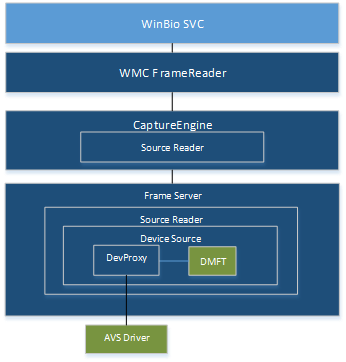

# Windows Hello camera driver bring up guide


Windows Hello provides you the ability to enable face authentication to log on to a Windows 10 system or device. This topic discusses how to enable Windows Hello for an infrared (IR) camera and is meant for original equipment manufacturers (OEMs) and independent hardware vendors (IHVs) who want to provide this log on functionality in their devices.

## Windows Hello and FrameServer


The following diagram shows how Windows Hello works with the new driver stack through FrameServer:



## <a href="" id="face-authentication--ddis"></a>Face authentication DDIs


There are two new face authentication DDI constructs available in Windows 10, version 1607 to support Windows Hello:

-   **KSPROPERTY\_CAMERACONTROL\_EXTENDED\_FACEAUTH\_MODE**

    This property ID is used to turn on and configure face authentication in the driver using the following flags:

    -   **KSCAMERA\_EXTENDEDPROP\_FACEAUTH\_MODE\_DISABLED**

    -   **KSCAMERA\_EXTENDEDPROP\_FACEAUTH\_MODE\_ALTERNATIVE\_FRAME\_ILLUMINATION**

    -   **KSCAMERA\_EXTENDEDPROP\_FACEAUTH\_MODE\_BACKGROUND\_SUBTRACTION**

    For more information about this control and how to use the bit flags to set the face authentication mode, see the [**KSPROPERTY\_CAMERACONTROL\_EXTENDED\_FACEAUTH\_MODE**](https://msdn.microsoft.com/library/windows/hardware/mt742028) topic.

-   **MF\_CAPTURE\_METADATA\_FRAME\_ILLUMINATION**

    This metadata attribute for IR cameras specifies that frames are using active IR illumination. For more information, see the **Mandatory metadata attributes** table in the [Photo capture feedback](standardized-extended-controls-.md#photo-capture-feedback-applied-device-settings) section of the [Extended camera controls](standardized-extended-controls-.md) topic.

## USB camera support


To enable Windows Hello for an infrared camera on your device, you must provide a correctly configured DeviceMFT component and USB Video Class (UVC) extension unit.

### Configure the DeviceMFT component

As a starting point for building a DeviceMFT component that supports Windows Hello on your device, you can use the [sampledevicemft](https://github.com/Microsoft/Windows-driver-samples/tree/master/avstream/sampledevicemft) sample located in the [Windows driver samples](https://github.com/Microsoft/Windows-driver-samples) repository on GitHub.

To modify the driver sample, download and extract [Windows-driver-samples-master.zip](https://github.com/Microsoft/Windows-driver-samples/archive/master.zip), or alternatively, use git to clone the Windows driver sample repository to your development computer. Navigate to the **sampledevicemft** sample located in the **avstream** folder and make the following changes to the sample source code:

1.  Add Source type information in the DeviceMFT component

2.  Tag the illumination flag in the DeviceMFT component

3.  Convert the IKSControl in the DeviceMFT component to communicate with the UVC extension unit you will build in the next section:

### Build a USB Video Class (UVC) Extension Unit

To build a UVC extension unit for your device, follow the instructions in [Building the Extension Unit Sample Control](building-the-extension-unit-sample-control.md). This topic contains information on creating the required project files and provides links to sample code in the following topics:

[Sample Interface for UVC Extension Units](sample-interface-for-uvc-extension-units.md) (contains *Interface.idl*)

[Sample Extension Unit Plug-in DLL](sample-extension-unit-plug-in-dll.md) (contains *Xuproxy.h* and *Xuproxy.cpp*)

[Sample Registry Entry for UVC Extension Units](sample-registry-entry-for-uvc-extension-units.md) (contains *Xusample.rgs*)

[Sample Application for UVC Extension Units](sample-application-for-uvc-extension-units.md) (contains *TestApp.cpp*)

[Supporting Autoupdate Events with Extension Units](supporting-autoupdate-events-with-extension-units.md)

[Sample Extension Unit Descriptor](sample-extension-unit-descriptor.md)

[Providing a UVC INF File](providing-a-uvc-inf-file.md)

Refer to the [Extension Unit Plug-In Architecture](extension-unit-plug-in-architecture.md) topic for more information on how the sample code modules work together.

## INF file entries


To register a UVC device under **KSCATEGORY\_SENSOR\_CAMERA**, the sensor camera promotion flag should be specified:

```
HKR,,SensorCameraMode,0x00010001,0x00000001
```

To hide this camera from a regular camera app because it has no RGB streams, use the skip enumeration flag as follows:

```
HKR,,SkipCameraEnumeration,0x00010001,0x00000001
```

This removes the camera from **KSCATEGORY\_VIDEO**, which will block it from being enumerated through the legacy enumeration by regular camera apps.

Both the **SkipCameraEnumeration** and **SensorCameraMode** entries should be placed in the **DDInstall.HW** section of the INF file.

## <a href="" id="hlk-tests-for-kscategory-sensor-camera-to-assist-driver-testing"></a>HLK tests for KSCATEGORY\_SENSOR\_CAMERA to assist driver testing


Hardware Logo Kit (HLK) testing is required for both IR and RGB camera modules. This testing verifies the basic functionality of RGB and IR cameras used for Windows Hello face authentication. The RGB camera requirements are already specified in the HLK test suite.

These are tests that IR camera modules will need to pass to be enabled:

1.  Enumerate all KS Sensor Category Camera:

    -   Devices that support IR streams have to be under the SENSOR\_CAMERA category.

    -   Devices that support RGB streams go under the VIDEO\_CAMERA category.

    -   Only for a single camera device that supports IR and RGB stream, should register the device under both KSCAMERA categories: SENSOR\_CAMERA and VIDEO\_CAMERA.

2.  Find streams which have the **MF\_DEVICESTREAM\_ATTRIBUTE\_FACEAUTH\_CAPABILITY** attribute defined:

    -   If no stream has the **MF\_DEVICESTREAM\_ATTRIBUTE\_FACEAUTH\_CAPABILITY** attribute defined, then skip the test.

    -   If multiple streams have the **MF\_DEVICESTREAM\_ATTRIBUTE\_FACEAUTH\_CAPABILITY** attribute defined, fail the test, as only one stream should be Windows Hello capable.

    -   If **MF\_DEVICESTREAM\_ATTRIBUTE\_FRAMESOURCE\_TYPES** is not set to IR for this stream, fail the test, as there can not be RGB media types on this stream.

    -   Select this stream and validate that the media type is Windows Hello-capable (MJPG/L8/NV12) and that the resolution is greater than or equal to 320 x 320 pixels:

        1.  If Face Authentication Profile is supported, then validate this stream for the profile media type.

        2.  If Face Authentication Profile is not supported, validate the default media type of this stream.

    -   Check support for one of the properties in the face authentication DDI: Illuminated/un-illuminated or ambient subtraction.

    -   Set the KS property to the one which is supported.

    -   Start streaming

3.  Check run-time properties:

    -   Verify timestamp precision (preview test for Face Authentication with Meta Data).

    -   Verify that startup is less than 500 milliseconds (preview test for Face Authentication with Meta Data).

    -   Verify streaming at a minimum frame rate with the following parameters: 15 FPS illuminated and 15 FPS ambient or 15 FPS ambient subtracted, resolution greater than or equal to 320 x 320 pixels, media type L8/NV12, positive stride on the sample:

        1.  If illuminated property is enabled, check for metadata on frames (illuminated/non-illuminated pair frames at 15 FPS).

        2.  If ambient subtraction property is enabled, check for no metadata on frames (ambient frames at 15 FPS).

4.  Stop streaming

5.  Unset the KS Control

6.  Concurrency for RGB + IR: tested if defined in the camera profile

If the HLK tests listed above are not passed, Microsoft will not issue a signed driver to the OEM, and Windows Hello will not operate.

## Related topics
[Capture photos and video with MediaCapture](https://msdn.microsoft.com/windows/uwp/audio-video-camera/capture-photos-and-video-with-mediacapture)  
[Windows.Media.Capture namespace](https://msdn.microsoft.com/library/windows/apps/windows.media.capture.aspx)  

--------------------
[Send comments about this topic to Microsoft](mailto:wsddocfb@microsoft.com?subject=Documentation%20feedback%20%5Bstream\stream%5D:%20Windows%20Hello%20camera%20driver%20bring%20up%20guide%20%20RELEASE:%20%288/23/2016%29&body=%0A%0APRIVACY%20STATEMENT%0A%0AWe%20use%20your%20feedback%20to%20improve%20the%20documentation.%20We%20don't%20use%20your%20email%20address%20for%20any%20other%20purpose,%20and%20we'll%20remove%20your%20email%20address%20from%20our%20system%20after%20the%20issue%20that%20you're%20reporting%20is%20fixed.%20While%20we're%20working%20to%20fix%20this%20issue,%20we%20might%20send%20you%20an%20email%20message%20to%20ask%20for%20more%20info.%20Later,%20we%20might%20also%20send%20you%20an%20email%20message%20to%20let%20you%20know%20that%20we've%20addressed%20your%20feedback.%0A%0AFor%20more%20info%20about%20Microsoft's%20privacy%20policy,%20see%20http://privacy.microsoft.com/default.aspx. "Send comments about this topic to Microsoft")


