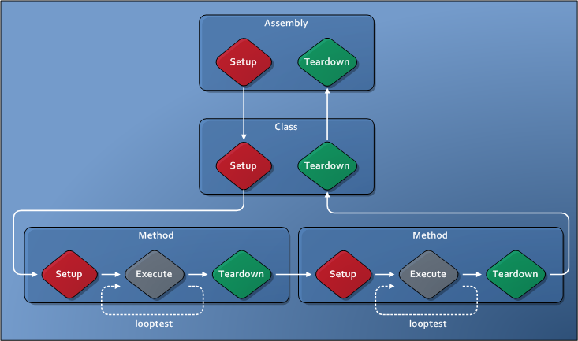
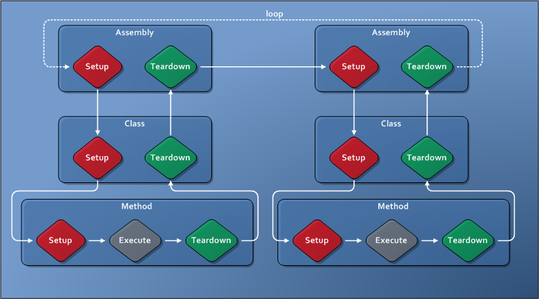

# Test Modes

TAEF provides several test modes which modify test execution behavior in various ways. Make sure that you are familiar with basic execution of TAEF, see [Authoring Tests](authoring-tests.md) and [Executing Tests](executing-tests.md), before proceeding with this section.

**Note:** Test modes are not compatible with each other; only one test mode may be enabled during a given test run.

The following test modes are currently provided by TAEF:

-   [Loop](#loop)
-   [Stress](#stress)

## Loop Test Mode

The "Loop Test Mode" provides simple functionality for iterating individual tests, or entire test runs. Loop Test Mode is great for verifying the robustness of test automation, or getting easy stress or long haul automation.

Loop Test Mode is enabled by specifying the /testmode:loop command option. There are two other - optional - parameters that control the specific behavior:

/Loop:&lt;loopNum&gt;  
Controls how many times the whole run is executed (default:1).

/LoopTest:&lt;loopTestNum&gt;  
Controls how many times the each test in the run gets executed (default:10).

The diagram, below, shows how TAEF represents a test run comprising of a single Test File, containing a single Test Class, that contains two Test Methods:

The arrows on the diagram show the flow of execution under TAEF; showing how TAEF executes setup fixtures, then the tests themselves, and the appropriate cleanup fixtures are executed after the tests are complete. The 'looptest' value causes TAEF to iterate around the test methods themselves - the *smallest possible scope*. Notice that the setup and cleanup for the test **aren't** executed. The same behavior occurs for data-driven tests, too: the 'looptest' value controls the looping at the 'Test Method' level.

There are times when it's not possible to loop around just the Test Method, and that's where the 'loop' parameter can be used. The diagram, below, shows how TAEF represents a test run comprising of a two test files, each file containing a single test class and each test class containing a single test method:

The 'loop' parameter controls looping at the *largest possible scope*; the entire run. If you specify a single test file to Te.exe, or if you have multiple test files, the entire run will be looped the specified number of times.

## Stress Test Mode

'Stress' Test Mode for TAEF helps users run tests in a 'stress' environment. By enabling Stress Test Mode via the "/testmode:stress" command option, the following behavior is enabled:

1.  *Te.exe runs indefinitely* - Te.exe requires Ctrl+C to be sent to the command prompt, or a WM\_CLOSE message to be sent to its hidden window to stop.
2.  *Te.exe iterates on the first 'group' of tests that it runs* - To avoid loading subsequent files during a run, Te.exe will iterate on the first 'group' of tests that it runs. Note that:
    1.  If you specify multiple Test Files at the command prompt, without any selection, only the first Test File will be executed.
    2.  If multiple Test Files along with a selection query are specified at the command prompt, only the tests within the first Test File where the selection criteria is satisfied will be executed.
    3.  If a Test File is specified that is data-driven at a module level, the first combination of data-driven parameters that is executed will be looped.

3.  *A 'stress logger' is enabled* - In order to minimize the amount of resources that logging would consume, Te.exe switches to a minimal output logger:
    -   Only errors are written to the console - no other Log entries are written out.
    -   Every 60 seconds, the Logger will output the current pass/fail counts to the console.
    -   Every second the Logger will output a single '.' to show that Te.exe is still working.

When running in stress test mode, you also need to specify the "/inproc" switch - which means that all stress execution runs in the Te.exe process. This restriction removes the need for TAEF to launch and maintain the separate sandbox process for execution, thereby minimizing test failures due to failed memory allocations.

 

 

