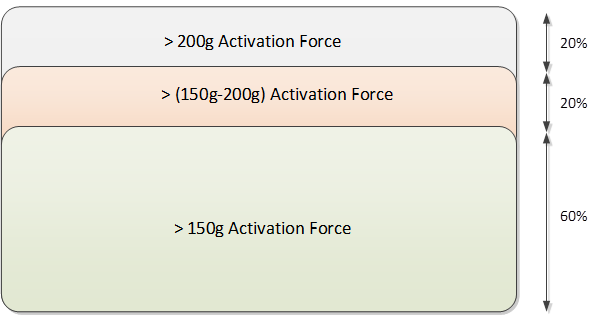
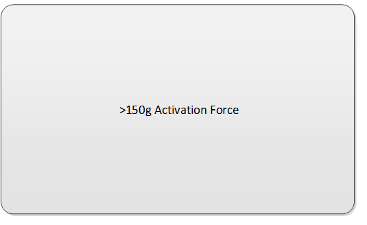
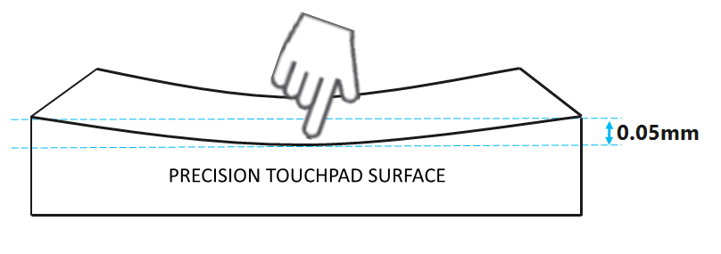
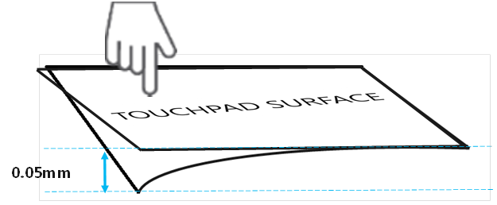
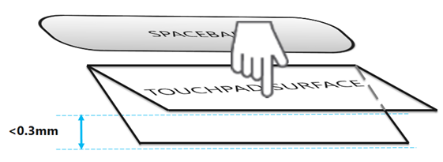

#  Mechanics

This topic describes the mechanics for the industrial design of Windows Precision Touchpads.

## Activation force

Activation force is defined as the required force to invoke a button report from a touchpad device. To ensure a consistent experience across all precision touchpad devices, minimum activation forces are defined and validated in the WHCK.

### Click-pad implementations

Precision touchpads that are implemented as a click-pad shall strive to provide uniform activation across the touchpad surface such that 150g will result in a button report anywhere. However, due to the varying designs and costs of associated hinge mechanisms, the activation force gradient that is shown in *Figure 1 Click-pad Activation Force* is a good starting point.

The [Windows Hardware Certification Kit (HCK)](http://go.microsoft.com/fwlink/p/?LinkID=330443) requires and validates activation force specifically in the lowest 10mm / 25% region (whichever is largest) of the touchpad.

**Figure 1 Click-pad Activation Force**

### Pressure-pad

Precision touchpads that are implemented as a pressure-pad shall strive to provide uniform activation across the touchpad surface, such that 150g will result in a button report anywhere. There is a greater expectation of uniform activation on these devices due to the lack of hinges and lack of tactile feedback to the user. It is prudent to provide haptic or audible feedback to the user when activation force has been exerted.

The Windows HCK requires and validates activation force specifically in the lowest 10mm / 25% region (whichever is largest) of the touchpad.

**Figure 2 Pressure-pad Activation Force**

## Surface Deflection

The amount in which a surface flexes or bends when under force is defined as surface deflection. Surface deflection can vary based on the methods and materials that are used in manufacturing a touchpad coversheet. The acceptable range for precision touchpad surface deflection is less than 0.05mm. The coversheet should not bend more than 0.05mm anywhere on the device when the user is exerting normal forces that occur during button activation and interaction, as shown in *Figure 3 Surface Deflection* and *Figure 4 Surface Corner Deflection*. High degrees of deflection feel unnatural to the user and lead to perceived fragility and quality issues.

**Figure 3 Surface Deflection**

**Figure 4 Surface Corner Deflection**

## Click depth (click-pad devices)

Applying activation force to a precision touchpad click-pad device causes the coversheet to depress. The total depression, including deflection of the coversheet, shall be no greater than 0.3mm. When viewed from an angle looking down on the device, *Figure 5 Click Depth* shows that the click depression does not exceed 0.3mm.

This depth provides an optimal click travel distance and has a natural feel to the user. This click depth also prevents foreign objects,including fingers, from becoming trapped in the gap between the touchpad and palm deck.

**Figure 5 Click Depth**

 

 

