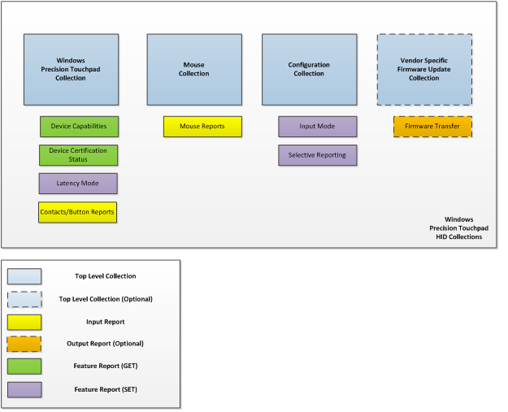
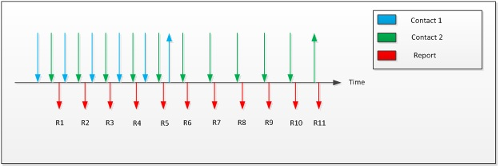
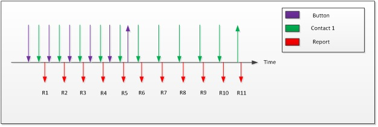
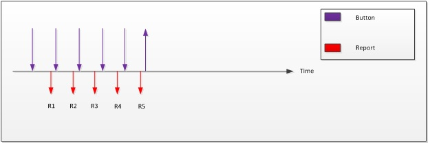

# Touchpad Required HID Top-Level Collections

A Windows Precision Touchpad device shall expose 3 mandatory top-level collections; Windows Precision Touchpad, Mouse and Configuration. An optional (recommended) collection for firmware update can also be implemented.

**Figure 1 Windows Precision Touchpad HID Collections**

## Mouse collection

Using the HID protocol, a Windows Precision Touchpad shall provide a top-level collection that appears as generic desktop/mouse (Page 0x01, Usage 0x02).

The mouse collection of a Windows Precision Touchpad provides HID compliant mouse reporting to the host. This is especially important for hosts that are not capable of consuming input by using the Windows Precision Touchpad collection. The mouse collection shall support an input report such that relative position (x,y), and left and right buttons are reported at a minimum. There are no mandatory feature reports associated with this collection. Please see the sample descriptor for reference.

By default, Windows Precision Touchpads shall report data via the mouse collection as this is the most compatible reporting mode as mentioned above.

## Configuration collection

Using the HID protocol in Windows 8.1, a Windows Precision Touchpad shall provide a top-level collection that appears as digitizer/configuration (Page 0x0D, Usage 0x0E).

The configuration collection of a Windows Precision Touchpad enables the host to configure two different aspects of the device. The collection shall support two feature reports: one that allows the host to select input mode, and the other to allow the host to be selective in what is reported. No mandatory input reports are associated with this collection.

## Input mode feature report

The input mode feature report is communicated by the host to the Windows Precision Touchpad to indicate which top-level collection should be used for input reporting. There are two collections which may be used for input reporting: the mouse collection and the Windows Precision Touchpad collection.

By default, upon cold-boot/power cycle, Windows Precision Touchpads shall report input by using the mouse collection. A Windows Precision Touchpad shall only report data by using one given collection at any time and shall only report from a different collection after the corresponding feature report has been received from the host that indicates the desired input mode.

The value that is specified by the host for input mode (Usage 0x52) determines the collection that should be used to report input.

**Table 1 Input Mode Usage Values**

| Input Mode Value | Input Reporting                       |
|------------------|---------------------------------------|
| 0                | Mouse Collection                      |
| 3                | Windows Precision Touchpad Collection |

 

The host may issue the input mode feature report to a Windows Precision Touchpad at any time after reading the report descriptor, including the time that data is potentially being reported through the active collection. In the event that a mode switch occurs while data is being reported, all contacts and button state should be reported as up and all reporting should cease by using that collection. Reporting by using the newly specified collection can occur after all contacts are physically up. The input mode shall not be persisted by a Windows Precision Touchpad across power cycles or host initiated resets (USB reset, HID I²C HIR); however the input mode may be persisted across any device initiated reset (for example, HID I²C DIR, etc.).

**Note**  
A non-PTP capable host can send a value other than those listed in *Table 1 Input Mode Usage Values*. Is it recommended that the device interpret that value as 0 and switch to mouse mode because only a PTP-capable operating system will issue mode 3.

 

## Selective reporting feature report

The input mode feature report is communicated by the host to the Windows Precision Touchpad to indicate which types of input should be reported. There are two types of input that can be reported: surface contacts and button state.

By default, upon cold-boot/power cycle, Windows Precision Touchpads shall report both surface contacts and button state. A Windows Precision Touchpad shall only report input that was previously selected by the host per the corresponding feature report.

The values that are specified by the host for surface switch (Usage 0x57) and button switch (Usage 0x58) determines the types of input that shall be reported.

**Table 2 Surface and Button Switch Usage Values**

| Surface Switch | Button Switch | Input to be Reported                                      |
|----------------|---------------|-----------------------------------------------------------|
| 0              | 0             | No input is to be reported                                |
| 0              | 1             | Only button state is to be reported                       |
| 1              | 0             | Only surface contacts are to be reported                  |
| 1              | 1             | Both surface contacts and button state are to be reported |

 

The host can issue the selective reporting feature report to a Windows Precision Touchpad at any time after reading the report descriptor. The selective reporting state shall not be persisted by a Windows Precision Touchpad across power cycles.

When a USB-connected Windows Precision Touchpad is suspended, it shall only signal a remote wake based on the input the host has selected via this feature report.

An I²C connected Windows Precision Touchpad shall only generate interrupts that are based on the input that the host has selected by using this feature report.

## Windows Precision Touchpad collection

Using the HID protocol in Windows 8.1, a Windows Precision Touchpad shall provide a top-level collection that appears as a digitizer/touchpad (Page 0x0D, Usage 0x05).

The Windows Precision Touchpad collection provides rich multi-contact and button reporting to the host as well as device information that pertains to those reports. The collection shall support two feature reports: one that allows the host to obtain device capabilities, and the other to obtain the device’s certification status. The mandatory input report is specified in detail in the following section. An optional (highly recommended) feature report can be implemented to obtain latency mode hints from the host to achieve required power consumption on USB devices in sleep mode.

## Device capabilities feature report

The device capabilities feature report is requested by the host of the Windows Precision Touchpad to elicit the device’s contact reporting capabilities and device button type.

The device’s contact reporting capability is defined by the maximum number of concurrent surface contacts it may report. A Windows Precision Touchpad shall support a minimum of three concurrent contacts and a maximum of five concurrent contacts and shall report this value by using the specification of the contact count maximum (Page 0x0D, Usage 0x55) in the device capabilities feature report. While reporting data, a device must not report more contacts than the contact count maximum. Any new contact information reported after the contact count maximum has been reached will be ignored by the host.

The device’s button type is defined as either a depressable implementation (also referred to as click-pad type) or a non-depressable implementation (also referred to as pressure-pad). Either implementation is acceptable for a Windows Precision Touchpad.

The implementation type shall be specified via the value for button type (Page 0x0D, Usage 0x59) in the device capabilities feature report.

**Table 3 Button Type Usage Values**

| Button Type Value | Implementation                 |
|-------------------|--------------------------------|
| 0                 | Depressible (Click-pad)        |
| 1                 | Non-Depressible (Pressure-pad) |

 

The host can request the device capabilities feature report of a Windows Precision Touchpad at any time after reading the report descriptor.

## Device certification status feature report

The device certification status feature report is requested by the host of the Windows Precision Touchpad to elicit the device’s 256-byte blob.

The 256-bytes shall be specified via the vendor specific usage in a vendor defined usage page (Page 0xFF, Usage 0xC5) in the device certification status feature report.

Prior to a device receiving a 256-byte blob attesting to its certification status, it shall implement a default blob as follows:

*0xfc, 0x28, 0xfe, 0x84, 0x40, 0xcb, 0x9a, 0x87, 0x0d, 0xbe, 0x57, 0x3c, 0xb6, 0x70, 0x09, 0x88, 0x07, 0x97, 0x2d, 0x2b, 0xe3, 0x38, 0x34, 0xb6, 0x6c, 0xed, 0xb0, 0xf7, 0xe5, 0x9c, 0xf6, 0xc2, 0x2e, 0x84, 0x1b, 0xe8, 0xb4, 0x51, 0x78, 0x43, 0x1f, 0x28, 0x4b, 0x7c, 0x2d, 0x53, 0xaf, 0xfc, 0x47, 0x70, 0x1b, 0x59, 0x6f, 0x74, 0x43, 0xc4, 0xf3, 0x47, 0x18, 0x53, 0x1a, 0xa2, 0xa1, 0x71, 0xc7, 0x95, 0x0e, 0x31, 0x55, 0x21, 0xd3, 0xb5, 0x1e, 0xe9, 0x0c, 0xba, 0xec, 0xb8, 0x89, 0x19, 0x3e, 0xb3, 0xaf, 0x75, 0x81, 0x9d, 0x53, 0xb9, 0x41, 0x57, 0xf4, 0x6d, 0x39, 0x25, 0x29, 0x7c, 0x87, 0xd9, 0xb4, 0x98, 0x45, 0x7d, 0xa7, 0x26, 0x9c, 0x65, 0x3b, 0x85, 0x68, 0x89, 0xd7, 0x3b, 0xbd, 0xff, 0x14, 0x67, 0xf2, 0x2b, 0xf0, 0x2a, 0x41, 0x54, 0xf0, 0xfd, 0x2c, 0x66, 0x7c, 0xf8, 0xc0, 0x8f, 0x33, 0x13, 0x03, 0xf1, 0xd3, 0xc1, 0x0b, 0x89, 0xd9, 0x1b, 0x62, 0xcd, 0x51, 0xb7, 0x80, 0xb8, 0xaf, 0x3a, 0x10, 0xc1, 0x8a, 0x5b, 0xe8, 0x8a, 0x56, 0xf0, 0x8c, 0xaa, 0xfa, 0x35, 0xe9, 0x42, 0xc4, 0xd8, 0x55, 0xc3, 0x38, 0xcc, 0x2b, 0x53, 0x5c, 0x69, 0x52, 0xd5, 0xc8, 0x73, 0x02, 0x38, 0x7c, 0x73, 0xb6, 0x41, 0xe7, 0xff, 0x05, 0xd8, 0x2b, 0x79, 0x9a, 0xe2, 0x34, 0x60, 0x8f, 0xa3, 0x32, 0x1f, 0x09, 0x78, 0x62, 0xbc, 0x80, 0xe3, 0x0f, 0xbd, 0x65, 0x20, 0x08, 0x13, 0xc1, 0xe2, 0xee, 0x53, 0x2d, 0x86, 0x7e, 0xa7, 0x5a, 0xc5, 0xd3, 0x7d, 0x98, 0xbe, 0x31, 0x48, 0x1f, 0xfb, 0xda, 0xaf, 0xa2, 0xa8, 0x6a, 0x89, 0xd6, 0xbf, 0xf2, 0xd3, 0x32, 0x2a, 0x9a, 0xe4, 0xcf, 0x17, 0xb7, 0xb8, 0xf4, 0xe1, 0x33, 0x08, 0x24, 0x8b, 0xc4, 0x43, 0xa5, 0xe5, 0x24, 0xc2*

The host can request the device certification status feature report of a Windows Precision Touchpad at any time after reading the report descriptor.

## Latency mode feature report

The latency mode feature report is sent by the host to a Windows Precision Touchpad to indicate when high latency is desirable for power savings and, conversely, when normal latency is desired for operation. For USB-connected Windows Precision Touchpads, this enables the device to disambiguate between being suspended for inactivity (runtime IDLE) and being suspended because the system is entering S3 or Connected Standby.

The latency mode shall be indicated by using the value for the latency mode usage (Page 0x0D, Usage 0x60) in the latency mode feature report.

**Table 4 Latency Mode Usage Values**

| Latency Mode Value | Latency Mode   |
|--------------------|----------------|
| 0                  | Normal Latency |
| 1                  | High Latency   |

 

## Windows Precision Touchpad input reports

The host makes use of the following usages when extracting contact data from an input report by using the Windows Precision Touchpad collection.

*Table 5 Contact Level Usages* includes all mandatory usages and supported optional usages that pertain to each unique digitizer contact reported.

**Table 5 Contact Level Usages**

| Member     | Description                                           | Page | ID   | Mandatory/Optional             |
|------------|-------------------------------------------------------|------|------|--------------------------------|
| Contact ID | Uniquely identifies the contact within a given frame  | 0x0D | 0x51 | Mandatory                      |
| X          | X coordinate of contact position                      | 0x01 | 0x30 | Mandatory for T Optional for C |
| Y          | Y coordinate of contact position                      | 0x01 | 0x31 | Mandatory for T Optional for C |
| Tip        | Set if the contact is on the surface of the digitizer | 0x0D | 0x42 | Mandatory                      |
| Confidence | Set when a contact is too large to be a finger        | 0x0D | 0x47 | Mandatory                      |
| Width      | Width of contact                                      | 0x0D | 0x48 | Optional                       |
| Height     | Height of contact                                     | 0x0D | 0x49 | Optional                       |

 

*Table 6 Report Level Usages* includes all the mandatory usages that shall be present in all Windows Precision Touchpad input reports.

**Table 6 Report Level Usages**

| Member        | Description                                               | Page | ID   | Mandatory/Optional |
|---------------|-----------------------------------------------------------|------|------|--------------------|
| Report ID     | Windows Precision Touchpad Report ID                      | 0x0D | 0x05 | Mandatory          |
| Scan Time     | Relative scan time                                        | 0x0D | 0x56 | Mandatory          |
| Contact Count | Total number of contacts to be reported in a given report | 0x0D | 0x54 | Mandatory          |
| Button        | Indicates Button State                                    | 0x09 | 0x01 | Mandatory          |

 

Any device that does not report all mandatory usages at either the contact or report level will be non-functional as a Windows Precision Touchpad. Mandatory usages are strictly enforced by the Windows host. Where a logical maximum value has not been restricted, it can be optimized to reduce descriptor size.

### Contact ID

Contact ID uniquely identifies a contact in a report for its lifecycle. The contact ID must remain constant while the contact is detected and reported by the device. Each separate concurrent contact must have a unique identifier. Identifiers can be reused after the previously associated contact is no longer detected or reported. There is no expected numeric range and the values that are used are only limited by the specified logical maximum in the descriptor.

### X/Y

X and Y report the coordinates of a given contact. A Windows Precision Touchpad can report two points for each contact.

The first point (known as *T*) is considered the point that the user intended to touch, and is mandatory.

The optional second point (known as *C*) is considered the location of the center of mass of the contact. To report optional height and width usages, reporting the second point is mandatory (and vice-versa).

Devices that are capable of reporting T and C should have a usage array of two X values and two Y values. The values in the first position in the arrays are interpreted as the coordinates for T and the values in the second position are interpreted as the coordinates for C. For devices that opt to report both T and C, the report count for both X and Y usages shall be 2, to indicate the presence of a usage array.

The following global items shall be specified for both the X and Y usages:

-   Logical minimum & Logical maximum (*ensuring &gt;= 300DPI input resolution*)
    **Note**  
    The entire logical coordinate range shall be reportable across both the X and Y axis.

     

-   Physical minimum & Physical maximum (*see Device Integration - Size*)
-   Unit & Unit exponent

### Tip

The tip switch is used to indicate when the contact is on the surface or has left the surface of the digitizer. This is indicated by a main item with a report size of 1 bit. When delivering a contact report, the bit should be set when the contact is on the digitizer surface and cleared when the contact has left the surface.

When a contact is being reported with the tip switch clear, the X/Y location that is reported should be the same as the last position that was reported with the tip switch set.

**Figure 2 Two Contacts with Separated Lift**

With reference to the example in *Figure 2 Two Contacts with Separated Lift*, two contacts are placed on a Windows Precision Touchpad. Some time later, the first contact is lifted while the second remains on the surface. This would be reported as described in *Table 7 Report Sequence for Two Contacts with Separated Lift (Two-Finger Hybrid)*.

**Table 7 Report Sequence for Two Contacts with Separated Lift (Two-Finger Hybrid)**

| Report               | 1     | 2     | 3     | 4     | 5     | 6     | 7     | 8     | 9     | 10      | 11      |
|----------------------|-------|-------|-------|-------|-------|-------|-------|-------|-------|---------|---------|
| Contact Count        | 2     | 2     | 2     | 2     | 2     | 2     | 1     | 1     | 1     | 1       | 1       |
| Contact 1 Tip Switch | 1     | 1     | 1     | 1     | 1     | 0     | NR    | NR    | NR    | NR      | NR      |
| Contact 1 X,Y        | X₁,Y₁ | X₂,Y₂ | X₃,Y₃ | X₄,Y₄ | X₅,Y₅ | X₅,Y₅ | NR    | NR    | NR    | NR      | NR      |
| Contact 2 Tip Switch | 1     | 1     | 1     | 1     | 1     | 1     | 1     | 1     | 1     | 1       | 0       |
| Contact 2 X,Y        | X₁,Y₁ | X₂,Y₂ | X₃,Y₃ | X₄,Y₄ | X₅,Y₅ | X₆,Y₆ | X₇,Y₇ | X₈,Y₈ | X₉,Y₉ | X₁₀,Y₁₀ | X₁₀,Y₁₀ |

 

### Confidence

Confidence is used to indicate that the contact does not have any dimensions (height or width) &gt; 25mm that implies that it is not an unintended contact. Windows Precision Touchpads should not reject any contacts in firmware processing, but should forward all contacts to the host and indicate the confidence. After a device has deemed a contact to be unintentional, it shall clear the confidence bit for that contact report and all subsequent reports. Until a contact has been deemed unintentional, the device shall set the confidence bit for that contact being reported.

### Width/Height (optional)

The Width and Height usages represent the width and height of the bounding box around the center of mass of a given contact. The reported values should never be 0 except when a contact up event is being reported (Tip bit cleared), in which case they shall both be 0. If Height and Width are reported they shall be accurate within +/-2mm of the actual contact dimensions.

The following global items shall be specified for both the Width and Height usages:

-   Logical minimum & Logical maximum (this is relative to the min/max specified for X/Y)

### Scan time

Scan Time reports relative digitizer time in 100µs units. It represents the delta from the first frame that was reported after a device starts reporting data subsequent to a period of inactivity. The first scan time received is treated as a base time for subsequent reported times. The deltas between reported scan times should reflect the scanning frequency of the digitizer. It is important to note that unlike other usages, the host does not allow any flexibility for the unit for the scan time usage. It must be in 100µs units. The value is expected to roll over, as only 2 bytes are allocated to the counter.

The scan time value should be the same for all contacts within a frame.

### Contact count

Contact count is used to indicate the number of contacts that are being reported in a given frame irrespective of their associated tip switch.

### Button

The button bit specifies the up/down state of the Windows Precision Touchpad button. Irrespective of button type implementation, when the button has received the required amount of activation force its down state shall be reported by setting the button bit. When the activation force applied to the button falls below the required threshold, the up state shall be reported by clearing the button bit.

**Figure 3 Contact with Button Down and Up**

With reference to the example shown in *Figure 3 Contact with Button Down and Up*, a contact is placed on a Windows Precision Touchpad with sufficient activation force to invoke a button down. Some later time the activation force is reduced so that it invokes a button up, while the contact remains on the surface for some additional time. This would be reported as described in *Table 8 Report Sequence for Contact with Button Down and Up*.

**Table 8 Report Sequence for Contact with Button Down and Up**

| Report               | 1     | 2     | 3     | 4     | 5     | 6     | 7     | 8     | 9     | 10      | 11      |
|----------------------|-------|-------|-------|-------|-------|-------|-------|-------|-------|---------|---------|
| Contact Count        | 1     | 1     | 1     | 1     | 1     | 1     | 1     | 1     | 1     | 1       | 1       |
| Button               | 1     | 1     | 1     | 1     | 1     | 0     | NR    | NR    | NR    | NR      | NR      |
| Contact 2 Tip Switch | 1     | 1     | 1     | 1     | 1     | 1     | 1     | 1     | 1     | 1       | 0       |
| Contact 2 X,Y        | X₁,Y₁ | X₂,Y₂ | X₃,Y₃ | X₄,Y₄ | X₅,Y₅ | X₆,Y₆ | X₇,Y₇ | X₈,Y₈ | X₉,Y₉ | X₁₀,Y₁₀ | X₁₀,Y₁₀ |

 

**Figure 4 Button Only Down and Up**

With reference to the example shown in *Figure 4 Button Only Down and Up*, a non-capacitive contact is placed on a Windows Precision Touchpad with sufficient activation force to invoke a button down. Some later time, the activation force is reduced so that it invokes a button up. This would be reported as described below in *Table 9 Report Sequence for Button Only Down and Up*.

**Table 9 Report Sequence for Button Only Down and Up**

| Report        | 1   | 2   | 3   | 4   | 5   |
|---------------|-----|-----|-----|-----|-----|
| Contact Count | 0   | 0   | 0   | 0   | 0   |
| Button        | 1   | 1   | 1   | 1   | 0   |

 

### Packet reporting modes

**Parallel mode**

In Parallel mode, devices report all contact information in a single packet. Each physical contact is represented by a logical collection that is embedded in the top-level collection. This logical collection contains all the usages that the device supports for each contact. When taking advantage of Parallel mode, each of the logical collections must be identical. Because the device generally reports fewer contacts than the maximum, the number of contacts that are reported in a parallel packet should be communicated by using the Contact Count usage.

For example, consider a device that supports three contacts. If the user has only two fingers on the digitizer, the parallel packet has only two valid contact data in a report that can carry data for three contacts. In this case, the Contact Count should be set to two so that the client application knows that any information about more than two contacts is not valid.

A disadvantage of reporting multiple contacts in one report is that space is wasted per report every time that there are fewer contacts than the maximum number of contacts possible. Devices can use the Hybrid mode to reduce this inefficiency.

**Hybrid mode**

In Hybrid mode, the number of contacts that can be reported in one report is less than the maximum number of contacts that the device supports. For example, a device that supports a maximum of 4 concurrent physical contacts can set up its top-level collection to deliver a maximum of two contacts in one report. If four contact points are present, the device can break these down into two serial reports that deliver two contacts each.

When a device delivers data in this manner, the contact count usage value in the first report should reflect the total number of contacts that are being delivered in the hybrid reports. The other serial reports should have a contact count of 0.

**Single finger hybrid reporting mode**

The first input report for a given frame shall indicate the total number of contacts that are to be reported by using the contact count usage and all subsequent input reports for the same frame shall have a value of 0 for the contact count usage to indicate that they are part of the previously reported frame. The scan time for all reports of a given frame shall be identical.

**Table 10 Reporting Sequence 2 Contacts (Single-Finger Hybrid)**

| Report               | 1     | 2     | 3     | 4     | 5     | 6     |
|----------------------|-------|-------|-------|-------|-------|-------|
| Contact Count        | 2     | 0     | 2     | 0     | 2     | 0     |
| Contact ID           | 1     | 2     | 1     | 2     | 1     | 2     |
| Contact 1 X,Y        | X₁,Y₁ | NR    | X₂,Y₂ | NR    | X₃,Y₃ | NR    |
| Contact 1 Tip Switch | 1     | NR    | 1     | NR    | 1     | NR    |
| Contact 2 X,Y        | NR    | X₁,Y₁ | NR    | X₂,Y₂ | NR    | X₃,Y₃ |
| Contact 2 Tip Switch | NR    | 1     | NR    | 1     | NR    | 1     |
| Scan Time            | T₁    | T₁    | T₂    | T₂    | T₃    | T₃    |

 

USB and I²C connected Windows Precision Touchpads can deliver input reports in either single-finger hybrid reporting mode or two-finger hybrid reporting mode.

## Firmware update collection (optional)

Using the HID protocol in Windows 8.1, a Windows Precision Touchpad may provide a vendor specific top-level collection for performing device firmware and vendor configuration updates.

The vendor-specific firmware update collection can provide an output report for transferring the firmware payload from the host to the device.

This is highly advantageous as it allows for firmware updates to be performed without requiring a driver on the host.

It should be noted that field firmware update capability is a requirement for Windows Precision Touchpads and the above mechanism is recommended for compliance. It is mandatory for the wVersionID to be incremented after a firmware upgrade.

Windows Precision Touchpads shall be able to recover from a failed firmware update, due to power loss or other error, by using a power cycle.

It is highly recommended that basic mouse functionality be available even after a failed firmware update.

 

 

