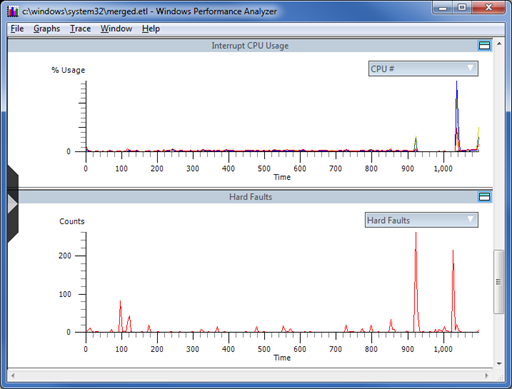

# Analyzing USB Performance Issues by Using Xperf and Netmon


This topic provides information about how to view the timeline of events captured in a USB ETW log.

Xperf provides a set of kernel events for analyzing performance issues. It records these events and presents them in graphs.

If you are familiar with both Xperf and the USB ETW events, you can create a USB ETW log and an Xperf log of a problem scenario, merge the two log files, and analyze them together. Using Xperf and Netmon together enables you to view both the system events (Xperf) and the USB events (Netmon) for a given scenario.

Start the two traces in parallel by issuing the following commands from an elevated command prompt:

```cpp
Xperf –on Diag

Logman start Usbtrace -p Microsoft-Windows-USB-USBPORT -o usbtrace.etl -ets -nb 128 640 -bs 128

Logman update Usbtrace -p Microsoft-Windows-USB-USBHUB –ets
```

Perform the actions for the problem scenario, and then stop the traces by issuing the following commands from an elevated command prompt:

```cpp
Logman stop Usbtrace -ets

Xperf –stop
```

Merge the two trace log file into a single file by using the following command (privileges are not required):

```cpp
Xperf –merge usbtrace.etl C:\kernel.etl merged.etl
```

This example creates a merged file that is named merged.etl. You can open this file with either the Xperf Performance Analyzer or with Netmon. To open the file in Xperf, run the following command:

```cpp
Xperf merged.etl
```

Xperf shows specialized graphs for a wide range of kernel events as shown in this image. For more information on Xperf recording options and the Xperf GUI, [The Xperf Command Line Tool in Detail](https://msdn.microsoft.com/library/cc305221.aspx) and [Windows Performance Analyzer (WPA)](https://msdn.microsoft.com/library/cc305187.aspx).



To open the merged trace log in Netmon, run Netmon, click **File -&gt; Open -&gt; Capture**, and then select the file. Xperf and Netmon can have the merged file open at the same time. You can switch between the Xperf GUI and Netmon to analyze what was happening in the system and in the USB stack during a particular period of time. You can view the USB events in Xperf, in addition to the system events, but the USB events can be easier to read in Netmon.

By default, Netmon displays all events in the merged trace file. To show only the USB events, apply a filter such as the following:

```cpp
ProtocolName == "USBHub_MicrosoftWindowsUSBUSBHUB" OR ProtocolName == "USBPort_MicrosoftWindowsUSBUSBPORT"
```

You can enter this filter text in the Netmon Filter Display pane. For more information on using filters in Netmon, see "USB Netmon Filters" in this [Case Study: Troubleshooting an Unknown USB Device by Using ETW and Netmon](case-study--troubleshooting-an-unknown-usb-device-by-using-etw-and-netmon.md).

To analyze the timing of USB events, you can look at the time difference between displayed events in Netmon.

**To view the time difference of displayed events**

1.  In the **Frame Summary** pane, right-click a column title, and select **Choose Columns**.
2.  In the **Disabled Columns** list, select **Time Delta**, click **Add**, and then click **OK**.
3.  Write a filter that displays only the events whose timing you would like to see. For example, to view the delays between non-overlapping bulk-transfer dispatch and complete events, add the following filter:
    ```cpp
    Description == "USBPort_MicrosoftWindowsUSBUSBPORT:Dispatch URB_FUNCTION_BULK_OR_INTERRUPT_TRANSFER" 
    OR Description == "USBPort_MicrosoftWindowsUSBUSBPORT:Complete URB_FUNCTION_BULK_OR_INTERRUPT_TRANSFER" 
    OR Description == "USBPort_MicrosoftWindowsUSBUSBPORT:Complete URB_FUNCTION_BULK_OR_INTERRUPT_TRANSFER with Data"

    ```

    1.  You can choose the event IDs (descriptions) from the events that appear in the trace.
    2.  To use an event ID in a filter, right-click an event’s description in the **Frame Summary** pane and select **Add Description to Display Filter**.

## Related topics
[USB Event Tracing for Windows](usb-event-tracing-for-windows.md)  
[Using Xperf with USB ETW](using-xperf-with-usb-etw.md)  


