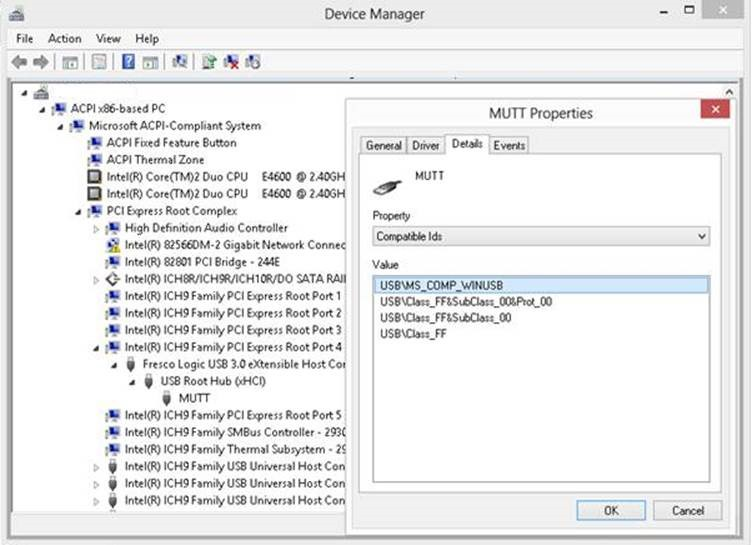
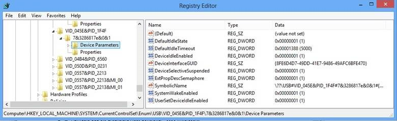

# WinUSB Device


In this topic, you will learn about how a *WinUSB device* is recognized in Windows 8.

The information in this topic applies to you if you are an OEM or independent hardware vendor (IHV) developing a device for which you want to use Winusb.sys as the function driver and want to load the driver automatically without having to provide a custom INF.

- [WinUSB Device](#winusb-device)
  - [What is a WinUSB device](#what-is-a-winusb-device)
  - [WinUSB device installation by using the in-box Winusb.inf](#winusb-device-installation-by-using-the-in-box-winusbinf)
    - [About using the USBDevice class:](#about-using-the-usbdevice-class)
  - [How to change the device description for a WinUSB device](#how-to-change-the-device-description-for-a-winusb-device)
  - [How to configure a WinUSB device](#how-to-configure-a-winusb-device)
  - [Related topics](#related-topics)

## What is a WinUSB device


A WinUSB device is a Universal Serial Bus (USB) device whose firmware defines certain Microsoft operating system (OS) feature descriptors that report the compatible ID as "WINUSB".

The purpose of a WinUSB device is to enable Windows to load Winusb.sys as the device's function driver without a custom INF file. For a WinUSB device, you are not required to distribute INF files for your device, making the driver installation process simple for end users. Conversely, if you need to provide a custom INF, you should not define your device as a WinUSB device and specify the hardware ID of the device in the INF.

Microsoft provides Winusb.inf that contains information required by to install Winusb.sys as the device driver for a USB device.

Before Windows 8, to load Winusb.sys as the function driver, you needed to provide a custom INF. The custom INF specifies the device-specific hardware ID and also includes sections from the in-box Winusb.inf. Those sections are required for instantiating the service, copying inbox binaries, and registering a device interface GUID that applications required to find the device and talk to it. For information about writing a custom INF, see [WinUSB (Winusb.sys) Installation](winusb-installation.md#inf).

In Windows 8, the in-box Winusb.inf file has been updated to enable Windows to automatically match the INF with a WinUSB device.

## WinUSB device installation by using the in-box Winusb.inf


In Windows 8, the in-box Winusb.inf file has been updated. The INF includes an install section that references a compatible ID called "USB\\MS\_COMP\_WINUSB".

```cpp
[Generic.Section.NTamd64]
%USB\MS_COMP_WINUSB.DeviceDesc%=WINUSB,USB\MS_COMP_WINUSB 
```

The updated INF also includes a new setup class called "USBDevice".

The "USBDevice" setup class is available for those devices for which Microsoft does not provide an in-box driver. Typically, such devices do not belong to well-defined USB classes such as Audio, Bluetooth, and so on, and require a custom driver. If your device is a WinUSB device, most likely, the device does not belong to a USB class. Therefore, your device must be installed under "USBDevice" setup class. The updated Winusb.inf facilitates that requirement.

### About using the USBDevice class:

Do not use the &quot;USB&quot; setup class for unclassified devices. That class is reserved for installing controllers, hubs, and composite devices. Misusing the &quot;USB&quot; class can lead to significant reliability and performance issues. For unclassified devices, use &quot;USBDevice&quot;.

In Windows 8, to use &quot;USBDevice&quot; device class, simply add this to your INF:

```cpp
  …
  [Version] 
  Class=USBDevice 
  ClassGuid={88BAE032-5A81-49f0-BC3D-A4FF138216D6}
  …
```

In Device Manager you will see a new node **USB Universal Serial Bus devices** and your device appears under that node.
<p>In Windows 7, in addition to the preceding lines, you need to create these registry settings in the INF:

```cpp
  ;---------- Add Registry Section ----------
  [USBDeviceClassReg] 
  HKR,,,,"Universal Serial Bus devices"
  HKR,,NoInstallClass,,1
  HKR,,SilentInstall,,1 
  HKR,,IconPath,%REG_MULTI_SZ%,"%systemroot%\system32\setupapi.dll,-20"
```

In Device Manager, you will see your device appear under **USB Universal Serial Bus devices**. However, the device class description is derived from the registry setting specified in your INF.

*-Eliyas Yakub, Microsoft Windows USB Core Team*

 

Note that the "USBDevice" class is not limited to WinUSB. If you have a custom driver for your device, you can use the "USBDevice" setup class in the custom INF.

During device enumeration, the USB driver stack reads the compatible ID from the device. If the compatible ID is "WINUSB", Windows uses it as the device identifier and finds a match in the updated in-box Winusb.inf, and then loads Winusb.sys as the device's function driver.

This image is for a single interface MUTT device that is defined as a WinUSB device and as a result Winusb.sys gets loaded as the function driver for the device.



For versions of Windows earlier than Windows 8, the updated Winusb.inf is available through **Windows Update**. If your computer is configured to get driver update automatically, WinUSB driver will get installed without any user intervention by using the new INF package.

## How to change the device description for a WinUSB device


For a WinUSB device, Device Manager shows "WinUsb Device" as the device description. That string is derived from Winusb.inf. If there are multiple WinUSB devices, all devices get the same device description.

To uniquely identify and differentiate the device in Device Manager, Windows 8 provides a new property on a device class that instructs the system to give precedence to the device description reported by the device (in its **iProduct** string descriptor) over the description in the INF. The "USBDevice" class defined in Windows 8 sets this property. In other words, when a device is installed under "USBDevice" class, system queries the device for a device description and sets the Device Manager string to whatever is retrieved in the query. In that case, the device description provided in the INF is ignored. Notice the device description strings: "MUTT" in the preceding image. The string is provided by the USB device in its product string descriptor.

The new class property is not supported on earlier versions of Windows. To have a customized device description on an earlier version of Windows, you have to write your own custom INF.

## How to configure a WinUSB device


To identify a USB device as a WinUSB device, the device firmware must have Microsoft OS Descriptors. For information about the descriptors, see the specifications described here: [Microsoft OS Descriptors](microsoft-defined-usb-descriptors.md).

**Supporting extended feature descriptors**

In order for the USB driver stack to know that the device supports extended feature descriptors, the device must define an OS string descriptor that is stored at string index 0xEE. During enumeration, the driver stack queries for the string descriptor. If the descriptor is present, the driver stack assumes that the device contains one or more OS feature descriptors and the data that is required to retrieve those feature descriptors.

The retrieved string descriptor has a **bMS\_VendorCode** field value. The value indicates the vendor code that the USB driver stack must use to retrieve the extended feature descriptor.

For information about how to define an OS string descriptor, see "The OS String Descriptor" in the specifications described here: [Microsoft OS Descriptors](microsoft-defined-usb-descriptors.md).

**Setting the compatible ID**

An extended compat ID OS feature descriptor that is required to match the in-box Winusb.inf and load the WinUSB driver module.

The extended compat ID OS feature descriptor includes a header section followed by one or more function sections depending on whether the device is a composite or non-composite device. The header section specifies the length of the entire descriptor, number of function sections, and version number. For a non-composite device, the header is followed by one function section associated with the device’s only interface. The **compatibleID** field of that section must specify "WINUSB" as the field value. For a composite device, there are multiple function sections. The **compatibleID** field of each function section must specify "WINUSB".

**Registering a device interface GUID**

An extended properties OS feature descriptor that is required to register its device interface GUID. The GUID is required to find the device from an application or service, configure the device, and perform I/O operations.

In previous versions of Windows, device interface GUID registration is done through the custom INF. Starting in Windows 8, your device should report the interface GUID by using extended properties OS feature descriptor.

The extended properties OS feature descriptor includes a header section that is followed by one or more custom property sections. The header section describes the entire extended properties descriptor, including its total length, the version number, and the number of custom property sections. To register the device interface GUID, add a custom property section that sets the **bPropertyName** field to "DeviceInterfaceGUID" and **wPropertyNameLength** to 40 bytes. Generate a unique device interface GUID by using a GUID generator and set the **bPropertyData** field to that GUID, such as "{8FE6D4D7-49DD-41E7-9486-49AFC6BFE475}". Note that the GUID is specified as a Unicode string and the length of the string is 78 bytes (including the null terminator).

<table>
<colgroup>
<col width="25%" />
<col width="25%" />
<col width="25%" />
<col width="25%" />
</colgroup>
<tbody>
<tr class="odd">
<td><strong>bPropertyData</strong></td>
<td>78 bytes</td>
<td><p>7B 00 38 00 46 00 45 00 36 00 44 00 34 00 44 00 37 00 2D 00 34 00 39 00 00 44 00 2D 00 34 00 31 00 45 00 37 00 2D 00 39 00 34 00 38 00 36 00 2D 00 34 00 39 00 41 00 46 00 43 00 36 00 42 00 46 00 45 00 34 00 37 00 35 00 7D 00 00 00</p></td>
<td>Property value is {8FE6D4D7-49DD-41E7-9486-49AFC6BFE475}.</td>
</tr>
</tbody>
</table>

 

During device enumeration, The USB driver stack then retrieves the **DeviceInterfaceGUID** value from the extended properties OS feature descriptor and registers the device in the device's hardware key. An application can retrieve the value by using **SetupDiXxx** APIs (See [**SetupDiOpenDevRegKey**](https://msdn.microsoft.com/library/windows/hardware/ff552079)). For more information, see [How to Access a USB Device by Using WinUSB Functions](using-winusb-api-to-communicate-with-a-usb-device.md).

**Enabling or disabling WinUSB power management features**

Before Windows 8, to configure power management features of WinUSB, you had to write registry entry values in the **HW.AddReg** section of your custom INF.

In Windows 8, you can specify power settings in device. You can report values through the extended properties OS feature descriptor that enable or disable features in WinUSB for that device. There are two features that we can be configured: selective suspend and system wake. Selective suspend allows the device to enter low-power state when it is idle. System wake refers to the ability to a device to wake up a system when the system is in low-power state.

For information about power management features of WinUSB, see [WinUSB Power Management](winusb-power-management.md).

| Property name            | Description                                                                                                                                                                                                                                                                                                                               |
|--------------------------|-------------------------------------------------------------------------------------------------------------------------------------------------------------------------------------------------------------------------------------------------------------------------------------------------------------------------------------------|
| DeviceIdleEnabled        | This value is set to 1 to indicate that the device can power down when idle (selective suspend).                                                                                                                                                                                                                                          |
| DefaultIdleState         | This value is set to 1 to indicate that the device can be suspended when idle by default.                                                                                                                                                                                                                                                 |
| DefaultIdleTimeout       | This value is set to 5000 in milliseconds to indicate the amount of time in milliseconds to wait before determining that a device is idle.                                                                                                                                                                                                |
| UserSetDeviceIdleEnabled | This value is set to 1 to allow the user to control the ability of the device to enable or disable USB selective suspend. A check box **Allow the computer to turn off this device to save power** on the device **Power Management** property page and the user can check or uncheck the box to enable or disable USB selective suspend. |
| SystemWakeEnabled        | This value is set to 1 to allow the user to control the ability of the device to wake the system from a low-power state. When enabled, the **Allow this device to wake the computer** check box appears in the device power management property page. The user can check or uncheck the box to enable or disable USB system wake.         |

 

For example, to enable selective suspend on the device, add a custom property section that sets the **bPropertyName** field to a Unicode string, "DeviceIdleEnabled" and **wPropertyNameLength** to 36 bytes. Set the **bPropertyData** field to "0x00000001". The property values are stored as little-endian 32-bit integers.

During enumeration, the USB driver stack reads the extended properties feature descriptors and creates registry entries under this key:

**HKEY\_LOCAL\_MACHINE**\\**System**\\**CurrentControlSet**\\**Enum**\\**USB**\\***&lt;Device Identifier&gt;***\\***&lt;Instance Identifier&gt;***\\**Device Parameters**

This image shows sample settings for a WinUSB device.



For additional examples, see the specifications on [Microsoft OS Descriptors](microsoft-defined-usb-descriptors.md).

## Related topics
[Microsoft-Defined USB Descriptors](microsoft-defined-usb-descriptors.md)  


