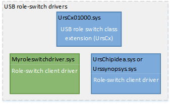

# Bring up the dual-role controller for a USB Type-C Windows system

**Summary**

-   OEM bring up tasks for a dual-role controller that has a USB Type-C connector

**Applies to**

-   Windows 10 Mobile

**Last updated**

-   December 2016

**Important APIs**

-   [USB dual-role controller driver programming reference](https://msdn.microsoft.com/library/windows/hardware/mt628026)

The USB role-switch drivers (URS) are a set of WDF class extension and its client driver that handle the role-switching capability of a dual-role controller. If your system has a dual role controller, you can switch the role of the system depending on the device that is attached to the partner port of the USB Type-C connector of the system. This allows interesting scenarios such as wired docking.

Systems can be designed such that the dual-role USB controller needs Windows to configure it to either Host or Function mode. These designs use the USB role switch stack. If the system does not use a Synopsys or ChipIdea dual role controller, you need to write a USB role switch client driver for the system’s dual role controller.

**Note**  Systems can be designed such that the dual-role USB port needs Windows to configure it to either Host or Function mode. These designs use the USB role switch stack. If the system does not use a Synopsys dual role controller, you need to write a USB role switch client driver for the system’s dual role controller.

 

The client driver handles hardware events and reports them to the class extension. In case of role-switch hardware events, URS decides the role and consequently loads the drivers for that role. If the controller is in host role, the [USB host-side drivers](usb-3-0-driver-stack-architecture.md) are loaded; for a the function role, the [device-side drivers](usb-device-side-drivers-in-windows.md) are loaded.

On systems with USB micro-AB connectors, the client driver for the dual-role controller makes that decision based on the ID pin in the connector by using interrupt resources assigned to it. On systems with USB Type-C connectors, this decision is made by the client driver for the connector. That driver determines the role based on the CC pins and reports the results to the USB connector manager (UCM), which then sends the results to the role-switch drivers.

## 1. Enable the URS driver in system ACPI

In order to use URS, you must make ACPI modifications. Replace the device on which the [USB device-side drivers](usb-device-side-drivers-in-windows.md) load with a device on which the URS must to load. For more information about how to change ACPI definition, see the example given in [USB Dual Role Driver Stack Architecture](usb-dual-role-driver-stack-architecture.md). Make sure you remove the interrupt resource. This is not required for USB Type-C.

## 2. Load the USB role-switch drivers for the dual-role controller driver

-   If your system uses ChipIdea and Synopsys controllers, load the Microsoft provided in-box client drivers for ChipIdea and Synopsys controllers.

    To load the driver, you must create a driver installation package. The INF file must have **Include-Needs** directive that references the in-box INF for the supported controllers. The in-box INF already contains hardware IDs of other controllers. This step is required if your dual-role controller’s hardware ID is not one of hardware IDs in the in-box INF. Check with your SoC vendor.

    For more information, see "URS driver package" under [Driver installation packages](usb-dual-role-driver-stack-architecture.md#inf).

-   If your system uses a custom controller, write a role-switch client driver. For more information, see:

    [USB dual-role controller driver programming reference](https://msdn.microsoft.com/library/windows/hardware/mt628026)

## Related topics
[USB Dual Role Driver Stack Architecture](usb-dual-role-driver-stack-architecture.md)  

