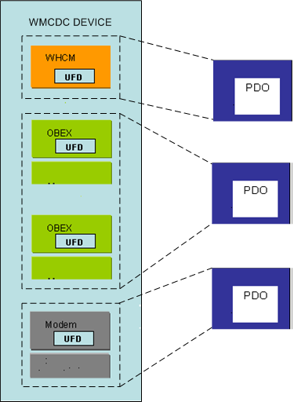

# Enumerating Interface Collections on WMCDC


The USB wireless mobile communication device class (WMCDC) is a subclass of the USB communications device class (CDC). The WMCDC specification extends but does not substantially change the CDC guidelines for defining interface collections. In particular, WMCDC devices must comply with the CDC guidelines for defining interface collections.

CDC interface collections contain a master interface ([**USB\_INTERFACE\_DESCRIPTOR**](https://msdn.microsoft.com/library/windows/hardware/ff540065)) that belongs to the communication interface class (`bInterfaceClass = 0x02`) or data interface class (`bInterfaceClass = 0x0A`). If the master interface belongs to the communication interface class (which is the typical situation), the subclass of the master interface (**bInterfaceSubClass**) specifies a CDC *control model*. The control model indicates the type of interfaces included in the interface collection. For a description of the control models that the USB Implementers Forum defines, see the CDC specification and the WMCDC specification.

The master interface of an interface collection is followed by a set of mandatory class-specific functional descriptors, including a union functional descriptor (UFD). The UFD lists the numbers of the interfaces that belong to the collection. The **bMasterInterface** field of the UFD contains the number of the master interface. Zero or more **bSubordinateInterface** fields contain the numbers of the other (subordinate) interfaces in the collection.

For most types of control models, the [USB Generic Parent Driver (Usbccgp.sys)](usb-common-class-generic-parent-driver.md) creates one physical device object (PDO) for each UFD. But some control models include an audio interface that the generic parent driver enumerates separately from the interface collection that the audio interface belongs to. The audio interface appears in the list of subordinate interfaces (**bSubordinateInterface**) in the UFD of the interface collection, but the generic parent driver creates a separate PDO for the audio interface. Both the PDO for the audio interface and the PDO for the interface collection that the audio interface belongs to are directly above the functional device object (FDO) of the parent composite device in the device object tree. The PDO of the audio interface is not a child of the interface collection. Enumeration of audio interfaces is described in [Enumeration of Interface Collections on Audio Devices without IADs](enumeration-of-interface-collections-on-audio-devices-without-iads.md).

There are two control models whose enumeration characteristics are configurable in the registry: the Wireless Handset Control Model (WHCM), which defines a logical handset, and the Object Exchange Protocol (OBEX) control model. To configure the enumeration characteristics of these two control models, you must provide an INF file that loads an instance of Usbccgp.sys and sets the value of **CdcFlags** in the software key for that instance of Usbccgp.sys. The following table describes the configuration options of **CdcFlags**.

<table>
<colgroup>
<col width="33%" />
<col width="33%" />
<col width="33%" />
</colgroup>
<thead>
<tr class="header">
<th>CdcFlags bit</th>
<th>Bit set to 0</th>
<th>Bit set to 1</th>
</tr>
</thead>
<tbody>
<tr class="odd">
<td><p>0 (mask = 0x00000001)</p></td>
<td><p>The USB generic parent driver creates a separate PDO for each OBEX interface.</p></td>
<td><p>The USB generic parent driver creates a single PDO for all OBEX interfaces.</p></td>
</tr>
<tr class="even">
<td><p>1 (mask = 0x00000010)</p></td>
<td><p>The USB generic parent driver does not create PDOs for WHCM interfaces (logical handsets). These interfaces remain hidden from the perspective of the device object tree.</p></td>
<td><p>The USB generic parent driver creates a PDO for each WHCM interface.</p></td>
</tr>
</tbody>
</table>

 

For example, to clear both bits (set them to 0), your INF file should have the following line in a **DDInstall.AddReg** section.

```
HKR, , CdcFlags, 0x00010001, 0x00000000
```

To set both bits to 1, your INF file should have the following line.

```
HKR, , CdcFlags, 0x00010001, 0x00000011
```

To set both bit 0 to 1 and bit 1 to 0, your INF file should have the following line.

```
HKR, , CdcFlags, 0x00010001, 0x00000001
```

Either bit can be set or reset, independently of the other bit.

The following figures illustrate how different registry configurations can create different device trees for the same device.

The following figure illustrates the PDO configuration when both bit 0 and bit 1 of **CdcFlags** are 0.


The Wireless Handset Control Model (WHCM) interface collection in the preceding figure contains three subordinate interface collections (**bSubordinateInterface**): two OBEX collections and a modem collection. Bit 0 of the **CdcFlags** is 0, so the USB generic parent driver does not create a PDO for the WHCM interface collection. Bit 1 of the **CdcFlags** is 0, so the USB generic parent driver generates a separate PDO for each OBEX interface collection.

The following figure illustrates the PDO configuration when both bit 0 and bit 1 of **CdcFlags** are set.



Because bit 0 of **CdcFlags** is set to 1, the USB generic parent driver creates a PDO for the WHCM interface collection. Because bit 1 of **CdcFlags** is set to 1, the USB generic parent driver groups the two OBEX collections together and generates a single PDO for both OBEX collections.

You might want to represent OBEX collections with a single PDO at the kernel level and to distinguish between each individual OBEX collection within a user-mode driver. The Windows Portable Devices (WPD) protocol can help you multiplex data streams between different OBEX functions at the user level, when all of the OBEX functions are grouped into a single PDO at the kernel level.

The following example INF file loads the USB generic parent driver to manage a WMCDC device and instructs the USB generic parent to create PDOs for logical handsets and to create a single PDO for all OBEX collections in the logical handset.

```
[Version]
signature="$Windows NT$"
Class=USB
ClassGUID={36FC9E60-C465-11CF-8056-444553540000}
Provider=%MSFT%
DriverVer=07/01/2001,5.1.2600.0

[ControlFlags]
ExcludeFromSelect=*

[Manufacturer]
CompanyName=CompanyName

[CompanyName]
%COMPANYNAME.DeviceDesc%=CCGPDriverInstall,USB\Vid_????&amp;Pid_????

[CCGPDriverInstall.NT]
Include=usb.inf
Needs=Composite.Dev.NT
AddReg=CCGPDriverInstall.AddReg

[CCGPDriverInstall.NT.Services]
Include=usb.inf
Needs=Composite.Dev.NT.Services

[CCGPDriverInstall.AddReg]
HKR,,EnumeratorClass,0x00000001,02,00,00
HKR,,CdcFlags,0x00010001,0x00010001

[Strings]
MSFT="Microsoft"
COMPANYNAME.DeviceDesc="USB Phone Parent"
```

## Related topics


[Support for the Wireless Mobile Communication Device Class](support-for-the-wireless-mobile-communication-device-class--wmcdc-.md)

[Enumeration of Interface Collections on USB Composite Devices](support-for-interface-collections.md)

[USB Generic Parent Driver (Usbccgp.sys)](usb-common-class-generic-parent-driver.md)

 

 

[Send comments about this topic to Microsoft](mailto:wsddocfb@microsoft.com?subject=Documentation%20feedback%20%5Busbcon\buses%5D:%20Enumerating%20Interface%20Collections%20on%20WMCDC%20%20RELEASE:%20%281/26/2017%29&body=%0A%0APRIVACY%20STATEMENT%0A%0AWe%20use%20your%20feedback%20to%20improve%20the%20documentation.%20We%20don't%20use%20your%20email%20address%20for%20any%20other%20purpose,%20and%20we'll%20remove%20your%20email%20address%20from%20our%20system%20after%20the%20issue%20that%20you're%20reporting%20is%20fixed.%20While%20we're%20working%20to%20fix%20this%20issue,%20we%20might%20send%20you%20an%20email%20message%20to%20ask%20for%20more%20info.%20Later,%20we%20might%20also%20send%20you%20an%20email%20message%20to%20let%20you%20know%20that%20we've%20addressed%20your%20feedback.%0A%0AFor%20more%20info%20about%20Microsoft's%20privacy%20policy,%20see%20http://privacy.microsoft.com/default.aspx. "Send comments about this topic to Microsoft")


