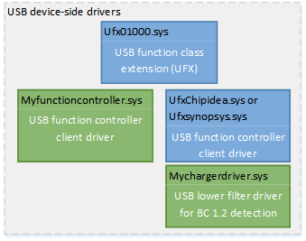

# Bring up the function controller on a USB Type-C Windows system


**Summary**

-   OEM bring up tasks for a function controller that has a USB Type-C connector

**Applies to**

-   Windows 10 Mobile

**Last updated**

-   November 2015

**Important APIs**

-   [USB function controller client driver programming reference](https://msdn.microsoft.com/library/windows/hardware/mt188010)
-   [USB filter driver for supporting proprietary chargers](https://msdn.microsoft.com/library/windows/hardware/mt188012)

The driver for the function controller informs the operating system about the charging levels that its USB Type-C connector supports and notifies the battery subsystem when it can begin charging and the maximum amount of current the device can draw.

This topic assumes that the function controller manages a single connector (UFP) at any given time.

## 1. Load the USB device-side drivers


There are two drivers that manage the operations of a function controller. The pair is the Microsoft-provided USB function class extension and its client driver. The class extension reports information sent by the client driver to the operating system. The client driver communicates with the hardware by using hardware interfaces. See, [USB device-side drivers in Windows](usb-device-side-drivers-in-windows.md).



-   If your system uses ChipIdea and Synopsys controllers.
    1.  Load the Microsoft provided in-box client drivers for ChipIdea and Synopsys controllers.
    2.  Write a lower filter driver that gets attach/detach events when a charger is connected. The driver determines the type of charger and the configuration properties. It can also detect USB charging ports as defined by the BC1.2 specification. Charging information is passed to the class extension so that it can report it to charging arbitration driver (CAD.sys). For more information, see [USB filter driver for supporting proprietary chargers](https://msdn.microsoft.com/library/windows/hardware/mt188012).
-   If your system uses a custom controller, write a client driver. The BC1.2 detect logic is implemented in the client driver. For more information, see:

    [USB function controller client driver programming reference](https://msdn.microsoft.com/library/windows/hardware/mt188010)

    [Developing Windows drivers for USB function controller](developing-windows-drivers-for-usb-function-controllers.md)

## <a href="" id="2--modify-system-acpi-to-indicate-to-the-function-controller-driver-that-the-connector-is-a-usb-type-c-connector--"></a>2. Modify system ACPI to indicate to the function controller driver that the connector is a USB Type-C connector.


This is done through an ACPI method defined in the ACPI 6.0 specification

`_UPC (USB Port Capabilities)`

Use the new values defined in ACPI 6.0 to indicate the correct type of USB Type-C connector, such as "Type-C USB2" and "Type-C USB2 and SS with switch". The function driver communicates this information to CAD.sys, so that it uses USB Type-C-specific arbitration logic to determine an appropriate charging source.

```
Device (UFN0)
{
    ...

    Name (_UPC, Package()
    {
        0x1,    // Connectable
        0x9,    // Type-C USB2 and Type-C USB2 and SS with switch
        0x0,    // Reserved
        0x0     // Reserved
    })

    Name (_CRS, ResourceTemplate()
    {
        ...
    })

    ...
```

## Related topics


[Developing Windows drivers for USB Type-C connectors](developing-windows-drivers-for-usb-type-c-connectors.md)

 

 

[Send comments about this topic to Microsoft](mailto:wsddocfb@microsoft.com?subject=Documentation%20feedback%20%5Busbcon\buses%5D:%20Bring%20up%20the%20function%20controller%20on%20a%20USB%20Type-C%20Windows%20system%20%20RELEASE:%20%281/26/2017%29&body=%0A%0APRIVACY%20STATEMENT%0A%0AWe%20use%20your%20feedback%20to%20improve%20the%20documentation.%20We%20don't%20use%20your%20email%20address%20for%20any%20other%20purpose,%20and%20we'll%20remove%20your%20email%20address%20from%20our%20system%20after%20the%20issue%20that%20you're%20reporting%20is%20fixed.%20While%20we're%20working%20to%20fix%20this%20issue,%20we%20might%20send%20you%20an%20email%20message%20to%20ask%20for%20more%20info.%20Later,%20we%20might%20also%20send%20you%20an%20email%20message%20to%20let%20you%20know%20that%20we've%20addressed%20your%20feedback.%0A%0AFor%20more%20info%20about%20Microsoft's%20privacy%20policy,%20see%20http://privacy.microsoft.com/default.aspx. "Send comments about this topic to Microsoft")


