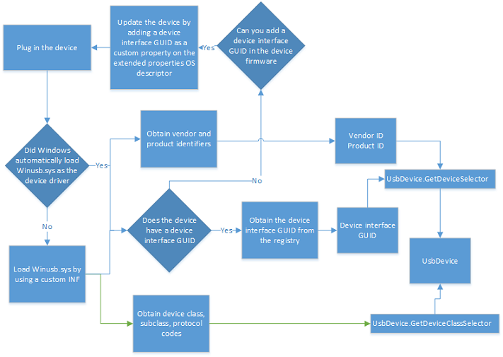

# How to connect to a USB device (UWP app)


**Summary**

-   How to use the [**DeviceWatcher**](https://msdn.microsoft.com/library/windows/apps/br225446) object to detect devices
-   How to open the device for communication
-   How to close the device when you are finished using it

**Important APIs**

-   [**UsbDevice**](https://msdn.microsoft.com/library/windows/apps/dn263883)
-   [**DeviceWatcher**](https://msdn.microsoft.com/library/windows/apps/br225446)

When you write a UWP app that interacts with a USB device, the app can send control commands, get device information, and read and write data to/from bulk and interrupt endpoints. Before you can do all that, you must find the device and establish connection.

## Before you start...


-   This is the first topic in a series. Before you start this tutorial, you must have created a basic Visual Studio project that you can extend in this tutorial. Read [Getting started with UWP apps](http://go.microsoft.com/fwlink/p/?linkid=617681) for more info.
-   Code examples are based on the CustomUsbDeviceAccess sample. You can download the complete sample from this code gallery page.
-   The USB device used in tutorial is the SuperMUTT device.
-   In order to use the [**Windows.Devices.Usb**](https://msdn.microsoft.com/library/windows/apps/dn278466) namespace to write a Windows app that interacts with a USB device, the device must have the Winusb.sys driver loaded as its function driver. Winusb.sys is provided by Microsoft and is included with Windows in the **\\Windows\\System32\\drivers** folder.

## Flowchart: Finding the device


To connect to a USB device, you must first find the device based on various discovery patterns and then connect to it:

-   Connect to any USB device with a specific device interface GUID.
-   Connect to a USB device with a particular Vendor ID and Product ID and that has a specific device interface GUID.
-   Connect to a USB device with a particular Vendor ID and Product ID without knowing the device interface GUID.
-   Connect to a USB device which has known device class.



## Key concepts


**What is a device interface GUID?**

A kernel-model driver, during its initialization, register and exposes a GUID called the *device interface GUID*. Typically, the app uses the exposed GUID to find the associated driver and its device, and then open a handle to the device. The retrieved handle is used for subsequent read and write operations.

However, in the case of Winusb.sys, instead of the driver exposing the device interface GUID, it can be provided in one of two ways:

-   In the device's MS OS descriptors. The device manufacturer sets **DeviceInterfaceGUID** as a custom property in the extended properties descriptor in the device. For more details, see the "Extended Properties Descriptors" document in [Microsoft OS Descriptors](http://go.microsoft.com/fwlink/p/?linkid=617682).
-   If you installed Winusb.sys manually through a custom INF, the INF registered a GUID in the INF. See [WinUSB (Winusb.sys) Installation](winusb-installation.md).

If a device interface GUID is found for the device, your UWP app can find all devices that match that device interface GUID.

**How is USB device identification shown in Windows?**

Every USB device must have two pieces of information: vendor ID and product ID.

USB-IF assigns those identifiers and the device manufacturer must expose them in the device. So how can you obtain that information?

-   Even when the device doesn't have a device driver loaded, that is, Windows detects it as an "Unknown Device", you can still view the identifiers in the Device Manager in the **Hardware Id** property value. That value is a combination of those two identifiers. For example, for the SuperMUTT device, the **Hardware Id** is "USB\\VID\_045E&PID\_F001"; vendor id is "0x045E" and product id is "0xF001".

-   If there is an INF for the device, obtain that string from the **Models** section.
-   You can inspect various registry settings. The easiest way is to see the

    **HKEY\_LOCAL\_MACHINE\\SYSTEM\\ControlSet001\\Enum\\USB\\&lt;hardware id&gt;**

    For more information, see [USB Device Registry Entries](usb-device-specific-registry-settings.md).

-   Hardware ID is used by the app manifest to identify the device.

    &lt;Device Id="vidpid:045e f001"&gt;

Your UWP app can find all devices that match a specific vendor and product ids. You can narrow the search results by specifying the device interface GUID.

**What are USB device classes?**

Most USB devices conform to device class specifications approved by USB-IF. By using those specifications, devices of similar nature can exhibit their functionality in a standard way. The biggest advantage of this approach is that the device can use a Microsoft provided in-box class driver or the generic Winusb.sys driver.

Some devices might not follow a USB-IF specification. Instead they expose *vendor-defined* functionality. For such devices, either the vendor must provide the device driver or Winusb.sys can be used.

Whether a device is vendor-defined or conforms to a device class, it must describe this device class related information:

-   Class code: Indicates the device class to which the device belongs.
-   Subclass code: Within the device class, indicates the subclass of device.
-   Protocol code: The protocol that the device uses.

For example, the SuperMUTT device is a vendor-defined device and that information is indicated by class code is FF. If your device shows class code as FEh, subclass code as 02h, and protocol code 00h, you can conclude that the device is a class-compliant IrDA bridge device.
Your UWP app can communicate with devices that belong to these device classes:

-   ActiveSync
-   CdcControl
-   DeviceFirmwareUpdate
-   IrDA
-   Measurement
-   PalmSync
-   PersonalHealthcare
-   Physical
-   VendorSpecific

Your UWP app can find all devices that match a specific set of class, subclass, and protocol codes.

## Get the Advanced Query Syntax (AQS) string for the device


Generate an advanced query string (AQS) that contains identification information about the device that you want to detect. You can generate the string either by specifying the vendor/product IDs, device interface GUID, or by the device class.

-   If you want to provide the vendor ID/product ID or the device interface GUID, call any overload of [**GetDeviceSelector**](https://msdn.microsoft.com/library/windows/apps/dn264022).

    In the example of the SuperMUTT device, [**GetDeviceSelector**](https://msdn.microsoft.com/library/windows/apps/dn264022) retrieves an AQS string similar to this string:

    `"System.Devices.InterfaceClassGuid:="{DEE824EF-729B-4A0E-9C14-B7117D33A817}" AND System.Devices.InterfaceEnabled:=System.StructuredQueryType.Boolean#True AND System.DeviceInterface.WinUsb.UsbVendorId:=1118 AND System.DeviceInterface.WinUsb.UsbProductId:=61441"`

    **Note**  Notice that the device interface GUID that appears in the string is not the one you specified. That GUID is the actual device interface GUID registered by Winusb.sys for UWP apps.

     

-   If you know the device class of the device or its class, subclass, and protocol codes, call [**GetDeviceClassSelector**](https://msdn.microsoft.com/library/windows/apps/dn264013) to generate the AQS string.

    Create a [**UsbDeviceClass**](https://msdn.microsoft.com/library/windows/apps/dn263894) object by specifying [**ClassCode**](https://msdn.microsoft.com/library/windows/apps/dn263948), [**SubclassCode**](https://msdn.microsoft.com/library/windows/apps/dn263956), and [**ProtocolCode**](https://msdn.microsoft.com/library/windows/apps/dn263951) property values. Alternatively, if you know the device class of the device, you can call the constructor by specifying a particular [**UsbDeviceClasses**](https://msdn.microsoft.com/library/windows/apps/dn263904) property.

## Finding the device—The basic way


This is the simplest way to find a USB device. For details, see [Quickstart: enumerating commonly used devices](https://msdn.microsoft.com/library/windows/apps/xaml/hh872189).

1.  Pass the retrieved AQS string to [**FindAllAsync**](https://msdn.microsoft.com/library/windows/apps/br225432). The call retrieves a [**DeviceInformationCollection**](https://msdn.microsoft.com/library/windows/apps/br225395) object.
2.  Loop through the collection. Each iteration gets a [**DeviceInformation**](https://msdn.microsoft.com/library/windows/apps/br225393) object.
3.  Get the [**DeviceInformation.Id**](https://msdn.microsoft.com/library/windows/apps/br225437) property value. The string value is the device instance path. For example, "\\\\\\\\?\\\\USB\#VID\_045E&PID\_078F\#6&1b8ff026&0&5\#{dee824ef-729b-4a0e-9c14-b7117d33a817}".
4.  Call [**FromIdAsync**](https://msdn.microsoft.com/library/windows/apps/dn264010) by passing the device instance string and get the [**UsbDevice**](https://msdn.microsoft.com/library/windows/apps/dn263883) object. You can then use the **UsbDevice** object to perform other operations, such as sending a control transfer. When the app has finished using the **UsbDevice** object, the app must release it by calling [**Close**](https://msdn.microsoft.com/library/windows/apps/dn263990).
    **Note**  When UWP app suspends, the device is closed automatically. To avoid using a stale handle for future operations, the app must released the [**UsbDevice**](https://msdn.microsoft.com/library/windows/apps/dn263883) reference.

     

```CSharp
    private async void OpenDevice()
    {
        UInt32 vid = 0x045E;
        UInt32 pid = 0x0611;

        string aqs = UsbDevice.GetDeviceSelector(vid, pid);

        var myDevices = await Windows.Devices.Enumeration.DeviceInformation.FindAllAsync(aqs);

        try
        {
            usbDevice = await UsbDevice.FromIdAsync(myDevices[0].Id);
        }
        catch (Exception exception)
        {
            ShowStatus(exception.Message.ToString());
        }
        finally        
        {
            ShowStatus("Opened device for communication.");
        }

    }
```

## Find the device—using DeviceWatcher


Alternatively, you can enumerate devices dynamically. Then, your app can receive notification if devices are added or removed, or if device properties change. For more information, see [How to get notifications if devices are added, removed, or changed](https://msdn.microsoft.com/library/windows/apps/xaml/hh967756).

A [**DeviceWatcher**](https://msdn.microsoft.com/library/windows/apps/br225446) object enables an app to dynamically detect devices as they get added and removed from the system.

1.  Create a [**DeviceWatcher**](https://msdn.microsoft.com/library/windows/apps/br225446) object to detect when the device is added to or removed from the system. You must create the object by calling [**CreateWatcher**](https://msdn.microsoft.com/library/windows/apps/br225427) and specifying the AQS string.
2.  Implement and register handlers for [**Added**](https://msdn.microsoft.com/library/windows/apps/br225450) and [**Removed**](https://msdn.microsoft.com/library/windows/apps/br225453) events on the [**DeviceWatcher**](https://msdn.microsoft.com/library/windows/apps/br225446) object. Those event handlers are invoked when devices (with the same identification information) are added or removed from the system.
3.  Start and stop the [**DeviceWatcher**](https://msdn.microsoft.com/library/windows/apps/br225446) object.

    The app must start the [**DeviceWatcher**](https://msdn.microsoft.com/library/windows/apps/br225446) object by calling [**Start**](https://msdn.microsoft.com/library/windows/apps/br225454) so that it can start detecting devices as they are added or removed from the system. Conversely, the app must stop the **DeviceWatcher** by calling [**Stop**](https://msdn.microsoft.com/library/windows/apps/br225456), when it's no longer necessary to detect devices. The sample has two buttons that allows the user to start and stop **DeviceWatcher**.

This code example shows how to create and start a device watcher to look for instances of the SuperMUTT device.

```CSharp
void CreateSuperMuttDeviceWatcher(void)
{
    UInt32 vid = 0x045E;
    UInt32 pid = 0x0611;

    string aqs = UsbDevice.GetDeviceSelector(vid, pid);  
    
    var superMuttWatcher = DeviceInformation.CreateWatcher(aqs);
  
    superMuttWatcher.Added += new TypedEventHandler<DeviceWatcher, DeviceInformation>
                              (this.OnDeviceAdded);

    superMuttWatcher.Removed += new TypedEventHandler<DeviceWatcher, DeviceInformationUpdate>
                            (this.OnDeviceRemoved);

    superMuttWatcher.Start();
 }
```

## Open the device


To open the device, the app must start an asynchronous operation by calling the static method [**FromIdAsync**](https://msdn.microsoft.com/library/windows/apps/dn264010) and passing the device instance path (obtained from [**DeviceInformation.Id**](https://msdn.microsoft.com/library/windows/apps/br225437)). That result of that operation obtain is a [**UsbDevice**](https://msdn.microsoft.com/library/windows/apps/dn263883) object, which is used for future communication with the device, such as performing data transfers.

After you are finished using the [**UsbDevice**](https://msdn.microsoft.com/library/windows/apps/dn263883) object, you must release it. By releasing the object, all pending data transfers are canceled. The completion callback routines for those operations are still invoked with canceled error or the operation completed.

C++ apps must release the reference by using the **delete** keyword. C#/VB apps must call the [**UsbDevice.Dispose**](https://msdn.microsoft.com/library/windows/apps/dn264007) method. JavaScript apps must call [**UsbDevice.Close**](https://msdn.microsoft.com/library/windows/apps/dn263990).

The [**FromIdAsync**](https://msdn.microsoft.com/library/windows/apps/dn264010) fails if the device is in use or cannot be found.

 

 


