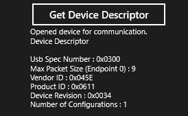

# How to get USB descriptors (UWP app)


**Summary**

-   Understanding USB device layout
-   Getting standard USB descriptors
-   Getting custom descriptors

**Important APIs**

-   [**UsbDeviceDescriptor**](https://msdn.microsoft.com/library/windows/apps/dn263961)
-   [**UsbConfigurationDescriptor**](https://msdn.microsoft.com/library/windows/apps/dn297689)
-   [**UsbDescriptor**](https://msdn.microsoft.com/library/windows/apps/dn263863)

One of the main tasks of interacting with a USB device is to get information about it. All USB devices provide information in the form of several data structures called descriptors. This topic describes how a UWP app can get descriptors from the device at the endpoint, interface, configuration, and device level.

## USB descriptors


A USB device describes its capabilities in two main descriptors: device descriptor and configuration descriptor.

A USB device must provide a *device descriptor* that contains information about a USB device as a whole. If the device doesn't provide that descriptor or provides a malformed descriptor, Windows is unable to load the device driver. The most important information in the descriptor is the device's *hardware ID* for the device (combination of **vendor ID** and **product ID** fields). It's based on that information that Windows is able to match an in-box driver for the device. Another information that is key is the *maximum packet size* of the default endpoint (**MaxPacketSize0**). The default endpoint is the target of all control requests that the host sends to the device to configure it.

The length of the device descriptor is fixed.

The USB device must also provide a complete *configuration descriptor*. The beginning portion of this descriptor has fixed length of 9 bytes, rest is variable length depending on the number of interfaces and endpoints those interfaces support. The fixed-length portion provides information about a USB configuration: number of interfaces it supports and power consumption when the device is in that configuration. Those initial 9 bytes are followed by the variable portion of the descriptor that provides information about all USB interfaces. Each interface consists of one or more interface settings, and each setting is made up of a set of endpoints. Descriptors for interfaces, alternate settings, and endpoints are included in the variable portion.

For detailed description about device layout, see [Standard USB descriptors](standard-usb-descriptors.md).

## Before you start...


-   You must have opened the device and obtained the [**UsbDevice**](https://msdn.microsoft.com/library/windows/apps/dn263883) object. Read [How to connect to a USB device (UWP app)](how-to-connect-to-a-usb-device--uwp-app-.md).
-   You can see the complete code shown in this topic in the CustomUsbDeviceAccess sample, Scenario5\_UsbDescriptors files.
-   Get information about the device layout. **Usbview.exe** (included in the Windows Software Development Kit (SDK) for Windows 8) is an application that enables you to browse all USB controllers and the USB devices that are connected to them. For each connected device, you can view the device, configuration, interface, and endpoint descriptors to get an idea about the capability of the device.

## How to get the device descriptor


Your UWP app can get the device descriptor from the previously obtained [**UsbDevice**](https://msdn.microsoft.com/library/windows/apps/dn263883) object by getting the [**UsbDevice.DeviceDescriptor**](https://msdn.microsoft.com/library/windows/apps/dn264002) property value.

This code example shows how to populate a string with field values from device descriptor.

```CSharp
String GetDeviceDescriptorAsString (UsbDevice device)
{
    String content = null;

    var deviceDescriptor = device.DeviceDescriptor;

    content = "Device Descriptor\n"
            + "\nUsb Spec Number : 0x" + deviceDescriptor.BcdUsb.ToString("X4", NumberFormatInfo.InvariantInfo)
            + "\nMax Packet Size (Endpoint 0) : " + deviceDescriptor.MaxPacketSize0.ToString("D", NumberFormatInfo.InvariantInfo)
            + "\nVendor ID : 0x" + deviceDescriptor.IdVendor.ToString("X4", NumberFormatInfo.InvariantInfo)
            + "\nProduct ID : 0x" + deviceDescriptor.IdProduct.ToString("X4", NumberFormatInfo.InvariantInfo)
            + "\nDevice Revision : 0x" + deviceDescriptor.BcdDeviceRevision.ToString("X4", NumberFormatInfo.InvariantInfo)
            + "\nNumber of Configurations : " + deviceDescriptor.NumberOfConfigurations.ToString("D", NumberFormatInfo.InvariantInfo);
    
    return content;
}
```

The output is shown here:



## How to get the configuration descriptor


To get the fixed portion of the configuration descriptor from the previously obtained [**UsbDevice**](https://msdn.microsoft.com/library/windows/apps/dn263883) object,

1.  Get the [**UsbConfiguration**](https://msdn.microsoft.com/library/windows/apps/dn297681) object from [**UsbDevice**](https://msdn.microsoft.com/library/windows/apps/dn263883). **UsbConfiguration** represents the first USB configuration defined by the device and is also selected by default by the underlying device driver.
2.  Get the [**UsbConfiguration.ConfigurationDescriptor**](https://msdn.microsoft.com/library/windows/apps/dn263799) property value.

The fixed portion of the configuration descriptor indicates the device's power characteristics. For example, you can determine whether the device is drawing power from the bus or an external source (see [**UsbConfigurationDescriptor.SelfPowered**](https://msdn.microsoft.com/library/windows/apps/dn263787)). If the device is drawing power from the bus, how much power (in milliamp units) it is consuming (see [**UsbConfigurationDescriptor.MaxPowerMilliamps**](https://msdn.microsoft.com/library/windows/apps/dn297702)). Also, you can determine whether the device is capable of waking itself or the system from a low power state, by getting [**UsbConfigurationDescriptor.RemoteWakeup**](https://msdn.microsoft.com/library/windows/apps/dn263785) value.

This code example shows how to get the fixed portion of a configuration descriptor in a string.

```CSharp
String GetConfigurationDescriptorAsString(UsbDevice device)
{
    String content = null;

    var usbConfiguration = device.Configuration;
    var configurationDescriptor = usbConfiguration.ConfigurationDescriptor;

    content = "Configuration Descriptor\n"
            + "\nNumber of Interfaces : " + usbConfiguration.UsbInterfaces.Count.ToString("D", NumberFormatInfo.InvariantInfo)
            + "\nConfiguration Value : 0x" + configurationDescriptor.ConfigurationValue.ToString("X2", NumberFormatInfo.InvariantInfo)
            + "\nSelf Powered : " + configurationDescriptor.SelfPowered.ToString()
            + "\nRemote Wakeup : " + configurationDescriptor.RemoteWakeup.ToString()
            + "\nMax Power (milliAmps) : " + configurationDescriptor.MaxPowerMilliamps.ToString("D", NumberFormatInfo.InvariantInfo);

    return content;
}
```

The output is shown here:


## How to get interface descriptors


Next, you can get information about the USB interfaces that are part of the configuration.

A USB interface is a collection of interface settings. As such there is no descriptor that describes the entire interface. The term *interface descriptor* indicates the data structure that describes a setting within an interface.

The [**Windows.Devices.Usb**](https://msdn.microsoft.com/library/windows/apps/dn278466) namespace exposes objects that you can use to get information about each USB interface and all interfaces descriptors (for alternate settings) included in that interface. and descriptors from the variable-length portion of the configuration descriptor.

To get the interface descriptors from [**UsbConfiguration**](https://msdn.microsoft.com/library/windows/apps/dn297681),

1.  Get the array of interfaces within the configuration by getting the [**UsbConfiguration.UsbInterfaces**](https://msdn.microsoft.com/library/windows/apps/dn263808) property.
2.  For each interface ([**UsbInterface**](https://msdn.microsoft.com/library/windows/apps/dn264121)), get this information:
    -   Bulk and interrupt pipes that are active and can transfer data.
    -   Array of alternate settings in the interface.
    -   Array of interface descriptors.

This example code gets all [**UsbInterface**](https://msdn.microsoft.com/library/windows/apps/dn264121) objects for the configuration. From each object, the helper method gets the number of alternate setting and open bulk and interface pipes. If a device supports multiple interfaces, device class, subclass, and protocol codes of each interface can differ. However, all interface descriptors for alternate settings must specify same codes. In this example, the method gets the device class, subclass, and protocol codes from the interface descriptor of the first setting to determine the code for the entire interface.

```CSharp
String GetInterfaceDescriptorsAsString(UsbDevice device)
{
    String content = null;
    
    var interfaces = device.Configuration.UsbInterfaces;

    content = "Interface Descriptors";

        foreach (UsbInterface usbInterface in interfaces)
        {
            // Class/subclass/protocol values from the first interface setting.

            UsbInterfaceDescriptor usbInterfaceDescriptor = usbInterface.InterfaceSettings[0].InterfaceDescriptor;

            content +="\n\nInterface Number: 0x" +usbInterface.InterfaceNumber.ToString("X2", NumberFormatInfo.InvariantInfo)
                    + "\nClass Code: 0x" +usbInterfaceDescriptor.ClassCode.ToString("X2", NumberFormatInfo.InvariantInfo)
                    + "\nSubclass Code: 0x" +usbInterfaceDescriptor.SubclassCode.ToString("X2", NumberFormatInfo.InvariantInfo)
                    + "\nProtocol Code: 0x" +usbInterfaceDescriptor.ProtocolCode.ToString("X2", NumberFormatInfo.InvariantInfo)
                    + "\nNumber of Interface Settings: "+usbInterface.InterfaceSettings.Count.ToString("D", NumberFormatInfo.InvariantInfo)
                    + "\nNumber of open Bulk In pipes: "+usbInterface.BulkInPipes.Count.ToString("D", NumberFormatInfo.InvariantInfo)
                    + "\nNumber of open Bulk Out pipes: "+usbInterface.BulkOutPipes.Count.ToString("D", NumberFormatInfo.InvariantInfo)
                    + "\nNumber of open Interrupt In pipes: "+usbInterface.InterruptInPipes.Count.ToString("D", NumberFormatInfo.InvariantInfo)
                    + "\nNumber of open Interrupt Out pipes: "+usbInterface.InterruptOutPipes.Count.ToString("D", NumberFormatInfo.InvariantInfo);
       }

    return content;
}
```

The output is shown here:


## How to get endpoint descriptors


All USB endpoints (except the default control endpoint) must have endpoint descriptors. To obtain the endpoint descriptors for a particular endpoint, you must know which interface and alternate setting to which the endpoint belongs.

1.  Get the [**UsbInterface**](https://msdn.microsoft.com/library/windows/apps/dn264121) object that contains the endpoint.
2.  Get the array of alternate settings by getting [**UsbInterface.InterfaceSettings**](https://msdn.microsoft.com/library/windows/apps/dn264291).
3.  Within the array, find the setting ([**UsbInterfaceSetting**](https://msdn.microsoft.com/library/windows/apps/dn264278)) that uses the endpoint.
4.  Within each setting, find the endpoint by enumerating bulk and interrupt descriptors arrays.

    Endpoint descriptors are represented by these objects:

    -   [**UsbBulkInEndpointDescriptor**](https://msdn.microsoft.com/library/windows/apps/dn297543)
    -   [**UsbBulkOutEndpointDescriptor**](https://msdn.microsoft.com/library/windows/apps/dn297619)
    -   [**UsbInterruptInEndpointDescriptor**](https://msdn.microsoft.com/library/windows/apps/dn264294)
    -   [**UsbInterruptOutEndpointDescriptor**](https://msdn.microsoft.com/library/windows/apps/dn278420)

If your device has only one interface, you can use the [**UsbDevice.DefaultInterface**](https://msdn.microsoft.com/library/windows/apps/dn263998) to get the interface as shown in this example code. Here, the helper method gets populates a string with endpoint descriptors associated with pipes of the active interface setting.

```CSharp
private String GetEndpointDescriptorsAsString(UsbDevice device)
{
    String content = null;

    var usbInterface = device.DefaultInterface;
    var bulkInPipes = usbInterface.BulkInPipes;
    var bulkOutPipes = usbInterface.BulkOutPipes;
    var interruptInPipes = usbInterface.InterruptInPipes;
    var interruptOutPipes = usbInterface.InterruptOutPipes;

    content = "Endpoint Descriptors for open pipes";

    // Print Bulk In Endpoint descriptors
    foreach (UsbBulkInPipe bulkInPipe in bulkInPipes)
    {
        var endpointDescriptor = bulkInPipe.EndpointDescriptor;

        content +="\n\nBulk In Endpoint Descriptor"
                + "\nEndpoint Number : 0x" + endpointDescriptor.EndpointNumber.ToString("X2", NumberFormatInfo.InvariantInfo)
                + "\nMax Packet Size : " + endpointDescriptor.MaxPacketSize.ToString("D", NumberFormatInfo.InvariantInfo);
    }

    // Print Bulk Out Endpoint descriptors
    foreach (UsbBulkOutPipe bulkOutPipe in bulkOutPipes)
    {
        var endpointDescriptor = bulkOutPipe.EndpointDescriptor;

        content +="\n\nBulk Out Endpoint Descriptor"
                + "\nEndpoint Number : 0x" + endpointDescriptor.EndpointNumber.ToString("X2", NumberFormatInfo.InvariantInfo)
                + "\nMax Packet Size : " + endpointDescriptor.MaxPacketSize.ToString("D", NumberFormatInfo.InvariantInfo);
    }

    // Print Interrupt In Endpoint descriptors
    foreach (UsbInterruptInPipe interruptInPipe in interruptInPipes)
    {
        var endpointDescriptor = interruptInPipe.EndpointDescriptor;

        content +="\n\nInterrupt In Endpoint Descriptor"
                + "\nEndpoint Number : 0x" + endpointDescriptor.EndpointNumber.ToString("X2", NumberFormatInfo.InvariantInfo)
                + "\nMax Packet Size : " + endpointDescriptor.MaxPacketSize.ToString("D", NumberFormatInfo.InvariantInfo);
                + "\nInterval : " + endpointDescriptor.Interval.Duration.ToString();
    }

    // Print Interrupt Out Endpoint descriptors
    foreach (UsbInterruptOutPipe interruptOutPipe in interruptOutPipes)
    {
        var endpointDescriptor = interruptOutPipe.EndpointDescriptor;

        content +="\n\nInterrupt Out Endpoint Descriptor"
                + "\nEndpoint Number : 0x" + endpointDescriptor.EndpointNumber.ToString("X2", NumberFormatInfo.InvariantInfo)
                + "\nMax Packet Size : " + endpointDescriptor.MaxPacketSize.ToString("D", NumberFormatInfo.InvariantInfo);
                + "\nInterval : " + endpointDescriptor.Interval.Duration.ToString();
    }

    return content;
}
```

The output is shown here:


## How to get custom descriptors


Notice that [**UsbConfiguration**](https://msdn.microsoft.com/library/windows/apps/dn297681), [**UsbInterface**](https://msdn.microsoft.com/library/windows/apps/dn264121), and [**UsbInterfaceSetting**](https://msdn.microsoft.com/library/windows/apps/dn264278) objects, each expose a property named **Descriptors**. That property value retrieves the array of descriptors represented by [**UsbDescriptor**](https://msdn.microsoft.com/library/windows/apps/dn263863) objects. The **UsbDescriptor** object allows the app to get descriptor data in a buffer. [**UsbDescriptor.DescriptorType**](https://msdn.microsoft.com/library/windows/apps/dn263870) and [**UsbDescriptor.Length**](https://msdn.microsoft.com/library/windows/apps/dn263874) properties store the type and length of the buffer required to hold the descriptor.

**Note**  The first two bytes of all descriptor buffers also indicate the type and length of the descriptor.

 

For example, the [**UsbConfiguration.Descriptors**](https://msdn.microsoft.com/library/windows/apps/dn264289) property gets the array of complete configuration descriptor (fixed and variable length portions). The first element in that array is the fixed-length configuration descriptor (same as [**UsbConfigurationDescriptor**](https://msdn.microsoft.com/library/windows/apps/dn297689)), the second element is the interface descriptor of the first alternate setting, and so on.

Similarly, the [**UsbInterface.Descriptors**](https://msdn.microsoft.com/library/windows/apps/dn264289) property gets the array of all interface descriptors and the related endpoint descriptors. The [**UsbInterfaceSetting.Descriptors**](https://msdn.microsoft.com/library/windows/apps/dn264281) property gets the array of all descriptors for that setting, such as endpoint descriptors.

This way of getting descriptors is useful when the app wants to retrieve custom descriptors or other descriptors like endpoint companion descriptors for SuperSpeed devices.

This code example shows how to get a descriptor data in a buffer from the configuration descriptor. The example gets the configuration descriptor set and parses all descriptors contained in that set. For each descriptor, it uses the DataReader object to read the buffer and show descriptor length and type. You can get custom descriptors as shown in this example.

```CSharp
private String GetCustomDescriptorsAsString(UsbDevice device)
{
    String content = null;
    // Descriptor information will be appended to this string and then printed to UI
    content = "Raw Descriptors";

    var configuration = device.Configuration;
    var allRawDescriptors = configuration.Descriptors;

    // Print first 2 bytes of all descriptors within the configuration descriptor    
    // because the first 2 bytes are always length and descriptor type
    // the UsbDescriptor&#39;s DescriptorType and Length properties, but we will not use these properties
    // in order to demonstrate ReadDescriptorBuffer() and how to parse it.

    foreach (UsbDescriptor descriptor in allRawDescriptors)
    {
        var descriptorBuffer = new Windows.Storage.Streams.Buffer(descriptor.Length);
        descriptor.ReadDescriptorBuffer(descriptorBuffer);

        DataReader reader = DataReader.FromBuffer(descriptorBuffer);

        // USB data is Little Endian according to the USB spec.
        reader.ByteOrder = ByteOrder.LittleEndian;

        // ReadByte has a side effect where it consumes the current byte, so the next ReadByte will read the next character.
        // Putting multiple ReadByte() on the same line (same variable assignment) may cause the bytes to be read out of order.
        var length = reader.ReadByte().ToString("D", NumberFormatInfo.InvariantInfo);
        var type = "0x" + reader.ReadByte().ToString("X2", NumberFormatInfo.InvariantInfo);

        content += "\n\nDescriptor"
                + "\nLength : " + length
                + "\nDescriptorType : " + type;
    }

    return content;
}
```

 

 


