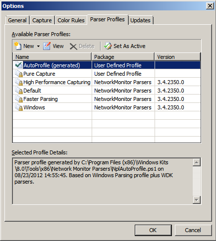

# How to install Netmon and USB ETW Parsers

This topic provides installation information about Netmon and the USB ETW parsers.

Install Netmon from the Microsoft Download Center, and then install USB ETW parsers from [Windows Driver Kit (WDK)](../download-the-wdk.md). The USB ETW parsers are supported in Netmon Version 3.3 and later versions.

## To install the Netmon tool and the Netmon USB parser

1. Determine whether your machine is running 32-bit Windows or 64-bit Windows:

    1. Open the **Start** menu, right-click **Computer** and view **Properties**.
    1. Look at the **System type** field.

    If your system type is 32-bit Operating System, you will use the x86 download. If your system type is 64-bit Operating System and your processor is Itanium, you will use the ia64 download. For other processor types, use the x64 or AMD64 download.

1. Install Netmon:
    1. On the [Windows Network Monitor](https://go.microsoft.com/fwlink/p/?linkid=103158) page in the Microsoft Download Center and read the description of the tool.
    1. Under **Files in this Download** section toward the bottom of the page, select the **Download** button for your system type.
    1. Download and run the .exe file to start the Setup Wizard.
    1. Select **Typical** when you are asked to choose the setup type.

1. Install the WDK from [Windows Driver Kit (WDK))](../download-the-wdk.md).
1. Allow execution of PowerShell scripts:
    1. On the Start screen, type "powershell", right-click on the Windows PowerShell result, and select **Run as administrator**.
    1. In the PowerShell window, type this command:

        ```syntax
        Set-ExecutionPolicy RemoteSigned -Force
        ```

    1. Close the PowerShell window.
    1. Open a PowerShell window (you don't need to **Run as administrator**) and run the following commands. Adjust the path if you installed the kit to a different location:

        ```syntax
        cd "C:\Program Files (x86)\Windows Kits\8.0\Tools\x86\Network Monitor Parsers\usb"
        ..\NplAutoProfile.ps1
        ```

    1. Restart Netmon to apply the changes.

1. Verify that the profile is active in Netmon.
    1. On the **Tools** menu, select **Options**.
    1. On the **Parser Profiles** tab, make sure that **AutoProfile (generated)** is set as active. Your settings should be similar to this image.

        

    1. Select **OK**.

Netmon is now configured for use with a USB ETW trace file. For more information, see [How to view a USB ETW trace in Netmon](how-to-examining-a-trace-file-by-using-netmon.md).

## Related topics

* [Using USB ETW](using-usb-etw.md)  
* [USB Event Tracing for Windows](usb-event-tracing-for-windows.md)  
* [How to open an ETW trace in Netmon](how-to-examining-a-trace-file-by-using-netmon.md)
