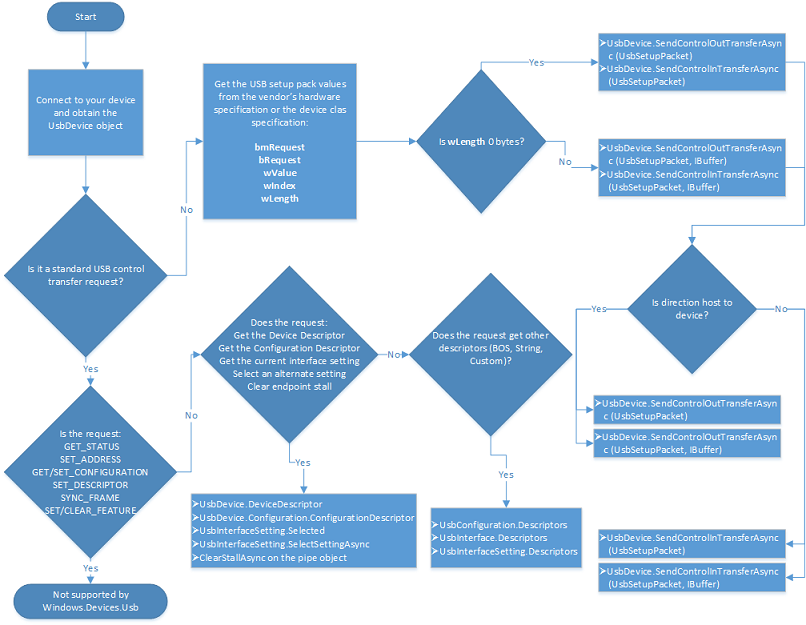

# How to send a USB control transfer (UWP app)


**Summary**

-   How to format a USB setup packet
-   How to initiate a USB control transfer from your app

**Important APIs**

-   [**SendControlInTransferAsync**](https://msdn.microsoft.com/library/windows/apps/dn264027)
-   [**SendControlOutTransferAsync**](https://msdn.microsoft.com/library/windows/apps/dn264044)

An app that communicates with a USB device usually sends several control transfers requests. Those requests get information about the device and send control commands defined by the hardware vendor. In this topic you'll learn about control transfers and how to format and send them in your UWP app.

A control transfer can read or write configuration information or perform device-specific functions defined by the hardware vendor. If the transfer performs a write operation, it's an OUT transfer; a read operation, it's an IN transfer. Regardless of the direction, a software, such as your UWP app, on the host system always builds and initiates a request for a control transfer. At times, your app can initiate control transfers that reads or writes data. In that case, you might need to send an additional buffer.

To accommodate all types of control transfers, [**Windows.Devices.Usb**](https://msdn.microsoft.com/library/windows/apps/dn278466) provides these methods:

-   [**SendControlOutTransferAsync (UsbSetupPacket)**](https://msdn.microsoft.com/library/windows/apps/dn264047)
-   [**SendControlInTransferAsync (UsbSetupPacket)**](https://msdn.microsoft.com/library/windows/apps/dn264037)
-   [**SendControlOutTransferAsync (UsbSetupPacket, IBuffer)**](https://msdn.microsoft.com/library/windows/apps/dn264050)
-   [**SendControlInTransferAsync (UsbSetupPacket, IBuffer)**](https://msdn.microsoft.com/library/windows/apps/dn264028)



USB control transfers are also used to get descriptor data or send standard commands. However, we recommend that you send those types of requests by calling specific methods provided by [**Windows.Devices.Usb**](https://msdn.microsoft.com/library/windows/apps/dn278466) rather than building a control transfer, manually. For example, to select an alternate setting, call [**SelectSettingAsync**](https://msdn.microsoft.com/library/windows/apps/dn264286) instead of calling [**SendControlOutTransferAsync (UsbSetupPacket)**](https://msdn.microsoft.com/library/windows/apps/dn264047).

Control transfers for certain types of standard requests are not supported. However, if your device belongs to a device class that is supported by [**Windows.Devices.Usb**](https://msdn.microsoft.com/library/windows/apps/dn278466), you can send some requests as defined by the device class specification.

## Before you start...


-   You have must opened the device and obtained the [**UsbDevice**](https://msdn.microsoft.com/library/windows/apps/dn263883) object. Read [How to connect to a USB device (UWP app)](how-to-connect-to-a-usb-device--uwp-app-.md).
-   Obtain information about vendor-defined control commands. Those commands are typically defined in the hardware specification.
-   You can see the complete code shown in this topic in the CustomUsbDeviceAccess sample, Scenario2\_ControlTransfer.cpp and Scenario2\_ControlTransfer.h.

## Step 1: Populate the setup packet


In this topic, we will send a control transfer to a device that blinks lights in various patterns. In order to populate the setup packet, you must know the control commands is defined by the hardware vendor:

-   **bmRequestType** (D7): OUT
-   **bmRequestType** (D4): Device
-   **bmRequestType** (D6…D5): Vendor
-   **bRequest**: 0x03
-   **wValue**: 0-7 (any number in that range, inclusive)
-   **wIndex**: 0
-   **wLength**: 0

For the control transfer, you must populate a *setup packet* that contains all information about the transfer; whether the request reads or writes data, the request type, and so on. The format of the setup packet is defined in the official USB specification. The values of setup packet fields are provided by the hardware specification of the device.

1.  Create a [**UsbSetupPacket**](https://msdn.microsoft.com/library/windows/apps/dn278431) object.
2.  Populate the [**UsbSetupPacket**](https://msdn.microsoft.com/library/windows/apps/dn278431) object by setting various properties. This table shows the USB-defined setup packet fields, and the properties that correspond to those fields:

    | Fields in Section 9.3     | Property                                                                              | Description                                                                                                                                                                                                                            |
    |---------------------------|---------------------------------------------------------------------------------------|----------------------------------------------------------------------------------------------------------------------------------------------------------------------------------------------------------------------------------------|
    | **bmRequestType** (D7)    | [**UsbControlRequestType.Direction**](https://msdn.microsoft.com/library/windows/apps/dn263833)      | Direction of the request. Whether the request is from host to device (Out transfers) or device to host (In transfers).                                                                                                                 |
    | **bmRequestType** (D4)    | [**UsbControlRequestType.Recipient**](https://msdn.microsoft.com/library/windows/apps/dn263841)      | Recipient of the request. All control transfers target the default endpoint. However, the recipient might be device, interface, endpoint, or other. For more information USB device, interface, endpoint hierarchy, see Device Layout. |
    | **bmRequestType** (D6…D5) | [**UsbControlRequestType.ControlTransferType**](https://msdn.microsoft.com/library/windows/apps/dn263829) | Category of request. Standard, class, or vendor.                                                                                                                                                                                       |
    | **bRequest**              | [**UsbSetupPacket.Request**](https://msdn.microsoft.com/library/windows/apps/dn278437)                        | Request type. If the request is a standard request, such as a GET\_DESCRIPTOR request, that request is defined by the USB specification. Otherwise, it could vendor-defined.                                                           |
    | **wValue**                | [**UsbSetupPacket.Value**](https://msdn.microsoft.com/library/windows/apps/dn278452)                            | Depends on the type of request.                                                                                                                                                                                                        |
    | **wIndex**                | [**UsbSetupPacket.Index**](https://msdn.microsoft.com/library/windows/apps/dn278433)                            | Depends on the type of request.                                                                                                                                                                                                        |
    | **wLength**               | [**UsbSetupPacket.Length**](https://msdn.microsoft.com/library/windows/apps/dn278435)                          | Length of the data packet sent or received in this request.                                                                                                                                                                            |
**Note**  For certain control transfers, you might need to provide **bmRequestType** as a raw byte. In that case, you can set the byte in the [**UsbControlRequestType.AsByte**](https://msdn.microsoft.com/library/windows/apps/dn263827) property.

## Step 2: Start an asynchronous operation to send the control transfer


To send control transfers, you must have a [**UsbDevice**](https://msdn.microsoft.com/library/windows/apps/dn263883) object. Your control transfer may or may not require data packets that follow the setup packet.

To initiate a control transfer, call the an override of [**SendControlInTransferAsync**](https://msdn.microsoft.com/library/windows/apps/dn264028) or [**SendControlOutTransferAsync**](https://msdn.microsoft.com/library/windows/apps/dn264050). If the transfer uses data packets, then call **SendControlOutTransferAsync (UsbSetupPacket, IBuffer)**, **SendControlInTransferAsync (UsbSetupPacket, IBuffer)**. Those methods take an additional parameter that contains the data to write or receives data from the device. Use the flowchart to determine which override to call.

The call starts and asynchronous operation. When the operation completes, the call returns [**IAsyncOperation**](https://msdn.microsoft.com/library/windows/desktop/br205802) object that contains results of the operation. For an OUT transfer, the object returns the number of bytes sent in a transfer. For an IN transfer, the object contains the buffer that contains data that was read from the device.

## USB control transfer code example


This example code shows how to send a control transfer that changes the blinking pattern on the SuperMUTT device. The setup packet for the transfer contains a vendor-defined command. The example is in Scenario2\_ControlTransfer.cpp.

```ManagedCPlusPlus
async Task SetSuperMuttLedBlinkPatternAsync(Byte pattern)
        {
            UsbSetupPacket initSetupPacket = new UsbSetupPacket
            {
                RequestType = new UsbControlRequestType
                {
                    Direction = UsbTransferDirection.Out,
                    Recipient = UsbControlRecipient.Device,
                    ControlTransferType = UsbControlTransferType.Vendor
                },
                Request = SuperMutt.VendorCommand.SetLedBlinkPattern,
                Value = pattern,
                Length = 0
            };

            UInt32 bytesTransferred = await EventHandlerForDevice.Current.Device.SendControlOutTransferAsync(initSetupPacket);

            MainPage.Current.NotifyUser("The Led blink pattern is set to " + pattern.ToString(), NotifyType.StatusMessage);
        }
```

This example code shows how to send a control transfer that changes the blinking pattern on the SuperMUTT device. The setup packet for the transfer contains a vendor-defined command. The example is in Scenario2\_ControlTransfer.cpp.

```CSharp
async Task<IBuffer> SendVendorControlTransferInToDeviceRecipientAsync(Byte vendorCommand, UInt32 dataPacketLength)
 {
    // Data will be written to this buffer when we receive it
    var buffer = new Windows.Storage.Streams.Buffer(dataPacketLength);

    UsbSetupPacket initSetupPacket = new UsbSetupPacket
    {
        RequestType = new UsbControlRequestType
        {
            Direction = UsbTransferDirection.In,
            Recipient = UsbControlRecipient.Device,
            ControlTransferType = UsbControlTransferType.Vendor,
        },
        Request = vendorCommand,
        Length = dataPacketLength
    };

    return await EventHandlerForDevice.Current.Device.SendControlInTransferAsync(initSetupPacket, buffer);
}
```


