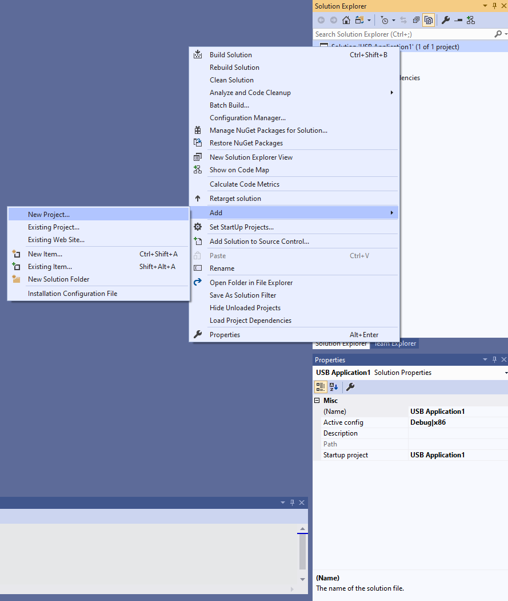

# Write a Windows desktop app based on the WinUSB template

The easiest way to write a Windows desktop app that communicates with a USB device, is by using the C/C++ WinUSB template. For this template, you need an integrated environment with the Windows Driver Kit (WDK) (with Debugging Tools for Windows) and Microsoft Visual Studio (Professional or Ultimate). You can use the template as a starting point.

## Prerequisites

- To set up the integrated development environment, first install Microsoft Visual Studio Ultimate 2019 or Microsoft Visual Studio Professional 2019 and then install the WDK. You can find information about how to set up Visual Studio and the WDK on the [WDK download page](../download-the-wdk.md).
- Debugging Tools for Windows are included when you install the WDK. For more information, see [Download and Install Debugging Tools for Windows](../debugger/index.md).

## Creating a WinUSB application

To create an application from the template:

1. In the **New Project** dialog box, in the search box at the top, type **USB.**
2. In the middle pane, select **WinUSB Application (Universal)**.
3. Select **Next**.
4. Enter a project name, choose a save location, and select **Create**.

    The following screenshots show the **New Project** dialog box for the **WinUSB Application (Universal)** template.

    

    

    This topic assumes that the name of the Visual Studio project is *USB Application1*.

    Visual Studio creates one project and a solution. You can see the solution, the project, and the files that belong to the project in the **Solution Explorer** window, as shown in the following screen shot. (If the **Solution Explorer** window is not visible, choose **Solution Explorer** from the **View** menu.) The solution contains a C++ application project named USB Application1.

    

    The USB Application1 project has source files for the application. If you want to look at the application source code, you can open any of the files that appear under **Source Files**.  

5. Add a driver package project to the solution. Select and hold (or right-click) the solution (Solution 'USB Application1'), then select **Add** \> **New Project** as shown in the following screenshot.

    

6. In the **New Project** dialog box, in the search box at the top, once again type **USB.**
7. In the middle pane, select **WinUSB INF Driver Package**.
8. Select **Next**.
9. Enter a project name, then select **Create**.

    The following screenshots show the **New Project** dialog box for the **WinUSB INF Driver Package** template.

    

    

    This topic assumes that the name of the Visual Studio project is *USB Application1 Package*.

    The USB Application1 Package project contains an INF file that is used to install Microsoft-provided Winusb.sys driver as the device driver.

    Your **Solution Explorer** should now contain both projects, as shown in the following screenshot.

    

10. In the INF file, USBApplication1.inf, locate this code:   `%DeviceName% =USB_Install, USB\VID_vvvv&PID_pppp`

11. Replace VID\_vvvv&PID\_pppp with the hardware ID for your device. Get the hardware ID from Device Manager. In Device Manager, view the device properties. On the **Details** tab, view the **Hardware Ids** property value.
12. In the **Solution Explorer** window, select and hold (or right-click) **Solution 'USB Application1' (2  of 2 projects)**, and choose **Configuration Manager**. Choose a configuration and platform for both the application project and the package project. In this exercise, we choose Debug and x64, as shown in the following screen shot.


## Building, deploying and debugging the project

So far in this exercise, you've used Visual Studio to create your projects. Next you need to configure the device to which the device is connected. The template requires that the Winusb driver is installed as the driver for your device.

Your testing and debugging environment can have:

- Two computer setup: the host computer and the target computer. You develop and build your project in Visual Studio on the host computer. The debugger runs on the host computer and is available in the Visual Studio user interface. When you test and debug the application, the driver runs on the target computer.

- Single computer setup: Your target and host run on one computer. You develop and build your project in Visual Studio, and run the debugger and the application.

You can deploy, install, load, and debug your application and the driver by following these steps:

- **Two computer setup**

  1. Provision your target computer by following the instructions in [Provision a computer for driver deployment and testing](../gettingstarted/provision-a-target-computer-wdk-8-1.md).
        **Note:**  Provisioning creates a user on the target machine named, WDKRemoteUser. After provisioning is complete you will see the user switch to WDKRemoteUser.
  2. On the host computer, open your solution in Visual Studio.
  3. In main.cpp add this line before the OpenDevice call.

  ```syntax
  system ("pause")
  ```

  The line causes the application to pause when launched. This is useful in remote debugging.
  
  4. In pch.h, include this line:

  ```syntax
  #include <cstdlib>
  ```

  This include statement is required for the `system()` call in the preceding step.

  5. In the **Solution Explorer** window, select and hold (or right-click) USB Application1 Package, and choose **Properties**.
  6. In the **USB Application1 Package Property Pages** window, in the left pane, navigate to **Configuration Properties &gt; Driver Install &gt; Deployment**, as shown in the following screen shot.
  7. Check **Remove previous driver versions before deployment**.
  8. For **Remote Computer Name**, select the name of the computer that you configured for testing and debugging. In this exercise, we use a computer named dbg-target.
  9. Select **Install/Reinstall and Verify**. Select **Apply**.

        

  10. In the property page, navigate to **Configuration Properties &gt; Debugging**, and select **Debugging Tools for Windows – Remote Debugger**, as shown in the following screen shot.

        

  11. Select **Build Solution** from the **Build** menu. Visual Studio displays build progress in the **Output** window. (If the **Output** window is not visible, choose **Output** from the **View** menu.) In this exercise, we've built the project for an x64 system running Windows 10.
  12. Select **Deploy Solution** from the **Build** menu.

On the target computer, you will see driver install scripts running. The driver files are copied to the %Systemdrive%\\drivertest\\drivers folder on the target computer. Verify that the .inf, .cat, test cert, and .sys files, and any other necessary files, are present %systemdrive%\\drivertest\\drivers folder. The device must appear in Device Manager without errors.

On the host computer, you will see this message in the **Output** window.

```syntax
Deploying driver files for project
"<path>\visual studio 14\Projects\USB Application1\USB Application1 Package\USB Application1 Package.vcxproj".  
Deployment may take a few minutes...
========== Build: 1 succeeded, 0 failed, 1 up-to-date, 0 skipped ==========
```

### To debug the application

1. On the host computer, navigate to **x64 &gt; Win8.1Debug** in the solution folder.
2. Copy the application executable, UsbApplication1.exe to the target computer.
3. On the target computer launch the application.
4. On the host computer, from the **Debug** menu, select **Attach to process**.
5. In the window, select **Windows User Mode Debugger** (Debugging Tools for Windows) as the transport and the name of the target computer, in this case dbg-target, as the qualifier as shown in this image.

    

6. Select the application from the list of **Available Processes** and select **Attach**. You can now debug using **Immediate Window** or by using the options in **Debug** menu.

The preceding instructions debug the application by using **Debugging Tools for Windows – Remote Debugger**. If you want to use the **Remote Windows Debugger** (the debugger that is included with Visual Studio), then follow these instructions:

1. On the target computer, add msvsmon.exe to the list of apps allowed through Firewall.
2. Launch Visual Studio Remote Debugging Monitor located in C:\\DriverTest\\msvsmon\\msvsmon.exe.
3. Create a working folder, such as, C:\\remotetemp.
4. Copy the application executable, UsbApplication1.exe to the working folder on the target computer.
5. On the host computer, in Visual Studio, right-click the **USB Application1 Package** project, and select **Unload Project**.
6. Select and hold (or right-click) the **USB Application1** project, in project properties expand the **Configuration Properties** node and select **Debugging**.
7. Change **Debugger to launch** to **Remote Windows Debugger**.
8. Change the project settings to run the executable on a remote computer by following the instructions given in [Remote Debugging of a Project Built Locally](/visualstudio/debugger/remote-debugging?view=vs-2015&preserve-view=true). Make sure that **Working Directory** and **Remote Command** properties reflect the folder on the target computer.
9. To debug the application, in the **Build** menu, select **Start Debugging**, or press **F5.**

- **Single computer setup:**

  1. To build your application and the driver installation package, choose **Build Solution** from the **Build** menu. Visual Studio displays build progress in the **Output** window. (If the **Output** window is not visible, choose **Output** from the **View** menu.) In this exercise, we've built the project for an x64 system running Windows 10.
  2. To see the built driver package, navigate in Windows Explorer to your USB Application1 folder, and then navigate to **x64 \> Debug \> USB Application1 Package**. The driver package contains several files: MyDriver.inf is an information file that Windows uses when you install the driver, mydriver.cat is a catalog file that the installer uses to verify the test signature for the driver package. These files are shown in the following screen shot.

        

        **Note**  There is no driver file included in the package. That is because the INF file references the in-box driver, Winusb.sys, found in Windows\\System32 folder.
  3. Manually install the driver. In Device Manager, update the driver by specifying the INF in the package. Point to the driver package located in the solution folder, shown in the preceding section. **Note** If you see the error `DriverVer set to a date in the future`, set **INF Package project settings > Inf2Cat > General > Use Local Time > Yes**.
  4. Select and hold (or right-click) the **USB Application1** project, in project properties expand the **Configuration Properties** node and select **Debugging**.
  5. Change **Debugger to launch** to **Local Windows Debugger**.
  6. Select and hold (or right-click) the USB Application1 Package project, and select **Unload Project**.
  7. To debug the application, in the **Build** menu, select **Start Debugging**, or press **F5**.

## Template code discussion

The template is a starting point for your desktop application. The USB Application1 project has source files device.cpp and main.cpp.

The main.cpp file contains the application entry point, \_tmain. The device.cpp contains all helper functions that open and close the handle to the device.

The template also has a header file named device.h. This file contains definitions for the device interface GUID (discussed later) and a DEVICE\_DATA structure that stores information obtained by the application. For example, it stores the WinUSB interface handle obtained by OpenDevice and used in subsequent operations.

```cpp
typedef struct _DEVICE_DATA {

    BOOL                    HandlesOpen;
    WINUSB_INTERFACE_HANDLE WinusbHandle;
    HANDLE                  DeviceHandle;
    TCHAR                   DevicePath[MAX_PATH];

} DEVICE_DATA, *PDEVICE_DATA;
```

### Getting the instance path for the device - see RetrieveDevicePath in device.cpp

To access a USB device, the application creates a valid file handle for the device by calling **CreateFile**. For that call, the application must obtain the device path instance. To obtain the device path, the app uses [SetupAPI](../install/setupapi.md) routines and specifies the device interface GUID in the INF file that was used to install Winusb.sys. Device.h declares a GUID constant named GUID\_DEVINTERFACE\_USBApplication1. By using those routines, the application enumerates all devices in the specified device interface class and retrieves the device path of the device.

```cpp
HRESULT
RetrieveDevicePath(
    _Out_bytecap_(BufLen) LPTSTR DevicePath,
    _In_                  ULONG  BufLen,
    _Out_opt_             PBOOL  FailureDeviceNotFound
    )
/*++

Routine description:

    Retrieve the device path that can be used to open the WinUSB-based device.

    If multiple devices have the same device interface GUID, there is no
    guarantee of which one will be returned.

Arguments:

    DevicePath - On successful return, the path of the device (use with CreateFile).

    BufLen - The size of DevicePath's buffer, in bytes

    FailureDeviceNotFound - TRUE when failure is returned due to no devices
        found with the correct device interface (device not connected, driver
        not installed, or device is disabled in Device Manager); FALSE
        otherwise.

Return value:

    HRESULT

--*/
{
    BOOL                             bResult = FALSE;
    HDEVINFO                         deviceInfo;
    SP_DEVICE_INTERFACE_DATA         interfaceData;
    PSP_DEVICE_INTERFACE_DETAIL_DATA detailData = NULL;
    ULONG                            length;
    ULONG                            requiredLength=0;
    HRESULT                          hr;

    if (NULL != FailureDeviceNotFound) {

        *FailureDeviceNotFound = FALSE;
    }

    //
    // Enumerate all devices exposing the interface
    //
    deviceInfo = SetupDiGetClassDevs(&GUID_DEVINTERFACE_USBApplication1,
                                     NULL,
                                     NULL,
                                     DIGCF_PRESENT | DIGCF_DEVICEINTERFACE);

    if (deviceInfo == INVALID_HANDLE_VALUE) {

        hr = HRESULT_FROM_WIN32(GetLastError());
        return hr;
    }

    interfaceData.cbSize = sizeof(SP_DEVICE_INTERFACE_DATA);

    //
    // Get the first interface (index 0) in the result set
    //
    bResult = SetupDiEnumDeviceInterfaces(deviceInfo,
                                          NULL,
                                          &GUID_DEVINTERFACE_USBApplication1,
                                          0,
                                          &interfaceData);

    if (FALSE == bResult) {

        //
        // We would see this error if no devices were found
        //
        if (ERROR_NO_MORE_ITEMS == GetLastError() &&
            NULL != FailureDeviceNotFound) {

            *FailureDeviceNotFound = TRUE;
        }

        hr = HRESULT_FROM_WIN32(GetLastError());
        SetupDiDestroyDeviceInfoList(deviceInfo);
        return hr;
    }

    //
    // Get the size of the path string
    // We expect to get a failure with insufficient buffer
    //
    bResult = SetupDiGetDeviceInterfaceDetail(deviceInfo,
                                              &interfaceData,
                                              NULL,
                                              0,
                                              &requiredLength,
                                              NULL);

    if (FALSE == bResult && ERROR_INSUFFICIENT_BUFFER != GetLastError()) {

        hr = HRESULT_FROM_WIN32(GetLastError());
        SetupDiDestroyDeviceInfoList(deviceInfo);
        return hr;
    }

    //
    // Allocate temporary space for SetupDi structure
    //
    detailData = (PSP_DEVICE_INTERFACE_DETAIL_DATA)
        LocalAlloc(LMEM_FIXED, requiredLength);

    if (NULL == detailData)
    {
        hr = E_OUTOFMEMORY;
        SetupDiDestroyDeviceInfoList(deviceInfo);
        return hr;
    }

    detailData->cbSize = sizeof(SP_DEVICE_INTERFACE_DETAIL_DATA);
    length = requiredLength;

    //
    // Get the interface's path string
    //
    bResult = SetupDiGetDeviceInterfaceDetail(deviceInfo,
                                              &interfaceData,
                                              detailData,
                                              length,
                                              &requiredLength,
                                              NULL);

    if(FALSE == bResult)
    {
        hr = HRESULT_FROM_WIN32(GetLastError());
        LocalFree(detailData);
        SetupDiDestroyDeviceInfoList(deviceInfo);
        return hr;
    }

    //
    // Give path to the caller. SetupDiGetDeviceInterfaceDetail ensured
    // DevicePath is NULL-terminated.
    //
    hr = StringCbCopy(DevicePath,
                      BufLen,
                      detailData->DevicePath);

    LocalFree(detailData);
    SetupDiDestroyDeviceInfoList(deviceInfo);

    return hr;
}
```

In the preceding function, the application gets the device path by calling these routines:

1. [**SetupDiGetClassDevs**](/windows/win32/api/setupapi/nf-setupapi-setupdigetclassdevsexa) to get a handle to the *device information set*, an array that contains information about all installed devices that matched the specified device interface class, GUID\_DEVINTERFACE\_USBApplication1. Each element in the array called a *device interface* corresponds to a device that is installed and registered with the system. The device interface class is identified by passing the device interface GUID that you defined in the INF file. The function returns an HDEVINFO handle to the device information set.
2. [**SetupDiEnumDeviceInterfaces**](/windows/win32/api/setupapi/nf-setupapi-setupdienumdeviceinterfaces) to enumerate the device interfaces in the device information set and obtain information about your device interface.

    This call requires the following items:

   - An initialized caller-allocated [**SP\_DEVICE\_INTERFACE\_DATA**](/windows/win32/api/setupapi/ns-setupapi-sp_device_interface_data) structure that has its **cbSize** member set to the size of the structure.
   - The HDEVINFO handle from step 1.
   - The device interface GUID that you defined in the INF file.

    [**SetupDiEnumDeviceInterfaces**](/windows/win32/api/setupapi/nf-setupapi-setupdienumdeviceinterfaces) looks up the device information set array for the specified index of the device interface and fills the initialized [**SP\_DEVICE\_INTERFACE\_DATA**](/windows/win32/api/setupapi/ns-setupapi-sp_device_interface_data) structure with basic data about the interface.

    **Note**   To enumerate all the device interfaces in the device information set, call [**SetupDiEnumDeviceInterfaces**](/windows/win32/api/setupapi/nf-setupapi-setupdienumdeviceinterfaces) in a loop until the function returns **FALSE** and the error code for the failure is ERROR\_NO\_MORE\_ITEMS. The ERROR\_NO\_MORE\_ITEMS error code can be retrieved by calling **GetLastError**. With each iteration, increment the member index.

    Alternately, you can call [**SetupDiEnumDeviceInfo**](/windows/win32/api/setupapi/nf-setupapi-setupdienumdeviceinfo) that enumerates the device information set and returns information about device interface elements, specified by the index, in a caller-allocated [**SP\_DEVINFO\_DATA**](/windows/win32/api/setupapi/ns-setupapi-sp_devinfo_data) structure. You can then pass a reference to this structure in the *DeviceInfoData* parameter of the [**SetupDiEnumDeviceInterfaces**](/windows/win32/api/setupapi/nf-setupapi-setupdienumdeviceinterfaces) function.

3. [**SetupDiGetDeviceInterfaceDetail**](/windows/win32/api/setupapi/nf-setupapi-setupdigetdeviceinterfacedetaila) to get detailed data for the device interface. The information is returned in a [**SP\_DEVICE\_INTERFACE\_DETAIL\_DATA**](/windows/win32/api/setupapi/ns-setupapi-sp_device_interface_detail_data_a) structure. Because the size of the **SP\_DEVICE\_INTERFACE\_DETAIL\_DATA** structure varies, **SetupDiGetDeviceInterfaceDetail** is called twice. The first call gets the buffer size to allocate for the **SP\_DEVICE\_INTERFACE\_DETAIL\_DATA** structure. The second call fills the allocated buffer with detailed information about the interface.
   1. Calls [**SetupDiGetDeviceInterfaceDetail**](/windows/win32/api/setupapi/nf-setupapi-setupdigetdeviceinterfacedetaila) with *DeviceInterfaceDetailData* parameter set to **NULL**. The function returns the correct buffer size in the *requiredlength* parameter. This call fails with the ERROR\_INSUFFICIENT\_BUFFER error code. This error code is expected.
   2. Allocates memory for a [**SP\_DEVICE\_INTERFACE\_DETAIL\_DATA**](/windows/win32/api/setupapi/ns-setupapi-sp_device_interface_detail_data_a) structure based on the correct buffer size that is retrieved in the *requiredlength* parameter.
   3. Calls [**SetupDiGetDeviceInterfaceDetail**](/windows/win32/api/setupapi/nf-setupapi-setupdigetdeviceinterfacedetaila) again and passes it a reference to the initialized structure in the *DeviceInterfaceDetailData* parameter. When the function returns, the structure is filled with detailed information about the interface. The device path is in the [**SP\_DEVICE\_INTERFACE\_DETAIL\_DATA**](/windows/win32/api/setupapi/ns-setupapi-sp_device_interface_detail_data_a) structure's **DevicePath** member.

### Creating a file handle for the device

See OpenDevice in device.cpp.

To interact with the device, the needs a WinUSB interface handle to the first (default) interface on the device. The template code obtains the file handle and the WinUSB interface handle and stores them in the DEVICE\_DATA structure.

```cpp
HRESULT
OpenDevice(
    _Out_     PDEVICE_DATA DeviceData,
    _Out_opt_ PBOOL        FailureDeviceNotFound
    )
/*++

Routine description:

    Open all needed handles to interact with the device.

    If the device has multiple USB interfaces, this function grants access to
    only the first interface.

    If multiple devices have the same device interface GUID, there is no
    guarantee of which one will be returned.

Arguments:

    DeviceData - Struct filled in by this function. The caller should use the
        WinusbHandle to interact with the device, and must pass the struct to
        CloseDevice when finished.

    FailureDeviceNotFound - TRUE when failure is returned due to no devices
        found with the correct device interface (device not connected, driver
        not installed, or device is disabled in Device Manager); FALSE
        otherwise.

Return value:

    HRESULT

--*/
{
    HRESULT hr = S_OK;
    BOOL    bResult;

    DeviceData->HandlesOpen = FALSE;

    hr = RetrieveDevicePath(DeviceData->DevicePath,
                            sizeof(DeviceData->DevicePath),
                            FailureDeviceNotFound);

    if (FAILED(hr)) {

        return hr;
    }

    DeviceData->DeviceHandle = CreateFile(DeviceData->DevicePath,
                                          GENERIC_WRITE | GENERIC_READ,
                                          FILE_SHARE_WRITE | FILE_SHARE_READ,
                                          NULL,
                                          OPEN_EXISTING,
                                          FILE_ATTRIBUTE_NORMAL | FILE_FLAG_OVERLAPPED,
                                          NULL);

    if (INVALID_HANDLE_VALUE == DeviceData->DeviceHandle) {

        hr = HRESULT_FROM_WIN32(GetLastError());
        return hr;
    }

    bResult = WinUsb_Initialize(DeviceData->DeviceHandle,
                                &DeviceData->WinusbHandle);

    if (FALSE == bResult) {

        hr = HRESULT_FROM_WIN32(GetLastError());
        CloseHandle(DeviceData->DeviceHandle);
        return hr;
    }

    DeviceData->HandlesOpen = TRUE;
    return hr;
}
```

1. The app calls **CreateFile** to create a file handle for the device by specifying the device path retrieved earlier. It uses the FILE\_FLAG\_OVERLAPPED flag because WinUSB depends on this setting.
2. By using the file handle for the device, the app creates a WinUSB interface handle. [WinUSB Functions](/previous-versions/windows/hardware/drivers/ff540046(v=vs.85)#winusb) use this handle to identify the target device instead of the file handle. To obtain a WinUSB interface handle, the app calls [**WinUsb\_Initialize**](/windows/win32/api/winusb/nf-winusb-winusb_initialize) by passing the file handle. Use the received handle in the subsequent calls to get information from the device, and to send I/O requests to the device.

### Release the device handles - see CloseDevice in device.cpp

The template code implements code to release the file handle and the WinUSB interface handle for the device.

- **CloseHandle** to release the handle that was created by **CreateFile**, as described in the [Create a File Handle for the Device](#creating-a-file-handle-for-the-device) section of this walkthrough.
- [**WinUsb\_Free**](/windows/win32/api/winusb/nf-winusb-winusb_free) to release the WinUSB interface handle for the device, which is returned by [**WinUsb\_Initialize**](/windows/win32/api/winusb/nf-winusb-winusb_initialize).

```cpp
VOID
CloseDevice(
    _Inout_ PDEVICE_DATA DeviceData
    )
/*++

Routine description:

    Perform required cleanup when the device is no longer needed.

    If OpenDevice failed, do nothing.

Arguments:

    DeviceData - Struct filled in by OpenDevice

Return value:

    None

--*/
{
    if (FALSE == DeviceData->HandlesOpen) {

        //
        // Called on an uninitialized DeviceData
        //
        return;
    }

    WinUsb_Free(DeviceData->WinusbHandle);
    CloseHandle(DeviceData->DeviceHandle);
    DeviceData->HandlesOpen = FALSE;

    return;
}
```

## Next steps

Next, read these topics to send get device information and send data transfers to the device:

- [Access a USB Device by Using WinUSB Functions](using-winusb-api-to-communicate-with-a-usb-device.md)

    Learn about querying the device for USB-specific information such as device speed, interface descriptors, related endpoints, and their pipes.

- [Send USB isochronous transfers from a WinUSB desktop app](getting-set-up-to-use-windows-devices-usb.md)

    Transfer data to and from isochronous endpoints of a USB device.

## Related topics

[Windows desktop app for a USB device](windows-desktop-app-for-a-usb-device.md)  
[Provision a computer for driver deployment and testing](../gettingstarted/provision-a-target-computer-wdk-8-1.md)