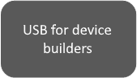

# Universal Serial Bus (USB)

Universal Serial Bus (USB) provides an expandable, hot-pluggable Plug and Play serial interface that ensures a standard, low-cost connection for peripheral devices such as keyboards, mice, joysticks, printers, scanners, storage devices, modems, and video conferencing cameras. Migration to USB is recommended for all peripheral devices that use legacy ports such as PS/2, serial, and parallel ports.

The USB-IF is a Special Interest Groups (SIGs) that maintains the [Official USB Specification](https://www.usb.org/documents), test specifications and tools.

Windows operating systems include native support for USB host controllers, hubs, and devices and systems that comply with the official USB specification. Windows also provides programming interfaces that you can use to develop [device drivers](usb-driver-development-guide.md) and [applications](developing-windows-applications-that-communicate-with-a-usb-device.md) that communicate with a USB device.

<table>
<colgroup>
<col width="50%" />
<col width="50%" />
</colgroup>
<tbody>
<tr class="odd">
<td><strong>USB in Windows</strong>

<a href="windows-10--what-s-new-for-usb.md" data-raw-source="[Windows 10: What's new for USB](windows-10--what-s-new-for-usb.md)">Windows 10: What's new for USB</a>

Overview of new features and improvements in USB in Windows 10.

<a href="usb-faq--introductory-level.yml" data-raw-source="[USB FAQ](usb-faq--introductory-level.yml)">USB FAQ</a>

Frequently asked questions from driver developers about the USB stack and features that are supported in USB.

<a href="microsoft-defined-usb-descriptors.md" data-raw-source="[Microsoft OS Descriptors for USB Devices](microsoft-defined-usb-descriptors.md)">Microsoft OS Descriptors for USB Devices</a>

Windows defines MS OS descriptors that allows better enumeration when connected to system running Windows operating system

<strong>Microsoft-provided USB drivers</strong>

<a href="usb-device-side-drivers-in-windows.md" data-raw-source="[USB device-side drivers in Windows](usb-device-side-drivers-in-windows.md)">USB device-side drivers in Windows</a>

A set of drivers for handling common function logic for USB devices.

<a href="usb-3-0-driver-stack-architecture.md" data-raw-source="[USB host-side drivers in Windows](usb-3-0-driver-stack-architecture.md)">USB host-side drivers in Windows</a>

Microsoft provides a core stack of drivers that interoperate with devices that are connected to EHCI and xHCI controllers.

<a href="supported-usb-classes.md" data-raw-source="[USB-IF device class drivers](supported-usb-classes.md)">USB-IF device class drivers</a>

Windows provides in-box device class drivers for many USB-IF approved device classes, audio, mass storage, and so on.

<a href="winusb.md" data-raw-source="[USB generic function driver–WinUSB](winusb.md)">USB generic function driver–WinUSB</a>

Windows provides Winusb.sys that can be loaded as a function driver for a custom device and a function of a composite device.

<a href="usb-common-class-generic-parent-driver.md" data-raw-source="[USB generic parent driver for composite devices–Usbccgp](usb-common-class-generic-parent-driver.md)">USB generic parent driver for composite devices–Usbccgp</a>

Parent driver for USB devices with multiple functions. Usbccgp creates physical device objects (PDOs) for each of those functions. Those individual PDOs are managed by their respective USB function drivers, which could be the Winusb.sys driver or a USB device class driver.

<strong>WDF extension for developing USB drivers</strong>
<ul>
<li>USB connector manager class extension (UcmCx) reference
    <ul>
    <li><a href="/windows-hardware/drivers/ddi/ucmmanager/" data-raw-source="[Ucmmanager.h](/windows-hardware/drivers/ddi/ucmmanager/)">Ucmmanager.h</a>
    </li>
    </ul>
</li>
<li>USB host controller (UCX) reference
    <ul>
    <li>
    <a href="/windows-hardware/drivers/ddi/ucxclass/" data-raw-source="[Ucxclass.h](/windows-hardware/drivers/ddi/ucxclass/)">Ucxclass.h</a>
    </li>
    <li>
    <a href="/windows-hardware/drivers/ddi/ucxcontroller/" data-raw-source="[Ucxcontroller.h](/windows-hardware/drivers/ddi/ucxcontroller/)">Ucxcontroller.h</a>
    </li>
    <li>
    <a href="/windows-hardware/drivers/ddi/ucxroothub/" data-raw-source="[Ucxroothub.h](/windows-hardware/drivers/ddi/Ucxroothub/)">Ucxroothub.h</a>
    </li>
    <li>
    <a href="/windows-hardware/drivers/ddi/ucxusbdevice/" data-raw-source="[Ucxusbdevice.h](/windows-hardware/drivers/ddi/ucxusbdevice/)">Ucxusbdevice.h</a>
    </li>
    <li>
    <a href="/windows-hardware/drivers/ddi/ucxendpoint/" data-raw-source="[Ucxendpoint.h](/windows-hardware/drivers/ddi/ucxendpoint/)">Ucxendpoint.h</a>
    </li>
    <li>
    <a href="/windows-hardware/drivers/ddi/ucxsstreams/" data-raw-source="[Ucxsstreams.h](/windows-hardware/drivers/ddi/ucxsstreams/)">Ucxsstreams.h</a>
    </li>
    </ul>
</li>
<li>USB function class extension (UFX) reference
    <ul>
    <li>
    <a href="/windows-hardware/drivers/ddi/ufxbase/" data-raw-source="[Ufxbase.h](/windows-hardware/drivers/ddi/ufxbase/)">Ufxbase.h</a>
    </li>
    <li>
    <a href="/windows-hardware/drivers/ddi/ufxclient/" data-raw-source="[Ufxclient.h](/windows-hardware/drivers/ddi/ufxclient/)">Ufxclient.h</a>
    </li>
    <li>
    <a href="/windows-hardware/drivers/ddi/ufxproprietarycharger/" data-raw-source="[Ufxproprietarycharger.h](/windows-hardware/drivers/ddi/ufxproprietarycharger/)">Ufxproprietarycharger.h</a>
    </li>
    </ul>
</li>
</ul>
<strong>Testing USB devices with Windows</strong>

[Overview of Microsoft USB Test Tool (MUTT) devices](./microsoft-usb-test-tool--mutt--devices.md)

Get information about the tools that you can use to test your USB hardware or software, capture traces of operations and other system events, and observe how the USB driver stack responds to a request sent by a client driver or an application.

Read an overview of tests in the Hardware Certification Kit that enable hardware vendors and device manufacturers to prepare their USB devices and host controllers for Windows Hardware Certification submission.

<strong>Other Resources for USB</strong>

<a href="https://www.usb.org/documents" data-raw-source="[Official USB Specification](https://www.usb.org/documents)">Official USB Specification</a>

Provides complete technical details for the USB protocol.

<a href="https://techcommunity.microsoft.com/t5/Microsoft-USB-Blog/bg-p/MicrosoftUSBBlog" data-raw-source="[Microsoft Windows USB Core Team Blog](https://techcommunity.microsoft.com/t5/Microsoft-USB-Blog/bg-p/MicrosoftUSBBlog)">Microsoft Windows USB Core Team Blog</a>

Check out posts written by the Microsoft USB Team. The blog focuses on the Windows USB driver stack that works with various USB Host controllers and USB hubs found in Windows PC. A useful resource for USB client driver developers and USB hardware designers understand the driver stack implementation, resolve common issues, and explain how to use tools for gathering traces and log files.

<a href="https://community.osr.com/categories/ntdev" data-raw-source="[OSR Online Lists - ntdev](https://community.osr.com/categories/ntdev)">OSR Online Lists - ntdev</a>

Discussion list managed by <a href="https://www.osronline.com/index.cfm" data-raw-source="[OSR Online](https://www.osronline.com/index.cfm)">OSR Online</a> for kernel-mode driver developers.

<a href="https://msdn.microsoft.com/windows/hardware/" data-raw-source="[Windows Dev-Center for Hardware Development](https://msdn.microsoft.com/windows/hardware/)">Windows Dev-Center for Hardware Development</a>

Miscellaneous resources based on frequently asked questions from developers who are new to developing USB devices and drivers that work with Windows operating systems.

<strong>USB-related videos</strong>

<a href="https://channel9.msdn.com/Events/Build/2013/3-924a" data-raw-source="[UWP apps for USB devices](https://channel9.msdn.com/Events/Build/2013/3-924a)">UWP apps for USB devices</a>
<a href="https://channel9.msdn.com/events/BUILD/BUILD2011/HW-256T" data-raw-source="[Understanding USB 3.0 in Windows 8](https://channel9.msdn.com/events/BUILD/BUILD2011/HW-256T)">Understanding USB 3.0 in Windows 8</a>
<a href="https://channel9.msdn.com/events/BUILD/BUILD2011/HW-773T" data-raw-source="[Building great USB 3.0 devices](https://channel9.msdn.com/events/BUILD/BUILD2011/HW-773T)">Building great USB 3.0 devices</a>
<a href="https://channel9.msdn.com/events/BUILD/BUILD2011/HW-258P" data-raw-source="[USB Debugging Innovations in Windows 8 (Part I, II, & III)](https://channel9.msdn.com/events/BUILD/BUILD2011/HW-258P)">USB Debugging Innovations in Windows 8 (Part I, II, & III)</a>

<strong>USB hardware for learning</strong>

<a href="microsoft-usb-test-tool--mutt--devices.md" data-raw-source="[MUTT devices](microsoft-usb-test-tool--mutt--devices.md)">MUTT devices</a>

MUTT and SuperMUTT devices and the accompanying software package are integrated into the HCK suite of USB tests. They provide automated testing that can be used during the development cycle of USB controllers, devices and systems, especially stress testing.

<a href="https://www.osronline.com/index.cfm" data-raw-source="[OSR USB FX2 Learning Kit](https://www.osronline.com/index.cfm)">OSR USB FX2 Learning Kit</a>

If you are new to USB driver development. The kit is the most suitable to study USB samples included in this documentation set. You can get the learning kit from OSR Online Store.
</td>
<td><strong>Write a USB client driver (KMDF, UMDF)</strong>

Introduces you to USB driver development. Provides information about choosing the most appropriate model for providing a USB driver for your device. This section also includes tutorials about writing your first user-mode and kernel-mode USB drivers by using the USB templates included with Microsoft Visual Studio.

<a href="getting-started-with-usb-client-driver-development.md" data-raw-source="[Getting started with USB client driver development](getting-started-with-usb-client-driver-development.md)">Getting started with USB client driver development</a>

<a href="/windows-hardware/drivers/ddi/_usbref/" data-raw-source="[USB device driver programming reference](/windows-hardware/drivers/ddi/_usbref/)">USB device driver programming reference</a>

<strong>Write a USB host controller driver</strong>

If you are developing an xHCI host controller that is not compliant with the specification or developing a custom non-xHCI hardware (such as a virtual host controller), you can write a host controller driver that communicates with UCX. For example, consider a wireless dock that supports USB devices. The PC communicates with USB devices through the wireless dock by using USB over TCP as a transport.

<a href="developing-windows-drivers-for-usb-host-controllers.md" data-raw-source="[Developing Windows drivers for USB host controllers](developing-windows-drivers-for-usb-host-controllers.md)">Developing Windows drivers for USB host controllers</a>

<ul>
<li>USB host controller (UCX) reference
    <ul>
    <li>
    <a href="/windows-hardware/drivers/ddi/ucxclass/" data-raw-source="[Ucxclass.h](/windows-hardware/drivers/ddi/ucxclass/)">Ucxclass.h</a>
    </li>
    <li>
    <a href="/windows-hardware/drivers/ddi/ucxcontroller/" data-raw-source="[Ucxcontroller.h](/windows-hardware/drivers/ddi/ucxcontroller/)">Ucxcontroller.h</a>
    </li>
    <li>
    <a href="/windows-hardware/drivers/ddi/ucxroothub/" data-raw-source="[Ucxroothub.h](/windows-hardware/drivers/ddi/Ucxroothub/)">Ucxroothub.h</a>
    </li>
    <li>
    <a href="/windows-hardware/drivers/ddi/ucxusbdevice/" data-raw-source="[Ucxusbdevice.h](/windows-hardware/drivers/ddi/ucxusbdevice/)">Ucxusbdevice.h</a>
    </li>
    <li>
    <a href="/windows-hardware/drivers/ddi/ucxendpoint/" data-raw-source="[Ucxendpoint.h](/windows-hardware/drivers/ddi/ucxendpoint/)">Ucxendpoint.h</a>
    </li>
    <li>
    <a href="/windows-hardware/drivers/ddi/ucxsstreams/" data-raw-source="[Ucxsstreams.h](/windows-hardware/drivers/ddi/ucxsstreams/)">Ucxsstreams.h</a>
    </li>
    </ul>
</li>
</ul>

<strong>Write a function controller driver for a USB device</strong>

You can develop a controller driver that handles all USB data transfers and commands sent by the host to the device. This driver communicates with the Microsoft-provided USB function controller extension (UFX).

<a href="developing-windows-drivers-for-usb-function-controllers.md" data-raw-source="[Developing Windows drivers for USB function controllers](developing-windows-drivers-for-usb-function-controllers.md)">Developing Windows drivers for USB function controllers</a>

USB function class extension (UFX) reference
    <ul>
    <li>
    <a href="/windows-hardware/drivers/ddi/ufxbase/" data-raw-source="[Ufxbase.h](/windows-hardware/drivers/ddi/ufxbase/)">Ufxbase.h</a>
    </li>
    <li>
    <a href="/windows-hardware/drivers/ddi/ufxclient/" data-raw-source="[Ufxclient.h](/windows-hardware/drivers/ddi/ufxclient/)">Ufxclient.h</a>
    </li>
    <li>
    <a href="/windows-hardware/drivers/ddi/ufxproprietarycharger/" data-raw-source="[Ufxproprietarycharger.h](/windows-hardware/drivers/ddi/ufxproprietarycharger/)">Ufxproprietarycharger.h</a>
    </li>
    </ul>

<strong>Write a USB Type-C connector driver</strong>

Windows 10 introduces support for the new USB connector: USB Type-C. You can write a driver for the connector that communicates with the Microsoft-provided class extension module: UcmCx to handle scenarios related to Type-C connectors such as, which ports support Type-C, which ports support power delivery.

<a href="developing-windows-drivers-for-usb-type-c-connectors.md" data-raw-source="[Developing Windows drivers for USB Type-C connectors](developing-windows-drivers-for-usb-type-c-connectors.md)">Developing Windows drivers for USB Type-C connectors</a>

USB connector manager class extension (UcmCx) reference
    <ul>
    <li><a href="/windows-hardware/drivers/ddi/ucmmanager/" data-raw-source="[Ucmmanager.h](/windows-hardware/drivers/ddi/ucmmanager/)">Ucmmanager.h</a>
    </li>
    </ul>

<strong>Write a USB dual-role controller driver</strong>

USB Dual Role controllers are now supported in Windows 10. Windows includes in-box client drivers for ChipIdea and Synopsys controllers. For other controllers, Microsoft provides a set of programming interfaces that allow the dual-role class extension (UrsCx) and its client driver to communicate with each other to handle the role-switching capability of a dual-role controller.

For more information about this feature, see:

<a href="usb-dual-role-driver-stack-architecture.md" data-raw-source="[USB Dual Role Driver Stack Architecture](usb-dual-role-driver-stack-architecture.md)">USB Dual Role Driver Stack Architecture</a>

USB dual-role controller driver programming reference
    <ul>
    <li><a href="/windows-hardware/drivers/ddi/ursdevice/" data-raw-source="[Ursdevice.h](/windows-hardware/drivers/ddi/ursdevice/)">Ursdevice.h</a>
    </li>
    </ul>

<strong>Write a USB driver for emulated devices</strong>

Windows 10 introduces support for emulated devices. Now you can develop an emulated Universal Serial Bus (USB) host controller driver and a connected virtual USB device. Both components are combined into a single KMDF driver that communicates with the Microsoft-provided USB device emulation class extension (UdeCx).

<a href="developing-windows-drivers-for-emulated-usb-host-controllers-and-devices.md" data-raw-source="[Developing Windows drivers for emulated USB devices (UDE)](developing-windows-drivers-for-emulated-usb-host-controllers-and-devices.md)">Developing Windows drivers for emulated USB devices (UDE)</a>

Emulated USB host controller driver programming reference
    <ul>
    <li><a href="/windows-hardware/drivers/ddi/udecxusbdevice/" data-raw-source="[Udecxusbdevice.h](/windows-hardware/drivers/ddi/udecxusbdevice/)">Udecxusbdevice.h</a>
    </li>
    <li><a href="/windows-hardware/drivers/ddi/udecxusbendpoint/" data-raw-source="[Udecxusbendpoint.h](/windows-hardware/drivers/ddi/udecxusbendpoint/)">Udecxusbendpoint.h</a>
    </li>
    <li><a href="/windows-hardware/drivers/ddi/udecxwdfdevice/" data-raw-source="[Udecxwdfdevice.h](/windows-hardware/drivers/ddi/udecxwdfdevice/)">Udecxwdfdevice.h</a>
    </li>
    <li><a href="/windows-hardware/drivers/ddi/udecxurb/" data-raw-source="[Udecxurb.h](/windows-hardware/drivers/ddi/udecxurb/)">Udecxurb.h</a>
    </li>
    </ul>

<strong>Write a UWP app</strong>

Provides step-by-step instructions about implementing USB features in a UWP app. To write such an app for a USB device you need Visual Studio and Microsoft Windows Software Development Kit (SDK) .

<a href="talking-to-usb-devices-start-to-finish.md" data-raw-source="[Talk to USB devices, start to finish](talking-to-usb-devices-start-to-finish.md)">Talk to USB devices, start to finish</a>

<a href="/uwp/api/Windows.Devices.Usb" data-raw-source="[&lt;strong&gt;Windows.Devices.Usb&lt;/strong&gt;](/uwp/api/Windows.Devices.Usb)"><strong>Windows.Devices.Usb</strong></a>

<strong>Write a Windows desktop app</strong>

Describes how an application can call WinUSB Functions to communicate with a USB device.

<a href="how-to-write-a-windows-desktop-app-that-communicates-with-a-usb-device.md" data-raw-source="[Write a WinUSB application](how-to-write-a-windows-desktop-app-that-communicates-with-a-usb-device.md)">Write a WinUSB application</a>

WinUSB functions
    <ul>
    <li><a href="/windows/win32/api/winusb/" data-raw-source="[Winusb.h](/windows/win32/api/winusb/)">Winusb.h</a>
    </li>
    <li><a href="/windows-hardware/drivers/ddi/usbioctl/" data-raw-source="[Usbioctl.h](/windows-hardware/drivers/ddi/usbioctl/)">Usbioctl.h</a>
    </li>
    </ul>

<a href="wdk-resources-for-usb-driver-development.md" data-raw-source="[Common programming scenarios](wdk-resources-for-usb-driver-development.md)">Common programming scenarios</a>

List of common tasks that a driver or an app performs in order to communicate with a USB device. Get quick info about the programming interfaces you need for each task.

<strong>USB samples</strong>

<a href="https://github.com/Microsoft/Windows-universal-samples" data-raw-source="[UWP app samples for USB](https://github.com/Microsoft/Windows-universal-samples)">UWP app samples for USB</a>

<a href="https://go.microsoft.com/fwlink/p/?linkid=618021" data-raw-source="[Windows driver samples for USB](https://go.microsoft.com/fwlink/p/?linkid=618021)">Windows driver samples for USB</a>

<strong>Development tools</strong>

<a href="/windows-hardware/drivers/download-the-wdk" data-raw-source="[Download kits and tools for Windows]( ../download-the-wdk.md)">Download kits and tools for Windows</a></td>
</tr>
</tbody>
</table>