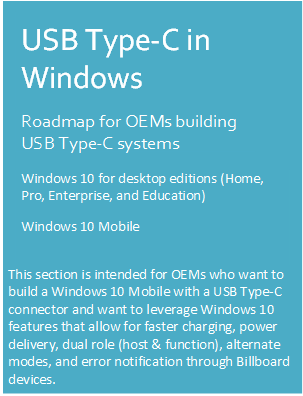
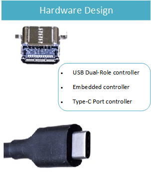
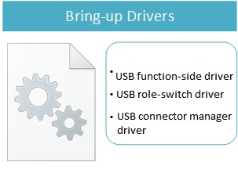

# Windows support for USB Type-C connectors

**Last Updated**

-   December 2016

**Official specifications**

-   [USB 3.1 and USB Type-C specifications](http://go.microsoft.com/fwlink/p/?LinkId=699515)
-   [USB Power Delivery](http://go.microsoft.com/fwlink/p/?LinkID=623310)
-   [Billboard Devices specification](http://go.microsoft.com/fwlink/p/?linkid=620207)
-   [UCSI Specification](http://go.microsoft.com/fwlink/p/?LinkId=703713)

**Windows support**

-   USB Type-C feature support in Windows
-   [FAQ: USB Type-C connector on a Windows system](faq--usb-type-c-connector-on-a-windows-system.md)
-   [Troubleshoot messages in UI](http://go.microsoft.com/fwlink/?LinkId=526894)

Describes Windows support for USB Type-C connector and tasks for OEMs who are building USB Type-C systems, including how to write drivers that manage different features of the connector.

A traditional USB connection uses a cable with a USB A and USB B connector on each end. The USB A connector always plugs in to the host side and the USB B connector connects the function side, which is a device (phone) or peripheral (mouse, keyboard). By using those connectors, you can only connect a host to a function; never a host to another host or a function to another function. The host is the power source provider and the function consumes power from the host.

The traditional configuration limits some scenarios. For example, if a mobile device wants to connect to a peripheral, the device must act as the host and deliver power to the connected device.

The USB Type-C connector, introduced by the USB-IF, defined in the USB 3.1 specification, addresses those limitations. Windows 10 introduces native support for those features.

<table>
<colgroup>
<col width="50%" />
<col width="50%" />
</colgroup>
<tbody>
<tr class="odd">
<td>

</td>
<td>

USB Type-C connector is reversible and symmetric.

Allows for faster charging up to 100W with Power Delivery over USB Type-C.

Single connector for both USB Hosts and USB Devices

Can switch USB roles to support a USB host or device.

Can switch power roles between sourcing and sinking power

Supports other protocols like DisplayPort and Thunderbolt over USB Type-C.

Introduces USB Billboard device class to provide error notifications for Alternate Modes.
</td>
</tr>
<tr class="even">
<td></td>
<td>
The main component are: the USB Type-C connector and its port or PD controller that manages the CC pin logic for the connector. Such systems typically have a dual-role controller that can swap the USB role from host to function. It has Display-Out module that allows video signal to be transmitted over USB. Optionally it can support BC1.2 charger detection.

[Hardware design of a USB Type-C system](architecture--usb-type-c-in-a-windows-system.md)

[Hardware design for a USB Type-C system with an embedded controller](ucsi.md)

Consider recommendations for the design and development of USB components, including minimum hardware requirements, Windows Hardware Compatibility Program requirements, and other recommendations that build on those requirements.

[Hardware component guidelines USB](https://msdn.microsoft.com/library/windows/hardware/dn915125)
</td>
</tr>
<tr class="odd">
<td></td>
<td><ul>

Use this flow chart to determine a solution for your USB Type-C system. 

<li>
For a system that does not implement a PD state machine, implement a client driver to the UcmTcpciCx class extension. 

[UCmCx client driver programming reference](https://msdn.microsoft.com/library/windows/hardware/mt188011)

[Write a USB Type-C port controller driver](write-a-usb-type-c-port-controller-driver.md)

</li>

<li>For systems that implement the PD state machines in hardware or firmware and support USB Type-C Connector System Software Interface (UCSI) over ACPI, load the Microsoft provided in-box driver, UcmUcsi.sys. 

See [UCSI driver](ucsi.md).</li>

<li>
For systems that implement the PD state machines in hardware or firmware, but either do not support UCSI, or support UCSI but require a transport other than ACPI, write a client driver for the UcmCx class extension.

For systems that implement UCSI but require a transport other than ACPI, Microsoft provides a skeleton UcmCx client driver based on the inbox UCSI driver that can be modified to support a different transport. 

See [this sample template](https://github.com/Microsoft/Windows-driver-samples/tree/master/usb/UcmCxUcsi). 

</li>

[Write a USB Type-C connector driver](bring-up-a-usb-type-c-connector-on-a-windows-system.md)

[UcmCx client driver programming reference](https://msdn.microsoft.com/library/windows/hardware/mt188011)</li>
</ul></td>
</tr>
<tr class="even">
<td></td>
<td><ol>

<li>USB Function driver bring-up is only required if you support USB Function mode. If you previously implemented a USB Function driver for a USB micro-B connector, describe the appropriate connectors as USB Type-C in the ACPI tables for the USB Function driver to continue working. 

For more information, see [instructions about writing a USB Function driver.](developing-windows-drivers-for-usb-function-controllers.md).
</li>
<li>USB Role-Switch driver bring-up is only required for devices that have a Dual Role controller that assumes both Host and Function roles. To bring-up the USB Role-Switch driver, you need to modify the ACPI tables to enable the Microsoft in-box USB role-switch driver. 

For more information, see the [guidance for bringing up the USB Role Switch Driver](dual-role-controller-bringup-for-a-usb-type-c-system.md).</li>

<li>
A USB Connector Manager Driver is required for Windows to manage the USB Type-C ports on a system. The bring-up tasks for a USB Connector Manager driver depend on the driver that you choose for the USB Type-C ports: The Microsoft in-box UCSI (UcmUcsi.sys) driver, a UcmCx client driver, or a UcmTcpciCx client driver. For more information, see the links in the preceding section that describe how to choose the right solution for your USB Type-C system.
</li>
<ul>
</ul></li>
</ol></td>
</tr>
<tr class="odd">
<td></td>
<td><ul>
<li>
Perform various functional and stress tests on systems and devices that expose a USB Type-C connector.

[Test USB Type-C systems with USB Type-C ConnEx](test-usb-type-c-systems-with-mutt-connex-c.md)</li>
<li>Run USB tests included in the Windows Hardware Lab Kit (HLK) for Windows 10.

<strong>Note</strong>  Run USB function HLK tests with a C-to-A cable (searc for <strong>&quot;Windows USB Device&quot;</strong> in the HLK search box.

 

</li>
<li>
Certification/Compliance

Attend Power Delivery and USB Type-C compliance workshops hosted by the standards bodies.
</li>
</ul></td>
</tr>
</tbody>
</table>

 

 

 

--------------------
[Send comments about this topic to Microsoft](mailto:wsddocfb@microsoft.com?subject=Documentation%20feedback%20%5Busbcon\buses%5D:%20Windows%20support%20for%20USB%20Type-C%20connectors%20%20RELEASE:%20%281/26/2017%29&body=%0A%0APRIVACY%20STATEMENT%0A%0AWe%20use%20your%20feedback%20to%20improve%20the%20documentation.%20We%20don't%20use%20your%20email%20address%20for%20any%20other%20purpose,%20and%20we'll%20remove%20your%20email%20address%20from%20our%20system%20after%20the%20issue%20that%20you're%20reporting%20is%20fixed.%20While%20we're%20working%20to%20fix%20this%20issue,%20we%20might%20send%20you%20an%20email%20message%20to%20ask%20for%20more%20info.%20Later,%20we%20might%20also%20send%20you%20an%20email%20message%20to%20let%20you%20know%20that%20we've%20addressed%20your%20feedback.%0A%0AFor%20more%20info%20about%20Microsoft's%20privacy%20policy,%20see%20http://privacy.microsoft.com/default.aspx. "Send comments about this topic to Microsoft")

