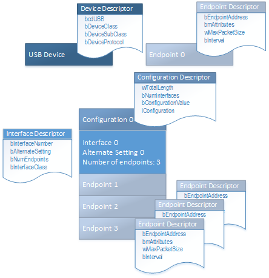

# Standard USB descriptors


**Summary**

-   Types of USB descriptors
-   Microsoft-provided programming interfaces for USB retrieving descriptors

**Important APIs**

-   See reference tables included in this topic.

A USB device provides information about itself in data structures called *USB descriptors*. This section provides information about device, configuration, interface, and endpoint descriptors and ways to retrieve them from a USB device.

## USB Descriptors mapped to device layout


The host software obtains descriptors from an attached device by sending various standard control requests to the default endpoint(Get Descriptor requests, see USB specification section 9.4.3). Those requests specify the type of descriptor to retrieve. In response to such requests, the device sends descriptors that include information about the device, its configurations, interfaces and the related endpoints. *Device descriptors* contain information about the whole device. *Configuration descriptors* contain information about each device configuration. *String descriptors* contain Unicode text strings.

Every USB device exposes a device descriptor that indicates the device’s class information, vendor and product identifiers, and number of configurations. Each configuration exposes it's configuration descriptor that indicates number of interfaces and power characteristics. Each interface exposes an interface descriptor for each of its alternate settings that contains information about the class and the number of endpoints. Each endpoint within each interface exposes endpoint descriptors that indicate the endpoint type and the maximum packet size.

For example, let's consider the OSR FX2 board device layout (see USB device layout). At device level, the device exposes a device descriptor and an endpoint descriptor for the default endpoint. At configuration level, the device exposes a configuration descriptor for Configuration 0. At interface level, it exposes one interface descriptor for Alternate Setting 0. At the endpoint level, it exposes three endpoint descriptors.



## USB device descriptor


Every Universal Serial Bus (USB) device must be able to provide a single device descriptor that contains relevant information about the device. Windows uses that information to derive various sets of information. For example, the **idVendor** and **idProduct** fields specify vendor and product identifiers, respectively. Windows uses those field values to construct a hardware ID for the device. To view the hardware ID of a particular device, open Device Manager and view device properties. In the **Details** tab, the **Hardware Ids** property value indicates the hardware ID ("USB\\XXX") that is generated by Windows. The **bcdUSB** field indicates the version of the USB specification to which the device conforms. For example, 0x0200 indicates that the device is designed as per the USB 2.0 specification. The **bcdDevice** value indicates the device-defined revision number. The USB driver stack uses **bcdDevice**, along with **idVendor** and **idProduct**, to generate hardware and compatible IDs for the device. You can view the those identifiers in Device Manager. The device descriptor also indicates the total number of configurations that the device supports.

The host obtains the device descriptor through a control transfer. Microsoft provides programming interfaces to obtain the descriptor.

<table>
<colgroup>
<col width="50%" />
<col width="50%" />
</colgroup>
<thead>
<tr class="header">
<th>If you are writing a...</th>
<th>Call...</th>
</tr>
</thead>
<tbody>
<tr class="odd">
<td>UWP app that uses <a href="https://msdn.microsoft.com/library/windows/apps/dn278466" data-raw-source="[&lt;strong&gt;Windows.Devices.Usb&lt;/strong&gt;](https://msdn.microsoft.com/library/windows/apps/dn278466)"><strong>Windows.Devices.Usb</strong></a></td>
<td><a href="https://msdn.microsoft.com/library/windows/apps/dn264002" data-raw-source="[&lt;strong&gt;UsbDevice.DeviceDescriptor&lt;/strong&gt;](https://msdn.microsoft.com/library/windows/apps/dn264002)"><strong>UsbDevice.DeviceDescriptor</strong></a></td>
</tr>
<tr class="even">
<td>Win32 desktop app that uses <a href="https://msdn.microsoft.com/library/windows/hardware/ff540046#winusb" data-raw-source="[WinUSB Functions](https://msdn.microsoft.com/library/windows/hardware/ff540046#winusb)">WinUSB Functions</a></td>
<td><a href="https://msdn.microsoft.com/library/windows/hardware/ff540257" data-raw-source="[&lt;strong&gt;WinUsb_GetDescriptor&lt;/strong&gt;](https://msdn.microsoft.com/library/windows/hardware/ff540257)"><strong>WinUsb_GetDescriptor</strong></a></td>
</tr>
<tr class="odd">
<td>UMDF-based client driver</td>
<td><a href="https://msdn.microsoft.com/library/windows/hardware/ff560374" data-raw-source="[&lt;strong&gt;IWDFUsbTargetDevice::RetrieveDescriptor&lt;/strong&gt;](https://msdn.microsoft.com/library/windows/hardware/ff560374)"><strong>IWDFUsbTargetDevice::RetrieveDescriptor</strong></a></td>
</tr>
<tr class="even">
<td>KMDF-based client driver</td>
<td><a href="https://msdn.microsoft.com/library/windows/hardware/ff550090" data-raw-source="[&lt;strong&gt;WdfUsbTargetDeviceGetDeviceDescriptor&lt;/strong&gt;](https://msdn.microsoft.com/library/windows/hardware/ff550090)"><strong>WdfUsbTargetDeviceGetDeviceDescriptor</strong></a></td>
</tr>
<tr class="odd">
<td>WDM-based client driver</td>
<td><a href="https://msdn.microsoft.com/library/windows/hardware/ff538943" data-raw-source="[&lt;strong&gt;UsbBuildGetDescriptorRequest&lt;/strong&gt;](https://msdn.microsoft.com/library/windows/hardware/ff538943)"><strong>UsbBuildGetDescriptorRequest</strong></a>
<p><a href="https://msdn.microsoft.com/library/windows/hardware/ff540357" data-raw-source="[&lt;strong&gt;_URB_CONTROL_DESCRIPTOR_REQUEST&lt;/strong&gt;](https://msdn.microsoft.com/library/windows/hardware/ff540357)"><strong>_URB_CONTROL_DESCRIPTOR_REQUEST</strong></a></p></td>
</tr>
</tbody>
</table>

 

## USB configuration descriptor


A USB configuration contains a series of interfaces. Each interface consists of one or more alternate settings, and each alternate setting is made up of a set of endpoints (see USB device layout). A configuration descriptor describes the entire configuration include its interfaces, alternate settings, and their endpoints. Each of those entities are also described in their descriptor format. A configuration descriptor can also include custom descriptors that are defined by the device manufacturer.

Therefore, only the initial portion of a configuration descriptor is fixed, 9 bytes. The rest is variable depending on the number of interfaces and their alternate settings, and endpoints that are supported by the device. In this documentation set, the initial 9 bytes are referred to as the configuration descriptor. The first two bytes of the descriptor indicates the total length.

The following example shows the configuration descriptor for the USB webcam device:

``` syntax
Configuration Descriptor:
wTotalLength:         0x02CA
bNumInterfaces:       0x02
bConfigurationValue:  0x01
iConfiguration:       0x00
bmAttributes:         0x80 (Bus Powered )
MaxPower:             0xFA (500 mA)
```

The **bConfigurationValue** field indicates the number for the configuration defined in the firmware of the device. A USB configuration also indicates certain power characteristics. The **bmAttributes** contains a bitmask that indicates whether the configuration supports the remote wake-up feature, and whether the device is bus-powered or self-powered. The **MaxPower** field specifies the maximum power (in milliamp units) that the device can draw from the host, when the device is bus-powered. The configuration descriptor also indicates the total number of interfaces (**bNumInterfaces**) that the device supports.

<table>
<colgroup>
<col width="50%" />
<col width="50%" />
</colgroup>
<thead>
<tr class="header">
<th>If you are writing a...</th>
<th>Call...</th>
</tr>
</thead>
<tbody>
<tr class="odd">
<td>UWP app that uses <a href="https://msdn.microsoft.com/library/windows/apps/dn278466" data-raw-source="[&lt;strong&gt;Windows.Devices.Usb&lt;/strong&gt;](https://msdn.microsoft.com/library/windows/apps/dn278466)"><strong>Windows.Devices.Usb</strong></a></td>
<td><p><a href="https://msdn.microsoft.com/library/windows/apps/dn297689" data-raw-source="[&lt;strong&gt;UsbDevice.ConfigurationDescriptor&lt;/strong&gt;](https://msdn.microsoft.com/library/windows/apps/dn297689)"><strong>UsbDevice.ConfigurationDescriptor</strong></a> to get the fixed length portion.</p>
<p><a href="https://msdn.microsoft.com/library/windows/apps/dn263802" data-raw-source="[&lt;strong&gt;UsbConfiguration.Descriptors&lt;/strong&gt;](https://msdn.microsoft.com/library/windows/apps/dn263802)"><strong>UsbConfiguration.Descriptors</strong></a> to get the entire configuration set.</p></td>
</tr>
<tr class="even">
<td>Win32 desktop app that uses <a href="https://msdn.microsoft.com/library/windows/hardware/ff540046#winusb" data-raw-source="[WinUSB Functions](https://msdn.microsoft.com/library/windows/hardware/ff540046#winusb)">WinUSB Functions</a></td>
<td><a href="https://msdn.microsoft.com/library/windows/hardware/ff540257" data-raw-source="[&lt;strong&gt;WinUsb_GetDescriptor&lt;/strong&gt;](https://msdn.microsoft.com/library/windows/hardware/ff540257)"><strong>WinUsb_GetDescriptor</strong></a></td>
</tr>
<tr class="odd">
<td>UMDF-based client driver</td>
<td><a href="https://msdn.microsoft.com/library/windows/hardware/ff560374" data-raw-source="[&lt;strong&gt;IWDFUsbTargetDevice::RetrieveDescriptor&lt;/strong&gt;](https://msdn.microsoft.com/library/windows/hardware/ff560374)"><strong>IWDFUsbTargetDevice::RetrieveDescriptor</strong></a></td>
</tr>
<tr class="even">
<td>KMDF-based client driver</td>
<td><a href="https://msdn.microsoft.com/library/windows/hardware/ff550098" data-raw-source="[&lt;strong&gt;WdfUsbTargetDeviceRetrieveConfigDescriptor&lt;/strong&gt;](https://msdn.microsoft.com/library/windows/hardware/ff550098)"><strong>WdfUsbTargetDeviceRetrieveConfigDescriptor</strong></a></td>
</tr>
<tr class="odd">
<td>WDM-based client driver</td>
<td><p><a href="https://msdn.microsoft.com/library/windows/hardware/ff538943" data-raw-source="[&lt;strong&gt;UsbBuildGetDescriptorRequest&lt;/strong&gt;](https://msdn.microsoft.com/library/windows/hardware/ff538943)"><strong>UsbBuildGetDescriptorRequest</strong></a></p>
<p><a href="https://msdn.microsoft.com/library/windows/hardware/ff540365" data-raw-source="[&lt;strong&gt;_URB_CONTROL_GET_CONFIGURATION_REQUEST&lt;/strong&gt;](https://msdn.microsoft.com/library/windows/hardware/ff540365)"><strong>_URB_CONTROL_GET_CONFIGURATION_REQUEST</strong></a></p></td>
</tr>
</tbody>
</table>

 

## USB interface descriptor


An interface descriptor contains information about an alternate setting of a USB interface.

The following example shows the interface descriptor for Alternate Setting 0 of Interface 0 for the webcam device:

``` syntax
Interface Descriptor:
bInterfaceNumber:     0x00
bAlternateSetting:    0x00
bNumEndpoints:        0x01
bInterfaceClass:      0x0E
bInterfaceSubClass:   0x02
bInterfaceProtocol:   0x00
iInterface:           0x02
0x0409: "Microsoft LifeCam VX-5000"
0x0409: "Microsoft LifeCam VX-5000"
```

In the preceding example, note **bInterfaceNumber** and **bAlternateSetting** field values. Those fields contain index values that the host uses to activate the interface and one of its alternate settings. For activation, an application or a driver specifies the index value in the function call. Based on that information, the USB driver stack then builds a standard control request (SET INTERFACE) and sends it to the device. Note the **bInterfaceClass** field. The interface descriptor or the descriptor for any of its alternate settings specifies a class code, subclass, and protocol. The value of 0x0E indicates that the interface is for the video device class. Also, notice the **iInterface** field. That value indicates that there are two string descriptors appended to the interface descriptor. String descriptors contain Unicode descriptions that are used during device enumeration to identify the functionality.

<table>
<colgroup>
<col width="50%" />
<col width="50%" />
</colgroup>
<thead>
<tr class="header">
<th>If you are writing a...</th>
<th>Call...</th>
</tr>
</thead>
<tbody>
<tr class="odd">
<td>UWP app that uses <a href="https://msdn.microsoft.com/library/windows/apps/dn278466" data-raw-source="[&lt;strong&gt;Windows.Devices.Usb&lt;/strong&gt;](https://msdn.microsoft.com/library/windows/apps/dn278466)"><strong>Windows.Devices.Usb</strong></a></td>
<td><p><a href="https://msdn.microsoft.com/library/windows/apps/dn264281" data-raw-source="[&lt;strong&gt;UsbInterfaceSetting.Descriptors&lt;/strong&gt;](https://msdn.microsoft.com/library/windows/apps/dn264281)"><strong>UsbInterfaceSetting.Descriptors</strong></a> to get a particular the descriptor for a particular alternate setting.</p>
<p><a href="https://msdn.microsoft.com/library/windows/apps/dn264281" data-raw-source="[&lt;strong&gt;UsbInterface.Descriptors&lt;/strong&gt;](https://msdn.microsoft.com/library/windows/apps/dn264281)"><strong>UsbInterface.Descriptors</strong></a> to get descriptors for all settings of an interface.</p></td>
</tr>
<tr class="even">
<td>Win32 desktop app that uses <a href="https://msdn.microsoft.com/library/windows/hardware/ff540046#winusb" data-raw-source="[WinUSB Functions](https://msdn.microsoft.com/library/windows/hardware/ff540046#winusb)">WinUSB Functions</a></td>
<td><a href="https://msdn.microsoft.com/library/windows/hardware/ff540257" data-raw-source="[&lt;strong&gt;WinUsb_GetDescriptor&lt;/strong&gt;](https://msdn.microsoft.com/library/windows/hardware/ff540257)"><strong>WinUsb_GetDescriptor</strong></a></td>
</tr>
<tr class="odd">
<td>UMDF-based client driver</td>
<td><a href="https://msdn.microsoft.com/library/windows/hardware/ff560320" data-raw-source="[&lt;strong&gt;IWDFUsbInterface::GetInterfaceDescriptor&lt;/strong&gt;](https://msdn.microsoft.com/library/windows/hardware/ff560320)"><strong>IWDFUsbInterface::GetInterfaceDescriptor</strong></a></td>
</tr>
<tr class="even">
<td>KMDF-based client driver</td>
<td><a href="https://msdn.microsoft.com/library/windows/hardware/ff550060" data-raw-source="[&lt;strong&gt;WdfUsbInterfaceGetDescriptor&lt;/strong&gt;](https://msdn.microsoft.com/library/windows/hardware/ff550060)"><strong>WdfUsbInterfaceGetDescriptor</strong></a></td>
</tr>
<tr class="odd">
<td>WDM-based client driver</td>
<td><p><a href="https://msdn.microsoft.com/library/windows/hardware/ff538943" data-raw-source="[&lt;strong&gt;UsbBuildGetDescriptorRequest&lt;/strong&gt;](https://msdn.microsoft.com/library/windows/hardware/ff538943)"><strong>UsbBuildGetDescriptorRequest</strong></a></p>
<p><a href="https://msdn.microsoft.com/library/windows/hardware/ff540365" data-raw-source="[&lt;strong&gt;_URB_CONTROL_GET_CONFIGURATION_REQUEST&lt;/strong&gt;](https://msdn.microsoft.com/library/windows/hardware/ff540365)"><strong>_URB_CONTROL_GET_CONFIGURATION_REQUEST</strong></a> and then parse for each interface descriptor. For more information, see <a href="how-to-select-a-configuration-for-a-usb-device.md" data-raw-source="[How to select a configuration for a USB device](how-to-select-a-configuration-for-a-usb-device.md)">How to select a configuration for a USB device</a>.</p></td>
</tr>
</tbody>
</table>

 

## USB endpoint descriptor


Each endpoint, in an interface, describes a single stream of input or output for the device. A device that supports streams for different kinds of functions has multiple interfaces. A device that supports several streams that pertain to a function can support multiple endpoints on a single interface.

All types of endpoints (except the default endpoint) must provide endpoint descriptors so that the host can get information about endpoint. An endpoint descriptor includes information, such as its address, type, direction, and the amount of data the endpoint can handle. The data transfers to the endpoint are based on that information.

The following example shows an endpoint descriptor for the webcam device:

``` syntax
Endpoint Descriptor:
bEndpointAddress:   0x82  IN
bmAttributes:       0x01
wMaxPacketSize:     0x0080 (128)
bInterval:          0x01
```

The **bEndpointAddress** field specifies the unique endpoint address that contains the endpoint number (Bits 3..0) and the direction of the endpoint (Bit 7). By reading those values in the preceding example, we can determine that the descriptor describes an IN endpoint whose endpoint number is 2. The **bmAttributes** attribute indicates that the endpoint type is isochronous. The **wMaxPacketSizefield** indicates the maximum number of bytes that the endpoint can send or receive in a single transaction. Bits 12..11 indicate the total number of transactions that can be sent per microframe. The **bInterval** indicates how often the endpoint can send or receive data.

<table>
<colgroup>
<col width="50%" />
<col width="50%" />
</colgroup>
<thead>
<tr class="header">
<th>If you are writing a...</th>
<th>Call...</th>
</tr>
</thead>
<tbody>
<tr class="odd">
<td>UWP app that uses <a href="https://msdn.microsoft.com/library/windows/apps/dn278466" data-raw-source="[&lt;strong&gt;Windows.Devices.Usb&lt;/strong&gt;](https://msdn.microsoft.com/library/windows/apps/dn278466)"><strong>Windows.Devices.Usb</strong></a></td>
<td><p><a href="https://msdn.microsoft.com/library/windows/apps/dn264052" data-raw-source="[&lt;strong&gt;UsbEndpointDescriptor&lt;/strong&gt;](https://msdn.microsoft.com/library/windows/apps/dn264052)"><strong>UsbEndpointDescriptor</strong></a></p></td>
</tr>
<tr class="even">
<td>Win32 desktop app that uses <a href="https://msdn.microsoft.com/library/windows/hardware/ff540046#winusb" data-raw-source="[WinUSB Functions](https://msdn.microsoft.com/library/windows/hardware/ff540046#winusb)">WinUSB Functions</a></td>
<td><a href="https://msdn.microsoft.com/library/windows/hardware/ff540257" data-raw-source="[&lt;strong&gt;WinUsb_GetDescriptor&lt;/strong&gt;](https://msdn.microsoft.com/library/windows/hardware/ff540257)"><strong>WinUsb_GetDescriptor</strong></a></td>
</tr>
<tr class="odd">
<td>UMDF-based client driver</td>
<td><a href="https://msdn.microsoft.com/library/windows/hardware/ff560403" data-raw-source="[&lt;strong&gt;WDFUsbTargetPipe::GetInformation&lt;/strong&gt;](https://msdn.microsoft.com/library/windows/hardware/ff560403)"><strong>WDFUsbTargetPipe::GetInformation</strong></a></td>
</tr>
<tr class="even">
<td>KMDF-based client driver</td>
<td><a href="https://msdn.microsoft.com/library/windows/hardware/ff551142" data-raw-source="[&lt;strong&gt;WdfUsbTargetPipeGetInformation&lt;/strong&gt;](https://msdn.microsoft.com/library/windows/hardware/ff551142)"><strong>WdfUsbTargetPipeGetInformation</strong></a></td>
</tr>
<tr class="odd">
<td>WDM-based client driver</td>
<td><p><a href="https://msdn.microsoft.com/library/windows/hardware/ff538943" data-raw-source="[&lt;strong&gt;UsbBuildGetDescriptorRequest&lt;/strong&gt;](https://msdn.microsoft.com/library/windows/hardware/ff538943)"><strong>UsbBuildGetDescriptorRequest</strong></a></p>
<p><a href="https://msdn.microsoft.com/library/windows/hardware/ff540365" data-raw-source="[&lt;strong&gt;_URB_CONTROL_GET_CONFIGURATION_REQUEST&lt;/strong&gt;](https://msdn.microsoft.com/library/windows/hardware/ff540365)"><strong>_URB_CONTROL_GET_CONFIGURATION_REQUEST</strong></a> and then parse for each endpoint descriptor. For more information, see <a href="how-to-select-a-configuration-for-a-usb-device.md" data-raw-source="[How to select a configuration for a USB device](how-to-select-a-configuration-for-a-usb-device.md)">How to select a configuration for a USB device</a>.</p></td>
</tr>
</tbody>
</table>

 

## Related topics
[Concepts for all USB developers](usb-concepts-for-all-developers.md)  


