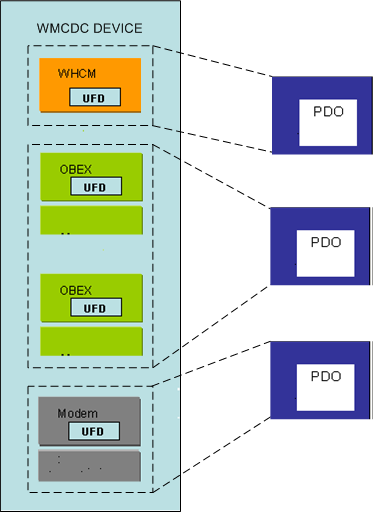

# Enumeration of Interface Collections on USB Composite Devices


Interfaces on a composite USB device can be grouped in collections. The [USB Generic Parent Driver (Usbccgp.sys)](usb-common-class-generic-parent-driver.md) can enumerate interface collections in four ways.

These four methods of enumeration of interface collections are arranged hierarchically in the following manner:

1.  **Vendor-supplied callback routines**

    If the vendor has registered a callback routine with the [USB Generic Parent Driver (Usbccgp.sys)](usb-common-class-generic-parent-driver.md), the generic parent driver gives precedence to the callback routine, and allows the callback routine to group interfaces rather than using some other method. For more information on the enumeration of interface collection using vendor-supplied callback routines, see [Enumeration of Interface Collections on USB Composite Devices](support-for-interface-collections.md).

2.  **Union Functional Descriptors**

    . If the vendor has enabled CDC and WMCDC enumeration in the USB generic parent driver, the generic parent driver uses *union functional descriptors* (UFDs) to group interfaces into collections. When enabled, this method has precedence over all other methods, except for vendor-supplied callback routines. For more information on the enumeration of devices with UFDs, see [Support for Wireless Mobile Communications Device Class](support-for-the-wireless-mobile-communication-device-class--wmcdc-.md).

3.  **Interface Association Descriptors**

    If *interface association descriptors* (IADs) are present, the USB generic parent driver always groups interfaces by using IADs rather than by using legacy methods. Microsoft recommends that vendors use IADs to define interface collections. For more information on the enumeration of devices with IADs, see [Support for the Wireless Mobile Communication Device Class](support-for-the-wireless-mobile-communication-device-class--wmcdc-.md).

4.  **Legacy audio method.**

    The USB generic parent driver is able to enumerate interface collections by using legacy techniques that are reserved for audio functions. The generic parent driver does not use this method if there are any IADs on the device. For more information on the legacy audio method of enumeration, see [Support for the Wireless Mobile Communication Device Class](support-for-the-wireless-mobile-communication-device-class--wmcdc-.md).

##  Customizing Enumeration of Interface Collections for Composite Devices


Some USB devices have interface collections that the USB Interface Association Descriptor (IAD) is unable to describe. In Windows Vista and later operating systems, vendors can customize the way the [USB Generic Parent Driver (Usbccgp.sys)](usb-common-class-generic-parent-driver.md) defines and enumerates a device's interface collections. This is done through an *enumeration callback routine* in a filter driver. The callback routine assists the generic parent driver in defining custom interface collections for the device.

For the generic parent driver to define custom interface collections, the vendor of the composite device must:

1.  Implement the enumeration callback routine ([**USBC\_START\_DEVICE\_CALLBACK**](https://msdn.microsoft.com/library/windows/hardware/ff539007)).
2.  Supply a pointer to the callback routine in the *USB device configuration interface* (**StartDeviceCallback** member of [**USBC\_DEVICE\_CONFIGURATION\_INTERFACE\_V1**](https://msdn.microsoft.com/library/windows/hardware/ff538990)).
3.  Provide an INF file that matches the device ID of the composite device and explicitly loads both the USB generic parent driver and the filter driver.

### Implementation Considerations


The filter driver that contains the enumeration callback routine can be either an upper or a lower filter driver. When the USB generic parent driver receives an [**IRP\_MN\_START\_DEVICE**](https://msdn.microsoft.com/library/windows/hardware/ff551749) request to start a composite device, it queries for the USB device configuration interface by sending an [**IRP\_MN\_QUERY\_INTERFACE**](https://msdn.microsoft.com/library/windows/hardware/ff551687) request to the top of the driver stack.

On receiving an [**IRP\_MN\_QUERY\_INTERFACE**](https://msdn.microsoft.com/library/windows/hardware/ff551687) request, the filter driver must check the GUID type in the **InterfaceType** member of the request to verify that the interface that is requested is of type USB\_BUS\_INTERFACE\_USBC\_CONFIGURATION\_GUID. If it is, the filter driver returns a pointer to the interface in the **Interface** member of the IRP.

The enumeration callback routine must return a pointer to an array of *function descriptors* ([**USBC\_FUNCTION\_DESCRIPTOR**](https://msdn.microsoft.com/library/windows/hardware/ff539001)) that describe the interface collections. Each function descriptor contains an array of interface descriptors ([**USB\_INTERFACE\_DESCRIPTOR**](https://msdn.microsoft.com/library/windows/hardware/ff540065)) that describe the interface collection. The callback routine must allocate both the function descriptors and the interface descriptors from non-paged pool. The generic parent driver releases this memory. The callback routine must ensure that the **NumberOfInterfaces** member of each **USB\_INTERFACE\_DESCRIPTOR** accurately reports the number of interfaces in the interface collection.

The generic parent driver creates a physical device object (PDO) for each function descriptor.

The USB device configuration interface and the enumeration callback routine is summarized in [Generic Parent Driver Routines](https://msdn.microsoft.com/library/windows/hardware/ff540134#usbccgp).

### USB Generic Parent Driver Loading Mechanism


When a composite device meets the requirements described in [Enumeration of USB Composite Devices](enumeration-of-the-composite-parent-device.md), the operating system generates a compatible ID of `USB\COMPOSITE` to indicate that the device is composite. The compatible ID produces a match in Usb.inf, and the operating system loads the USB generic parent driver, automatically, without the help of a vendor-supplied INF file.

However, this default mechanism does not work for composite devices that require custom enumeration of interface collections, because in the default mechanism the system does not load the required vendor-supplied filter driver. For the enumeration callback routine mechanism to work, the filter driver that exposes the USB device configuration interface must already be loaded when the USB generic parent enumerates the interface collections of the composite device. This requires the vendor of the composite device to install an INF file that matches the device ID of the composite device and explicitly loads both the USB generic parent driver and the filter driver.


## Support for the Wireless Mobile Communication Device Class


In Windows Vista the [USB Generic Parent Driver (Usbccgp.sys)](usb-common-class-generic-parent-driver.md) provides support for devices that are included in the Universal Serial Bus (USB) Communication Device Class (CDC) and USB Wireless Mobile Communication Device Class (WMCDC).

The USB Wireless Mobile Communication Device Class (WMCDC) specification establishes a standard for connection, control, and content exchange between a host and a wireless mobile device (for example, a cell phone) when the device is connected to a USB port. WMCDC is an extension of the communication device class (CDC), which includes a broad range of communication and networking devices. This section describes the architecture that supports CDC and WMCDC devices in Windows operating systems.

WMCDC devices consist of multiple functions that are grouped into *logical handsets*. Most WMCDC devices have a single logical handset, but a device might have multiple logical handsets. Logical handsets typically include functions such as a data/fax modem, an object store, and a call control facility. A logical handset might also include supporting functions that are defined by other USB specifications such as the USB Audio Class specification, the USB Human Input Device (HID) class specification, and the USB Video Class specification.

The Windows WMCDC architecture uses native Windows drivers to manage the functions of your WMCDC device. For example, you can use the Windows telephony application program interface (TAPI) subsystem to manage the voice and data/fax modem functions of your device and the Windows network driver interface specification (NDIS) subsystem to manage the device's Ethernet LAN function. Furthermore, you can manage some functions, such as an Object Exchange Protocol (OBEX) function, in user-mode software with the assistance of the [WinUSB](winusb.md) (Winusb.sys).

This image shows an example driver stack for a WMCDC device.


In the preceding figure, the WMCDC device contains a single logical handset: an OBEX function and a modem function. A vendor-supplied INF file loads native Windows drivers to manage the modem. The OBEX function is managed by a vendor-supplied user-mode driver that runs in the [User-Mode Driver Framework](https://msdn.microsoft.com/library/windows/hardware/ff561365) (UMDF). The user-mode driver uses the Windows Portable Devices (WPD) protocol to communicate with user applications and the interface that the [WinUSB](winusb.md) exports to communicate with the USB stack. In general, a vendor-supplied INF file will load a separate instance of Winusb.sys for each interface collection that uses Winusb.sys.

### Registry Settings

The USB stack does not automatically support WMCDC. You must provide an INF file that loads an instance of Usbccgp.sys. The INF file must contain an **AddReg** section that sets the **EnumeratorClass** registry value in the software key that is associated with Usbccgp.sys to a REG\_BINARY value that is constructed from three numbers: 0x02, 0x00, and 0x 00. The following code example from an example INF file illustrates how to set **EnumeratorClass** to the appropriate value.

```cpp
[CCGPDriverInstall.NT]
Include=usb.inf
Needs=Composite.Dev.NT
AddReg=CCGPDriverInstall.AddReg

[CCGPDriverInstall.NT.Services]
Include=usb.inf
Needs=Composite.Dev.NT.Services

[CCGPDriverInstall.AddReg]
HKR,,EnumeratorClass, 0x00000001,02,00,00
```

The value that you must assign to **EnumeratorClass** is constructed from three 1-byte binary values that are represented in the INF file by pairs of hexadecimal digits: 02, 00, and 00. These three numbers correspond to the values that the USB Implementers Forum has assigned to the CDC device class, CDC device subclass and CDC device protocol, respectively.

For more information about how to configure the registry to correctly enumerate your WMCDC device, see [Support for the Wireless Mobile Communication Device Class](support-for-the-wireless-mobile-communication-device-class--wmcdc-.md).

The following topics further describe the WMCDC:

### Enumerating Interface Collections on WMCDC


The USB wireless mobile communication device class (WMCDC) is a subclass of the USB communications device class (CDC). The WMCDC specification extends but does not substantially change the CDC guidelines for defining interface collections. In particular, WMCDC devices must comply with the CDC guidelines for defining interface collections.

CDC interface collections contain a master interface ([**USB\_INTERFACE\_DESCRIPTOR**](https://msdn.microsoft.com/library/windows/hardware/ff540065)) that belongs to the communication interface class (`bInterfaceClass = 0x02`) or data interface class (`bInterfaceClass = 0x0A`). If the master interface belongs to the communication interface class (which is the typical situation), the subclass of the master interface (**bInterfaceSubClass**) specifies a CDC *control model*. The control model indicates the type of interfaces included in the interface collection. For a description of the control models that the USB Implementers Forum defines, see the CDC specification and the WMCDC specification.

The master interface of an interface collection is followed by a set of mandatory class-specific functional descriptors, including a union functional descriptor (UFD). The UFD lists the numbers of the interfaces that belong to the collection. The **bMasterInterface** field of the UFD contains the number of the master interface. Zero or more **bSubordinateInterface** fields contain the numbers of the other (subordinate) interfaces in the collection.

For most types of control models, the [USB Generic Parent Driver (Usbccgp.sys)](usb-common-class-generic-parent-driver.md) creates one physical device object (PDO) for each UFD. But some control models include an audio interface that the generic parent driver enumerates separately from the interface collection that the audio interface belongs to. The audio interface appears in the list of subordinate interfaces (**bSubordinateInterface**) in the UFD of the interface collection, but the generic parent driver creates a separate PDO for the audio interface. Both the PDO for the audio interface and the PDO for the interface collection that the audio interface belongs to are directly above the functional device object (FDO) of the parent composite device in the device object tree. The PDO of the audio interface is not a child of the interface collection. Enumeration of audio interfaces is described in [Support for the Wireless Mobile Communication Device Class](support-for-the-wireless-mobile-communication-device-class--wmcdc-.md).

There are two control models whose enumeration characteristics are configurable in the registry: the Wireless Handset Control Model (WHCM), which defines a logical handset, and the Object Exchange Protocol (OBEX) control model. To configure the enumeration characteristics of these two control models, you must provide an INF file that loads an instance of Usbccgp.sys and sets the value of **CdcFlags** in the software key for that instance of Usbccgp.sys. The following table describes the configuration options of **CdcFlags**.

<table>
<colgroup>
<col width="33%" />
<col width="33%" />
<col width="33%" />
</colgroup>
<thead>
<tr class="header">
<th>CdcFlags bit</th>
<th>Bit set to 0</th>
<th>Bit set to 1</th>
</tr>
</thead>
<tbody>
<tr class="odd">
<td><p>0 (mask = 0x00000001)</p></td>
<td><p>The USB generic parent driver creates a separate PDO for each OBEX interface.</p></td>
<td><p>The USB generic parent driver creates a single PDO for all OBEX interfaces.</p></td>
</tr>
<tr class="even">
<td><p>1 (mask = 0x00000010)</p></td>
<td><p>The USB generic parent driver does not create PDOs for WHCM interfaces (logical handsets). These interfaces remain hidden from the perspective of the device object tree.</p></td>
<td><p>The USB generic parent driver creates a PDO for each WHCM interface.</p></td>
</tr>
</tbody>
</table>

 

For example, to clear both bits (set them to 0), your INF file should have the following line in a **DDInstall.AddReg** section.

```cpp
HKR, , CdcFlags, 0x00010001, 0x00000000
```

To set both bits to 1, your INF file should have the following line.

```cpp
HKR, , CdcFlags, 0x00010001, 0x00000011
```

To set both bit 0 to 1 and bit 1 to 0, your INF file should have the following line.

```cpp
HKR, , CdcFlags, 0x00010001, 0x00000001
```

Either bit can be set or reset, independently of the other bit.

The following figures illustrate how different registry configurations can create different device trees for the same device.

The following figure illustrates the PDO configuration when both bit 0 and bit 1 of **CdcFlags** are 0.


The Wireless Handset Control Model (WHCM) interface collection in the preceding figure contains three subordinate interface collections (**bSubordinateInterface**): two OBEX collections and a modem collection. Bit 0 of the **CdcFlags** is 0, so the USB generic parent driver does not create a PDO for the WHCM interface collection. Bit 1 of the **CdcFlags** is 0, so the USB generic parent driver generates a separate PDO for each OBEX interface collection.

The following figure illustrates the PDO configuration when both bit 0 and bit 1 of **CdcFlags** are set.



Because bit 0 of **CdcFlags** is set to 1, the USB generic parent driver creates a PDO for the WHCM interface collection. Because bit 1 of **CdcFlags** is set to 1, the USB generic parent driver groups the two OBEX collections together and generates a single PDO for both OBEX collections.

You might want to represent OBEX collections with a single PDO at the kernel level and to distinguish between each individual OBEX collection within a user-mode driver. The Windows Portable Devices (WPD) protocol can help you multiplex data streams between different OBEX functions at the user level, when all of the OBEX functions are grouped into a single PDO at the kernel level.

The following example INF file loads the USB generic parent driver to manage a WMCDC device and instructs the USB generic parent to create PDOs for logical handsets and to create a single PDO for all OBEX collections in the logical handset.

```cpp
[Version]
signature="$Windows NT$"
Class=USB
ClassGUID={36FC9E60-C465-11CF-8056-444553540000}
Provider=%MSFT%
DriverVer=07/01/2001,5.1.2600.0

[ControlFlags]
ExcludeFromSelect=*

[Manufacturer]
CompanyName=CompanyName

[CompanyName]
%COMPANYNAME.DeviceDesc%=CCGPDriverInstall,USB\Vid_????&Pid_????

[CCGPDriverInstall.NT]
Include=usb.inf
Needs=Composite.Dev.NT
AddReg=CCGPDriverInstall.AddReg

[CCGPDriverInstall.NT.Services]
Include=usb.inf
Needs=Composite.Dev.NT.Services

[CCGPDriverInstall.AddReg]
HKR,,EnumeratorClass,0x00000001,02,00,00
HKR,,CdcFlags,0x00010001,0x00010001

[Strings]
MSFT="Microsoft"
COMPANYNAME.DeviceDesc="USB Phone Parent"
```
### Handling CDC and WMCDC Interface Collections


The USB generic parent driver handles Wireless Handset Control Model (WHCM) interfaces in a special way, as described in [Support for Wireless Mobile Communications Device Class](support-for-the-wireless-mobile-communication-device-class--wmcdc-.md).

The following list summarizes the most important ways in which the handling of CDC and WMCDC interface collections differs from that of other interface collections:

-   The wireless mobile communication device class permits a limited amount of nesting of interface collections. In particular, a logical handset interface collection (that is, a WHCM interface collection) can contain other subordinate interface collections. For example, a WMCDC-compliant phone can have an WHCM interface collection, which in turn, contains an abstract control model collection and an OBEX collection.
-   You can configure the USB generic parent driver to not enumerate WHCM interface collections. WHCM interface collections that are not enumerated remain hidden, but the generic parent driver uses information from the union function descriptors (UFDs) that belong to an WHCM interface collections to group and enumerate subordinate interface collections.
-   You can configure the USB generic parent driver to create separate physical device objects (PDOs) for OBEX control model interface collections, or to create a single PDO for all OBEX control model interface collections.
-   The list of interface numbers in a UFD can have gaps. That is, the interface numbers of a UFD can refer to interfaces that are not contiguous. This type of numbering is not valid, for example, for the [USB Interface Association Descriptor (IAD)](usb-interface-association-descriptor.md), whose interfaces must be contiguous and have sequential numbers.
-   UFDs can include related audio interface collections
-   Hardware identifiers (IDs) for CDC and WMCDC interface collections must include the interface subclass. Other USB interfaces, whose hardware IDs contain a MI\_%02X suffix that specifies the interface number, do not contain information about the interface subclass. The subclass information is included in the hardware ID to allow vendors to provide INF files with hardware ID matches for specific interface collections, instead of relying on the position of the interface in the descriptor layout to determine which driver to load for the collection. The subclass information in the hardware ID also allows a gradual migration path from current vendor-supplied drivers that manage WMCDC interface collections to alternatives, such as user-mode drivers. For examples of CDC and WMCDC hardware IDs, see [Support for the Wireless Mobile Communication Device Class](support-for-the-wireless-mobile-communication-device-class--wmcdc-.md). For a general discussion of how USB interface hardware IDs are formatted, see [Identifiers for USB Devices](https://msdn.microsoft.com/library/windows/hardware/ff546284).

### CDC and WMCDC Control Models


The CDC and WMCDC Control Models section describes the properties of interface collections that are supported in Microsoft Windows operating systems. Each description includes, among other things, a list of hardware and device identifiers (IDs) that the USB generic parent driver generates for the interface collection.

Most of the interface collections that Windows supports correspond to control models that belong to the communication device class (CDC) and wireless mobile communication device class (WMCDC), but the operating system also supports legacy audio and video interface collections and an interface collection that the Mobile Computing Promotion Consortium (MCPC) defines.

The interface collections that are described in this section are the following:

#### Audio Class Interfaces


USB Audio Device class interface collections that occur on CDC and WMCDC devices have the following properties.

<table>
<colgroup>
<col width="50%" />
<col width="50%" />
</colgroup>
<thead>
<tr class="header">
<th>Property</th>
<th>Description</th>
</tr>
</thead>
<tbody>
<tr class="odd">
<td><p>Reference</p></td>
<td><p><em>Universal Serial Bus Device Class Definition for Audio Devices</em>, version 1.0.</p></td>
</tr>
<tr class="even">
<td><p>Class</p></td>
<td><p>All interfaces in the interface collection must belong to the Audio Device Class (0x01).</p></td>
</tr>
<tr class="odd">
<td><p>Subclass</p></td>
<td><p>Each interface in the interface collection must have a different subclass from the first interface in the collection.</p></td>
</tr>
<tr class="even">
<td><p>Protocol</p></td>
<td><p>None (0x00).</p></td>
</tr>
<tr class="odd">
<td><p>Enumerated</p></td>
<td><p>Yes.</p></td>
</tr>
<tr class="even">
<td><p>Related interfaces</p></td>
<td><p>Zero or more contiguous interfaces that belong to the streaming subclass (0x02).</p></td>
</tr>
<tr class="odd">
<td><p>Hardware IDs</p></td>
<td><pre space="preserve"><code>USB\Vid_%04x&amp;Pid_%04x&amp;Rev_%04x&amp;MI_%02x
USB\Vid_%04x&amp;Pid_%04x&amp;MI_%02x</code></pre>
<p>The hardware IDs for audio interface collections do not contain interface class-specific information. For an explanation of the formatting of hardware IDs that are associated with audio interface collections, see <a href="support-for-the-wireless-mobile-communication-device-class--wmcdc-.md" data-raw-source="[Support for the Wireless Mobile Communication Device Class](support-for-the-wireless-mobile-communication-device-class--wmcdc-.md)">Support for the Wireless Mobile Communication Device Class</a>.</p></td>
</tr>
<tr class="even">
<td><p>Compatible IDs</p></td>
<td><pre space="preserve"><code>USB\Class_01&amp;SubClass_01&amp;Prot_00
USB\Class_01&amp;SubClass_01
USB\Class_01</code></pre>
<p>The format of compatible IDs for audio interface collections contains embedded information about the interface class, interface subclass, and the protocol. For audio interface collections on a CDC or WMCDC device, the interface class is 01, the subclass is 01, and the protocol is 00.</p></td>
</tr>
</tbody>
</table>

#### CDC Abstract Control Model


There are two versions of the Abstract Control Model (ACM). The original version is defined in the *USB Communication Device Class* (CDC) specification. The *USB Wireless Mobile Communication Device Class* (WMCDC) specification contains an extended definition of the ACM.

Interface collections that comply with the WMCDC specification are described in [Support for the Wireless Mobile Communication Device Class](support-for-the-wireless-mobile-communication-device-class--wmcdc-.md).

Interface collections that comply with the CDC specification have the following properties.

<table>
<colgroup>
<col width="50%" />
<col width="50%" />
</colgroup>
<thead>
<tr class="header">
<th>Property</th>
<th>Description</th>
</tr>
</thead>
<tbody>
<tr class="odd">
<td><p>Reference</p></td>
<td><p><em>Universal Serial Bus Class Definitions for Communication Devices</em>, version 1.1, Section 3.6.2.</p></td>
</tr>
<tr class="even">
<td><p>Class of the master interface</p></td>
<td><p>Communication Interface Class (0x02).</p></td>
</tr>
<tr class="odd">
<td><p>Subclass of the master interface</p></td>
<td><p>ACM (0x02).</p></td>
</tr>
<tr class="even">
<td><p>Protocol</p></td>
<td><p>Any.</p></td>
</tr>
<tr class="odd">
<td><p>Enumerated</p></td>
<td><p>Yes.</p></td>
</tr>
<tr class="even">
<td><p>Related interfaces</p></td>
<td><p>One data class interface and optional audio class interfaces that the union functional descriptor (UFD) references.</p></td>
</tr>
<tr class="odd">
<td><p>Hardware IDs</p></td>
<td><pre space="preserve"><code>USB\Vid_%04x&amp;Pid_%04x&amp;Rev_%04x&amp;Cdc_02&amp;MI_%02x
USB\Vid_%04x&amp;Pid_%04x&amp;Rev_%04x&amp;Cdc_02
USB\Vid_%04x&amp;Pid_%04x&amp;Cdc_02&amp;MI_%02x
USB\Vid_%04x&amp;Pid_%04x&amp;Cdc_02</code></pre></td>
</tr>
<tr class="even">
<td><p>Compatible IDs</p></td>
<td><pre space="preserve"><code>USB\Class_02&amp;SubClass_02&amp;Prot_%02X
USB\Class_02&amp;SubClass_02
USB\Class_02</code></pre></td>
</tr>
<tr class="odd">
<td><p>Special handling</p></td>
<td><p>The UFD can reference an audio interface collection that is enumerated independently of the ACM interface collection.</p></td>
</tr>
</tbody>
</table>

#### CDC ATM Networking Control Model


USB CDC ATM Networking Control Model (ANCM) interface collections have the following properties.

<table>
<colgroup>
<col width="50%" />
<col width="50%" />
</colgroup>
<thead>
<tr class="header">
<th>Property</th>
<th>Description</th>
</tr>
</thead>
<tbody>
<tr class="odd">
<td><p>Reference</p></td>
<td><p><em>Universal Serial Bus Class Definitions for Communication Devices</em>, version 1.1, Section 3.8.3</p></td>
</tr>
<tr class="even">
<td><p>Class of the master interface</p></td>
<td><p>Communication Interface Class (0x02)</p></td>
</tr>
<tr class="odd">
<td><p>Subclass of the master interface</p></td>
<td><p>ANCM (0x07)</p></td>
</tr>
<tr class="even">
<td><p>Protocol</p></td>
<td><p>None (0x00)</p></td>
</tr>
<tr class="odd">
<td><p>Enumerated</p></td>
<td><p>Yes</p></td>
</tr>
<tr class="even">
<td><p>Related interfaces</p></td>
<td><p>One data class interface that is referenced by the Union Functional Descriptor (UFD)</p></td>
</tr>
<tr class="odd">
<td><p>Hardware IDs</p></td>
<td><pre space="preserve"><code>USB\Vid_%04x&amp;Pid_%04x&amp;Rev_%04x&amp;Cdc_07&amp;MI_%02x
USB\Vid_%04x&amp;Pid_%04x&amp;Rev_%04x&amp;Cdc_07
USB\Vid_%04x&amp;Pid_%04x&amp;Cdc_07&amp;MI_%02x
USB\Vid_%04x&amp;Pid_%04x&amp;Cdc_07</code></pre></td>
</tr>
<tr class="even">
<td><p>Compatible IDs</p></td>
<td><pre space="preserve"><code>USB\Class_02&amp;SubClass_07&amp;Prot_00
USB\Class_02&amp;SubClass_07
USB\Class_02</code></pre></td>
</tr>
<tr class="odd">
<td><p>Special handling</p></td>
<td><p>None</p></td>
</tr>
</tbody>
</table>


#### CDC CAPI Control Model


USB CDC Common ISDN API (CAPI) Control Model interface collections have the following properties.

<table>
<colgroup>
<col width="50%" />
<col width="50%" />
</colgroup>
<thead>
<tr class="header">
<th>Property</th>
<th>Description</th>
</tr>
</thead>
<tbody>
<tr class="odd">
<td><p>Reference</p></td>
<td><p><em></em></p>
<p><em>Universal Serial Bus Class Definitions for Communication Devices</em>, version 1.1, Section 3.7.2</p></td>
</tr>
<tr class="even">
<td><p>Class of the master interface</p></td>
<td><p>Communication Interface Class (0x02)</p></td>
</tr>
<tr class="odd">
<td><p>Subclass of the master interface</p></td>
<td><p>CAPI (0x05)</p></td>
</tr>
<tr class="even">
<td><p>Protocol</p></td>
<td><p>None (0x00)</p></td>
</tr>
<tr class="odd">
<td><p>Enumerated</p></td>
<td><p>Yes</p></td>
</tr>
<tr class="even">
<td><p>Related interfaces</p></td>
<td><p>One data class interface that the union functional descriptor (UFD) references.</p></td>
</tr>
<tr class="odd">
<td><p>Hardware IDs</p></td>
<td><pre space="preserve"><code>USB\Vid_%04x&amp;Pid_%04x&amp;Rev_%04x&amp;Cdc_05&amp;MI_%02x
USB\Vid_%04x&amp;Pid_%04x&amp;Rev_%04x&amp;Cdc_05</code></pre></td>
</tr>
<tr class="even">
<td><p>Compatible IDs</p></td>
<td><pre space="preserve"><code>USB\Class_02&amp;SubClass_05&amp;Prot_00
USB\Class_02&amp;SubClass_05</code></pre></td>
</tr>
<tr class="odd">
<td><p>Special handling</p></td>
<td><p>None</p></td>
</tr>
</tbody>
</table>

#### CDC Direct Line Control Model


USB CDC Direct Line Control Model (DLCM) interface collections have the following properties.

<table>
<colgroup>
<col width="50%" />
<col width="50%" />
</colgroup>
<thead>
<tr class="header">
<th>Property</th>
<th>Description</th>
</tr>
</thead>
<tbody>
<tr class="odd">
<td><p>Reference</p></td>
<td><p><em>Universal Serial Bus Class Definitions for Communication Devices</em>, version 1.1, Section 3.6.1.</p></td>
</tr>
<tr class="even">
<td><p>Class of the master interface</p></td>
<td><p>Communication Interface Class (0x02).</p></td>
</tr>
<tr class="odd">
<td><p>Subclass of the master interface</p></td>
<td><p>DLCM (0x01).</p></td>
</tr>
<tr class="even">
<td><p>Protocol</p></td>
<td><p>None (0x00).</p></td>
</tr>
<tr class="odd">
<td><p>Enumerated</p></td>
<td><p>Yes.</p></td>
</tr>
<tr class="even">
<td><p>Related interfaces</p></td>
<td><p>Audio Class or vendor-defined interfaces that the union functional descriptor (UFD) references.</p></td>
</tr>
<tr class="odd">
<td><p>Hardware IDs</p></td>
<td><pre space="preserve"><code>USB\Vid_%04x&amp;Pid_%04x&amp;Rev_%04x&amp;Cdc_01&amp;MI_%02x
USB\Vid_%04x&amp;Pid_%04x&amp;Rev_%04x&amp;Cdc_01
USB\Vid_%04x&amp;Pid_%04x&amp;Cdc_01&amp;MI_%02x
USB\Vid_%04x&amp;Pid_%04x&amp;Cdc_01</code></pre></td>
</tr>
<tr class="even">
<td><p>Compatible IDs</p></td>
<td><pre space="preserve"><code>USB\Class_02&amp;SubClass_01&amp;Prot_00
USB\Class_02&amp;SubClass_01
USB\Class_02</code></pre></td>
</tr>
<tr class="odd">
<td><p>Special handling</p></td>
<td><p>The UFD references an audio class interface collection that is enumerated independently of the DLCM interface collection.</p></td>
</tr>
</tbody>
</table>

#### CDC Ethernet Networking Control Model


USB CDC Ethernet Networking Control Model (ENCM) interface collections have the following properties.

<table>
<colgroup>
<col width="50%" />
<col width="50%" />
</colgroup>
<thead>
<tr class="header">
<th>Property</th>
<th>Description</th>
</tr>
</thead>
<tbody>
<tr class="odd">
<td><p>Reference</p></td>
<td><p><em>Universal Serial Bus Class Definitions for Communication Devices</em>, version 1.1, Section 3.8.2.</p></td>
</tr>
<tr class="even">
<td><p>Class of the master interface</p></td>
<td><p>Communication Interface Class (0x02).</p></td>
</tr>
<tr class="odd">
<td><p>Subclass of the master interface</p></td>
<td><p>ENCM (0x06).</p></td>
</tr>
<tr class="even">
<td><p>Protocol</p></td>
<td><p>None (0x00).</p></td>
</tr>
<tr class="odd">
<td><p>Enumerated</p></td>
<td><p>Yes.</p></td>
</tr>
<tr class="even">
<td><p>Related interfaces</p></td>
<td><p>One data class interface that the union functional descriptor (UFD) references.</p></td>
</tr>
<tr class="odd">
<td><p>Hardware IDs</p></td>
<td><pre space="preserve"><code>USB\Vid_%04x&amp;Pid_%04x&amp;Rev_%04x&amp;Cdc_06&amp;MI_%02x
USB\Vid_%04x&amp;Pid_%04x&amp;Rev_%04x&amp;Cdc_06
USB\Vid_%04x&amp;Pid_%04x&amp;Cdc_06&amp;MI_%02x
USB\Vid_%04x&amp;Pid_%04x&amp;Cdc_06</code></pre></td>
</tr>
<tr class="even">
<td><p>Compatible IDs</p></td>
<td><pre space="preserve"><code>USB\Class_02&amp;SubClass_06&amp;Prot_00
USB\Class_02&amp;SubClass_06
USB\Class_02</code></pre></td>
</tr>
<tr class="odd">
<td><p>Special handling</p></td>
<td><p>The compatible IDs of this control model have a match in a Microsoft-supplied INF file. If the operating system does not find a match for one of the hardware IDs in a vendor-supplied INF file, the system automatically loads the native NDIS miniport driver to manage the interface collection.</p></td>
</tr>
</tbody>
</table>

#### CDC Multi-Channel ISDN Control Model


USB CDC Multi-Channel ISDN Control Model (MCCM) interface collections have the following properties.

<table>
<colgroup>
<col width="50%" />
<col width="50%" />
</colgroup>
<thead>
<tr class="header">
<th>Property</th>
<th>Description</th>
</tr>
</thead>
<tbody>
<tr class="odd">
<td><p>Reference</p></td>
<td><p><em>Universal Serial Bus Class Definitions for Communication Devices</em>, version 1.1, Section 3.7.1</p></td>
</tr>
<tr class="even">
<td><p>Class of the master Interface</p></td>
<td><p>Communication Interface Class (0x02)</p></td>
</tr>
<tr class="odd">
<td><p>Subclass of the master interface</p></td>
<td><p>MCCM (0x04)</p></td>
</tr>
<tr class="even">
<td><p>Protocol</p></td>
<td><p>None (0x00)</p></td>
</tr>
<tr class="odd">
<td><p>Enumerated</p></td>
<td><p>Yes</p></td>
</tr>
<tr class="even">
<td><p>Related interfaces</p></td>
<td><p>Multiple data class interfaces that the union functional descriptor (UFD) references.</p></td>
</tr>
<tr class="odd">
<td><p>Hardware IDs</p></td>
<td><pre space="preserve"><code>USB\Vid_%04x&amp;Pid_%04x&amp;Rev_%04x&amp;Cdc_04&amp;MI_%02x
USB\Vid_%04x&amp;Pid_%04x&amp;Rev_%04x&amp;Cdc_04
USB\Vid_%04x&amp;Pid_%04x&amp;Cdc_04&amp;MI_%02x
USB\Vid_%04x&amp;Pid_%04x&amp;Cdc_04</code></pre></td>
</tr>
<tr class="even">
<td><p>Compatible IDs</p></td>
<td><pre space="preserve"><code>USB\Class_02&amp;SubClass_04&amp;Prot_00
USB\Class_02&amp;SubClass_04
USB\Class_02</code></pre></td>
</tr>
<tr class="odd">
<td><p>Special handling</p></td>
<td><p>None</p></td>
</tr>
</tbody>
</table>

 
#### CDC Telephone Control Model


USB CDC Telephone Control Model (TCM) interface collections have the following properties.

<table>
<colgroup>
<col width="50%" />
<col width="50%" />
</colgroup>
<thead>
<tr class="header">
<th>Property</th>
<th>Description</th>
</tr>
</thead>
<tbody>
<tr class="odd">
<td><p>Reference</p></td>
<td><p><em>Universal Serial Bus Class Definitions for Communication Devices</em>, version 1.1, Section 3.6.3.</p></td>
</tr>
<tr class="even">
<td><p>Class of the master interface</p></td>
<td><p>Communication Interface Class (0x02).</p></td>
</tr>
<tr class="odd">
<td><p>SubClass of the master interface</p></td>
<td><p>TCM (0x03).</p></td>
</tr>
<tr class="even">
<td><p>Protocol</p></td>
<td><p>Any.</p></td>
</tr>
<tr class="odd">
<td><p>Enumerated</p></td>
<td><p>Yes.</p></td>
</tr>
<tr class="even">
<td><p>Related interfaces</p></td>
<td><p>Audio class interfaces that the union functional descriptor (UFD) references.</p></td>
</tr>
<tr class="odd">
<td><p>Hardware ID</p></td>
<td><pre space="preserve"><code>USB\Vid_%04x&amp;Pid_%04x&amp;Rev_%04x&amp;Cdc_03&amp;MI_%02x
USB\Vid_%04x&amp;Pid_%04x&amp;Rev_%04x&amp;Cdc_03
USB\Vid_%04x&amp;Pid_%04x&amp;Cdc_03&amp;MI_%02x
USB\Vid_%04x&amp;Pid_%04x&amp;Cdc_03</code></pre></td>
</tr>
<tr class="even">
<td><p>Compatible ID</p></td>
<td><pre space="preserve"><code>USB\Class_02&amp;SubClass_03&amp;Prot_%02X
USB\Class_02&amp;SubClass_03
USB\Class_02</code></pre></td>
</tr>
<tr class="odd">
<td><p>Special handling</p></td>
<td><p>The UFD can reference an audio class interface collection that is enumerated independently of the TCM interface collection.</p></td>
</tr>
</tbody>
</table>

#### MCPC Vendor-Unique Interfaces


The Mobile Computing Promotion Consortium (MCPC) defined a format for interface collections before the Wireless Mobile Communication Device Class (WMCDC) specification provided a format for vendor-unique CDC devices. Therefore, MCPC interface collections do not comply with the WMCDC standard.

However, the USB generic parent driver can enumerate MCPC interface collections if WMCDC is enabled. MCPC interface collections have the following properties.

<table>
<colgroup>
<col width="50%" />
<col width="50%" />
</colgroup>
<thead>
<tr class="header">
<th>Property</th>
<th>Description</th>
</tr>
</thead>
<tbody>
<tr class="odd">
<td><p>Reference</p></td>
<td><p>Mobile Computing Promotion Consortium (MCPC) GL-004 specification</p></td>
</tr>
<tr class="even">
<td><p>Class</p></td>
<td><p>CDC (0x02)</p></td>
</tr>
<tr class="odd">
<td><p>Subclass</p></td>
<td><p>0x88</p></td>
</tr>
<tr class="even">
<td><p>Protocol</p></td>
<td><p>None (0x00)</p></td>
</tr>
<tr class="odd">
<td><p>Enumerated</p></td>
<td><p>Yes</p></td>
</tr>
<tr class="even">
<td><p>Related interfaces</p></td>
<td><p>Zero or more data class interfaces that the union functional descriptor (UFD) references</p></td>
</tr>
<tr class="odd">
<td><p>Hardware IDs</p></td>
<td><pre space="preserve"><code>USB\Vid_%04x&amp;Pid_%04x&amp;Rev_%04x&amp;Cdc_88&amp;MI_%02x
USB\Vid_%04x&amp;Pid_%04x&amp;Rev_%04x&amp;Cdc_88
USB\Vid_%04x&amp;Pid_%04x&amp;Cdc_88&amp;MI_%02x
USB\Vid_%04x&amp;Pid_%04x&amp;Cdc_88</code></pre></td>
</tr>
<tr class="even">
<td><p>Compatible IDs</p></td>
<td><pre space="preserve"><code>USB\Class_02&amp;SubClass_88&amp;Prot_00
USB\Class_02&amp;SubClass_88
USB\Class_02</code></pre></td>
</tr>
<tr class="odd">
<td><p>Special handling</p></td>
<td><p>None</p></td>
</tr>
</tbody>
</table>

#### Video Class Interfaces


USB Video Device Class interface collections that occur on CDC and WMCDC devices have the following properties.

<table>
<colgroup>
<col width="50%" />
<col width="50%" />
</colgroup>
<thead>
<tr class="header">
<th>Property</th>
<th>Description</th>
</tr>
</thead>
<tbody>
<tr class="odd">
<td><p>Reference</p></td>
<td><p><em>Universal Serial Bus Device Class Definition for Video Devices</em>, version 1.0.</p></td>
</tr>
<tr class="even">
<td><p>Class</p></td>
<td><p>Video (0x0E).</p></td>
</tr>
<tr class="odd">
<td><p>Subclass</p></td>
<td><p>Video Control (0x01).</p></td>
</tr>
<tr class="even">
<td><p>Protocol</p></td>
<td><p>None (0x00).</p></td>
</tr>
<tr class="odd">
<td><p>Enumerated</p></td>
<td><p>Yes.</p></td>
</tr>
<tr class="even">
<td><p>Related interfaces</p></td>
<td><p>Zero or more contiguous interfaces that belong to the streaming subclass (0x02).</p></td>
</tr>
<tr class="odd">
<td><p>Hardware IDs</p></td>
<td><pre space="preserve"><code>USB\Vid_%04x&amp;Pid_%04x&amp;Rev_%04x&amp;MI_%02x
USB\Vid_%04x&amp;Pid_%04x&amp;MI_%02x</code></pre></td>
</tr>
<tr class="even">
<td><p>Compatible IDs</p></td>
<td><pre space="preserve"><code>USB\Class_0E&amp;SubClass_01&amp;Prot_00
USB\Class_0E&amp;SubClass_01
USB\Class_0E</code></pre></td>
</tr>
<tr class="odd">
<td><p>Special handling</p></td>
<td><p>Video class interface collections receive special handling on CDC devices. On non-CDC devices, video class interface collections are defined by interface association descriptors (IADs). On CDC devices, video class interface collections are defined by union functional descriptors (UFDs).</p></td>
</tr>
</tbody>
</table>

#### WMCDC Abstract Control Model


There are two versions of the Abstract Control Model (ACM). The original version is defined in the USB Communication Device Class (CDC) specification. The USB Wireless Mobile Communication Device Class (WMCDC) specification contains an extended definition of the ACM. ACM collections that contain a fax/modem function should use the WMCDC definition of ACM rather than the original CDC ACM definition.

Interface collections that comply with the CDC specification are described in [Support for the Wireless Mobile Communication Device Class](support-for-the-wireless-mobile-communication-device-class--wmcdc-.md).

Interface collections that comply with the WMCDC specification have the following properties.

<table>
<colgroup>
<col width="50%" />
<col width="50%" />
</colgroup>
<thead>
<tr class="header">
<th>Property</th>
<th>Description</th>
</tr>
</thead>
<tbody>
<tr class="odd">
<td><p>Reference</p></td>
<td><p><em>Universal Serial Bus CDC Subclass Specification for Wireless Mobile Communication Devices</em>, version 1.0, Section 6.2.</p></td>
</tr>
<tr class="even">
<td><p>Class of the master interface</p></td>
<td><p>Communication Interface Class (0x02).</p></td>
</tr>
<tr class="odd">
<td><p>Subclass of the master interface</p></td>
<td><p>ACM (0x02).</p></td>
</tr>
<tr class="even">
<td><p>Protocol</p></td>
<td><p>If the collection uses an AT Command Set Protocol, the protocol value that is embedded in the compatible IDs is 0x01. If the collection uses one of the protocols that the WMCDC specification describes, the protocol value that is embedded in the compatible IDs is 0x2 through 0x06, or 0xFE.</p></td>
</tr>
<tr class="odd">
<td><p>Enumerated</p></td>
<td><p>Yes.</p></td>
</tr>
<tr class="even">
<td><p>Related interfaces</p></td>
<td><p>One data class interface that the union functional descriptor (UFD) references.</p></td>
</tr>
<tr class="odd">
<td><p>Hardware IDs</p></td>
<td><pre space="preserve"><code>USB\Vid_%04x&amp;Pid_%04x&amp;Rev_%04x&amp;Cdc_Modem&amp;MI_%02x
USB\Vid_%04x&amp;Pid_%04x&amp;Rev_%04x&amp;Cdc_Modem
USB\Vid_%04x&amp;Pid_%04x&amp;Cdc_Modem&amp;MI_%02x
USB\Vid_%04x&amp;Pid_%04x&amp;Cdc_Modem</code></pre></td>
</tr>
<tr class="even">
<td><p>Compatible IDs</p></td>
<td><pre space="preserve"><code>USB\Class_02&amp;SubClass_Modem&amp;Prot_%02X
USB\Class_02&amp;SubClass_Modem
USB\Class_02</code></pre></td>
</tr>
<tr class="odd">
<td><p>Special handling</p></td>
<td><p>The UFD might reference an audio interface collection that is enumerated independently of the ACM interface collection.</p>
<p>Interface collections must comply with the special descriptor and endpoint requirements that are specified in section 6.2 of the WMCDC specification. If the interface collection does not comply with the WMCDC requirements but the interface complies with CDC requirements, the USB generic parent driver will enumerate the interface collection and generic hardware IDs with CDC formats, as described in <a href="support-for-the-wireless-mobile-communication-device-class--wmcdc-.md" data-raw-source="[Support for the Wireless Mobile Communication Device Class](support-for-the-wireless-mobile-communication-device-class--wmcdc-.md)">Support for the Wireless Mobile Communication Device Class</a>.</p>
<p>The compatible IDs of this control model have a match in a Microsoft-supplied INF file. If the operating system does not find a match for one of the hardware IDs in a vendor-supplied INF file, the system automatically loads the native telephony application programming interface (TAPI) modem filter driver to manage the modem function and sets the appropriate TAPI registry settings, unless the protocol code is 0xFE. If the protocol code is 0xFE, the vendor must supply a device or class co-installer to correctly populate the TAPI registry settings.</p></td>
</tr>
</tbody>
</table>

#### WMCDC Device Management Model


USB WMCDC Device Management Model (DMM) interface collections have the following properties.

<table>
<colgroup>
<col width="50%" />
<col width="50%" />
</colgroup>
<thead>
<tr class="header">
<th>Property</th>
<th>Description</th>
</tr>
</thead>
<tbody>
<tr class="odd">
<td><p>Reference</p></td>
<td><p><em>Universal Serial Bus CDC Subclass Specification for Wireless Mobile Communication Devices</em>, version 1.0, Section 6.6.</p></td>
</tr>
<tr class="even">
<td><p>Class of the master interface</p></td>
<td><p>Communication Interface Class (0x02).</p></td>
</tr>
<tr class="odd">
<td><p>Subclass of the master interface</p></td>
<td><p>DMM (0x09).</p></td>
</tr>
<tr class="even">
<td><p>Protocol</p></td>
<td><p>Any.</p></td>
</tr>
<tr class="odd">
<td><p>Enumerated</p></td>
<td><p>Yes.</p></td>
</tr>
<tr class="even">
<td><p>Related interfaces</p></td>
<td><p>None.</p></td>
</tr>
<tr class="odd">
<td><p>Hardware IDs</p></td>
<td><pre space="preserve"><code>USB\Vid_%04x&amp;Pid_%04x&amp;Rev_%04x&amp;Cdc_09&amp;MI_%02x
USB\Vid_%04x&amp;Pid_%04x&amp;Rev_%04x&amp;Cdc_09
USB\Vid_%04x&amp;Pid_%04x&amp;Cdc_09&amp;MI_%02x
USB\Vid_%04x&amp;Pid_%04x&amp;Cdc_09</code></pre></td>
</tr>
<tr class="even">
<td><p>Compatible IDs</p></td>
<td><pre space="preserve"><code>USB\Class_02&amp;SubClass_09&amp;Prot_%02X
USB\Class_02&amp;SubClass_09
USB\Class_02</code></pre></td>
</tr>
<tr class="odd">
<td><p>Special handling</p></td>
<td><p>This control model does not use a union functional descriptor (UFD).</p></td>
</tr>
</tbody>
</table>

#### WMCDC Mobile Direct Line Model


USB WMCDC Mobile Direct Line Model (MDLM) interface collections have the following properties:

<table>
<colgroup>
<col width="50%" />
<col width="50%" />
</colgroup>
<thead>
<tr class="header">
<th>Property</th>
<th>Description</th>
</tr>
</thead>
<tbody>
<tr class="odd">
<td><p>Reference</p></td>
<td><p><em>Universal Serial Bus CDC Subclass Specification for Wireless Mobile Communication Devices</em>, version 1.0, Section 6.7</p></td>
</tr>
<tr class="even">
<td><p>Class of the master interface</p></td>
<td><p>Communication Interface Class (0x02)</p></td>
</tr>
<tr class="odd">
<td><p>Subclass of the master interface</p></td>
<td><p>MDLM (0x0A)</p></td>
</tr>
<tr class="even">
<td><p>Protocol</p></td>
<td><p>Any</p></td>
</tr>
<tr class="odd">
<td><p>Enumerated</p></td>
<td><p>Yes</p></td>
</tr>
<tr class="even">
<td><p>Related interfaces</p></td>
<td><p>One or more data class interfaces that the union functional descriptor (UFD) references</p></td>
</tr>
<tr class="odd">
<td><p>Hardware IDs</p></td>
<td><pre space="preserve"><code>USB\Vid_%04x&amp;Pid_%04x&amp;Rev_%04x&amp;Cdc_0A&amp;MI_%02x
USB\Vid_%04x&amp;Pid_%04x&amp;Rev_%04x&amp;Cdc_0A
USB\Vid_%04x&amp;Pid_%04x&amp;Cdc_0A&amp;MI_%02x
USB\Vid_%04x&amp;Pid_%04x&amp;Cdc_0A</code></pre></td>
</tr>
<tr class="even">
<td><p>Compatible IDs</p></td>
<td><pre space="preserve"><code>USB\Class_02&amp;SubClass_0A&amp;Prot_%02X
USB\Class_02&amp;SubClass_0A
USB\Class_02</code></pre></td>
</tr>
<tr class="odd">
<td><p>Special handling</p></td>
<td><p>None.</p></td>
</tr>
</tbody>
</table>

#### WMCDC OBEX Control Model (Multiple PDOs)


There are two ways to enumerate Object Exchange Protocol (OBEX) Control Model interface collections: the USB generic parent driver can group all of the OBEX interfaces together and create a single physical device object (PDO) for all of the OBEX interfaces, or the parent driver can create a separate PDO for each OBEX interface. For a description of the hardware IDs that the USB generic parent driver generates for OBEX interfaces that are grouped together, see [Support for the Wireless Mobile Communication Device Class](support-for-the-wireless-mobile-communication-device-class--wmcdc-.md).

When the USB generic parent driver assigns separate PDOs to each OBEX interface, the PDOs have the following properties.

<table>
<colgroup>
<col width="50%" />
<col width="50%" />
</colgroup>
<thead>
<tr class="header">
<th>Property</th>
<th>Description</th>
</tr>
</thead>
<tbody>
<tr class="odd">
<td><p>Reference</p></td>
<td><p><em>Universal Serial Bus CDC Subclass Specification for Wireless Mobile Communication Devices</em>, version 1.0, Section 6.5.</p></td>
</tr>
<tr class="even">
<td><p>Class of the master interface</p></td>
<td><p>Communication Interface Class (0x02).</p></td>
</tr>
<tr class="odd">
<td><p>Subclass of the master interface</p></td>
<td><p>OBEX (0x0B).</p></td>
</tr>
<tr class="even">
<td><p>Protocol</p></td>
<td><p>None (0x00).</p></td>
</tr>
<tr class="odd">
<td><p>Enumerated</p></td>
<td><p>Yes.</p></td>
</tr>
<tr class="even">
<td><p>Related interfaces</p></td>
<td><p>One data class interface that the union functional descriptor (UFD) references.</p></td>
</tr>
<tr class="odd">
<td><p>Hardware IDs</p></td>
<td><pre space="preserve"><code>USB\Vid_%04x&amp;Pid_%04x&amp;Rev_%04x&amp;Cdc_0B&amp;MI_%02x
USB\Vid_%04x&amp;Pid_%04x&amp;Rev_%04x&amp;Cdc_0B
USB\Vid_%04x&amp;Pid_%04x&amp;Cdc_0B&amp;MI_%02x
USB\Vid_%04x&amp;Pid_%04x&amp;Cdc_0B</code></pre></td>
</tr>
<tr class="even">
<td><p>Compatible IDs</p></td>
<td><pre space="preserve"><code>USB\Class_02&amp;SubClass_0B&amp;Prot_00
USB\Class_02&amp;SubClass_0B
USB\Class_02</code></pre></td>
</tr>
<tr class="odd">
<td><p>Special handling</p></td>
<td><p>The registry settings that are associated with the instance of the USB generic parent driver that manages the composite device determine whether OBEX interfaces are managed with a single PDO or multiple PDOs. For an explanation of the registry settings that specify how the USB generic parent driver enumerates OBEX interfaces, see <a href="support-for-the-wireless-mobile-communication-device-class--wmcdc-.md" data-raw-source="[Support for the Wireless Mobile Communication Device Class](support-for-the-wireless-mobile-communication-device-class--wmcdc-.md)">Support for the Wireless Mobile Communication Device Class</a>.</p></td>
</tr>
</tbody>
</table>

#### WMCDC OBEX Control Model (Single PDO)


There are two ways to enumerate Object Exchange Protocol (OBEX) control model interface collections: the USB generic parent driver can group all of the OBEX interfaces together and create a single physical device object (PDO) for all of the OBEX interfaces, or the parent driver can create a separate PDO for each OBEX interface. For a description of the hardware IDs that the USB generic parent driver generates for OBEX interfaces that are enumerated separately, see [Support for the Wireless Mobile Communication Device Class](support-for-the-wireless-mobile-communication-device-class--wmcdc-.md).

When the USB generic parent driver assigns a single PDO to all of the OBEX interfaces, the PDO has the following properties.

<table>
<colgroup>
<col width="50%" />
<col width="50%" />
</colgroup>
<thead>
<tr class="header">
<th>Property</th>
<th>Description</th>
</tr>
</thead>
<tbody>
<tr class="odd">
<td><p>Reference</p></td>
<td><p><em>Universal Serial Bus CDC Subclass Specification for Wireless Mobile Communication Devices</em>, version 1.0, Section 6.5.</p></td>
</tr>
<tr class="even">
<td><p>Class of the master interface</p></td>
<td><p>Communication Interface Class (0x02).</p></td>
</tr>
<tr class="odd">
<td><p>Subclass of the master interface</p></td>
<td><p>OBEX (0x0B).</p></td>
</tr>
<tr class="even">
<td><p>Protocol</p></td>
<td><p>None (0x00).</p></td>
</tr>
<tr class="odd">
<td><p>Enumerated</p></td>
<td><p>Yes.</p></td>
</tr>
<tr class="even">
<td><p>Related interfaces</p></td>
<td><p>One data class interface that the union functional descriptor (UFD) references.</p></td>
</tr>
<tr class="odd">
<td><p>Hardware IDs</p></td>
<td><pre space="preserve"><code>USB\Vid_%04x&amp;Pid_%04x&amp;Rev_%04x&amp;WPD_OBEX&amp;MI_%02x
USB\Vid_%04x&amp;Pid_%04x&amp;Rev_%04x&amp;WPD_OBEX
USB\Vid_%04x&amp;Pid_%04x&amp;WPD_OBEX&amp;MI_%02x
USB\Vid_%04x&amp;Pid_%04x&amp;WPD_OBEX</code></pre></td>
</tr>
<tr class="even">
<td><p>Compatible IDs</p></td>
<td><pre space="preserve"><code>USB\Class_02&amp;WPD_OBEX
USB\Class_02</code></pre></td>
</tr>
<tr class="odd">
<td><p>Special handling</p></td>
<td><p>The registry settings that are associated with the instance of the USB generic parent driver that manages the composite device determine whether OBEX interfaces are managed with a single PDO or multiple PDOs. For an explanation of the registry settings that specify how the USB generic parent driver enumerates OBEX interfaces, see <a href="support-for-interface-collections.md" data-raw-source="[Enumeration of Interface Collections on USB Composite Devices](support-for-interface-collections.md)">Enumeration of Interface Collections on USB Composite Devices</a>.</p></td>
</tr>
</tbody>
</table>

#### WMCDC Wireless Handset Control Model


The USB generic parent driver does not always enumerate Wireless Handset Control Model (WHCM) interface collections. The registry settings that are associated with the instance of the USB generic parent driver that manages the WHCM interface collection determine whether the USB generic parent driver creates a physical device object (PDO) for the interface collection or not. For an explanation of the registry settings that specify how the USB generic parent driver enumerates WHCM interfaces, see [Enumeration of Interface Collections on USB Composite Devices](support-for-interface-collections.md).

Enumerated WHCM interface collections have the following properties.

<table>
<colgroup>
<col width="50%" />
<col width="50%" />
</colgroup>
<thead>
<tr class="header">
<th>Property</th>
<th>Description</th>
</tr>
</thead>
<tbody>
<tr class="odd">
<td><p>Reference</p></td>
<td><p><em>Universal Serial Bus CDC Subclass Specification for Wireless Mobile Communication Devices</em>, version 1.0, Section 6.1.</p></td>
</tr>
<tr class="even">
<td><p>Class of the master interface</p></td>
<td><p>Communication Interface Class (0x02).</p></td>
</tr>
<tr class="odd">
<td><p>Subclass of the master interface</p></td>
<td><p>WHCM (0x08).</p></td>
</tr>
<tr class="even">
<td><p>Protocol</p></td>
<td><p>None (0x00).</p></td>
</tr>
<tr class="odd">
<td><p>Enumerated</p></td>
<td><p>Yes.</p></td>
</tr>
<tr class="even">
<td><p>Related interfaces</p></td>
<td><p>None.</p></td>
</tr>
<tr class="odd">
<td><p>Hardware IDs</p></td>
<td><pre space="preserve"><code>USB\Vid_%04x&amp;Pid_%04x&amp;Rev_%04x&amp;Cdc_08&amp;MI_%02x
USB\Vid_%04x&amp;Pid_%04x&amp;Rev_%04x&amp;Cdc_08
USB\Vid_%04x&amp;Pid_%04x&amp;Cdc_08&amp;MI_%02x
USB\Vid_%04x&amp;Pid_%04x&amp;Cdc_08</code></pre></td>
</tr>
<tr class="even">
<td><p>Compatible IDs</p></td>
<td><pre space="preserve"><code>USB\Class_02&amp;SubClass_08&amp;Prot_00
USB\Class_02&amp;SubClass_08
USB\Class_02</code></pre></td>
</tr>
<tr class="odd">
<td><p>Special handling</p></td>
<td><p>The union functional descriptor (UFD) identifies interfaces that are associated with a logical handset.</p></td>
</tr>
</tbody>
</table>

The hardware ID formats in the preceding topics describe use the following conventions:

- a C-language **printf** format represents integers. For example, "%04x" means a 4-digit hexadecimal integer, "%02x" means a 2-digit hexadecimal integer, and so on.

- The integer that follows the string "Vid\_" is a 4-digit hexadecimal representation of the vendor code that the USB committee (www.usb.org) assigns to the vendor.

- The integer that follows the string "Pid\_" is a 4-digit hexadecimal representation of the product code that the vendor assigns to the device.

- The integer that follows the string "Rev\_" is a 4-digit hexadecimal representation of the revision number of the device.

- The integer that follows the string "Cdc\_" is the interface subclass.

- The integer that follows the string "Prot\_" is the protocol number.

- The integer that follows the string "MI\_" is a 2-digit hexadecimal representation of the interface number, which is extracted from the **bInterfaceNumber** field of the interface descriptor.


### Enumeration of Interface Collections on USB Devices with IADs


If a USB composite device has an interface association descriptor (IAD) in its firmware, Windows enumerates interface collections as though each collection were a single device and assigns a single physical device object (PDO) to each interface collection and associates hardware and compatible identifiers (IDs) with the PDO. For a detailed description of IADs, see [USB Interface Association Descriptor](usb-interface-association-descriptor.md). This section describes the hardware IDs and compatible identifiers (IDs) assigned to interface collections associated with an IAD.

##  Hardware IDs


`USB\VID_v(4)&PID_p(4)&Rev_r(4)&MI_z(2)`

`USB\VID_v(4)&PID_p(4)&MI_z(2)`

In these hardware IDs,

-   *v(4)* is the four-digit vendor code that the USB committee assigns to the vendor and that is extracted from the **idVendor** field of the device descriptor.
-   *p(4)* is the four-digit product code that the vendor assigns to the device and that is extracted from the **idProduct** field of the device descriptor.
-   *r(4)* is the four-digit device release number, in binary coded decimal revision, that the vendor assigns to the device and that is extracted from the **bcdDevice** field of the device descriptor.
-   *z(2)* is the two-digit interface number that is extracted from the **bFirstInterface** field of IAD.

#### Compatible IDs


`USB\Class_c(2)&SubClass_s(2)&Prot_p(2)`

`USB\Class_c(2)&SubClass_s(2)`

`USB\Class_c(2)`

In these compatible IDs, c(2), s(2), and p(2) contain values that are taken, respectively, from the **bFunctionClass**, **bFunctionSubClass**, and **bFunctionProtocol** fields of the IAD.

You cannot use IADs recursively to bind functions of functions. In particular, if a device has IAD descriptors in its firmware, the generic parent driver will not group interfaces by audio device class, as described in [Enumeration of Interface Collections on USB Composite Devices](support-for-interface-collections.md).

### Enumeration of Interface Collections on Audio Devices without IADs


For audio devices, the Windows operating system can enumerate groups of interfaces (interface collections) that are associated with a function and assign a single physical device object (PDO) to each group, even when the device does not have an interface association descriptor (IAD).

The operating system groups the interfaces of composite audio devices into interface collections, if the interfaces meet the following conditions:

-   All interfaces in the interface collection must be consecutive. In other words, the interfaces must be adjacent to one another in firmware memory.
-   All interfaces in the interface collection must belong to the audio device class. The device manufacturer specifies that an interface belongs to the audio device class by assigning a value of 0x01 to the **bInterfaceClass** field of the interface descriptor.
-   Each interface in the interface collection must have a different subclass from the first interface in the collection.The **bInterfaceSubClass** field of the interface descriptor specifies the device subclass of the interface.

If an interface does not meet all of these three conditions, Windows will attempt to enumerate it separately instead of grouping it with the other audio class interfaces.

The operating system does not group audio class interfaces in a special way if an interface association descriptor (IAD) is present in device firmware. The IAD method is always the preferred method of grouping USB interfaces.

This section describes hardware and compatible identifiers (IDs) associated with the PDO that is created by the operating system for an interface collection whose interfaces belong to the audio device class.

#### Hardware IDs


`USB\VID_v(4)&PID_p(4)&Rev_r(4)&MI_z(2)`

`USB\VID_v(4)&PID_p(4)&MI_z(2)`

In these hardware IDs,

-   *v(4)* is the four-digit vendor code that the USB standards committee assigns to the vendor and that is extracted from the **idVendor** field of the device descriptor.
-   *p(4)* is the four-digit product code that the vendor assigns to the device and that is extracted from the **idProduct** field of the device descriptor.
-   *r(4)* is the four-digit device release number, in binary coded decimal revision, that the vendor assigns to the device and that is extracted from the **bcdDevice** field of the device descriptor.
-   *z(2)* is the two-digit interface number that is extracted from the **bInterfaceNumber** field of the interface descriptor.

##### Compatible IDs

`USB\Class_c(2)&SubClass_s(2)&Prot_p(2)`

`USB\Class_c(2)&SubClass_s(2)`

`USB\Class_c(2)`

In these compatible IDs, c(2), s(2), and p(2) contain values that are taken, respectively, from the bInterfaceClass, bInterfaceSubClass, and bInterfaceProtocol fields of the first USB interface descriptor in each interface collection.

## Related topics
[USB Generic Parent Driver (Usbccgp.sys)](usb-common-class-generic-parent-driver.md)  
[Microsoft-provided USB drivers](system-supplied-usb-drivers.md)  


