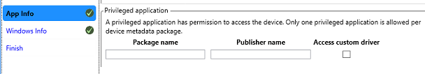

# Talking to USB devices, start to finish (UWP app)

This article provides an end-to-end walkthrough of creating a UWP app that talks to a USB device.

Use the Windows Runtime APIs to write UWP apps that give users access to their peripheral USB device. Such apps can connect to a device based on user-specified criteria, get information about the device, send data to the device and conversely get data streams from the device, and poll the device for interrupt data.

Here, we describe how your UWP app can implement those tasks, and link to examples that demonstrate the use of classes included in **[Windows.Devices.Usb](/uwp/api/Windows.Devices.Usb)**. We'll go over the device capabilities required in the app manifest and how to launch the app when the device connects. And we'll show how to run a data transfer task in the background even when the app suspends to conserve battery life.

## Walkthrough—Writing a UWP app for USB devices

Follow the steps in this article or, skip directly to the [Custom USB device access sample](/samples/browse/). The companion sample implements all the steps here, but to keep things moving, we don't walk through the code. Certain steps have a **Find it in the sample** section to help you find the code quickly. The structure of the sample's source files is simple and flat so you can easily find code without having to drill down through multiple layers of source files. But you may prefer to break up and organize your own project differently.

## Install the Microsoft WinUSB driver

Install the Microsoft-provided WinUSB driver as function driver for your device.

**QuickStart:** [WinUSB (Winusb.sys) installation](winusb-installation.md)

You can install Winusb.sys in these ways:

- When you connect your device, you might notice that Windows loads Winusb.sys automatically because the device is a [WinUSB Device](automatic-installation-of-winusb.md).
- Install the driver by specifying the system-provided device class in Device Manager.
- Install the driver by using a custom INF. You can get the INF in either of these two ways:
  - Get the INF from the hardware vendor.
  - Write a custom INF that references the Microsoft-provided Winusb.inf file. For more information, see [WinUSB (Winusb.sys) installation](winusb-installation.md).

## Get information about your device

Get the device interface GUID, hardware ID, and device class information about your device.

You can obtain that information from the device manufacturer.

- **Vendor and product identifiers**

    In Device Manager, view the device properties. On the **Details** tab, view the **Hardware Id** property value. That value is a combination of those two identifiers. For example, for the SuperMUTT device, the **Hardware Id** is "USB\VID_045E&PID_F001"; vendor ID is "0x045E" and product ID is "0xF001".

- **Device class, subclass, and protocol codes**
- **Device interface GUID**

Alternatively, you can view information the registry. For more information, see [USB device registry entries](usb-device-specific-registry-settings.md).

## Determine if the USB API set allows the device class, subclass, and protocol

You can write a UWP app, if device class, subclass, and protocol code of the device is in the following list:

- `name:cdcControl, classId:02 * *`
- `name:physical, classId:05 * *`
- `name:personalHealthcare, classId:0f 00 00`
- `name:activeSync, classId:ef 01 01`
- `name:palmSync, classId:ef 01 02`
- `name:deviceFirmwareUpdate, classId:fe 01 01`
- `name:irda, classId:fe 02 00`
- `name:measurement, classId:fe 03 *`
- `name:vendorSpecific, classId:ff * *`

## Create a basic Visual Studio project

Create a basic Visual Studio project that you can extend in this tutorial.

For more information, see [Getting started with UWP apps](/windows/uwp/get-started/).

## Add USB device capabilities to the app manifest

Learn how to add USB device capabilities to the app manifest.

**QuickStart:** [How to add USB device capabilities to the app manifest](updating-the-app-manifest-with-usb-device-capabilities.md)

Open your Package.appxmanifest file in a text editor and add the **[DeviceCapability](/uwp/schemas/appxpackage/appxmanifestschema/element-devicecapability)** element with **Name** attribute set to "usb" as shown in this example.

> [!NOTE]
> You cannot modify the USB device capability in Visual Studio. You must right-click the Package.appxmanifest file in **Solution Explorer** and select **Open With...**, and then **XML (Text) Editor**. The file opens in plain XML.

```xml
<Capabilities>
  <!--When the device's classId is FF * *, there is a predefined name for the class. 
      You can use the name instead of the class id. 
      There are also other predefined names that correspond to a classId.-->
  <m2:DeviceCapability Name="usb">
    <!--SuperMutt Device-->
    <m2:Device Id="vidpid:045E 0611">
      <!--<wb:Function Type="classId:ff * *"/>-->
      <m2:Function Type="name:vendorSpecific"/>
    </m2:Device>
  </m2:DeviceCapability>
</Capabilities>
```

**Find it in the sample:** The USB device capabilities are in the Package.appxmanifest file.

## Open the device for communication

Extend the app to open the device for communication.

**Quickstart:** [How to connect to a USB device (UWP app)](how-to-connect-to-a-usb-device--uwp-app-.md)

1. Find the device by building an Advanced Query Syntax (AQS) string that contains search criteria for finding the device in the enumerated device collection.
1. Open the device in one of two ways:
    - By passing the AQS to **[FindAllAsync](/uwp/api/Windows.Devices.Enumeration.DeviceInformation#Windows_Devices_Enumeration_DeviceInformation_FindAllAsync_System_String_)** and get the **[DeviceInformation](/uwp/api/Windows.Devices.Enumeration.DeviceInformation)** object for the device.

        For more information, see [Quickstart: enumerating commonly used devices](/previous-versions/windows/apps/hh872189(v=win.10)).

    - By using a **[DeviceWatcher](/uwp/api/Windows.Devices.Enumeration.DeviceWatcher)** object to detect when the device is added or removed from the system.

        1. Pass the AQS to **[CreateWatcher](/uwp/api/Windows.Devices.Enumeration.DeviceInformation#Windows_Devices_Enumeration_DeviceInformation_CreateWatcher)** and get a **[DeviceWatcher](/uwp/api/Windows.Devices.Enumeration.DeviceWatcher)** object.
        1. Register event handlers on the **[DeviceWatcher](/uwp/api/Windows.Devices.Enumeration.DeviceWatcher)** object.
        1. Get the **[DeviceInformation](/uwp/api/Windows.Devices.Enumeration.DeviceInformation)** object for the device in your **[Added](/uwp/api/Windows.Devices.Enumeration.DeviceWatcher#Windows_Devices_Enumeration_DeviceWatcher_Added)** event handler.
        1. Start and stop the **[DeviceWatcher](/uwp/api/Windows.Devices.Enumeration.DeviceWatcher)** object.

        For more information, see [How to get notifications if devices are added, removed, or changed](/previous-versions/windows/apps/hh967756(v=win.10)).
1. Get the device instance from the **[DeviceInformation.Id](/uwp/api/Windows.Devices.Enumeration.DeviceInformation#Windows_Devices_Enumeration_DeviceInformation_Id)** property.
1. Call **[FromIdAsync](/uwp/api/Windows.Devices.Usb.UsbDevice#Windows_Devices_Usb_UsbDevice_FromIdAsync_System_String_)** by passing the device instance string and get the **[UsbDevice](/uwp/api/Windows.Devices.Usb.UsbDevice)** object.

**Find it in the sample:** See files named Scenario1_DeviceConnect.

## Study your USB device layout

Study your [USB device layout](usb-device-layout.md).

Review basic USB concepts about configuring the device and performing data transfers: [Concepts for all USB developers](usb-concepts-for-all-developers.md).

View the device configuration descriptor, interface descriptors for each supported alternate settings, and their endpoint descriptors. By using [USBView](/windows-hardware/drivers/debugger/usbview), you can browse all USB controllers and the USB devices connected to them, and also inspect the device configuration.

## Get and show USB descriptors in the UI

Extend the app to get and show USB descriptors in the UI.

**Quickstart:** [How to get USB descriptors (UWP app)](how-to-get-usb-descriptors--uwp-app-.md)

- Get the device descriptor by getting the **[UsbDevice.DeviceDescriptor](/uwp/api/Windows.Devices.Usb.UsbDevice#Windows_Devices_Usb_UsbDevice_DeviceDescriptor)** value.
- Get the configuration descriptor by getting the **[UsbConfiguration.ConfigurationDescriptor](/uwp/api/Windows.Devices.Usb.UsbConfiguration#Windows_Devices_Usb_UsbConfiguration_ConfigurationDescriptor)** value.
  - Get the full configuration descriptor set by getting the **[UsbConfiguration.Descriptors](/uwp/api/Windows.Devices.Usb.UsbConfiguration#Windows_Devices_Usb_UsbConfiguration_Descriptors)** property.
- Get the array of interfaces within the configuration by getting the **[UsbConfiguration.UsbInterfaces](/uwp/api/Windows.Devices.Usb.UsbConfiguration#Windows_Devices_Usb_UsbConfiguration_UsbInterfaces)** property.
- Get the array of alternate settings by getting **[UsbInterface.InterfaceSettings](/uwp/api/Windows.Devices.Usb.UsbInterface#Windows_Devices_Usb_UsbInterface_InterfaceSettings)**.
- Within the active alternate setting, enumerate pipes and get the associated endpoints.

  These objects represent endpoint descriptors:

  - **[UsbBulkInEndpointDescriptor](/uwp/api/Windows.Devices.Usb.UsbBulkInEndpointDescriptor)**
  - **[UsbBulkOutEndpointDescriptor](/uwp/api/Windows.Devices.Usb.UsbBulkOutEndpointDescriptor)**
  - **[UsbInterruptInEndpointDescriptor](/uwp/api/Windows.Devices.Usb.UsbInterruptInEndpointDescriptor)**
  - **[UsbInterruptOutEndpointDescriptor](/uwp/api/Windows.Devices.Usb.UsbInterruptOutEndpointDescriptor)**

**Find it in the sample:** See files named Scenario5\_UsbDescriptors.

## Send vendor-defined USB control transfers

Extend the app to send vendor-defined USB control transfers.

**Quickstart:** [How to send a USB control transfer request (UWP app)](how-to-send-a-usb-control-transfer--uwp-app-.md)

1. Get the vendor command from the hardware specification of the device.
1. Create a **[UsbSetupPacket](/uwp/api/Windows.Devices.Usb.UsbSetupPacket)** object and populate the setup packet by setting various properties.
1. Start an asynchronous operation to send the control transfer by these methods depending on the direction of the transfer:
    - **[SendControlInTransferAsync](/uwp/api/Windows.Devices.Usb.UsbDevice#Windows_Devices_Usb_UsbDevice_SendControlInTransferAsync_Windows_Devices_Usb_UsbSetupPacket_Windows_Storage_Streams_IBuffer_)**
    - **[SendControlOutTransferAsync](/uwp/api/Windows.Devices.Usb.UsbDevice#Windows_Devices_Usb_UsbDevice_SendControlOutTransferAsync_Windows_Devices_Usb_UsbSetupPacket_)**

**Find it in the sample:** See files named Scenario2_ControlTransfer.

## Read or write bulk data

Extend the app to read or write bulk data.

**Quickstart:** [How to send a USB bulk transfer request (UWP app)](how-to-send-a-usb-bulk-transfer--uwp-app-.md)

1. Get the bulk pipe object (**[UsbBulkOutPipe](/uwp/api/Windows.Devices.Usb.UsbBulkOutPipe)** or **[UsbBulkInPipe](/uwp/api/Windows.Devices.Usb.UsbBulkInPipe)**).
1. Configure the bulk pipe to set policy parameters.
1. Set up the data stream by using the **[DataReader](/uwp/api/Windows.Storage.Streams.DataReader)** or **[DataWriter](/uwp/api/Windows.Storage.Streams.DataWriter)** object.
1. Start an asynchronous transfer operation by calling **[DataReader.LoadAsync](/uwp/api/Windows.Storage.Streams.DataReader#Windows_Storage_Streams_DataReader_LoadAsync_System_UInt32_)** or **[DataWriter.StoreAsync](/uwp/api/Windows.Storage.Streams.DataWriter#Windows_Storage_Streams_DataWriter_StoreAsync)**.
1. Get results of the transfer operation.

**Find it in the sample:** See files named Scenario4\_BulkPipes.

## Get hardware interrupt data

Extend the app to get hardware interrupt data.

**Quickstart:** [How to send a USB interrupt transfer request (UWP app)](how-to-send-a-usb-interrupt-transfer--uwp-app-.md)

1. Get the interrupt pipe object (**[UsbInterruptInPipe](/uwp/api/Windows.Devices.Usb.UsbInterruptInPipe)** or **[UsbInterruptOutPipe](/uwp/api/Windows.Devices.Usb.UsbInterruptOutPipe)**).
1. Implement the interrupt handler for the **[DataReceived](/uwp/api/Windows.Devices.Usb.UsbInterruptInPipe#Windows_Devices_Usb_UsbInterruptInPipe_DataReceived)** event.
1. Register the event handler to start receiving data.
1. Unregister the event handler to stop receiving data.

**Find it in the sample:** See files named Scenario3\_InterruptPipes.

## Select an interface setting that isn't currently active

Extend the app to select an interface setting that isn't currently active.

**Quickstart:** [How to select a USB interface setting (UWP app)](how-to-select-a-usb-interface-setting--uwp-app-.md)

When the device is opened for communication, the default interface and its first setting are selected. If you want to change that setting, follow these steps:

1. Get the active setting of a USB interface by using the **[UsbInterfaceSetting.Selected](/uwp/api/Windows.Devices.Usb.UsbInterfaceSetting#Windows_Devices_Usb_UsbInterfaceSetting_Selected)** value.
1. Set a USB interface setting by starting an asynchronous operation by calling **[UsbInterfaceSetting.SelectSettingAsync](/uwp/api/Windows.Devices.Usb.UsbInterfaceSetting#Windows_Devices_Usb_UsbInterfaceSetting_SelectSettingAsync)**.

## Close the device

Extend the app to close the device.

**Quickstart:** [How to connect to a USB device (UWP app)](how-to-connect-to-a-usb-device--uwp-app-.md)

After you finish using the UsbDevice object, close the device.

C++ apps must release the reference by using the **delete** keyword. C#/VB apps must call the **[UsbDevice.Dispose](/uwp/api/Windows.Devices.Usb.UsbDevice#Windows_Devices_Usb_UsbDevice_Dispose)** method. JavaScript apps must call **[UsbDevice.Close](/uwp/api/Windows.Devices.Usb.UsbDevice#Windows_Devices_Usb_UsbDevice_Close)**.

**Find it in the sample:** See files named Scenario1\_DeviceConnect.

## Create a device metadata package

Create a device metadata package for the app.

**Tool:** [Device Metadata Authoring Wizard](/windows-hardware/drivers/devtest/device-metadata-authoring-wizard-portal)

- If you have the Windows Driver Kit (WDK) installed, open **Driver** > **Device Metadata** > **Authoring**.
- If you have the Standalone SDK installed, the tool is located at _<install\_path>_\\bin\\x86\\DeviceMetadataWizardexe.

Associate your app with the device by following the steps in the wizard. Enter this information about your device:

- On the **Device Info** page, enter **Model Name**, **Manufacturer**, and **Description**.
- On the **Hardware Info** page, enter the hardware ID of your device.

**To declare the app as a privileged app for your device, follow these instructions:**

1. On the **App Info** page, in the **Privileged application** group, enter the **Package name**, **Publisher name**, and **UWP app ID**.

    

    > [!NOTE]
    > Do not check the **Access custom driver** option.

1. Open the **Finish** tab. Select the **Copy packages to your system's local metadata store** check box.
1. Connect the device, in Control Panel, open **View devices and printers** and verify that the icon of the device is correct.

**Find it in the sample:** See the DeviceMetadata folder.

## Implement AutoPlay activation

Extend the app by implementing AutoPlay activation to launch the app when the device connects to the system.

**Quickstart:** [Register an app for an AutoPlay device](/previous-versions/windows/apps/jj161017(v=win.10))

You can add AutoPlay capabilities so the app launches when the device connects to the system. You can enable Autoplay for all UWP apps (privileged or otherwise).

1. In your device metadata package, you must specify how the device should respond to an AutoPlay notification. On the **Windows Info** tab, select the **UWP device app** option and enter app information as shown here:
1. In the app manifest, add **AutoPlay Device** declaration and launch information as shown here:

    

1. In the OnActivated method of the App class, check if the device activated the app. If it is, then the method receives a DeviceEventArgs parameter value that contains the **[DeviceInformation.Id](/uwp/api/Windows.Devices.Enumeration.DeviceInformation#Windows_Devices_Enumeration_DeviceInformation_Id)** property value. This is the same value described in [Extend the app to open the device for communication](extend-the-app-to-open-the-device-for-communication).

**Find it in the sample:** See files named Autoplay. For JavaScript, see default.js.

## Implement a background task

Extend the app to implement a background task that can perform length transfers to the device, such as firmware update without the app getting suspended.

To implement background task, you need two classes.

The background task class implements the **[IBackgroundTask](/uwp/api/Windows.ApplicationModel.Background.IBackgroundTask)** interface and contains the actual code you create to either sync or update your peripheral device. The background task class executes when the background task triggers and from the entry point provided in your app's application manifest.

> [!NOTE]
> The device background tasks infrastructure provided by Windows 8.1. For more information about Windows background tasks, see [Supporting your app with background tasks](/previous-versions/windows/apps/hh977056(v=win.10)).

### Background task class

1. Implements the **[IBackgroundTask](/uwp/api/Windows.ApplicationModel.Background.IBackgroundTask)** interface required by the Windows background task infrastructure.
1. Obtains the DeviceUseDetails instance passed to the class in the **Run** method and uses this instance to report progress back to the Microsoft Store app and to register for cancellation events.
1. The **Run** method also calls the private OpenDevice and WriteToDeviceAsync methods that implement the background device sync code.

The UWP app registers and triggers a DeviceUseTrigger background task. The app register, trigger, and handle progress on a background task.

> [!NOTE]
> The example code that follows can be applied to the DeviceServicingTrigger background task by use the corresponding objects. The only difference between the two trigger objects and their corresponding APIs are the policy checks made by Windows.

1. Creates DeviceUseTrigger and BackgroundTaskRegistration objects.
1. Checks to see if any background tasks were previously registered by this sample application and cancels them by calling the Unregister method on the task.
1. Registers the background task that syncs with the device. The SetupBackgroundTask method is called from the SyncWithDeviceAsync method in the next step.
    1. Initializes the DeviceUseTrigger and saves it for later use.
    1. Creates a BackgroundTaskBuilder object and uses its Name, TaskEntryPoint and SetTrigger properties and method to register the app's DeviceUseTrigger object and background task name. The BackgroundTaskBuilder object's TaskEntryPoint property is set to the full name of the background task class that will be run when the background task is triggered.
    1. Registers for completion and progress events from the background task so the Microsoft Store app can provide completion and progress updates to the user.
1. The private SyncWithDeviceAsync method registers the background task that will sync with the device and starts the background sync.
    1. Calls the SetupBackgroundTask method from the previous step and registers the background task that will sync with the device.
    1. Calls the private StartSyncBackgroundTaskAsync method which starts the background task.
    1. Closes the app's handle to the device to ensure that the background task is able to open the device when it starts.

        > [!NOTE]
        > The background task will need to open the device to perform the update so the Microsoft Store app must close its connections to the device before calling RequestAsync

    1. Calls the DeviceUseTrigger object's RequestAsync method which starts triggers the background task and returns the DeviceTriggerResults object from RequestAsync used to determine if the background task started successfully.

        > [!NOTE]
        > Windows checks to ensure that all necessary task initiation policy checks have been completed. If all policy checks are completed the update operation is now running as a background task outside of the Microsoft Store app, allowing the app to be safely suspended while the operation is in progress. Windows will also enforce any runtime requirements and cancel the background task if those requirements are no longer met.

    1. Uses the DeviceTriggerResults object returned from StartSyncBackgroundTaskAsync to determine if the background task started successfully. A switch statement is used to inspect the result from DeviceTriggerResults.
1. Implements a private OnSyncWithDeviceProgress event handler that will update the app UI with progress from the background task.
1. Implements a private OnSyncWithDeviceCompleted event handler to handle the transition from background tasks to foreground app when the background task has completed.
    1. Uses the CheckResults method of the BackgroundTaskCompletedEventArgs object to determine if any exceptions were thrown by the background task.
    1. The app reopens the device for use by the foreground app now that the background task is complete and updates the UI to notify the user.
1. Implements private button click event handlers from the UI to start and cancel the background task.
    1. The private Sync\_Click event handler calls the SyncWithDeviceAsync method described in the previous steps.
    1. The private CancelSync\_Click event handler calls the private CancelSyncWithDevice method to cancel the background task.
1. The private CancelSyncWithDevice method unregisters and cancels any active device syncs so the device can be reopened by using the Unregister method on the BackgroundTaskRegistration object.

**Find it in the sample:** See files named Scenario7\_Sync files. Background class is implemented in IoSyncBackgroundTask.

## Run Windows app certification kit

Run the Windows app certification kit.

[Using the Windows App Certification Kit](/previous-versions/windows/apps/hh694081(v=win.10))

Recommended. Running the Windows app certification kit helps you make sure your app fulfills Microsoft Store requirements. You should run it whenever you add major functionality to your app.

## Related Samples

- [Custom USB device access sample](/samples/browse/)
- [USB CDC Control sample](/samples/browse/)
- [Firmware Update USB Device sample](/samples/browse/)

[UWP app UI, start to finish (XAML)](/previous-versions/windows/apps/dn263191(v=win.10))

Learn more about designing UWP app UI.

[Roadmap for UWP apps using C# and Visual Basic](/previous-versions/windows/apps/br229583(v=win.10)) and [Roadmap for UWP apps using C++](/previous-versions/windows/apps/hh700360(v=win.10))

Learn more about creating UWP apps using C++, C#, or Visual Basic in general.

[Asynchronous programming (UWP apps)](/previous-versions/windows/apps/hh464924(v=win.10))

Learn about how to make your apps stay responsive when they do work that might take an extended amount of time.

## Important APIs

- **[Windows.Devices.Usb](/uwp/api/Windows.Devices.Usb)**
- **[Windows.Devices.Enumeration](/uwp/api/Windows.Devices.Enumeration)**
- **[Windows.Devices.Background](/uwp/api/Windows.Devices.Background)**
