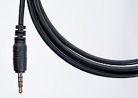
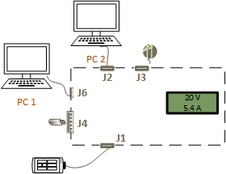
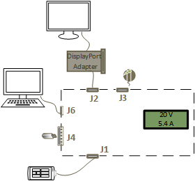
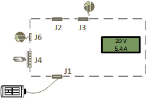
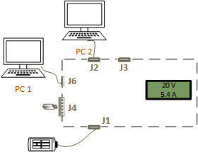

# Test USB Type-C systems with USB Type-C ConnEx


**Summary**

-   Automated testing by using USB Type-C ConnEx
-   USB Type-C interoperability test procedures in Windows 10: functional testing (FT) and stress testing (ST).
-   Diagnostic procedures and tips to confirm scenarios, such as device addition and removal.

**Applies to**

-   Windows 10

**Official specifications and procedures**

-   [USB 3.1 and USB Type-C specifications]( http://go.microsoft.com/fwlink/p/?LinkId=620208)
-   [xHCI interoperability test procedures](http://go.microsoft.com/fwlink/p/?LinkId=623257)

**Last Updated**

-   February 2016

\[Some information relates to pre-released product which may be substantially modified before it's commercially released. Microsoft makes no warranties, express or implied, with respect to the information provided here.\]

The MUTT Connection Exerciser Type-C (USB Type-C ConnEx) hardware board is a custom shield for the Arduino board. The shield provides a four-to-one switch to automate interoperability tests for USB Type-C scenarios.

This topic provides guidelines to automate the testing of systems, devices, docks with USB Type-C connectors and their interoperability with the Windows operating system. You can test hardware that belong to one of the following categories:

-   System: Desktops, laptops, tablets, servers, or phones running a SKU of a version of the Windows operating system with an exposed USB Type-C port.
-   Dock: Any USB Type-C device that exposes more than one port.
-   Device: Any USB device with a Type-C port that can be attached to a system or dock. This category includes traditional USB devices as well as devices that support the accessory and alternate modes as defined in the USB Type-C specification.

## Hardware requirements


To perform the USB Type-C interoperability test procedures by using USB Type-C ConnEx, you need:

-   **System under test (SUT)**

    Desktops, laptops, tablets, servers, or phones with at least one exposed Type-C USB port.

-   **Arduino Mega 2560 R3**

    [Arduino Mega 2560 R3](http://go.microsoft.com/fwlink/p/?LinkId=733526) is used as the microcontroller for the test setup. This board can be purchased from the [Arduino store](http://go.microsoft.com/fwlink/p/?LinkId=733526).

    

-   **Power adapter for the microcontroller**.

    For information about compatible adapters for the Arduino Mega 2560 R3 board, [see this site](http://go.microsoft.com/fwlink/p/?LinkID=733660).

-   **USB Type-C ConnEx**

    The shield has one male USB Type-C port (labeled **J1**) to which the SUT is connected. The shield also has four other USB ports (labeled **J2**, **J3**, **J4**, **J6**) to which devices can be attached that act as peripherals to the SUT. The shield monitors amperage and voltage being drawn from the SUT. You can buy this board from [MCCI](http://go.microsoft.com/fwlink/p/?LinkId=733488) or [JJG Technologies]( http://go.microsoft.com/fwlink/p/?linkid=618287).

    

-   **USB A-to-B cable**

    You will use this cable to connect a PC to the microcontroller in order to update the firmware on the microcontroller to run tests.

-   **Peripheral USB devices**

    Any USB device with a USB Type-C port that can be attached to the SUT. This category includes traditional USB devices and other devices that support the accessory and alternate modes as defined in the USB Type-C specification.

-   **USB charger**

    USB Type-C that supports USB Type-C current requirements and optionally [USB Power Delivery](http://go.microsoft.com/fwlink/p/?LinkID=623310). You also need a USB Micro-B charger for **J6**.

-   **Proxy controller**

    The USB Type-C ConnEx can be controlled by using a proxy for running the tests. The proxy controller can be one of these entities:

    -   Secondary desktop PC or a laptop.

        The proxy controller communicates, with a mobile SUT; the microcontroller to load the firmware.

    -   SUT by using a secondary USB port.
    -   SUT by using a 3.5mm audio jack.

        In this set up, you need:

        -   DTMF shield to run tests on SUTs with a single USB Type-C port. DTMF provides the ability to control the shield from a single-port device with an audio jack after the initial flash of the firmware has been completed.

            

        -   4-pin male-to-male audio cable used to connect the DTMF shield to the SUT. This allows the SUT to control the USB Type-C shield during testing.

            

## Software requirements


Make sure you meet these requirements:

-   Your SUT must have the version of the Windows operating system with which you want to test interoperability.
-   The proxy controller must be running Windows 10.
-   [](http://go.microsoft.com/fwlink/p/?LinkId=786621) and install the latest MUTT software package on the proxy controller.
-   The package is a suite of tools used to run tests with USB Type-C ConnEx .

    It includes utilities to update the firmware, switch between the peripheral ports, and send requests to simulate test cases. It also contains test driver packages that test the functionality of the buses, its controller, and devices connected to the bus.

-   Installation of the test tools requires an elevated command window.

    To open an elevated command window, the user must be a member of the **Administrators** group on the proxy controller. To open an elevated Command Prompt window, create a desktop shortcut to Cmd.exe, right-click the Cmd.exe shortcut, and select **Run as administrator**.

### USB Type-C ConnEx tools

Here are the tools in MUTT software package that are specific to USB Type-C ConnEx

| Tool                          | Description                                                                                          |
|-------------------------------|------------------------------------------------------------------------------------------------------|
| [ConnExUtil.exe](#connexutil) | Command line tool for exercising USB Type-C ConnEx features.                                             |
| [CxLoop.cmd](#cxloop)         | Connects and disconnects each port once.                                                             |
| [CxStress.cmd](#cxstress)     | Randomized stress script.                                                                            |
| [CxPower.cmd](#cxpower)       | Captures power data (voltage and amperage) over a period of time and sends the output to a CSV file. |


For information about all other tools, see [Tools in the MUTT software package](mutt-software-package.md).

## Get started...


Follow this procedure to set up your test environment.


The configuration should be similar to this image. Note that the USB Type-C port on the microcontroller provides control over USB Type-C ConnEx when connected to a PC.

In these steps, you will connect the hardware pieces, update the firmware on the microcontroller, and validate the installation. The DTMF shield provides control over USB Type-C ConnEx when connected to the audio port of a phone or tablet.

1.  Connect the microcontroller to the USB Type-C shield.

    If the USB Type-C ConnEx did not come assembled, then continue with step 1. If your USB Type-C ConnEx has been assembled, then proceed to step 2.

    **Caution**   This step must be performed carefully because the pins bend easily.


    1.  Align the pins of the USB Type-C shield with the receptors on the microcontroller by making sure that the boards are level to each other.

        

    2.  Gently press the two boards together. Be careful not to bend the pins on the shield.

        

        Your assembled unit should be similar to this image:

        

2.  Power the USB Type-C ConnEx from the attached microcontroller by using either the USB Type-B (connected to the proxy controller) or from an external power adapter. The LCD display is similar to this image:

    After five seconds, the LCD display shows the current and voltage.

    

    If you do not the see display as shown in the previous image, make sure your have assembled the unit correctly.

3.  Update the microcontroller with the USB Type-C ConnEx firmware.
    -   Open an elevated Command Prompt window.
    -   Navigate to the location of the MUTT software package, such as C:\\Program Files (x86)\\USBTest\\*&lt;arch&gt;*.
    -   Run the following command:

        **MuttUtil.exe –UpdateTabFirmware**

4.  Plug in the SUT to the male USB Type-C port (labeled **J1**) on the shield.

    **Caution**  The **J1** connector requires additional support when connecting the SUT. The connector is not sturdy enough to sustain the weight of a device or by itself.

    

5.  Attach the peripherals to the USB ports labeled **J2**, **J3**, **J4**, **J6**.

    

6.  Attach the proxy controller to the microcontroller.
    -   If the proxy controller is a desktop PC or laptop, establish connection over USB. Connect the USB Type-B port on the microcontroller to a USB port on the proxy controller, as shown in the preceding image.
    -   If the proxy controller is a mobile SUT, establish connection by using the audio port. For this connection, you need the DTMF shield.
        1.  Connect the DTMF shield to the assembled unit as shown in this image:

            

        2.  Connect the audio port of the shield to the audio port on the SUT by using a 4-pin male-to-male audio cable.

            Your setup should be similar to this image:

            

7.  Make sure USB Type-C ConnEx is recognized by Device Manager on the proxy controller.
    1.  Right-click the Start button in the task bar and select **Device Manager**.
    2.  Expand the **Ports (COM & LPT)** node and note the COM port that is used by the microcontroller. In this example, it is connected to COM 4.

        

## ConnExUtil.exe


Here are the command line options that ConnExUtil.exe supports for controlling the USB Type-C ConnEx board.

<table>
<colgroup>
<col width="33%" />
<col width="33%" />
<col width="33%" />
</colgroup>
<thead>
<tr class="header">
<th>Use case</th>
<th>Option</th>
<th>Description</th>
</tr>
</thead>
<tbody>
<tr class="odd">
<td>Device Discovery
<p>List all devices connected to USB Type-C ConnEx</p></td>
<td><strong>/list</strong></td>
<td>For USB connected devices, this option lists the device instance path. For audio connected devices it shows <strong>Audio</strong>.
<p>To view audio devices, use this in combination with the <strong>/all</strong> parameter. Lists with 1-based index that can be used for input to the <strong>/#</strong> parameter.</p></td>
</tr>
<tr class="even">
<td>Device Selection
<p>Select all devices connected to USB Type-C ConnEx, including audio.</p></td>
<td><strong>/all</strong></td>
<td>Optional.
<p>Without this parameter, the utility addresses USB connected devices. Use this parameter only if an audio connected device is in use. Audio discovery is time consuming and disabled by default.</p></td>
</tr>
<tr class="odd">
<td>Device Selection
<p>Select a specific device connected to USB Type-C ConnEx ‘n’.</p></td>
<td><strong>/#</strong> <em>n</em></td>
<td>(Optional)
<p>Input <em>n</em> is a 1-based index of the available devices connected to USB Type-C ConnEx which can be viewed by using the <strong>/list</strong> parameter. Without this parameter, the default behavior is to run each command on all USB Type-C ConnEx boards.</p></td>
</tr>
<tr class="even">
<td>Device Command</td>
<td><strong>/setPort</strong> <em>p</em></td>
<td>Switch to the specified port <em>p</em>.
<p>Connect a port either by specifying number (1 – 4) or by name (<strong>J2</strong>, <strong>J3</strong>, <strong>J4</strong>, <strong>J6</strong>).</p>
<p>0 disconnects all ports.</p></td>
</tr>
<tr class="odd">
<td>Device Command</td>
<td><strong>/getPort</strong></td>
<td>Read the currently connected port.</td>
</tr>
<tr class="even">
<td>Device Command
<p>Read amperage/voltage information</p></td>
<td><p><strong>/volts</strong></p>
<p><strong>/amps</strong></p>
<p><strong>/version</strong></p></td>
<td><p>Read the current voltage.</p>
<p>Read the current amperage.</p>
<p>Read the device version.</p></td>
</tr>
<tr class="odd">
<td>Device Command
<p>Enable SuperSpeed</p></td>
<td><strong>/SuperSpeedOn</strong></td>
<td>Enables SuperSpeed globally for current and future connections until a <strong>/SuperSpeedOff</strong> command is sent.
<p>SuperSpeed is enabled by default.</p>
<p>If SuperSpeed is disabled, and port 1 or 2 is connected, this command triggers a reconnect at SuperSpeed.</p></td>
</tr>
<tr class="even">
<td>Device Command
<p>Disable SuperSpeed</p></td>
<td><strong>/SuperSpeedOff</strong></td>
<td>Disables SuperSpeed globally for current and future connections until a <strong>/SuperSpeedOn</strong> command is sent or the device is reset.
<p>If SuperSpeed is enabled and port 1 or 2 is connected, this command triggers a reconnect with SuperSpeed lines disabled.</p></td>
</tr>
<tr class="odd">
<td><p>Set command delay</p></td>
<td><strong>/setDelay</strong> <em>t</em></td>
<td>Sets command delay <em>t</em> in seconds.
<p>Setting a command delay will cause the next <strong>/setPort</strong> or <strong>/SuperSpeed{On/Off}</strong> command to be delayed by <em>t</em> seconds where <strong>t</strong> ranges from 0 to 99. This is a one-time setting, only the next command is delayed. Sending multiple commands before the delay timer has expired is not supported.</p></td>
</tr>
<tr class="even">
<td><p>Set disconnect timeout in milliseconds</p></td>
<td><strong>/setDisconnectTimeout</strong> <em>t</em></td>
<td>Set a disconnect timeout for the next non-zero <strong>/setPort</strong> command. On the next connect event, the port will only remain connected for <em>t</em> milliseconds before disconnecting. This is a one-time setting, only the next connect event will be automatically disconnected. Allowed range is from 0 – 9999 ms.</td>
</tr>
<tr class="odd">
<td><p>Batch Command:</p>
<p>Output power measurements to a .csv file.</p></td>
<td><strong>/powercsv</strong></td>
<td>Append the current power measurements and timestamp into power.csv The first run creates power.csv. On subsequent runs appends data to this file.
<p>Rename or delete the file to start fresh data capture. Each run appends a line with the following format: <em>&lt;index&gt;,&lt;time&gt;,&lt;volts&gt;,&lt;amps&gt;</em>.</p>
<p><em>index</em> is the device index given by <strong>/list</strong>, so multiple devices may be monitored simultaneously.</p>
<p><em>time</em> is the raw timestamp in seconds.</p>
<p><em>volts</em> and <em>amps</em> are recorded to two decimal places.</p>
<p>This data may be captured over long periods of time and plotted in a spreadsheet application, see the cxpower.cmd script.</p></td>
</tr>
<tr class="even">
<td><p>Batch Command:</p>
Run unit test of major functionality</td>
<td><strong>/test</strong></td>
<td>Tests all the major functionality of the device. Use for basic validation of the functionality of the device. If this command fails, please power cycle the device and update the firmware.</td>
</tr>
<tr class="odd">
<td><p>Batch Command:</p>
Basic demo of the port switching sequence.</td>
<td><strong>/demo d</strong></td>
<td>Loop through all ports one time, with <em>d</em> second delay on each port
<p>Writes the port number, volts and amps on each port into demoresult.txt.</p></td>
</tr>
</tbody>
</table>


### Sample Commands

Connect to a port

``` syntax
connexutil.exe /setport 1
```

Alternatively use the port name as printed on the board:

``` syntax
connexutil.exe /setport J3
```

Disconnect all ports

``` syntax
connexutil.exe /setport 0
```

Loop through all ports

``` syntax
for %p in (1 2 3 4) 
do (
    connexutil.exe /setport %p
    echo Confirm device on port %p
    pause
)
```

## Scripts for controlling the USB Type-C ConnEx board


These scripts exercise the control interface supported by ConnExUtil.exe to run sequential and stress type tests with the USB Type-C ConnEx through the command line. All of these scripts support the optional command line parameter **audio** to indicate that the USB Type-C ConnEx board is connected over the 3.5 mm audio interface. By default they will only attempt to use USB connected boards.

### <a href="" id="cxloop"></a>Simple connect / disconnect sequence: CXLOOP.CMD

Connects and disconnects the SUT to and from each port (1-4) and pauses on each port prompting the tester to validate the connection on that port.

### <a href="" id="cxstress"></a>Random connect / disconnect loop: CXSTRESS.CMD

Connects and disconnects the SUT to and from each port at random for a random interval of 0.0-5.0 seconds in an infinite loop. When connecting to the USB Type-C ports it will randomly enable or disable SuperSpeed connection on that port, and will randomly instruct the board to disconnect quickly on that port at some random interval 0 – 999 ms.

The command line parameter **C** causes the script to only switch between the USB Type-C ports and the disconnected state. A numeric command line parameter resets the maximum random interval between switches from the default of 5.0 seconds to the input value in seconds. Parameters may be passed in any order.

### <a href="" id="cxpower"></a>Long running power measurement: CXPOWER.CMD

Saves the amperage and voltage reported by the USB Type-C ConnEx to output file power.csv at 2 second intervals. The data is formatted as comma-separated variables as follows:

<em>index</em>**,**<em>time</em>**,**<em>volts</em>**,**<em>amps</em>

*index* is the device index given by the **ConnExUtil.exe /list** command so multiple devices may be monitored simultaneously.

*time* is the raw timestamp in seconds.

*volts* and *amps* are recorded to 2 decimal places.

After capture is complete, this data may be post processed into charts showing power consumption over time, for example the power consumption for the duration of a battery charge cycle. A numeric command line parameter resets the default measurement interval of 2 seconds to the input value in seconds.

##  About test cases


The USB Type-C interoperability test procedures are divided into two sections: functional testing (FT) and stress testing (ST). Each test section describes the test case and identifies the category that applies to the test. The product must be tested against the entire applicable category. Certain test cases contain links to relevant hints and tips for additional information. This section is focused on USB Type-C functionality and experience. A USB Type-C solution may contains other USB components such as a USB hub or USB controller. Detailed testing of USB hubs and controllers is covered in both the USB-IF's [xHCI interoperability test procedures](http://go.microsoft.com/fwlink/p/?LinkId=623257) and the Windows Hardware Certification Kit.

These test cases are based on the ConnExUtil commands and example scripts [Scripts for controlling the USB Type-C ConnEx board](#scripts). The test cases refer to the scripts. Customize the scripts as required for your test scenario.

<a href="" id="device-enumeration"></a>[Device Enumeration](#ft1)  
Confirms that core aspects of device enumeration are functional.

<a href="" id="alternate-mode-negotiation"></a>[Alternate Mode Negotiation](#ft2)  
Confirms supported alternate modes.

<a href="" id="charging-and-power-delivery--pd-"></a>[Charging and power delivery (PD)](#ft3)  
Confirms charging with USB Type-C.

<a href="" id="role-swap"></a>[Role Swap](#ft4)  
Confirms role swap.

The stress testing section describes procedures for stress and edge case scenarios, which test device stability over a period of time. Stress testing does require a custom device (the SuperMUTT) for legacy USB validation (non USB Type-C). Additional testing and automation can be achieved with the upcoming USB Type-C test device.

<a href="" id="device-enumeration"></a>[Device Enumeration](#st1)  
Confirms that core aspects of device enumeration are functional.

<a href="" id="charging-and-power-delivery--pd-"></a>[Charging and power delivery (PD)](#st2)  
Confirms charging with USB Type-C.

## FT Case 1: Device Enumeration




| Port   | Device                                                                              |
|--------|-------------------------------------------------------------------------------------|
| **J1** | SUT.                                                                                |
| **J2** | PC with USB Type-C port that is connected by using a USB Type-C cable.              |
| **J3** | USB Type-C charger.                                                                 |
| **J4** | USB Hub (SuperSpeed or high speed) with a mouse connected downstream.               |
| **J6** | PC with USB Type-A port cable connected by using a USB Type-A to USB Micro-B cable. |


1.  Power off the SUT.
2.  Connect the SUT to the port labeled as **J1** on USB Type-C ConnEx.
3.  Connect the proxy controller to USB Type-C ConnEx.
4.  Connect peripherals to USB Type-C ConnEx.
5.  Power on the SUT and log on to Windows.
6.  At an elevated Command prompt, run the CXLOOP.CMD script. When script pauses, confirm the newly activated peripheral is operational.
7.  Reverse the orientation of USB Type-C cable and repeat step 5 - 7.

For configuration images related to step 2 -4, see [Get started...](#config).

## FT Case 2: Alternate Mode Negotiation




| Port   | Device                                                                              |
|--------|-------------------------------------------------------------------------------------|
| **J1** | SUT.                                                                                |
| **J2** | DisplayPort to USB Type-C dongle.                                                   |
| **J3** | USB Type-C charger.                                                                 |
| **J4** | USB Hub (SuperSpeed or high speed) with a flash drive connected downstream.         |
| **J6** | PC with USB Type-A port cable connected by using a USB Type-A to USB Micro-B cable. |


1.  Power off the SUT.
2.  Connect the SUT to the port labeled as **J1** on USB Type-C ConnEx.
3.  Connect the proxy controller to USB Type-C ConnEx.
4.  Connect peripherals to USB Type-C ConnEx.
5.  Power on the SUT and log on to Windows.
6.  At an elevated Command prompt, run the CXLOOP.CMD script. When script pauses, confirm the newly activated peripheral is operational.
7.  Reverse the orientation of USB Type-C cable and repeat step 5 - 7.

For configuration images related to step 2 -4, see [Get started...](#config).

## FT Case 3: Charging and power delivery (PD)




| Port   | Device               |
|--------|----------------------|
| **J1** | SUT.                 |
| **J2** | None.                |
| **J3** | USB Type-C charger.  |
| **J4** | USB mouse.           |
| **J6** | USB Micro-B charger. |


1.  Power off the SUT.
2.  Connect the SUT to the port labeled as **J1** on USB Type-C ConnEx.
3.  Connect the proxy controller to USB Type-C ConnEx.
4.  Connect peripherals to USB Type-C ConnEx.
5.  Power on the SUT and log on to Windows.
6.  At an elevated Command prompt, run the CXLOOP.CMD script. When script pauses, confirm the newly activated peripheral is operational.
7.  Reverse the orientation of USB Type-C cable and repeat step 5 - 7.
8.  Connect USB Type-C ConnEx to port **J2**.

    **ConnExUtil.exe /setPort 2**

9.  If SUT contains more than one USB Type-C port, connect two USB Type-C ports on the same system with a USB Type-C cable.

    Confirm that the SUT is not charging (itself).

    Confirm that the LCD reading of power matches the expectations of the wall adapter.

10. Replace the USB Type-C charger connected to **J3** with another USB Type-C charger from a different manufacturer.

    Confirm the device is receiving current.

For configuration images related to step 2 -4, see [Get started...](#config).

## FT Case 4: Role Swap




| Port   | Device                                                                              |
|--------|-------------------------------------------------------------------------------------|
| **J1** | SUT.                                                                                |
| **J2** | PC with USB Type-C port that is connected by using a USB Type-C cable.              |
| **J3** | None.                                                                               |
| **J4** | USB flash drive.                                                                    |
| **J6** | PC with USB Type-A port cable connected by using a USB Type-A to USB Micro-B cable. |


1.  Power off the SUT.
2.  Connect the SUT to the port labeled as **J1** on USB Type-C ConnEx.
3.  Connect the proxy controller to USB Type-C ConnEx.
4.  Connect peripherals to USB Type-C ConnEx.
5.  Power on the SUT and log on to Windows.
6.  At an elevated Command prompt, run the CXLOOP.CMD script. When script pauses, confirm the newly activated peripheral is operational.
7.  Reverse the orientation of USB Type-C cable and repeat step 5 - 7.
8.  Connect USB Type-C ConnEx to port **J2**.

    Confirm role swap. The Amperage shown on the LCD screen indicates power roles. **+ve** if **J1** is the power sink; **-ve** if **J1** is the power source.

9.  Perform necessary steps to swap data roles and confirm current roles of each system have changed.

For configuration images related to step 2 -4, see [Get started...](#config).

## ST Case 1: Device Enumeration


| Port   | Device                                                                              |
|--------|-------------------------------------------------------------------------------------|
| **J1** | SUT.                                                                                |
| **J2** | PC with USB Type-C port that is connected by using a USB Type-C cable.              |
| **J3** | USB Type-C charger.                                                                 |
| **J4** | USB Hub (SuperSpeed or high speed) with a mouse connected downstream.               |
| **J6** | PC with USB Type-A port cable connected by using a USB Type-A to USB Micro-B cable. |


1.  Power off the SUT.
2.  Connect the SUT to the port labeled as **J1** on USB Type-C ConnEx.
3.  Connect the proxy controller to USB Type-C ConnEx.
4.  Connect peripherals to USB Type-C ConnEx.
5.  Power on the SUT and log on to Windows.
6.  At an elevated Command prompt, run the CXSTRESS.CMD for 12 hours.

    Terminate the script by pressing Ctrl-C.

7.  Perform the steps described in [FT Case 1: Device Enumeration](#ft1).

For configuration images related to step 2 -4, see [Get started...](#config).

## ST Case 2: Charging and power delivery (PD)


| Port   | Device               |
|--------|----------------------|
| **J1** | SUT.                 |
| **J2** | None.                |
| **J3** | USB Type-C charger.  |
| **J4** | USB mouse.           |
| **J6** | USB Micro-B charger. |


1.  Power off the SUT.
2.  Connect the SUT to the port labeled as **J1** on USB Type-C ConnEx.
3.  Connect the proxy controller to USB Type-C ConnEx.
4.  Connect peripherals to USB Type-C ConnEx.
5.  Power on the SUT and log on to Windows.
6.  At an elevated Command prompt, run the CXSTRESS.CMD for 12 hours. .

    Terminate the script by pressing Ctrl-C.

7.  Perform the steps described in [FT Case 3: Charging and power delivery (PD)](#ft3).

For configuration images related to step 2 -4, see [Get started...](#config).

## Additional test resources


The following functional tests can be adapted for USB Type-C to improve traditional USB scenarios.

| Test case                                | Description                                                                                                                  | Category             |
|------------------------------------------|------------------------------------------------------------------------------------------------------------------------------|----------------------|
| [System Boot](type.md#ft2)              | Confirms that the product does not inhibit normal system boot.                                                               | System, Dock, Device |
| [System Power Transitions](type.md#ft3) | Tests whether the system's power transitions and wake-up capability from lower power states are not affected by the product. | System, Dock, Device |
| [Selective Suspend](type.md#ft4)        | Confirms the selective suspend transitions.                                                                                  | Dock, Device         |


The following stress tests can be adapted from the SuperMUTT test documentation to expand USB scenarios.

| Test case                                | Description                                                     | Category             |
|------------------------------------------|-----------------------------------------------------------------|----------------------|
| [System Power Transitions](type.md#st1) | Tests product reliability after repetitive system power events. | System, Dock, Device |
| [Transfer Events](type.md#st2)          | Generates multiple transfer and connection events.              | System, Dock, Device |
| [Plug and Play (PnP)](type.md#st3)      | Generates various PnP sequences.                                | System, Dock, Device |
| [Device Topology](type.md#st4)          | Tests a range of devices and topologies with the product.       | System, Dock, Device |


## Validating success or failure of the tests


### Confirming charging and power

The onboard LCD on the USB Type-C ConnEx displays power (volts, amps, and direction). Confirm that it matches expectations from power sources plugged in and actively enabled with the USB Type-C ConnEx .


### Confirming device addition on desktops

1.  Identify the USB host controller to which your device is connected.
2.  Make sure that the new device appears under the correct node in Device Manager.
3.  For USB 3.0 hubs connected to a USB 3.0 port, expect to see two hub devices: one enumerated at SuperSpeed and another at high speed.

### Confirm device removal on desktops

1.  Identify your device in Device Manager.
2.  Perform the test step to remove the device from the system.
3.  Confirm that the device is no longer present in Device Manager.
4.  For a USB 3.0 hub, check that both devices (SuperSpeed and companion hubs) are removed. Failure to remove a device in this case may be a device failure and should be investigated by all components involved to triage the appropriate root cause.

### Confirm device functionality

-   If the device is a USB hub, make sure that the devices that are downstream of the hub are functional. Verify that other devices can be connected to available ports on the hub.
-   If the device is an HID device, test its functionality. Make sure that a USB keyboard types, a USB mouse moves the cursor, and a gaming device is functional in the game controller's control panel.
-   A USB audio device must play and/or record sound.
-   A storage device must be accessible and should be able to copy a file 200MB or more in size.
-   If the device has multiple functions, such as scan & print, make sure to test both the scan and print functionality.
-   If the device is a USB Type-C device, confirm that the applicable USB and alternate modes are functional.

## Using ETW to log issues


Go to https://aka.ms/usbtrace for instructions and to download a script for capturing ETW traces from the USB drivers.

## Reporting test results


Provide these details:

-   The list of tests (in order) that were performed before the failed test.
-   The list must specify the tests that have failed or passed.
-   Systems, devices, docks, or hubs that were used for the tests. Include make, model, and Web site so that we can get additional information, if needed.


