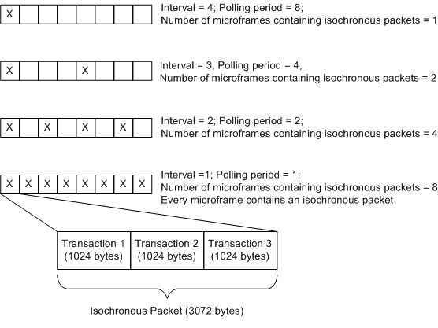
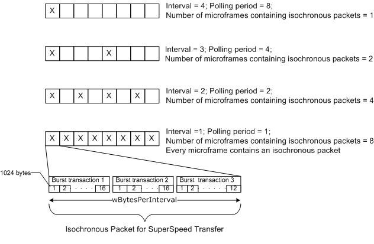

# How to transfer data to USB isochronous endpoints


This topic describes how a client driver can build a USB Request Block (URB) to transfer data to and from isochronous endpoints in a USB device.

A Universal Serial Bus (USB) device can support isochronous endpoints to transfer time-dependent data at a steady rate, such as with audio/video streaming. To transfer data, the client driver issues a request to read or write data to an isochronous endpoint. As a result, the host controller initiates an isochronous transfer that sends or receives data by polling the device at regular intervals.

For high speed and full speed devices, the polling is done by using (IN/OUT) token packets. When the endpoint is ready to send data, the device responds to one of the IN token packets by sending data. To write to the device, the host controller sends an OUT token packet followed by data packets. The host controller or device does not send any handshake packets, and therefore, there is no guaranteed delivery. Because the host controller does not attempt to retry the transfer, data might be lost if an error occurs.

For isochronous transfers the host controller reserves certain periods of time on the bus. To manage the reserved time for isochronous endpoints, the time is divided into consecutive logical chucks are called *bus intervals*. The unit of bus interval depends on the bus speed.

For full speed, a bus interval is a *frame*. The length of a frame is 1 millisecond.

For high speed and SuperSpeed, the bus interval is a microframe. The length of a microframe is 125 microseconds. Eight consecutive microframes constitute one high-speed or SuperSpeed frame.

Isochronous transfers are packet based. The term *isochronous packet* in this topic refers to the amount of data that is transferred in one bus interval. The characteristics of the endpoint determine the size of each packet is fixed and determined by the characteristics of the endpoint.

The client driver starts an isochronous transfer by creating an URB for the request and submitting the URB to the USB driver stack. The request is handled by one of the lower drivers in the USB driver stack. Upon receiving the URB, the USB driver stack performs a set of validations and schedules transactions for the request. For full speed, an isochronous packet to be transferred in each bus interval is contained in a single transaction on the wire. Certain high-speed devices permit multiple transactions in a bus interval. In that case, the client driver can send or receive more data in the isochronous packet in a single request (URB). SuperSpeed devices support multiple transactions and burst transfers, allowing even more bytes per bus interval. For more information about burst transfers, see USB 3.0 specification page 9-42.

### Prerequisites

Before you create a request for an isochronous transfer, you must have information about the pipe that is opened for the isochronous endpoint.

A client driver that uses Windows Driver Model (WDM) routines has the pipe information in one of the [**USBD\_PIPE\_INFORMATION**](https://msdn.microsoft.com/library/windows/hardware/ff539114) structures of a [**USBD\_INTERFACE\_LIST\_ENTRY**](https://msdn.microsoft.com/library/windows/hardware/ff539076) array. The client driver obtained that array in the driver's previous request to select a configuration or an interface in the device.

A Windows Driver Framework (WDF) client driver must get a reference to the framework's target pipe object and call [**WdfUsbTargetPipeGetInformation**](https://msdn.microsoft.com/library/windows/hardware/ff551142) to obtain pipe information in a [**WDF\_USB\_PIPE\_INFORMATION**](https://msdn.microsoft.com/library/windows/hardware/ff553037) structure.

Based on the pipe information, determine this set of information:

-   How much data can the host controller send to the pipe in each packet.

    The amount of data that the client driver can send in a request cannot exceed the maximum number of bytes that the host controller can send or receive from an endpoint. The maximum number of bytes is indicated by the **MaximumPacketSize** member of [**USBD\_PIPE\_INFORMATION**](https://msdn.microsoft.com/library/windows/hardware/ff539114) and [**WDF\_USB\_PIPE\_INFORMATION**](https://msdn.microsoft.com/library/windows/hardware/ff553037) structures. The USB driver stack sets the **MaximumPacketSize** value the during a select-configuration or select-interface request.

    For full speed devices, **MaximumPacketSize** is derived from the first 11 bits of the **wMaxPacketSize** field of the endpoint descriptor, which indicates the maximum number of bytes that the endpoint can send or receive in a transaction. For full speed devices the controller sends one transaction per bus interval.

    In a high-speed isochronous transfer, the host controller can send additional transactions in a bus interval if the endpoint allows them. The number of additional transactions is set by the device and indicated in bits 12..11 of the **wMaxPacketSize**. That number can be 0, 1, or 2. If 12..11 indicate 0, additional transactions per microframe are not supported by the endpoint. If the number is 1, then the host controller can send an additional transaction (total of two transactions per microframe); 2 indicates two additional transactions (total of three transactions per microframe). The **MaximumPacketSize** value that is set by the USB driver stack includes the number of bytes that can be sent in additional transactions.

    For SuperSpeed isochronous transfer, certain values of USB\_SUPERSPEED\_ENDPOINT\_COMPANION\_DESCRIPTOR (see Usbspec.h) are important. The USB driver stack uses those values to calculate the maximum number of bytes in a bus interval.

    -   **Isochronous.Mult** field of endpoint companion descriptor. In SuperSpeed isochronous transfers, the additional transactions (much like high-speed devices) are referred to as burst transactions. The **Mult** value indicates the maximum number of burst transactions that the endpoint supports. There can be up to three burst transactions (indexed 0 to 2) in a service interval.
    -   **bMaxBurst** field of the endpoint companion descriptor. This value indicates the number of chunks of **wMaxPacketSize** that can be present in a single burst transaction. There can be up to 16 chunks (indexed 0 to 15) in a burst transaction.
    -   **wBytesPerInterval** indicates the total number of bytes that the host can send or receive in a bus interval. Even though the maximum number of bytes per bus interval can be calculated as (**bMaxBurst**+1) \* (**Mult**+1) \* **wMaxPacketSize**, the USB 3.0 specification recommends using the **wBytesPerInterval** value instead. The **wBytesPerInterval** value must be less than or equal to that calculated value.

    **Important**  For a client driver the values described in the preceding is for information only. The driver must always use the **MaximumPacketSize** value of the endpoint descriptor to determine the layout of the transfer buffer.


-   How often does the endpoint send or receive data.

    The **Interval** member is used to determine how often the endpoint can send or receive data. The device sets that value and the client driver cannot changed it. The USB driver stack uses another number to determine the frequency with which it inserts isochronous packets into the data stream: the polling period, which is derived from the **Interval** value.

    For full-speed transmissions, the **Interval** and polling period values are always 1; the USB driver stack ignores other values.

    The following table shows **Interval** and the calculated polling period for high speed and SuperSpeed transfers:

    | Interval | Polling period (2Interval-1)                      |
    |----------|---------------------------------------------------|
    | 1        | 1; Data is transferred every bus interval.        |
    | 2        | 2; Data is transferred every second bus interval. |
    | 3        | 4; Data is transferred every fourth bus interval. |
    | 4        | 8; Data is transferred every eighth bus interval. |


-   What are the restrictions on the number of packets for each bus speed.

    In an URB, you can only send up to 255 isochronous packets for a full-speed device; 1024 packets in an URB for in high speed and SuperSpeed devices. The number of packets you send in the URB must be a multiple of the number of packets in each frame.

    | Polling period | Number of Packets for high speed/SuperSpeed |
    |----------------|---------------------------------------------|
    | 1              | Multiple of 8                               |
    | 2              | Multiple of 4                               |
    | 3              | Multiple of 2                               |
    | 4              | Any                                         |


Consider an example full-speed endpoint with **wMaxPacketSize** is 1,023. For this example, the application supplied buffer of 25,575 bytes. The transfer for that buffer requires 25 isochronous packets (25575/1023).

Consider an example high-speed endpoint with the following characteristics indicated in the endpoint descriptor.

-   **wMaxPacketSize** is 1,024.
-   Bits 12..11 indicate two additional transactions.
-   **Interval** is 1.

After the client driver selects a configuration, **MaximumPacketSize** for the isochronous pipe indicates 3,072 bytes (total transactions \* **wMaxPacketSize**). The additional transactions allow the client driver to transfer 3,072 bytes in every microframe, and total 24,576 bytes in one frame. The following illustration shows how often an isochronous packet is transferred in one microframe for high-speed transmissions.



Consider an example SuperSpeed endpoint with these characteristics indicated in the endpoint and SuperSpeed endpoint companion descriptors:

-   **wMaxPacketSize** is 1,024.
-   **bMaxBurst** is 15.
-   **Interval** is 1.
-   **Isochronous.Mult** is 2.
-   **wBytesPerInterval** is 45000.

In preceding example, even though maximum number of bytes can be calculated as **wMaxPacketSize** \* (**bMaxBurst** +1) \* (**Mult** + 1) resulting in 49,152 bytes, the device limits the value to the **wBytesPerInterval** value that is 45,000 bytes. That value is also reflected in **MaximumPacketSize** 45,000. The client driver must only use the **MaximumPacketSize** value. In this example, the request can be divided into three burst transactions. The first two burst transactions each contain 16 chunks of **wMaxPacketSize**. The last burst transaction contains 12 chunks to hold the remaining bytes. This image shows the polling interval and bytes transferred through an isochronous packet for SuperSpeed transmission.



The following procedure describes how to build a request for an isochronous transfer.

1.  Get the size of each isochronous packet.
2.  Determine the number of isochronous packets per frame.
3.  Calculate the number of isochronous packets that are required to hold the entire transfer buffer.
4.  Allocate a [**URB**](https://msdn.microsoft.com/library/windows/hardware/ff538923) structure to describe the details of the transfer.
5.  Specify the details of each isochronous packet, such as packet offset.

For complete code example about sending isochronous transfer requests, USBSAMP.

This example in this topic simplifies USBSAMP implementation of isochronous transfer. The sample calculates the total number frames required for the transfer. Based on the amount of data that can be sent in a frame, the transfer buffer is divided into smaller chunk-sized bytes.

The following procedure elaborates the preceding steps and shows calculations and routines that a client driver can use to build and send an isochronous transfer request for a high-speed isochronous endpoint. The values used in the procedure are based on the example endpoint characteristics described earlier.

Instructions
------------

### <a href="" id="get-the-size-of-an-isochronous-packet--"></a>Step 1: Get the size of an isochronous packet.

Determine the size of an isochronous packet by inspecting the pipe's **MaximumPacketSize** value.

For full-speed transmissions, the size of an isochronous packet is the number of bytes you can transfer in one frame. For high-speed and SuperSpeed transmissions, the size of an isochronous packet is the total number of bytes that can be transferred in one microframe. Those values are indicated in the pipe’s **MaximumPacketSize**.

In the example, **MaximumPacketSize** is 1023 bytes per frame (full speed); 3072 bytes per microframe (high speed); 45,000 bytes per microframe (SuperSpeed).

**Note**  The **MaximumPacketSize** value indicates the maximum permitted size of the isochronous packet. The client driver can set the size of each isochronous packet to any value less than the **MaximumPacketSize** value.


### <a href="" id="determine-the-number-of-isochronous-packets-per-frame-"></a>Step 2: Determine the number of isochronous packets per frame.

For full-speed transmissions, you transfer one isochronous packet in each frame.

For high-speed and SuperSpeed transmissions, this value must be derived from the Interval value. In the example, Interval is 1. Therefore, the number of isochronous packets must be eight per frame. For other Interval values, see the table in the Prerequisites section.

### <a href="" id="calculate-the-number-of-isochronous-packets-that-are-required-to-hold-the-entire-transfer-buffer-"></a>Step 3: Calculate the number of isochronous packets that are required to hold the entire transfer buffer.

Calculate the number of isochronous packets that are required to transfer the entire buffer. This value can be calculated by dividing the length of the transfer buffer by the size of an isochronous packet.

In this example, we assume that size of each isochronous packet is **MaximumPacketSize** and the transfer buffer length is a multiple of **MaximumPacketSize** value.

For example, for full-speed transfer a supplied buffer of 25,575 bytes requires 25 isochronous packets (25575/1023). For high-speed transfer, a buffer of size 24,576 is divided into eight isochronous packets (24576 /3072) for the transfer. For SuperSpeed, a buffer of size 360,000 bytes fits in eight isochronous packets (360000/45000).

The client driver should validate these requirements:

-   The number of isochronous packets must be a multiple of the number of packets per frame.
-   The maximum number of isochronous packets that are required to make the transfer must not exceed 255 for full-speed device; 1024 for a high-speed or SuperSpeed device.

### <a href="" id="allocate-an-urb-structure-to-describe-the-details-of-the-transfer-"></a>Step 4: Allocate an URB structure to describe the details of the transfer.

1.  Allocate an [**URB**](https://msdn.microsoft.com/library/windows/hardware/ff538923) structure in nonpaged pool.

    If your client driver uses WDM routines, the driver must call the [**USBD\_IsochUrbAllocate**](https://msdn.microsoft.com/library/windows/hardware/hh406231) if you have the Windows Driver Kit (WDK) for Windows 8. A client driver can uses the routine to target Windows Vista and later versions of the Windows operating system. If you do not have the WDK for Windows 8 or if the client driver is intended for an earlier version of the operating system, you can allocate the structure on the stack or in nonpaged pool by calling [**ExAllocatePoolWithTag**](https://msdn.microsoft.com/library/windows/hardware/ff544520).

    A WDF client driver can call the [**WdfUsbTargetDeviceCreateIsochUrb**](https://msdn.microsoft.com/library/windows/hardware/hh439420) method to allocate memory for the [**URB**](https://msdn.microsoft.com/library/windows/hardware/ff538923) structure.

2.  The **UrbIsochronousTransfer** member of the [**URB**](https://msdn.microsoft.com/library/windows/hardware/ff538923) structure points to a [**\_URB\_ISOCH\_TRANSFER**](https://msdn.microsoft.com/library/windows/hardware/ff540414) structure that describes the details of an isochronous transfer. Initialize the following **UrbIsochronousTransfer** members as follows:
    -   Set the **UrbIsochronousTransfer.Hdr.Length** member to the size of the URB. To get the size of the URB, call [**GET\_ISO\_URB\_SIZE**](https://msdn.microsoft.com/library/windows/hardware/ff537144) macro and specify the number of packets.
    -   Set the **UrbIsochronousTransfer.Hdr.Function** member to `URB_FUNCTION_ISOCH_TRANSFER`.
    -   Set the **UrbIsochronousTransfer.NumberOfPackets** member to the number of isochronous packets.
    -   Set the **UrbIsochronousTransfer.PipeHandle** to the opaque handle for the pipe that is associated with the endpoint. Make sure that the pipe handle is the USBD pipe handle used by the Universal Serial Bus (USB) driver stack.

        To obtain the USBD pipe handle, a WDF client driver can call the [**WdfUsbTargetPipeWdmGetPipeHandle**](https://msdn.microsoft.com/library/windows/hardware/ff551162) method and specify the WDFUSBPIPE handle to the framework's pipe object. A WDM client driver must use the same handle that was obtained in the **PipeHandle** member of the [**USBD\_PIPE\_INFORMATION**](https://msdn.microsoft.com/library/windows/hardware/ff539114) structure.

    -   Specify the direction of the transfer. Set **UrbIsochronousTransfer.TransferFlags** to USBD\_TRANSFER\_DIRECTION\_IN for an isochronous IN transfer (reading from the device); USBD\_TRANSFER\_DIRECTION\_OUT for an isochronous OUT transfer (writing to the device).
    -   Specify the USBD\_START\_ISO\_TRANSFER\_ASAP flag in **UrbIsochronousTransfer**.TransferFlags. The flag instructs the USB driver stack to send the transfer in the next appropriate frame. For the first time that the client driver sends an isochronous URB for this pipe, the driver stack sends the isochronous packets in the URB as soon as it can. The USB driver stack tracks the next frame to use for subsequent URBs on that pipe. If there is a delay in sending a subsequent isochronous URB that uses the USBD\_START\_ISO\_TRANSFER\_ASAP flag, the driver stack considers some or all packets of that URB to be late and does not transfer those packets.

        The USB driver stack resets its USBD\_START\_ISO\_TRANSFER\_ASAP start frame tracking, if the stack does not receive an isochronous URB for 1024 frames after it completed the previous URB for that pipe. Instead of specifying the USBD\_START\_ISO\_TRANSFER\_ASAP flag, you can specify the start frame. For more information, see the Remarks section.

    -   Specify the transfer buffer and its size. You can set a pointer to the buffer in **UrbIsochronousTransfer.TransferBuffer** or the [**MDL**](https://msdn.microsoft.com/library/windows/hardware/ff554414) that describes the buffer in **UrbIsochronousTransfer.TransferBufferMDL**.

        To retrieve the [**MDL**](https://msdn.microsoft.com/library/windows/hardware/ff554414) for the transfer buffer, a WDF client driver can call [**WdfRequestRetrieveOutputWdmMdl**](https://msdn.microsoft.com/library/windows/hardware/ff550021) or [**WdfRequestRetrieveInputWdmMdl**](https://msdn.microsoft.com/library/windows/hardware/ff550016), depending on the direction of the transfer.

### <a href="" id="specify-the-details-of-each-isochronous-packet-in-the-transfer-"></a>Step 5: Specify the details of each isochronous packet in the transfer.

The USB driver stack allocates the new [**URB**](https://msdn.microsoft.com/library/windows/hardware/ff538923) structure that is large enough to hold information about each isochronous packet, but not the data contained in the packet. In the **URB** structure, the **UrbIsochronousTransfer.IsoPacket** member is an array of [**USBD\_ISO\_PACKET\_DESCRIPTOR**](https://msdn.microsoft.com/library/windows/hardware/ff539084) that describes the details of each isochronous packet in the transfer. Packets must be contiguous. The number of elements in the array must be the number of isochronous packets specified in the URB's **UrbIsochronousTransfer.NumberOfPackets** member.

For a high-speed transfer, each element in the array correlates to one isochronous packet in one microframe. For full-speed, each element correlates to one isochronous packet transferred in one frame.

For each element, specify the byte offset of each isochronous packet from the start of the entire transfer buffer for the request. You can specify that value by setting the **UrbIsochronousTransfer.IsoPacket\[i\].Offset** member. The USB driver stack uses the specified value to track the amount of data to send or receive.

**Setting Offset for a Full-Speed Transfer**

For the example, these are the array entries for the transfer buffer in full speed. In full speed, the client driver has one frame to transfer one isochronous packet up to 1,023 bytes. A transfer buffer of 25,575 bytes can hold 25 isochronous packets, each 1,023 bytes long. A total of 25 frames are required for the entire buffer.

``` syntax
Frame 1 IsoPacket [0].Offset = 0 (start address)
Frame 2 IsoPacket [1].Offset = 1023
Frame 3 IsoPacket [2].Offset = 2046
Frame 4 IsoPacket [3].Offset = 3069
...
Frame 25 IsoPacket [24].Offset = 24552

Total length transferred is 25,575 bytes.
```

**Setting Offset for a High-Speed Transfer**

For the example, these are the array entries for a transfer buffer in high speed. The example assumes that the buffer is 24,576 bytes, and the client driver has one frame to transfer eight isochronous packets, each 3,072 bytes long.

``` syntax
Microframe 1 IsoPacket [0].Offset = 0 (start address)
Microframe 2 IsoPacket [1].Offset = 3072
Microframe 3 IsoPacket [2].Offset = 6144
Microframe 4 IsoPacket [3].Offset = 9216
Microframe 5 IsoPacket [4].Offset = 12288
Microframe 6 IsoPacket [5].Offset = 15360
Microframe 7 IsoPacket [6].Offset = 18432
Microframe 8 IsoPacket [7].Offset = 21504

Total length transferred is 24,576 bytes.
```

**Setting Offset for a SuperSpeed Transfer**

For the example, this is the array offset for SuperSpeed. You can transfer up to 45,000 bytes in one frame. The transfer buffer of size 360,000 fits within eight microframes.

``` syntax
Microframe 1 IsoPacket [0].Offset = 0 (start address)
Microframe 2 IsoPacket [1].Offset = 45000
Microframe 3 IsoPacket [2].Offset = 90000
Microframe 4 IsoPacket [3].Offset = 135000
Microframe 5 IsoPacket [4].Offset = 180000
Microframe 6 IsoPacket [5].Offset = 225000
Microframe 7 IsoPacket [6].Offset = 270000
Microframe 8 IsoPacket [7].Offset = 315000

Total length transferred is 360,000 bytes.
```

The **UrbIsochronousTransfer.IsoPacket\[i\]**.Length member does not imply the length of each packet of the isochronous URB. **IsoPacket\[i\].Length** is updated by the USB driver stack to indicate the actual number of bytes that are received from the device for isochronous IN transfers. For isochronous OUT transfers, the driver stack ignores the value that is set in **IsoPacket\[i\].Length**.

Remarks
-------

**Specify the starting USB frame number for the transfer**

The **UrbIsochronousTransfer.StartFrame** member of the URB specifies the starting USB frame number for the transfer. There is always latency between the time that the client driver submits an URB and the time that the USB driver stack processes the URB. Therefore, the client driver should always specify a start frame that is later than the frame that is current when the driver submits the URB. To retrieve the current frame number, the client driver can send the URB\_FUNCTION\_GET\_CURRENT\_FRAME\_NUMBER request to the USB driver stack ([**\_URB\_GET\_CURRENT\_FRAME\_NUMBER**](https://msdn.microsoft.com/library/windows/hardware/ff540401)).

For isochronous transfers, the absolute difference between the current frame and the **StartFrame** value must be less than USBD\_ISO\_START\_FRAME\_RANGE. If StartFrame is not within the proper range, the USB driver stack sets the **Status** member of the URB header (see [**\_URB\_HEADER**](https://msdn.microsoft.com/library/windows/hardware/ff540409)) to USBD\_STATUS\_BAD\_START\_FRAME and discards the entire URB.

The **StartFrame** value specified in the URB indicates the frame number in which the first isochronous packet of the URB is transferred. The frame number for subsequent packets depends on the bus speed and polling period values of the endpoint. For example, for a full speed transmission, the first packet is transferred in **StartFrame**; second packet is transferred in **StartFrame**+1, and so on. The way in which the USB driver stack transfers isochronous packets, for full speed, in frames is shown as follows:

``` syntax
Frame (StartFrame)   IsoPacket [0]
Frame (StartFrame+1) IsoPacket [1]
Frame (StartFrame+2) IsoPacket [2]
Frame (StartFrame+3) IsoPacket [3]
...
```

For high-speed device with Interval value of 1, the frame number changes every eighth microframe. The way in which the USB driver stack transfers isochronous packets, for high speed, in frames is shown as follows:

``` syntax
Frame (StartFrame) Microframe 1 IsoPacket [0]
...
Frame (StartFrame) Microframe 8 IsoPacket [7]
Frame (StartFrame+1) Microframe 1 IsoPacket [8]
...
Frame (StartFrame+1) Microframe 8 IsoPacket [15]
Frame (StartFrame+2) Microframe 1 IsoPacket [16]
...
Frame (StartFrame+2) Microframe 8 IsoPacket [23]
```

When the USB driver stack processes the URB, the driver discards all isochronous packets in the URB whose frame numbers are lower than the current frame number. The driver stack sets the **Status** member of the packet descriptor for each discarded packet to USBD\_STATUS\_ISO\_NA\_LATE\_USBPORT, USBD\_STATUS\_ISO\_NOT\_ACCESSED\_BY\_HW, or USBD\_STATUS\_ISO\_NOT\_ACCESSED\_LATE. Even though some packets in the URB are discarded, the driver stack attempts to transmit only those packets whose frame numbers are higher than the current frame number.

The check for a valid **StartFrame** member is slightly more complicated in high-speed transmissions because the USB driver stack loads each isochronous packet into a high-speed microframe; however, the value in **StartFrame** refers to the 1-millisecond (full-speed) frame number, and not the microframe. For example, if the **StartFrame** value recorded in the URB is one less than the current frame, the driver stack can discard as many as eight packets. The exact number of discarded packets depends on the polling period that is associated with the isochronous pipe.

## Isochronous Transfer Example


The following code example shows how to create an URB for an isochronous transfer for full speed, high speed, and SuperSpeed transmission.

```cpp
#define MAX_SUPPORTED_PACKETS_FOR_HIGH_OR_SUPER_SPEED 1024
#define MAX_SUPPORTED_PACKETS_FOR_FULL_SPEED 255

NTSTATUS CreateIsochURB  ( PDEVICE_OBJECT         DeviceObject,
                          PUSBD_PIPE_INFORMATION  PipeInfo,
                          ULONG                   TotalLength,
                          PMDL                    RequestMDL,
                          PURB                    Urb)
{  
    PDEVICE_EXTENSION        deviceExtension;
    ULONG                    numberOfPackets;
    ULONG                    numberOfFrames; 
    ULONG                    isochPacketSize = 0;
    ULONG                    transferSizePerFrame;
    ULONG                    currentFrameNumber;
    size_t                   urbSize;
    ULONG                    index;
    NTSTATUS                 ntStatus;  

    deviceExtension = (PDEVICE_EXTENSION) DeviceObject->DeviceExtension;

    isochPacketSize = PipeInfo->MaximumPacketSize;

    // For high-speed transfers
    if (deviceExtension->IsDeviceHighSpeed || deviceExtension->IsDeviceSuperSpeed) 
    {

        // Ideally you can pre-calculate numberOfPacketsPerFrame for the Pipe and 
        // store it in the pipe context.

        switch (PipeInfo->Interval) 
        {
        case 1:
            // Transfer period is every microframe (eight times a frame).
            numberOfPacketsPerFrame = 8;
            break;

        case 2:
            // Transfer period is every 2 microframes (four times a frame).
            numberOfPacketsPerFrame = 4;
            break;

        case 3:
            // Transfer period is every 4 microframes (twice in a frame).
            numperOfPacketsPerFrame = 2;
            break;

        case 4:
        default: 
            // Transfer period is every 8 microframes (once in a frame).
            numberOfPacketsPerFrame = 1;
            break;
        }


        //Calculate the number of packets.
        numberOfPackets = TotalLength / isochPacketSize;

        if (numberOfPackets > MAX_SUPPORTED_PACKETS_FOR_HIGH_OR_SUPER_SPEED) 
        {
            // Number of packets cannot be  greater than 1024.  
            ntStatus = STATUS_INVALID_PARAMETER;
            goto Exit;
        }

        if (numberOfPackets % numberOfPacketsPerFrame != 0) 
        {

            // Number of packets should be a multiple of numberOfPacketsPerFrame
            ntStatus = STATUS_INVALID_PARAMETER;
            goto Exit;
        }

    } 
    else if (deviceExtension->IsDeviceFullSpeed) 
    {
        //For full-speed transfers
        // Microsoft USB stack only supports bInterval value of 1 for
        // full-speed isochronous endpoints.


        //Calculate the number of packets.
        numberOfPacketsPerFrame = 1;

        numberOfPackets = TotalLength / isochPacketSize;

        if (numberOfPackets > MAX_SUPPORTED_PACKETS_FOR_FULL_SPEED) 
        {
            // Number of packets cannot be greater than 255. 
            ntStatus = STATUS_INVALID_PARAMETER;
            goto Exit;
        }

    }

    // Allocate an isochronous URB for the transfer
    ntStatus = USBD_IsochUrbAllocate (deviceExtension->UsbdHandle, 
        numberOfPackets, 
        &Urb);

    if (!NT_SUCCESS(ntStatus)) 
    {
        ntStatus = STATUS_INSUFFICIENT_RESOURCES;
        goto Exit;
    }

    urbSize = GET_ISO_URB_SIZE(numberOfPackets);

    Urb->UrbIsochronousTransfer.Hdr.Length = (USHORT) urbSize;
    Urb->UrbIsochronousTransfer.Hdr.Function = URB_FUNCTION_ISOCH_TRANSFER;
    Urb->UrbIsochronousTransfer.PipeHandle = PipeInfo->PipeHandle;

    if (USB_ENDPOINT_DIRECTION_IN(PipeInfo->EndpointAddress)) 
    {
        Urb->UrbIsochronousTransfer.TransferFlags = USBD_TRANSFER_DIRECTION_IN;
    }
    else
    {
        Urb->UrbIsochronousTransfer.TransferFlags = USBD_TRANSFER_DIRECTION_OUT;
    }

    Urb->UrbIsochronousTransfer.TransferBufferLength = TotalLength;
    Urb->UrbIsochronousTransfer.TransferBufferMDL = RequestMDL;
    Urb->UrbIsochronousTransfer.NumberOfPackets = numberOfPackets;
    Urb->UrbIsochronousTransfer.UrbLink = NULL;


    // Set the offsets for every packet for reads/writes

    for (index = 0; index < numberOfPackets; index++) 
    {
        Urb->UrbIsochronousTransfer.IsoPacket[index].Offset = index * isochPacketSize;
    } 

    // Length is a return value for isochronous IN transfers.  
    // Length is ignored by the USB driver stack for isochronous OUT transfers.

    Urb->UrbIsochronousTransfer.IsoPacket[index].Length = 0;
    Urb->UrbIsochronousTransfer.IsoPacket[index].Status = 0;

    // Set the USBD_START_ISO_TRANSFER_ASAP. The USB driver stack will calculate the start frame.
    // StartFrame value set by the client driver is ignored.
    Urb->UrbIsochronousTransfer.TransferFlags |= USBD_START_ISO_TRANSFER_ASAP;


Exit:

    return ntStatus;  
}  
```

## Related topics
[USB I/O Operations](usb-device-i-o.md)  


