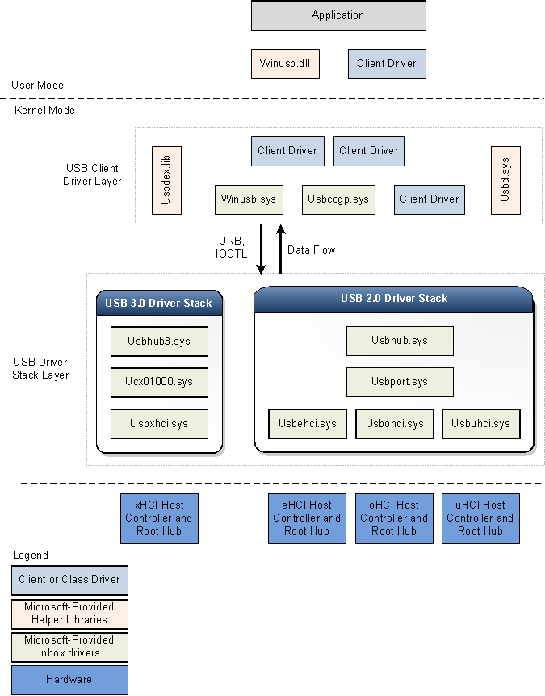

# USB host-side drivers in Windows

This topic provides an overview of the Universal Serial Bus (USB) driver stack architecture.

The following figure shows the architectural block diagram of the USB driver stack for Windows 8. The diagram shows separate USB driver stacks for USB 2.0 and USB 3.0. Windows loads the USB 3.0 driver stack when a device is attached to an xHCI controller. The USB 3.0 stack is new in Windows 8.

Windows loads the USB 2.0 driver stack for devices that are attached to eHCI, oHCI, or uHCI controllers. The USB 2.0 driver stack ships in Windows XP with Service Pack 1 (SP1) and later versions of the Windows operating system.

-   [USB 3.0 driver stack](#usb-3-0-driver-stack)
    -   [USB 3.0 host controller driver (Usbxhci.sys)](#usb-3-0-host-controller-driver--usbxhci-sys)
    -   [USB host controller extension (Ucx01000.sys)](#usb-host-controller-extension--ucx01000-sys)
    -   [USB hub driver (Usbhub3.sys)](#usb-hub-driver-usbhub3-sys)
-   [USB 2.0 driver stack](#usb-2-0-driver-stack)
-   [USB common class generic parent driver (Usbccgp.sys)](#usb-common-class-generic-parent-driver--usbccgp-sys--)
-   [WinUSB (Winusb.sys)](#winusb-winusb-sys)
-   [USB client driver](#usb-client-driver)
-   [Helper libraries for client drivers](#helper-libraries-for-client-drivers)
-   [Related topics](#related-topics)

## USB 3.0 driver stack

The USB 3.0 stack is new in Windows 8. Microsoft created the new drivers by using Kernel Mode Driver Framework (KMDF) interfaces. The KMDF driver model reduces complexity and improves stability.

### USB 3.0 host controller driver (Usbxhci.sys)

The xHCI driver is the USB 3.0 host controller driver. The responsibilities of the xHCI driver include initializing MMIO registers and host memory-based data structures for xHCI controller hardware, mapping transfer requests from upper layer drivers to Transfer Request Blocks, and submitting the requests to the hardware. After completing a transfer, the driver handles transfer completion events from the hardware and propagates the events up the driver stack. It also controls the xHCI controller device slots and endpoint contexts.

The xHCI driver is new in Windows 8 and is not an extension of the eHCI miniport driver that was available in earlier versions of the operating system. The new driver was written by using Kernel Mode Driver Framework (KMDF) interfaces and uses KMDF for all controller power management and PnP events. Windows loads the xHCI driver as the function device object (FDO) in the device stack for the host controller.

###  USB host controller extension (Ucx01000.sys)

The USB host controller extension driver (an extension to KMDF) is the new extension to the underlying class-specific host controller driver, such as the xHCI driver. The new driver is extensible and is designed to support other types of host controller drivers that are expected to be developed in the future. The USB host controller extension serves as a common abstracted interface to the hub driver, provides a generic mechanism for queuing requests to the host controller driver, and overrides certain selected functions. All I/O requests initiated by upper drivers reach the host controller extension driver before the xHCI driver. Upon receiving an I/O request, the host controller extension validates the request and then forwards the request to the proper KMDF queue associated with the target endpoint. The xHCI driver, when ready for processing, retrieves the request from the queue. The responsibilities of the USB host controller extension driver are:

-   Provides USB-specific objects to the xHCI driver.
-   Provides KMDF event callback routines to the xHCI driver.
-   Manages and control the operations of the root hub associated with the host controller.
-   Implements features that are configurable by the client driver, like chained MDLs, streams, and so on.

### USB hub driver (Usbhub3.sys)

The new hub driver, in the USB driver stack for 3.0 devices, uses the KMDF driver model. The hub driver primarily performs these tasks:

-   Manages USB hubs and their ports.
-   Enumerates devices and other hubs attached to their downstream ports.
-   Creates physical device objects (PDOs) for the enumerated devices and hubs.

Windows loads the hub driver as the FDO in the hub device stack. Device enumeration and hub management in the new driver are implemented through a set of state machines. The hub driver relies on KMDF for power management and PnP functions. In addition to hub management, the hub driver also performs preliminary checks and processing of certain requests sent by the USB client driver layer. For instance, the hub driver parses a select-configuration request to determine which endpoints will be configured by the request. After parsing the information, the hub driver submits the request to the USB host controller extension or further processing.

## USB 2.0 driver stack

Windows loads the USB 2.0 driver stack for devices that are attached to eHCI, oHCI, or uHCI controllers. The drivers in the USB 2.0 driver stack ship in Windows XP with SP1 and later versions of the Windows operating system. The USB 2.0 driver stack is designed to facilitate high-speed USB devices as defined in the USB 2.0 specification.

At the bottom of the USB driver stack is the host controller driver. It consists of the port driver, Usbport.sys, and one or more of three miniport drivers that run concurrently. When the system detects host controller hardware, it loads one of these miniport drivers. The miniport driver, after it is loaded, loads the port driver, Usbport.sys. The port driver handles those aspects of the host controller driver's duties that are independent of the specific protocol.

The Usbuhci.sys (universal host controller interface) miniport driver replaces the Uhcd.sys miniclass driver that shipped with Windows 2000. The Usbohci.sys (open host controller interface) miniport driver replaces Openhci.sys. The Usbehci.sys miniport driver supports high-speed USB devices and was introduced in Windows XP with SP1 and later and Windows Server 2003 and later operating systems.

In all versions of Windows that support USB 2.0, the operating system is capable of managing USB 1.1 and USB 2.0 host controllers simultaneously. Whenever the operating system detects that both types of controller are present, it creates two separate device nodes, one for each host controller. Windows subsequently loads the Usbehci.sys miniport driver for the USB 2.0-compliant host controller hardware and either Usbohci.sys or Openhci.sys for the USB 1.1-compliant hardware, depending on the system configuration.

Above the port driver is the USB bus driver, Usbhub.sys, also known as the hub driver. This is the device driver for each hub on the system.

## USB common class generic parent driver (Usbccgp.sys)

The USB common class generic parent driver is the Microsoft-provided parent driver for composite devices. The hub driver enumerates and loads the parent composite driver if **deviceClass** is 0 or 0xef and **numInterfaces** is greater than 1 in the device descriptor. The hub driver generates the compatible ID for the parent composite driver as "USB\\COMPOSITE". Usbccgp.sys uses Windows Driver Model (WDM) routines.

The parent composite driver enumerates all functions in a composite device and creates a PDO for each one. This causes the appropriate class or client driver to be loaded for each function in the device. Each function driver (child PDO) sends requests to the parent driver, which submits them to the USB hub driver.

Usbccgp.sys is included with Windows XP with SP1 and later versions of the Windows operating system. In Windows 8, the driver has been updated to implement function suspend and remote wake-up features as defined in the USB 3.0 specification.

For more information, see [USB Generic Parent Driver (Usbccgp.sys)](usb-common-class-generic-parent-driver.md).

## WinUSB (Winusb.sys)

Windows USB (WinUSB) is a Microsoft-provided generic driver for USB devices. WinUSB architecture consists of a kernel-mode driver (Winusb.sys) and a user-mode dynamic link library (Winusb.dll). For devices that don't require a custom function driver, Winusb.sys can be installed in the device's kernel-mode stack as the function driver. User-mode processes can then communicate with Winusb.sys by using a set of device I/O control requests or by calling **WinUsb\_Xxx** functions. For more information, see [WinUSB](winusb.md).

In Windows 8, the Microsoft-provided information (INF) file for WinUSB, Winusb.inf, contains USB\\MS\_COMP\_WINUSB as a device identifier string. This allows Winusb.sys to get automatically loaded as the function driver for those devices that have a matching WinUSB compatible ID in the MS OS descriptor. Such devices are called WinUSB devices. Hardware manufacturers are not required to distribute an INF file for their WinUSB device, making the driver installation process simpler for the end user. For more information, see [WinUSB Device](automatic-installation-of-winusb.md).

## USB client driver

Each USB device, composite or non-composite, is managed by a client driver. A USB client driver is a class or device driver that is a client of the USB driver stack. Such drivers include class and device-specific drivers from Microsoft or a third-party vendor. To see a list of class drivers provided by Microsoft, see [Drivers for the Supported USB Device Classes](supported-usb-classes.md). A client driver creates requests to communicate with the device by calling public interfaces exposed by the USB driver stack.

A client driver for a composite device is no different from a client driver for a non-composite device, except for its location in the driver stack.

A client driver for a non-composite device is layered directly above the hub driver.

For a composite USB device that exposes multiple functions and does not have a parent class driver, Windows loads the [USB generic parent driver (Usbccgp.sys)](usb-common-class-generic-parent-driver.md) between the hub driver and the client driver layer. The parent driver creates a separate PDO for each function of a composite device. Client drivers (FDOs for functions) are loaded above the generic parent driver. Vendors might choose to provide a separate client driver for each function.

A USB client driver can run in either user mode or kernel mode, depending on the requirements of the driver. USB client drivers can be written by using KMDF, UMDF, or WDM routines.

## Helper libraries for client drivers

Microsoft provides the following helper libraries to help kernel-mode drivers and applications to communicate with the USB driver stack:

-   Usbd.sys

    Microsoft provides the Usbd.sys library that exports routines for USB client drivers. The helper routines simplify the operational tasks of a client driver. For instance, by using the helper routines, a USB client driver can build [USB Request Blocks (URBs)](communicating-with-a-usb-device.md) for certain specific operations, such as selecting a configuration, and submit those URBs to the USB driver stack.

-   Usbdex.lib

    This helper library is new for Windows 8. The library exports routines primarily for allocating and building URBs. Those routines replace some of the legacy routines exported by Usbd.sys. The new routines require the client driver to register with the USB driver stack, which maintains the handle for registration. That handle is used for calls to other Usbdex.lib routines. Certain URBs allocated by the new routines have an URB context that the USB driver uses for better tracking and processing. For more information, see [Allocating and Building URBs](how-to-add-xrb-support-for-client-drivers.md).

-   Winusb.dll

    Winusb.dll is a user-mode DLL that exposes [WinUSB functions](https://msdn.microsoft.com/library/windows/hardware/ff540046#winusb) for communicating with Winusb.sys, which is loaded as a device's function driver in kernel mode. Applications use these functions to configure the device, retrieve information about the device, and perform I/O operations. For information about using these functions, see [How to Access a USB Device by Using WinUSB Functions](using-winusb-api-to-communicate-with-a-usb-device.md).

## Related topics
[Universal Serial Bus (USB) Drivers](https://msdn.microsoft.com/library/windows/hardware/ff538930)  
[USB Driver Development Guide](usb-driver-development-guide.md)  

