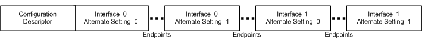

# USB configuration descriptors


A USB device exposes its capabilities in the form of a series of interfaces called a USB configuration. Each interface consists of one or more alternate settings, and each alternate setting is made up of a set of endpoints. This topic describes the various descriptors associated with a USB configuration.

A USB configuration is described in a configuration descriptor (see [**USB\_CONFIGURATION\_DESCRIPTOR**](https://msdn.microsoft.com/library/windows/hardware/ff539241) structure). A configuration descriptor contains information about the configuration and its interfaces, alternate settings, and their endpoints. Each interface descriptor or alternate setting is described in a [**USB\_INTERFACE\_DESCRIPTOR**](https://msdn.microsoft.com/library/windows/hardware/ff540065) structure. In a configuration, each interface descriptor is followed in memory by all of the endpoint descriptors for the interface and alternate setting. Each endpoint descriptor is stored in a [**USB\_ENDPOINT\_DESCRIPTOR**](https://msdn.microsoft.com/library/windows/hardware/ff539317) structure.

For example, consider a USB webcam device described in [USB Device Layout](usb-device-layout.md). The device supports a configuration with two interfaces, and the first interface (index 0) supports two alternate settings.

The following example shows the configuration descriptor for the USB webcam device:

``` syntax
Configuration Descriptor:
wTotalLength:         0x02CA
bNumInterfaces:       0x02
bConfigurationValue:  0x01
iConfiguration:       0x00
bmAttributes:         0x80 (Bus Powered )
MaxPower:             0xFA (500 mA)
```

The **bConfigurationValue** field indicates the number for the configuration defined in the firmware of the device. The client driver uses that number value to select an active configuration. For more information about [USB device configuration](configuring-usb-devices.md), see [How to Select a Configuration for a USB Device](how-to-select-a-configuration-for-a-usb-device.md). A USB configuration also indicates certain power characteristics. The **bmAttributes** contains a bitmask that indicates whether the configuration supports the remote wake-up feature, and whether the device is bus-powered or self-powered. The **MaxPower** field specifies the maximum power (in milliamp units) that the device can draw from the host, when the device is bus-powered. The configuration descriptor also indicates the total number of interfaces (**bNumInterfaces**) that the device supports.

The following example shows the interface descriptor for Alternate Setting 0 of Interface 0 for the webcam device:

``` syntax
Interface Descriptor:
bInterfaceNumber:     0x00
bAlternateSetting:    0x00
bNumEndpoints:        0x01
bInterfaceClass:      0x0E
bInterfaceSubClass:   0x02
bInterfaceProtocol:   0x00
iInterface:           0x02
0x0409: "Microsoft LifeCam VX-5000"
0x0409: "Microsoft LifeCam VX-5000"
```

In the preceding example, note **bInterfaceNumber** and **bAlternateSetting** field values. Those fields contain index values that a client driver uses to activate the interface and one of its alternate settings. For activation, the driver sends a select-interface request to the USB driver stack. The driver stack then builds a standard control request (SET INTERFACE) and sends it to the device. Note the **bInterfaceClass** field. The interface descriptor or the descriptor for any of its alternate settings specifies a class code, subclass, and protocol. The value of 0x0E indicates that the interface is for the video device class. Also, notice the **iInterface** field. That value indicates that there are two string descriptors appended to the interface descriptor. String descriptors contain Unicode descriptions that are used during device enumeration to identify the functionality. For more information about string descriptors, see [USB String Descriptors](usb-string-descriptors.md).

Each endpoint, in an interface, describes a single stream of input or output for the device. A device that supports streams for different kinds of functions has multiple interfaces. A device that supports several streams that pertain to a function can support multiple endpoints on a single interface.

All types of endpoints (except the default endpoint) must provide endpoint descriptors so that the host can get information about endpoint. An endpoint descriptor includes information, such as its address, type, direction, and the amount of data the endpoint can handle. The data transfers to the endpoint are based on that information.

The following example shows an endpoint descriptor for the webcam device:

``` syntax
Endpoint Descriptor:
bEndpointAddress:   0x82  IN
bmAttributes:       0x01
wMaxPacketSize:     0x0080 (128)
bInterval:          0x01
```

The **bEndpointAddress** field specifies the unique endpoint address that contains the endpoint number (Bits 3..0) and the direction of the endpoint (Bit 7). By reading those values in the preceding example, we can determine that the descriptor describes an IN endpoint whose endpoint number is 2. The **bmAttributes** attribute indicates that the endpoint type is isochronous. The **wMaxPacketSizefield** indicates the maximum number of bytes that the endpoint can send or receive in a single transaction. Bits 12..11 indicate the total number of transactions that can be sent per microframe. The **bInterval** indicates how often the endpoint can send or receive data.

## How to get the configuration descriptor


The configuration descriptor is obtained from the device through a standard device request (GET\_DESCRIPTOR), which is sent as a control transfer by the USB driver stack. A USB client driver can initiate the request in one of the following ways:

- If the device supports only one configuration, the easiest way is to call the framework-provided [**WdfUsbTargetDeviceRetrieveConfigDescriptor**](https://msdn.microsoft.com/library/windows/hardware/ff550098) method.
- For a device that supports multiple configurations, if the client driver wants to get the descriptor of the configuration other than the first, the driver must submit an URB. To submit an URB, the driver must allocate, format, and then submit the URB to the USB driver stack.

  To allocate the URB, the client driver must call the [**WdfUsbTargetDeviceCreateUrb**](https://msdn.microsoft.com/library/windows/hardware/hh439423) method. The method receives a pointer to an URB allocated by the USB driver stack.

  To format the URB, the client driver can use the [**UsbBuildGetDescriptorRequest**](https://msdn.microsoft.com/library/windows/hardware/ff538943) macro. The macro sets all the necessary information in the URB, such as the device-defined configuration number for which to retrieve the descriptor. The URB function is set to URB\_FUNCTION\_GET\_DESCRIPTOR\_FROM\_DEVICE (see [**\_URB\_CONTROL\_DESCRIPTOR\_REQUEST**](https://msdn.microsoft.com/library/windows/hardware/ff540357)) and the type of descriptor is set to USB\_CONFIGURATION\_DESCRIPTOR\_TYPE. By using the information contained in the URB, the USB driver stack builds a standard control request and sends it to the device.

  To submit the URB, the client driver must use a WDF request object. To send the request object to the USB driver stack asynchronously, the driver must call the [**WdfRequestSend**](https://msdn.microsoft.com/library/windows/hardware/ff550027)method. To send it synchronously, call the [**WdfUsbTargetDeviceSendUrbSynchronously**](https://msdn.microsoft.com/library/windows/hardware/ff550105) method.

  <strong>WDM drivers:  **A Windows Driver Model (WDM) client driver can only get the configuration descriptor by submitting an URB. To allocate the URB, the driver must call the [</strong>USBD\_UrbAllocate<strong>](<https://msdn.microsoft.com/library/windows/hardware/hh406250>) routine. To format the URB, the driver must call the [</strong>UsbBuildGetDescriptorRequest**](<https://msdn.microsoft.com/library/windows/hardware/ff538943>) macro. To submit the URB, the driver must associate the URB with an IRP, and submit the IRP to the USB driver stack. For more information, see [How to Submit an URB](send-requests-to-the-usb-driver-stack.md).

Within a USB configuration, the number of interfaces and their alternate settings are variable. Therefore, it's difficult to predict the size of buffer required to hold the configuration descriptor. The client driver must collect all that information in two steps. First, determine what size buffer required to hold all of the configuration descriptor, and then issue a request to retrieve the entire descriptor. A client driver can get the size in one of the following ways:

**To obtain the configuration descriptor by calling WdfUsbTargetDeviceRetrieveConfigDescriptor, perform these steps:**

1.  Get the size of buffer required to hold all of the configuration information by calling [**WdfUsbTargetDeviceRetrieveConfigDescriptor**](https://msdn.microsoft.com/library/windows/hardware/ff550098). The driver must pass NULL in the buffer, and a variable to hold the size of the buffer.
2.  Allocate a larger buffer based on the size received through the previous [**WdfUsbTargetDeviceRetrieveConfigDescriptor**](https://msdn.microsoft.com/library/windows/hardware/ff550098) call.
3.  Call [**WdfUsbTargetDeviceRetrieveConfigDescriptor**](https://msdn.microsoft.com/library/windows/hardware/ff550098) again and specify a pointer to the new buffer allocated in step 2.

```cpp
 NTSTATUS RetrieveDefaultConfigurationDescriptor (
    _In_  WDFUSBDEVICE  UsbDevice,
    _Out_ PUSB_CONFIGURATION_DESCRIPTOR *ConfigDescriptor 
    )
{
    NTSTATUS ntStatus = -1;

    USHORT sizeConfigDesc;

    PUSB_CONFIGURATION_DESCRIPTOR fullConfigDesc = NULL;

    PAGED_CODE();

    *ConfigDescriptor  = NULL;

    ntStatus = WdfUsbTargetDeviceRetrieveConfigDescriptor (
        UsbDevice, 
        NULL,
        &sizeConfigDesc);

    if (sizeConfigDesc == 0)
    {
        TraceEvents(TRACE_LEVEL_ERROR, TRACE_DEVICE, 
            "%!FUNC! Could not retrieve the configuration descriptor size.");

        goto Exit;
    }
    else
    {
        fullConfigDesc = (PUSB_CONFIGURATION_DESCRIPTOR) ExAllocatePoolWithTag (
            NonPagedPool, 
            sizeConfigDesc,
            USBCLIENT_TAG);

        if (!fullConfigDesc)
        {
            ntStatus = STATUS_INSUFFICIENT_RESOURCES;
            goto Exit;
        }  
    }

    RtlZeroMemory (fullConfigDesc, sizeConfigDesc);

    ntStatus = WdfUsbTargetDeviceRetrieveConfigDescriptor (
        UsbDevice, 
        fullConfigDesc,
        &sizeConfigDesc);

    if (!NT_SUCCESS(ntStatus))
    {           
        TraceEvents(TRACE_LEVEL_ERROR, TRACE_DEVICE, 
            "%!FUNC! Could not retrieve the configuration descriptor.");

        goto Exit;
    }

    *ConfigDescriptor = fullConfigDesc;

Exit:

    return ntStatus;   
}
```

**To obtain the configuration descriptor by submitting an URB, perform these steps:**

1.  Allocate an URB by calling the [**WdfUsbTargetDeviceCreateUrb**](https://msdn.microsoft.com/library/windows/hardware/hh439423) method.
2.  Format the URB by calling the [**UsbBuildGetDescriptorRequest**](https://msdn.microsoft.com/library/windows/hardware/ff538943) macro. The transfer buffer of the URB must point to a buffer large enough to hold a [**USB\_CONFIGURATION\_DESCRIPTOR**](https://msdn.microsoft.com/library/windows/hardware/ff539241) structure.
3.  Submit the URB as a WDF request object by calling [**WdfRequestSend**](https://msdn.microsoft.com/library/windows/hardware/ff550027) or [**WdfUsbTargetDeviceSendUrbSynchronously**](https://msdn.microsoft.com/library/windows/hardware/ff550105).
4.  After the request completes, check the **wTotalLength** member of [**USB\_CONFIGURATION\_DESCRIPTOR**](https://msdn.microsoft.com/library/windows/hardware/ff539241). That value indicates the size of the buffer required to contain a full configuration descriptor.
5.  Allocate a larger buffer based on the size retrieved in **wTotalLength**.
6.  Issue the same request with the larger buffer.

The following example code shows the [**UsbBuildGetDescriptorRequest**](https://msdn.microsoft.com/library/windows/hardware/ff538943) call for a request to get configuration information for the i-th configuration:

```cpp
NTSTATUS FX3_RetrieveConfigurationDescriptor (
    _In_ WDFUSBDEVICE  UsbDevice,
    _In_ PUCHAR ConfigurationIndex,
    _Out_ PUSB_CONFIGURATION_DESCRIPTOR *ConfigDescriptor 
    )
{
    NTSTATUS ntStatus = STATUS_SUCCESS;

    USB_CONFIGURATION_DESCRIPTOR configDesc;
    PUSB_CONFIGURATION_DESCRIPTOR fullConfigDesc = NULL;

    PURB urb = NULL;

    WDFMEMORY urbMemory = NULL;

    PAGED_CODE();

    RtlZeroMemory (&configDesc, sizeof(USB_CONFIGURATION_DESCRIPTOR));
    *ConfigDescriptor = NULL;

    // Allocate an URB for the get-descriptor request. 
    // WdfUsbTargetDeviceCreateUrb returns the address of the 
    // newly allocated URB and the WDFMemory object that 
    // contains the URB.

    ntStatus = WdfUsbTargetDeviceCreateUrb (
        UsbDevice,
        NULL,
        &urbMemory,
        &urb);

    if (!NT_SUCCESS (ntStatus))
    {
        TraceEvents(TRACE_LEVEL_ERROR, TRACE_DEVICE, 
            "%!FUNC! Could not allocate URB for an open-streams request.");

        goto Exit;
    }

       // Format the URB.
    UsbBuildGetDescriptorRequest (
        urb,                                                        // Points to the URB to be formatted
        (USHORT) sizeof( struct _URB_CONTROL_DESCRIPTOR_REQUEST ),  // Size of the URB.
        USB_CONFIGURATION_DESCRIPTOR_TYPE,                          // Type of descriptor
        *ConfigurationIndex,                                        // Index of the configuration
        0,                                                          // Not used for configuration descriptors
        &configDesc,                                                // Points to a USB_CONFIGURATION_DESCRIPTOR structure
        NULL,                                                       // Not required because we are providing a buffer not MDL
        sizeof(USB_CONFIGURATION_DESCRIPTOR),                       // Size of the USB_CONFIGURATION_DESCRIPTOR structure.
        NULL                                                        // Reserved.
        );

       // Send the request synchronously.
    ntStatus = WdfUsbTargetDeviceSendUrbSynchronously (
        UsbDevice,
        NULL,
        NULL,
        urb);

    if (configDesc.wTotalLength == 0)
    {
        TraceEvents(TRACE_LEVEL_ERROR, TRACE_DEVICE, 
            "%!FUNC! Could not retrieve the configuration descriptor size.");

        ntStatus = USBD_STATUS_INAVLID_CONFIGURATION_DESCRIPTOR;

        goto Exit;
    }

    // Allocate memory based on the retrieved size. 
       // The allocated memory is released by the caller.
    fullConfigDesc = (PUSB_CONFIGURATION_DESCRIPTOR) ExAllocatePoolWithTag (
        NonPagedPool, 
        configDesc.wTotalLength,
        USBCLIENT_TAG);

    RtlZeroMemory (fullConfigDesc, configDesc.wTotalLength);

    if (!fullConfigDesc)
    {
        ntStatus = STATUS_INSUFFICIENT_RESOURCES;

        goto Exit;
    }

       // Format the URB.
    UsbBuildGetDescriptorRequest (
        urb,                                                        
        (USHORT) sizeof( struct _URB_CONTROL_DESCRIPTOR_REQUEST ),  
        USB_CONFIGURATION_DESCRIPTOR_TYPE,                          
        *ConfigurationIndex,                                         
        0,                                                          
        fullConfigDesc,                                                 
        NULL,                                                       
        configDesc.wTotalLength,                       
        NULL                                                        
        );

       // Send the request again.
    ntStatus = WdfUsbTargetDeviceSendUrbSynchronously (
        UsbDevice,
        NULL,
        NULL,
        urb);

    if ((fullConfigDesc->wTotalLength == 0) || !NT_SUCCESS (ntStatus))
    {
        TraceEvents(TRACE_LEVEL_ERROR, TRACE_DEVICE, 
            "%!FUNC! Could not retrieve the configuration descriptor.");

        ntStatus = USBD_STATUS_INAVLID_CONFIGURATION_DESCRIPTOR;

        goto Exit;
    }

       // Return to the caller.
    *ConfigDescriptor = fullConfigDesc;

Exit:

    if (urbMemory)
    {
        WdfObjectDelete (urbMemory);
    }

    return ntStatus;   
}
```

When the device returns the configuration descriptor, the request buffer is filled with interface descriptors for all alternate settings, and endpoint descriptors for all endpoints within a particular alternate setting. For the device described in [USB Device Layout](usb-device-layout.md), the following diagram illustrates how configuration information is laid out in memory.



The zero-based **bInterfaceNumber** member of [**USB\_INTERFACE\_DESCRIPTOR**](https://msdn.microsoft.com/library/windows/hardware/ff540065) distinguishes interfaces within a configuration. For a given interface, the zero-based **bAlternateSetting** member distinguishes between alternate settings of the interface. The device returns interface descriptors in order of **bInterfaceNumber** values and then in order of **bAlternateSetting** values.

To search for a given interface descriptor within the configuration, the client driver can call [**USBD\_ParseConfigurationDescriptorEx**](https://msdn.microsoft.com/library/windows/hardware/ff539102). In the call, the client driver provides a starting position within the configuration. Optionally the driver can specify an interface number, an alternate setting, a class, a subclass, or a protocol. The routine returns a pointer to the next matching interface descriptor.

To examine a configuration descriptor for an endpoint or string descriptor, use the [**USBD\_ParseDescriptors**](https://msdn.microsoft.com/library/windows/hardware/ff539109) routine. The caller provides a starting position within the configuration and a descriptor type, such as USB\_STRING\_DESCRIPTOR\_TYPE or USB\_ENDPOINT\_DESCRIPTOR\_TYPE. The routine returns a pointer to the next matching descriptor.

## Related topics
[How to Select a Configuration for a USB Device](how-to-select-a-configuration-for-a-usb-device.md)  
[USB Descriptors](usb-descriptors.md)  


