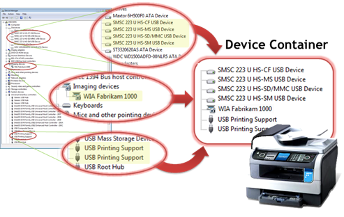
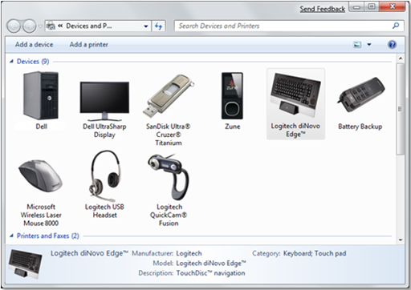

# USB ContainerIDs in Windows


This paper provides information about USB **ContainerID**s for the Windows operating system. It includes guidelines for device manufacturers to program their multifunction USB devices so that they can be correctly detected by Windows.

Starting in Windows 7, users can take advantage of all the capabilities of the devices that are connected to their computers. This includes multifunction devices, such as a combination printer, scanner, and copier device. Windows 7 includes support for consolidating all the functionality of a single physical device into a device container. A device container is a virtual representation of the physical device. This consolidation is achieved by assigning a **ContainerID** property to each device function that is enumerated for the physical device. By assigning the same **ContainerID** value to each device function, Windows 7 recognizes that all device functions belong to the same physical device.

All types of devices that connect to a computer through different bus types can support device containers. However, not all bus types use the same mechanism for generating a **ContainerID**. For USB devices, device vendors can use a **ContainerID** descriptor to describe the **ContainerID** for a physical device. A **ContainerID** descriptor is a Microsoft OS feature descriptor that can be stored in the USB device's firmware. USB device manufacturers must correctly implement these **ContainerID** descriptors in their devices to take advantage of the new device capabilities that are available in Windows 7. USB device manufacturers need to implement only a single **ContainerID** for each physical device, regardless of how many device functions are supported by the device.

For more information about consolidating all the functionality of a single device into a device container, see [How Container IDs are Generated](https://msdn.microsoft.com/library/windows/hardware/ff546193).

For more information about Microsoft OS descriptors for USB devices, see [Microsoft OS Descriptors for USB Devices](microsoft-defined-usb-descriptors.md).

## How a USB ContainerID Is Generated


The following are two ways to generate a **ContainerID** for a USB device:

-   The manufacturer of the USB device specifies the **ContainerID** in the device's firmware by using a Microsoft OS **ContainerID** descriptor.
-   The Microsoft USB hub driver automatically creates a **ContainerID** for the device from the combination of the device's product ID (PID), vendor ID (VID), revision number, and serial number. In this situation, the Microsoft USB hub driver creates a **ContainerID** with minimal functionality. This method applies only to devices that have a unique serial number.

## USB ContainerID Contents


A USB **ContainerID** is presented to the operating system in the form of a universally unique identifier (UUID) string. The **ContainerID** UUID is contained within a **ContainerID** descriptor. A **ContainerID** descriptor is a device-level Microsoft OS feature descriptor. As such, when the operating system requests a USB **ContainerID**, the wValue field of the descriptor request must always be set to zero. For more information about Microsoft OS feature descriptors and descriptor requests, see [Microsoft OS 1.0 Descriptors Specification](http://go.microsoft.com/fwlink/p/?linkid=617519).

A **ContainerID** descriptor consists of a header section.

| Offset | Field          | Size | Type           | Description                                                                                                                                                                                                                                                                                                                                                                                         |
|--------|----------------|------|----------------|-----------------------------------------------------------------------------------------------------------------------------------------------------------------------------------------------------------------------------------------------------------------------------------------------------------------------------------------------------------------------------------------------------|
| 0      | **dwLength**   | 4    | Unsigned DWord | The length, in bytes, of the entire **ContainerID** descriptor. This field must always be set to a value of 0x18.                                                                                                                                                                                                                                                                                   |
| 4      | **bcdVersion** | 2    | BCD            | The version number of the **ContainerID** descriptor, in binary coded decimal (BCD), where each nibble corresponds to a digit. The most-significant byte (MSB) contains the two digits before the decimal point, and the least-significant byte (LSB) contains the two digits after the decimal point. For example, version 1.00 is represented as 0x0100. This field must always be set to 0x0100. |
| 6      | **wIndex**     | 2    | Word           | This field is always set to 6 for USB **ContainerID** descriptors.                                                                                                                                                                                                                                                                                                                                  |

 

A **ContainerID** descriptor consists of a ContainerID section.

| Offset | Field            | Size | Type           | Description           |
|--------|------------------|------|----------------|-----------------------|
| 0      | **bContainerID** | 16   | Unsigned DWord | **ContainerID** data. |

 

Device manufacturers are responsible for ensuring that each instance of a device has a universally unique 16-byte value for the **ContainerID**. Also, a device must report the same **ContainerID** value each time it is powered on.
There are several established algorithms for generating UUIDs with almost zero chance of duplication. Device manufacturers can select the UUID generation algorithm that best suits their needs. It does not matter which UUID generation algorithm is used as long as the result is unique.

## USB ContainerID Syntax


A **ContainerID** is reported in the standard UUID string format of {xxxxxxxx-xxxx-xxxx-xxxx-xxxxxxxxxxxx}. The following is an example representation in firmware for a 0C B4 A7 2C D1 7B 25 4F B5 73 A1 3A 97 5D DC 07 USB **ContainerID**, which is formatted as a {2CA7B40C-7BD1-4F25-B573-A13A975DDC07} UUID string.

```cpp
UCHAR Example<mark type="member">ContainerID</mark>Descriptor[24] =
{
    0x18, 0x00, 0x00, 0x00,     // dwLength - 24 bytes
    0x00, 0x01,                 // bcdVersion - 1.00
    0x06, 0x00,                 // wIndex – 6 for a <mark type="member">ContainerID</mark>

    0x0C, 0xB4, 0xA7, 0x2C,     // b<mark type="member">ContainerID</mark> -
    0xD1, 0x7B, 0x25, 0x4F,     // {2CA7B40C-7BD1-4F25-B573-A13A975DDC07}
    0xB5, 0x73, 0xA1, 0x3A,     // 0C B4 A7 2C D1 7B 25 4F B5 73 A1 3A 97 5D DC 07
    0x97, 0x5D, 0xDC, 0x07      //
}
```

Note the change in the byte order of the first 8 bytes when it is formatted as a UUID string.

## Microsoft OS Descriptor Changes


To preserve legacy **ContainerID** functionality, a new flags field has been added to the Microsoft OS string descriptor that can be used to indicate support for the **ContainerID** descriptor.

The current definition of the Microsoft OS string descriptor includes a 1-byte pad field, **bPad**, at the end of the descriptor that is normally set to zero. For USB devices that support the new **ContainerID**, the **bPad** field is redefined as a flags field, **bFlags**. Bit 1 of this field is used to indicate support for the **ContainerID** descriptor. Table 3 describes the fields of the Microsoft OS string descriptor for USB devices.

<table>
<colgroup>
<col width="25%" />
<col width="25%" />
<col width="25%" />
<col width="25%" />
</colgroup>
<thead>
<tr class="header">
<th>Field</th>
<th>Length (bytes)</th>
<th>Value</th>
<th>Description</th>
</tr>
</thead>
<tbody>
<tr class="odd">
<td><strong>bLength</strong></td>
<td>1</td>
<td>0x12</td>
<td>Length of the descriptor.</td>
</tr>
<tr class="even">
<td><strong>bDescriptorType</strong></td>
<td>1</td>
<td>0x03</td>
<td>Descriptor type. A value of 0x03 indicates a Microsoft OS string descriptor.</td>
</tr>
<tr class="odd">
<td><strong>qwSignature</strong></td>
<td>14</td>
<td>‘MSFT100’</td>
<td>Signature field.</td>
</tr>
<tr class="even">
<td><strong>bMS_VendorCode</strong></td>
<td>1</td>
<td>Vendor Code</td>
<td>Vendor code.</td>
</tr>
<tr class="odd">
<td><strong>bFlags</strong></td>
<td>1</td>
<td>0x02</td>
<td><p>Bit 0: Reserved</p>
<p>Bit 1: <strong>ContainerID</strong> Support</p>
<ul>
<li>0: Does not support <strong>ContainerID</strong></li>
<li>1: Supports <strong>ContainerID</strong></li>
</ul>
<p>Bits 2–7: Reserved</p></td>
</tr>
</tbody>
</table>

 

Currently shipping USB devices that support the Microsoft OS descriptor but do not support the **ContainerID** descriptor have the **bPad** field set to 0x00. The USB hub driver does not query such devices for the USB **ContainerID** descriptor.
## Container View of a USB Multifunction Device


The **ContainerID** provides information to consolidate devices for multifunction USB devices. Figure 1 shows an example of how all devices in a multifunction printer are consolidated into a single device container when all individual devices within the product use the same **ContainerID**.



By consolidating all devices for a multifunction USB device, the physical product can be shown as a single device in Devices and Printers in Windows 7. Figure 2 shows an example of a USB multifunction keyboard and mouse device that appears as a single device in Devices and Printers.



## USB ContainerID HCK Requirements


Device manufacturers must ensure that each instance of a device that they produce has a globally unique **ContainerID** value so that Windows can successfully consolidate the functionality of each USB multifunction device. The Windows Hardware CertificationWindows Hardware Certification Kit includes a requirement, DEVFUND-0034, for a USB **ContainerID** if it is implemented in a device. If a device implements a USB **ContainerID**, the Windows Hardware Certification tests the **ContainerID** as part of the Microsoft OS Descriptor tests and checks whether the **ContainerID** value is globally unique. For more details on these Windows Hardware Certification requirements, see the Windows Hardware Certification Web site.

Recommendations for Implementing a USB **ContainerID** The following are recommendations for device vendors that design, manufacture, and ship USB devices:

-   Learn how Windows 7 improves the support for multifunction and multiple transport USB devices through the use of a **ContainerID**. We recommend that you start by reading “Multifunction Device Support and Device Container Groupings in Windows 7.”
-   Make sure that the serial number on each USB device is unique. A Windows Hardware Certification requirement states that, if your device includes a serial number, the serial number must be unique for each instance of your device.
-   Do not provide a **ContainerID** for a USB device that is embedded in a system. Integrated USB devices should rely on ACPI BIOS settings or the USB hub descriptor **DeviceRemovable** bit for the port.
-   Ensure that all USB devices that are attached to a system have unique **ContainerID** values. Do not share **ContainerID** values or USB serial numbers across your product lines.
-   Make sure to set the Removable Device Capability correctly for your device.
    **Note**  Device vendors that add a USB **ContainerID** descriptor to a previously shipping USB device must increment the device release number (**bcdDevice**) in the device’s device descriptor. This is required because the USB hub driver caches the Microsoft OS string descriptor (or the lack of one) based on a device’s vendor ID, product ID, and device release number. If you do not increment the device release number, the hub driver does not query for the USB **ContainerID** of a new device if it previously enumerated an instance of the device with the same vendor ID, product ID, and device release number that did not support the USB **ContainerID** descriptor.

     

## Related topics
[Building USB devices for Windows](building-usb-devices-for-windows.md)  
[Container IDs for USB Devices](https://msdn.microsoft.com/library/windows/hardware/ff540084)  


