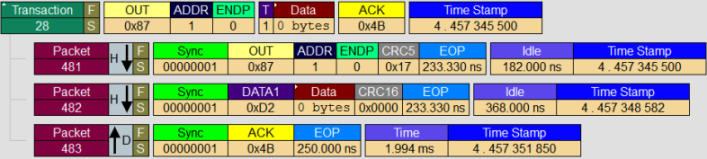

# How to send a USB control transfer


This topic explains the structure of a control transfer and how a client driver should send a control request to the device.

In this topic:

-   [About the default endpoint](#about-the-default-endpoint)
-   [Layout of a control transfer](#layout-of-a-control-transfer)
-   [Supported driver models](#supported-driver-models)
    -   [Related Technologies](#related-technologies)
-   [Prerequisites](#prerequisites)
-   [Microsoft-defined methods for sending control transfer requests](#microsoft-defined-methods-for-sending-control-transfer-requests)
-   [How to send a control transfer for vendor commands - KMDF](#how-to-send-a-control-transfer-for-vendor-commands---kmdf)
-   [How to send a control transfer for GET\_STATUS - UMDF](#how-to-send-a-control-transfer-for-get-status---umdf)

## About the default endpoint


All USB devices must support at least one endpoint called the *default endpoint*. Any transfer that targets the default endpoint is called a *control transfer*. The purpose of a control transfer is to enable the host to obtain device information, configure the device, or perform control operations that are unique to the device.

Let’s begin by studying these characteristics of the default endpoint.

-   The address of the default endpoint is 0.
-   The default endpoint is bidirectional, that is, the host can send data to the endpoint and receive data from it within one transfer.
-   The default endpoint is available at the device level and is not defined in any interface of the device.
-   The default endpoint is active as soon as a connection is established between the host and the device. It is active even before a configuration is selected.
-   The maximum packet size of the default endpoint depends on the bus speed of the device. Low speed, 8 bytes; full and high speed, 64 bytes; SuperSpeed, 512 bytes.

## Layout of a control transfer


Because control transfers are high priority transfers, certain amount of bandwidth is reserved on the bus by the host. For low and full speed devices, 10% of the bandwidth; 20% for high and SuperSpeed transfers devices. Now, let’s look at the layout of a control transfer.


A control transfer is divided into three transactions: *setup transaction*, *data transaction*, and *status transaction*. Each transaction contains three types of packets: *token packet*, *data packet*, and *handshake packet*.

Certain fields are common to all packets. These fields are:

-   Sync field that indicates the start of packet.
-   Packet identifier (PID) that indicates the type of packet, the direction of the transaction, and in the case of a handshake packet, it indicates success or failure of the transaction.
-   EOP field indicates the end of packet.

Other fields depend on the type of packet.

-   **Token packet**

    Every setup transaction starts with a token packet. Here is the structure of the packet. The host always sends the token packet.

    

    The PID value indicates the type of the token packet. Here are the possible values:

    -   SETUP: Indicates the start of a setup transaction in a control transfer.
    -   IN: Indicates that the host is requesting data from the device (read case).
    -   OUT: Indicates that the host is sending data to the device (write case).
    -   SOF: Indicates the start of frame. This type of token packet contains an 11-bit frame number. The host sends the SOF packet. The frequency at which this packet is sent depends on the bus speed. For full speed, the host sends the packet every 1millisecond; every 125 microsecond on a high-speed bus.

<!-- -->

-   **Data packet**

    Immediately following the token packet is the data packet that contains the payload. The number of bytes that each data packet can contain depends on the maximum packet size of the default endpoint. The data packet can be sent by either the host or the device, depending on the direction of the transfer.

    

<!-- -->

-   **Handshake packet**

    Immediately following the data packet is the handshake packet. The PID of the packet indicates whether or not the packet was received by the host or the device. The handshake packet can be sent by either the host or the device, depending on the direction of the transfer.

    

You can see the structure of transactions and packets by using any USB analyzer, such as Beagle, Ellisys, LeCroy USB protocol analyzers. An analyzer device shows how data is sent to or received from a USB device over the wire. In this example, let's examine some traces captured by a LeCroy USB analyzer. This example is for information only. This is not an endorsement by Microsoft.

-   **Setup transaction**

    The host always initiates a control transfer. It does so by sending a setup transaction. This transaction contains a token packet called *setup token* followed by an 8-byte data packet. This screen shot shows an example setup transaction.

    

    In the preceding trace, the host initiates (indicated by **H↓**) the control transfer by sending the setup token packet \#434. Notice that the PID specifies SETUP indicating a setup token. The PID is followed by the device address and the address of the endpoint. For control transfers, that endpoint address is always 0.

    Next, the host sends the data packet \#435. The PID is DATA0 and that value is used for packet sequencing (to be discussed). The PID is followed by 8 bytes that contains the main information about this request. Those 8 bytes indicate the type of request and the size of the buffer in which the device will write its response.

    All bytes are received in reverse order. As described in section 9.3, we see these fields and values:

    <table>
    <colgroup>
    <col width="25%" />
    <col width="25%" />
    <col width="25%" />
    <col width="25%" />
    </colgroup>
    <thead>
    <tr class="header">
    <th>Field</th>
    <th>Size</th>
    <th>Value</th>
    <th>Description</th>
    </tr>
    </thead>
    <tbody>
    <tr class="odd">
    <td><strong>bmRequestType</strong> (See 9.3.1 bmRequestType)</td>
    <td>1</td>
    <td>0x80</td>
    <td><p>The data transfer direction is from device to host (D7 is 1)</p>
    <p>The request is a standard request (D6…D5 is 0)</p>
    <p>The recipient of the request is the DEVICE (D4 is 0)</p></td>
    </tr>
    <tr class="even">
    <td><strong>bRequest</strong> (See section See 9.3.2 and Table 9-4)</td>
    <td>1</td>
    <td>0x06</td>
    <td>The request type is GET_DESCRIPTOR.</td>
    </tr>
    <tr class="odd">
    <td><strong>wValue</strong> (See Table 9-5)</td>
    <td>2</td>
    <td>0x0100</td>
    <td>The request value indicates that the descriptor type is DEVICE.</td>
    </tr>
    <tr class="even">
    <td><strong>wIndex</strong>(See section 9.3.4)</td>
    <td>2</td>
    <td>0x0000</td>
    <td><p>The direction is from the host to device (D7 is 1)</p>
    <p>The endpoint number is 0.</p></td>
    </tr>
    <tr class="odd">
    <td><strong>wLength</strong> (See section 9.3.5)</td>
    <td>2</td>
    <td>0x0012</td>
    <td>The request is to retrieve 18 bytes.</td>
    </tr>
    </tbody>
    </table>

    Thus, we can conclude that in this control (read) transfer, the host sends a request to retrieve the device descriptor and specifies 18 bytes as the transfer length to hold that descriptor. The way the device sends those 18 bytes depends on how much data the default endpoint can send in one transaction. That information is included in the device descriptor returned by the device in the data transaction.

    In response, the device sends a handshake packet (\#436 indicated by **D↓**). Notice that the PID value is ACK (ACK packet). This indicates that the device acknowledged the transaction.

-   **Data transaction**

    Now, let’s see what the device returns in response to the request. The actual data is transferred in a data transaction.

    Here is the trace for the data transaction.

    

    Upon receiving the ACK packet, the host initiates the data transaction. To initiate the transaction, it sends a token packet (\#450) with direction as IN (called IN token).

    In response, the device sends a data packet (\#451) that follows the IN token. This data packet contains the actual device descriptor. The first byte indicates the length of the device descriptor, 18 bytes (0x12). The last byte in this data packet indicates the maximum packet size supported by the default endpoint. In this case, we see that the device can send 8 bytes at a time through its default endpoint.

    **Note**  The maximum packet size of the default endpoint depends on the speed of the device. The default endpoint of a high-speed device is 64 bytes; low-speed device is 8 bytes.

    The host acknowledges the data transaction by sending an ACK packet (\#452) to the device.

    Let’s calculate the amount of data returned. In the **wLength** field of the data packet (\#435) in the setup transaction, the host requested 18 bytes. In the data transaction, we see that only first 8 bytes of the device descriptor were received from the device. So, how does the host receive information stored in the remaining 10 bytes? The device does so in two transactions: 8 bytes and then last 2 bytes.

    Now that the host knows the maximum packet size of the default endpoint, the host initiates a new data transaction and requests the next portion based on the packet size.

    Here is the next data transaction:

    

    The host initiates the preceding data transaction by sending an IN token (\#463) and requesting the next 8 bytes from the device. The device responds with a data packet (\#464) that contains the next 8 bytes of the device descriptor.

    Upon receiving the 8 bytes, the host sends an ACK packet (\#465) to the device.

    Next, the host requests the last 2 bytes in another data transaction as follows:

    

    Therefore, we see that to transfer 18 bytes from the device to the host, the host keeps track of the number of bytes transferred and initiated three data transactions (8+8+2).

    **Note**   Notice the PID of the data packets in data transactions 19, 23, 26. The PID alternates between DATA0 and DATA1. This sequence is called data toggling. In cases where there are multiple data transactions, data toggling is used to verify the packet sequence. This method makes sure that the data packets are not duplicated or lost.

    By mapping the consolidated data packets to the structure of the device descriptor (See Table 9-8), we see these fields and values:

    | Field                  | Size | Value  | Description                                                                       |
    |------------------------|------|--------|-----------------------------------------------------------------------------------|
    | **bLength**            | 1    | 0x12   | Length of the device descriptor, which is 18 bytes.                               |
    | **bDescriptorType**    | 1    | 0x01   | The descriptor type is device.                                                    |
    | **bcdUSB**             | 2    | 0x0100 | The specification version number is 1.00.                                         |
    | **bDeviceClass**       | 1    | 0x00   | Device class is 0. Each interface in the configuration has the class information. |
    | **bDeviceSubClass**    | 1    | 0x00   | Subclass is 0 because device class is 0.                                          |
    | **bProtocol**          | 1    | 0x00   | Protocol is 0. This device does not use any class-specific protocols.             |
    | **bMaxPacketSize0**    | 1    | 0x08   | The maximum packet size of the endpoint is 8 bytes.                               |
    | **idVendor**           | 2    | 0x0562 | Telex Communications.                                                             |
    | **idProduct**          | 2    | 0x0002 | USB microphone.                                                                   |
    | **bcdDevice**          | 2    | 0x0100 | Indicates the device release number.                                              |
    | **iManufacturer**      | 1    | 0x01   | Manufacturer string.                                                              |
    | **iProduct**           | 1    | 0x02   | Product string.                                                                   |
    | **iSerialNumber**      | 1    | 0x03   | Serial number.                                                                    |
    | **bNumConfigurations** | 1    | 0x01   | Number of configurations.                                                         |


    By examining those values we have some preliminary information about the device. The device is a low-speed USB microphone. The maximum packet size of the default endpoint is 8 bytes. The device supports one configuration.

-   **Status transaction**

    Finally, the host completes the control transfer by initiating the last transaction: status transaction.

    

    The host starts the transaction with an OUT token packet (\#481). The purpose of this packet is to verify that the device sent all of the requested data. There is no data packet sent in this status transaction. The device responds with an ACK packet. If an error occurred, the PID could have been either NAK or STALL.

## Supported driver models


### Related Technologies

-   [Kernel-Mode Driver Framework](https://docs.microsoft.com/windows-hardware/drivers/wdf/)
-   [User- Mode Driver Framework](https://docs.microsoft.com/windows-hardware/drivers/wdf/)
-   [WinUSB](winusb.md)

## Prerequisites


Before the client driver can enumerate pipes, make sure that these requirements are met:

-   The client driver must have created the framework USB target device object.

    If you are using the USB templates that are provided with Microsoft Visual Studio Professional 2012, the template code performs those tasks. The template code obtains the handle to the target device object and stores in the device context.

    **KMDF client driver:  **

    A KMDF client driver must obtain a WDFUSBDEVICE handle by calling the [**WdfUsbTargetDeviceCreateWithParameters**](https://msdn.microsoft.com/library/windows/hardware/hh439428) method. For more information, see "Device source code" in [Understanding the USB client driver code structure (KMDF)](understanding-the-kmdf-template-code-for-usb.md).

    **UMDF client driver:  **

    A UMDF client driver must obtain an [**IWDFUsbTargetDevice**](https://msdn.microsoft.com/library/windows/hardware/ff560362) pointer by querying the framework target device object. For more information, see "[**IPnpCallbackHardware**](https://msdn.microsoft.com/library/windows/hardware/ff556764) implementation and USB-specific tasks" in [Understanding the USB client driver code structure (UMDF)](understanding-the-umdf-template-code-for-usb.md).

-   The most important aspect for a control transfer is to format the setup token appropriately. Before sending the request, gather this set of information:

    -   Direction of the request: host to device or device to host.
    -   Recipient of the request: device, interface, endpoint, or other.
    -   Category of request: standard, class, or vendor.
    -   Type of request, such as a GET\_DESCRIPTPOR request. For more information, see section 9.5 in the USB specification.
    -   **wValue** and **wIndex** values. Those values depend on the type of request.

    You can obtain all that information from the official USB specification.

-   If you are writing a UMDF driver, get the header file, Usb\_hw.h from the UMDF Sample Driver for OSR USB Fx2 Learning Kit. This header file contains useful macros and structure for formatting the setup packet for the control transfer.

    All UMDF drivers must communicate with a kernel-mode driver in order to send and receive data from devices. For a USB UMDF driver, the kernel-mode driver is always the Microsoft-provided driver [WinUSB](winusb.md) (Winusb.sys).

    Whenever a UMDF driver makes a request for the USB driver stack, the Windows I/O manager sends the request to WinUSB. After receiving the request, WinUSB either processes the request or forwards it to the USB driver stack.

## Microsoft-defined methods for sending control transfer requests


A USB client driver on the host initiates most control requests to get information about the device, configure the device, or send vendor control commands. All of those requests can be categorized into:

-   Standard requests — Standard requests are defined in the USB specification. The purpose of sending these requests is to obtain information about the device, its configurations, interfaces, and endpoints. The recipient of each request depends on the type of request. The recipient can be the device, an interface, endpoint.

    **Note**  The target of any control transfer is always the default endpoint. The recipient is the device's entity whose information (descriptor, status, and so on) the host is interested in.

    These requests can be further classified into: configuration requests, feature requests, and status requests.

    -   Configuration requests are sent to get information from the device so that the host can configure it, such as a GET\_DESCRIPTOR request. These requests can also be write requests that are sent by the host to set a particular configuration or alternate setting in the device.
    -   Feature requests are sent by the client driver to enable or disable certain Boolean device settings supported by the device, interface, or an endpoint.
    -   USB devices support status requests to enable the host get or set the USB-defined status bits of a device, endpoint, or interface.

    For more information, see Section 9.4 in USB specification, version 2.0. The standard request types are defined the header file, Usbspec.h.

-   Class requests—are defined by a specific device class specification.
-   Vendor requests—are provided by the vendor and depends on the requests supported by the device.

The Microsoft-provided USB stack handles all the protocol communication with the device as shown in the preceding traces. The driver exposes device driver interfaces (DDIs) that enable a client driver to send control transfers in many ways. If your client driver is a Windows Driver Foundation (WDF) driver, it can call routines directly to send the common types of control requests. WDF supports control transfers intrinsically for both KMDF and UMDF.

Certain types of control requests are not exposed through WDF. For those requests, the client driver can use the WDF-hybrid model. This model allows the client driver to build and format WDM URB-style requests and then send those requests by using WDF framework objects. The hybrid model only applies to kernel-mode drivers.

**For UMDF drivers:**

Use the helper macros and structure defined in usb\_hw.h. This header is included with the UMDF Sample Driver for OSR USB Fx2 Learning Kit.

Use this table to determine the best way to send control requests to the USB driver stack. If you are unable to view this table, see the table in [this topic](https://msdn.microsoft.com/library/ff539261(VS.85).aspx).

<table>
<colgroup>
<col width="25%" />
<col width="25%" />
<col width="25%" />
<col width="25%" />
</colgroup>
<thead>
<tr class="header">
<th>If you want to send a control request to...</th>
<th>If you are a KMDF driver, use these KMDF DDIs...</th>
<th>If you are a UMDF driver, use these UMDF methods...</th>
<th>If you are a WDM driver, build your URB structure (Helper routine)</th>
</tr>
</thead>
<tbody>
<tr class="odd">
<td>CLEAR_FEATURE: Disable certain feature settings in device, its configurations, interfaces and endpoints. See section 9.4.1 in the USB specification.</td>
<td><ol>
<li>Declare a setup packet. See the <a href="https://msdn.microsoft.com/library/windows/hardware/ff552568" data-raw-source="[&lt;strong&gt;WDF_USB_CONTROL_SETUP_PACKET&lt;/strong&gt;](https://msdn.microsoft.com/library/windows/hardware/ff552568)"><strong>WDF_USB_CONTROL_SETUP_PACKET</strong></a> structure.</li>
<li>Initialize the setup packet by calling <a href="https://msdn.microsoft.com/library/windows/hardware/ff552576" data-raw-source="[&lt;strong&gt;WDF_USB_CONTROL_SETUP_PACKET_INIT_FEATURE&lt;/strong&gt;](https://msdn.microsoft.com/library/windows/hardware/ff552576)"><strong>WDF_USB_CONTROL_SETUP_PACKET_INIT_FEATURE</strong></a>.</li>
<li>Specify a recipient value defined in <a href="https://msdn.microsoft.com/library/windows/hardware/ff552554" data-raw-source="[&lt;strong&gt;WDF_USB_BMREQUEST_RECIPIENT&lt;/strong&gt;](https://msdn.microsoft.com/library/windows/hardware/ff552554)"><strong>WDF_USB_BMREQUEST_RECIPIENT</strong></a>.</li>
<li>Specify the feature selector (<strong>wValue</strong>). See USB_FEATURE_XXX constants in Usbspec.h. Also see Table 9-6 in the USB specification.</li>
<li>Set <em>SetFeature</em> to <strong>FALSE</strong>.</li>
<li>Send the request by calling <a href="https://msdn.microsoft.com/library/windows/hardware/ff550104" data-raw-source="[&lt;strong&gt;WdfUsbTargetDeviceSendControlTransferSynchronously&lt;/strong&gt;](https://msdn.microsoft.com/library/windows/hardware/ff550104)"><strong>WdfUsbTargetDeviceSendControlTransferSynchronously</strong></a> or <a href="https://msdn.microsoft.com/library/windows/hardware/ff550082" data-raw-source="[&lt;strong&gt;WdfUsbTargetDeviceFormatRequestForControlTransfer&lt;/strong&gt;](https://msdn.microsoft.com/library/windows/hardware/ff550082)"><strong>WdfUsbTargetDeviceFormatRequestForControlTransfer</strong></a>.</li>
</ol></td>
<td><ol>
<li>Declare a setup packet. See the <strong>WINUSB_CONTROL_SETUP_PACKET</strong> structure declared in usb_hw.h.</li>
<li>Initialize the setup packet by calling the helper macro, <strong>WINUSB_CONTROL_SETUP_PACKET_INIT_FEATURE</strong>, defined in usb_hw.h.</li>
<li>Specify a recipient value defined in <strong>WINUSB_BMREQUEST_RECIPIENT</strong>.</li>
<li>Specify the feature selector (<strong>wValue</strong>). See <strong>USB_FEATURE_XXX</strong> constants in Usbspec.h. Also see Table 9-6 in the USB specification.</li>
<li>Set <em>SetFeature</em> to <strong>FALSE</strong>.</li>
<li>Build the request by associating the initialized setup packet with the framework request object and the transfer buffer by calling <a href="https://msdn.microsoft.com/library/windows/hardware/ff560363" data-raw-source="[&lt;strong&gt;IWDFUsbTargetDevice::FormatRequestForControlTransfer&lt;/strong&gt;](https://msdn.microsoft.com/library/windows/hardware/ff560363)"><strong>IWDFUsbTargetDevice::FormatRequestForControlTransfer</strong></a> method.</li>
<li>Send the request by calling the <a href="https://msdn.microsoft.com/library/windows/hardware/ff559149" data-raw-source="[&lt;strong&gt;IWDFIoRequest::Send&lt;/strong&gt;](https://msdn.microsoft.com/library/windows/hardware/ff559149)"><strong>IWDFIoRequest::Send</strong></a> method.</li>
</ol></td>
<td><p><a href="https://msdn.microsoft.com/library/windows/hardware/ff540361" data-raw-source="[&lt;strong&gt;_URB_CONTROL_FEATURE_REQUEST&lt;/strong&gt;](https://msdn.microsoft.com/library/windows/hardware/ff540361)"><strong>_URB_CONTROL_FEATURE_REQUEST</strong></a></p>
<p>(<a href="https://msdn.microsoft.com/library/windows/hardware/ff538932" data-raw-source="[&lt;strong&gt;UsbBuildFeatureRequest&lt;/strong&gt;](https://msdn.microsoft.com/library/windows/hardware/ff538932)"><strong>UsbBuildFeatureRequest</strong></a>)</p>
<p>URB_FUNCTION_CLEAR_FEATURE_TO_DEVICE</p>
<p>URB_FUNCTION_CLEAR_FEATURE_TO_INTERFACE</p>
<p>URB_FUNCTION_CLEAR_FEATURE_TO_ENDPOINT</p>
<p>URB_FUNCTION_CLEAR_FEATURE_TO_OTHER</p></td>
</tr>
<tr class="even">
<td>GET_CONFIGURATION: Get the current USB configuration. See section 9.4.2 in the USB specification.</td>
<td><p>KMDF selects the first configuration by default. To retrieve the device-defined configuration number:</p>
<ol>
<li>Format a <a href="https://msdn.microsoft.com/library/windows/hardware/ff552568" data-raw-source="[&lt;strong&gt;WDF_USB_CONTROL_SETUP_PACKET&lt;/strong&gt;](https://msdn.microsoft.com/library/windows/hardware/ff552568)"><strong>WDF_USB_CONTROL_SETUP_PACKET</strong></a> and set its <strong>bRequest</strong> member to <strong>USB_REQUEST_GET_CONFIGURATION</strong>.</li>
<li>Send the request by calling <a href="https://msdn.microsoft.com/library/windows/hardware/ff550104" data-raw-source="[&lt;strong&gt;WdfUsbTargetDeviceSendControlTransferSynchronously&lt;/strong&gt;](https://msdn.microsoft.com/library/windows/hardware/ff550104)"><strong>WdfUsbTargetDeviceSendControlTransferSynchronously</strong></a> or <a href="https://msdn.microsoft.com/library/windows/hardware/ff550082" data-raw-source="[&lt;strong&gt;WdfUsbTargetDeviceFormatRequestForControlTransfer&lt;/strong&gt;](https://msdn.microsoft.com/library/windows/hardware/ff550082)"><strong>WdfUsbTargetDeviceFormatRequestForControlTransfer</strong></a>.</li>
</ol></td>
<td><p>UMDF selects the first configuration by default. To retrieve the device-defined configuration number:</p>
<ol>
<li>Declare a setup packet. See the <strong>WINUSB_CONTROL_SETUP_PACKET</strong> structure declared in usb_hw.h.</li>
<li>Initialize the setup packet by calling the helper macro, <strong>WINUSB_CONTROL_SETUP_PACKET_INIT</strong>, defined in usb_hw.h.</li>
<li>Specify <strong>BmRequestToDevice</strong> as the direction, <strong>BmRequestToDevice</strong> as the recipient, and <strong>USB_REQUEST_GET_CONFIGURATION</strong> as the request.</li>
<li>Build the request by associating the initialized setup packet with the framework request object and the transfer buffer by calling <a href="https://msdn.microsoft.com/library/windows/hardware/ff560363" data-raw-source="[&lt;strong&gt;IWDFUsbTargetDevice::FormatRequestForControlTransfer&lt;/strong&gt;](https://msdn.microsoft.com/library/windows/hardware/ff560363)"><strong>IWDFUsbTargetDevice::FormatRequestForControlTransfer</strong></a> method.</li>
<li>Send the request by calling the <a href="https://msdn.microsoft.com/library/windows/hardware/ff559149" data-raw-source="[&lt;strong&gt;IWDFIoRequest::Send&lt;/strong&gt;](https://msdn.microsoft.com/library/windows/hardware/ff559149)"><strong>IWDFIoRequest::Send</strong></a> method.</li>
<li>Receive the configuration number in the transfer buffer. Access that buffer by calling <a href="https://msdn.microsoft.com/library/windows/hardware/ff559249" data-raw-source="[&lt;strong&gt;IWDFMemory&lt;/strong&gt;](https://msdn.microsoft.com/library/windows/hardware/ff559249)"><strong>IWDFMemory</strong></a> methods.</li>
</ol></td>
<td><p><a href="https://msdn.microsoft.com/library/windows/hardware/ff540365" data-raw-source="[&lt;strong&gt;_URB_CONTROL_GET_CONFIGURATION_REQUEST&lt;/strong&gt;](https://msdn.microsoft.com/library/windows/hardware/ff540365)"><strong>_URB_CONTROL_GET_CONFIGURATION_REQUEST</strong></a></p>
<p>URB_FUNCTION_GET_CONFIGURATION</p></td>
</tr>
<tr class="odd">
<td>GET_DESCRIPTOR: Get device, configuration, interface, and endpoint descriptors. See section 9.4.3 in the USB specification.
<p>For more information, see <a href="usb-descriptors.md" data-raw-source="[USB Descriptors](usb-descriptors.md)">USB Descriptors</a>.</p></td>
<td><p>Call these methods:</p>
<ul>
<li><a href="https://msdn.microsoft.com/library/windows/hardware/ff550090" data-raw-source="[&lt;strong&gt;WdfUsbTargetDeviceGetDeviceDescriptor&lt;/strong&gt;](https://msdn.microsoft.com/library/windows/hardware/ff550090)"><strong>WdfUsbTargetDeviceGetDeviceDescriptor</strong></a></li>
<li><a href="https://msdn.microsoft.com/library/windows/hardware/ff550060" data-raw-source="[&lt;strong&gt;WdfUsbInterfaceGetDescriptor&lt;/strong&gt;](https://msdn.microsoft.com/library/windows/hardware/ff550060)"><strong>WdfUsbInterfaceGetDescriptor</strong></a></li>
<li><a href="https://msdn.microsoft.com/library/windows/hardware/ff550063" data-raw-source="[&lt;strong&gt;WdfUsbInterfaceGetEndpointInformation&lt;/strong&gt;](https://msdn.microsoft.com/library/windows/hardware/ff550063)"><strong>WdfUsbInterfaceGetEndpointInformation</strong></a> or <a href="https://msdn.microsoft.com/library/windows/hardware/ff551142" data-raw-source="[&lt;strong&gt;WdfUsbTargetPipeGetInformation&lt;/strong&gt;](https://msdn.microsoft.com/library/windows/hardware/ff551142)"><strong>WdfUsbTargetPipeGetInformation</strong></a>. This method returns endpoint descriptor fields in a <a href="https://msdn.microsoft.com/library/windows/hardware/ff553037" data-raw-source="[&lt;strong&gt;WDF_USB_PIPE_INFORMATION&lt;/strong&gt;](https://msdn.microsoft.com/library/windows/hardware/ff553037)"><strong>WDF_USB_PIPE_INFORMATION</strong></a> structure.</li>
</ul></td>
<td><p>Call these methods:</p>
<ul>
<li><a href="https://msdn.microsoft.com/library/windows/hardware/ff560374" data-raw-source="[&lt;strong&gt;IWDFUsbTargetDevice::RetrieveDescriptor&lt;/strong&gt;](https://msdn.microsoft.com/library/windows/hardware/ff560374)"><strong>IWDFUsbTargetDevice::RetrieveDescriptor</strong></a></li>
<li><a href="https://msdn.microsoft.com/library/windows/hardware/ff560320" data-raw-source="[&lt;strong&gt;IWDFUsbInterface::GetInterfaceDescriptor&lt;/strong&gt;](https://msdn.microsoft.com/library/windows/hardware/ff560320)"><strong>IWDFUsbInterface::GetInterfaceDescriptor</strong></a></li>
<li><a href="https://msdn.microsoft.com/library/windows/hardware/ff560403" data-raw-source="[&lt;strong&gt;IWDFUsbTargetPipe::GetInformation&lt;/strong&gt;](https://msdn.microsoft.com/library/windows/hardware/ff560403)"><strong>IWDFUsbTargetPipe::GetInformation</strong></a>. This method returns endpoint descriptor fields in a <a href="https://msdn.microsoft.com/library/windows/hardware/ff540285" data-raw-source="[&lt;strong&gt;WINUSB_PIPE_INFORMATION&lt;/strong&gt;](https://msdn.microsoft.com/library/windows/hardware/ff540285)"><strong>WINUSB_PIPE_INFORMATION</strong></a> structure.</li>
</ul></td>
<td><p><a href="https://msdn.microsoft.com/library/windows/hardware/ff540357" data-raw-source="[&lt;strong&gt;_URB_CONTROL_DESCRIPTOR_REQUEST&lt;/strong&gt;](https://msdn.microsoft.com/library/windows/hardware/ff540357)"><strong>_URB_CONTROL_DESCRIPTOR_REQUEST</strong></a></p>
<p>(<a href="https://msdn.microsoft.com/library/windows/hardware/ff538943" data-raw-source="[&lt;strong&gt;UsbBuildGetDescriptorRequest&lt;/strong&gt;](https://msdn.microsoft.com/library/windows/hardware/ff538943)"><strong>UsbBuildGetDescriptorRequest</strong></a>)</p>
<p>URB_FUNCTION_GET_DESCRIPTOR_FROM_DEVICE</p>
<p>URB_FUNCTION_GET_DESCRIPTOR_FROM_ENDPOINT</p>
<p>URB_FUNCTION_GET_DESCRIPTOR_FROM_INTERFACE</p></td>
</tr>
<tr class="even">
<td>GET_INTERFACE: Get the current alternate setting for an interface. See section 9.4.4 in the USB specification.</td>
<td><p></p>
<ol>
<li>Get a WDFUSBINTERFACE handle to the target interface object by calling the <a href="https://msdn.microsoft.com/library/windows/hardware/ff550092" data-raw-source="[&lt;strong&gt;WdfUsbTargetDeviceGetInterface&lt;/strong&gt;](https://msdn.microsoft.com/library/windows/hardware/ff550092)"><strong>WdfUsbTargetDeviceGetInterface</strong></a> method.</li>
<li>Call the <a href="https://msdn.microsoft.com/library/windows/hardware/ff550059" data-raw-source="[&lt;strong&gt;WdfUsbInterfaceGetConfiguredSettingIndex&lt;/strong&gt;](https://msdn.microsoft.com/library/windows/hardware/ff550059)"><strong>WdfUsbInterfaceGetConfiguredSettingIndex</strong></a> method.</li>
</ol></td>
<td><ol>
<li>Get a <a href="https://msdn.microsoft.com/library/windows/hardware/ff560312" data-raw-source="[&lt;strong&gt;IWDFUsbInterface&lt;/strong&gt;](https://msdn.microsoft.com/library/windows/hardware/ff560312)"><strong>IWDFUsbInterface</strong></a> pointer to the target interface object.</li>
<li>Call the <a href="https://msdn.microsoft.com/library/windows/hardware/ff560317" data-raw-source="[&lt;strong&gt;IWDFUsbInterface::GetConfiguredSettingIndex&lt;/strong&gt;](https://msdn.microsoft.com/library/windows/hardware/ff560317)"><strong>IWDFUsbInterface::GetConfiguredSettingIndex</strong></a> method.</li>
</ol></td>
<td><p><a href="https://msdn.microsoft.com/library/windows/hardware/ff540373" data-raw-source="[&lt;strong&gt;_URB_CONTROL_GET_INTERFACE_REQUEST&lt;/strong&gt;](https://msdn.microsoft.com/library/windows/hardware/ff540373)"><strong>_URB_CONTROL_GET_INTERFACE_REQUEST</strong></a></p>
<p>URB_FUNCTION_GET_INTERFACE</p></td>
</tr>
<tr class="odd">
<td>GET_STATUS: Get status bits from a device, endpoint, or interface. See section 9.4.5. in the USB specification.</td>
<td><ol>
<li>Declare a setup packet. See the <a href="https://msdn.microsoft.com/library/windows/hardware/ff552568" data-raw-source="[&lt;strong&gt;WDF_USB_CONTROL_SETUP_PACKET&lt;/strong&gt;](https://msdn.microsoft.com/library/windows/hardware/ff552568)"><strong>WDF_USB_CONTROL_SETUP_PACKET</strong></a> structure.</li>
<li>Initialize the setup packet by calling <a href="https://msdn.microsoft.com/library/windows/hardware/ff552582" data-raw-source="[&lt;strong&gt;WDF_USB_CONTROL_SETUP_PACKET_INIT_GET_STATUS&lt;/strong&gt;](https://msdn.microsoft.com/library/windows/hardware/ff552582)"><strong>WDF_USB_CONTROL_SETUP_PACKET_INIT_GET_STATUS</strong></a>.</li>
<li>Specify the recipient value defined in <a href="https://msdn.microsoft.com/library/windows/hardware/ff552554" data-raw-source="[&lt;strong&gt;WDF_USB_BMREQUEST_RECIPIENT&lt;/strong&gt;](https://msdn.microsoft.com/library/windows/hardware/ff552554)"><strong>WDF_USB_BMREQUEST_RECIPIENT</strong></a>.</li>
<li>Specify which status you want to get: device, interface, or endpoint (<strong>wIndex</strong>).</li>
<li>Send the request by calling <a href="https://msdn.microsoft.com/library/windows/hardware/ff550104" data-raw-source="[&lt;strong&gt;WdfUsbTargetDeviceSendControlTransferSynchronously&lt;/strong&gt;](https://msdn.microsoft.com/library/windows/hardware/ff550104)"><strong>WdfUsbTargetDeviceSendControlTransferSynchronously</strong></a> or <a href="https://msdn.microsoft.com/library/windows/hardware/ff550082" data-raw-source="[&lt;strong&gt;WdfUsbTargetDeviceFormatRequestForControlTransfer&lt;/strong&gt;](https://msdn.microsoft.com/library/windows/hardware/ff550082)"><strong>WdfUsbTargetDeviceFormatRequestForControlTransfer</strong></a>.</li>
</ol></td>
<td><ol>
<li>Declare a setup packet. See the <strong>WINUSB_CONTROL_SETUP_PACKET</strong> structure declared in usb_hw.h.</li>
<li>Initialize the setup packet by calling the helper macro, <strong>WINUSB_CONTROL_SETUP_PACKET_INIT_GET_STATUS</strong>, defined in usb_hw.h.</li>
<li>Specify a recipient value defined in <strong>WINUSB_BMREQUEST_RECIPIENT</strong>.</li>
<li>Specify which status you want to get: device, interface, or endpoint (<strong>wIndex</strong>).</li>
<li>Build the request by associating the initialized setup packet with the framework request object and the transfer buffer by calling <a href="https://msdn.microsoft.com/library/windows/hardware/ff560363" data-raw-source="[&lt;strong&gt;IWDFUsbTargetDevice::FormatRequestForControlTransfer&lt;/strong&gt;](https://msdn.microsoft.com/library/windows/hardware/ff560363)"><strong>IWDFUsbTargetDevice::FormatRequestForControlTransfer</strong></a> method.</li>
<li>Send the request by calling the <a href="https://msdn.microsoft.com/library/windows/hardware/ff559149" data-raw-source="[&lt;strong&gt;IWDFIoRequest::Send&lt;/strong&gt;](https://msdn.microsoft.com/library/windows/hardware/ff559149)"><strong>IWDFIoRequest::Send</strong></a> method.</li>
<li>Receive the status value in the transfer buffer. Access that buffer by calling <a href="https://msdn.microsoft.com/library/windows/hardware/ff559249" data-raw-source="[&lt;strong&gt;IWDFMemory&lt;/strong&gt;](https://msdn.microsoft.com/library/windows/hardware/ff559249)"><strong>IWDFMemory</strong></a> methods.</li>
<li>To determine if the status indicates self-powered, remote wake-up, use thee values defined in the <strong>WINUSB_DEVICE_TRAITS</strong> enumeration:</li>
</ol></td>
<td><p><a href="https://msdn.microsoft.com/library/windows/hardware/ff540378" data-raw-source="[&lt;strong&gt;_URB_CONTROL_GET_STATUS_REQUEST&lt;/strong&gt;](https://msdn.microsoft.com/library/windows/hardware/ff540378)"><strong>_URB_CONTROL_GET_STATUS_REQUEST</strong></a></p>
<p>(<a href="https://msdn.microsoft.com/library/windows/hardware/ff538946" data-raw-source="[&lt;strong&gt;UsbBuildGetStatusRequest&lt;/strong&gt;](https://msdn.microsoft.com/library/windows/hardware/ff538946)"><strong>UsbBuildGetStatusRequest</strong></a>)</p>
<p>URB_FUNCTION_GET_STATUS_FROM_DEVICE</p>
<p>URB_FUNCTION_GET_STATUS_FROM_INTERFACE</p>
<p>URB_FUNCTION_GET_STATUS_FROM_ENDPOINT</p>
<p>URB_FUNCTION_GET_STATUS_FROM_OTHER.</p></td>
</tr>
<tr class="even">
<td>SET_ADDRESS: See section 9.4.6 in USB specification.</td>
<td>This request is handled by the USB driver stack; the client driver cannot perform this operation.</td>
<td>This request is handled by the USB driver stack; the client driver cannot perform this operation.</td>
<td>This request is handled by the USB driver stack; the client driver cannot perform this operation.</td>
</tr>
<tr class="odd">
<td>SET_CONFIGURATION: Set a configuration. See section 9.4.7 in USB specification.
<p>For more information, see <a href="how-to-select-a-configuration-for-a-usb-device.md" data-raw-source="[How to select a configuration for a USB device](how-to-select-a-configuration-for-a-usb-device.md)">How to select a configuration for a USB device</a>.</p></td>
<td>By default KMDF selects the default configuration and first alternate setting in each interface. The client driver can change the default configuration by calling <a href="https://msdn.microsoft.com/library/windows/hardware/ff550102" data-raw-source="[&lt;strong&gt;WdfUsbTargetDeviceSelectConfigType&lt;/strong&gt;](https://msdn.microsoft.com/library/windows/hardware/ff550102)"><strong>WdfUsbTargetDeviceSelectConfigType</strong></a> method and specifying <strong>WdfUsbTargetDeviceSelectConfigTypeUrb</strong> as the request option. You must then format an URB for this request and submit it to the USB driver stack.</td>
<td>By default UMDF selects the default configuration and first alternate setting in each interface. The client driver cannot change the configuration.</td>
<td><p><a href="https://msdn.microsoft.com/library/windows/hardware/ff540422" data-raw-source="[&lt;strong&gt;_URB_SELECT_CONFIGURATION&lt;/strong&gt;](https://msdn.microsoft.com/library/windows/hardware/ff540422)"><strong>_URB_SELECT_CONFIGURATION</strong></a></p>
<p>(<a href="https://msdn.microsoft.com/library/windows/hardware/hh406243" data-raw-source="[&lt;strong&gt;USBD_SelectConfigUrbAllocateAndBuild&lt;/strong&gt;](https://msdn.microsoft.com/library/windows/hardware/hh406243)"><strong>USBD_SelectConfigUrbAllocateAndBuild</strong></a>)</p>
<p>URB_FUNCTION_SELECT_CONFIGURATION</p></td>
</tr>
<tr class="even">
<td>SET_DESCRIPTOR: Update an existing device, configuration, or string descriptor. See section 9.4.8 in USB specification.
<p>This request is not commonly used. However, the USB driver stack accepts such a request from the client driver.</p></td>
<td><ol>
<li>Allocate and build an <a href="https://msdn.microsoft.com/library/windows/hardware/ff538923" data-raw-source="[&lt;strong&gt;URB&lt;/strong&gt;](https://msdn.microsoft.com/library/windows/hardware/ff538923)"><strong>URB</strong></a> for the request.</li>
<li>Specify the transfer information in a <a href="https://msdn.microsoft.com/library/windows/hardware/ff540357" data-raw-source="[&lt;strong&gt;_URB_CONTROL_DESCRIPTOR_REQUEST&lt;/strong&gt;](https://msdn.microsoft.com/library/windows/hardware/ff540357)"><strong>_URB_CONTROL_DESCRIPTOR_REQUEST</strong></a> structure.</li>
<li>Send the request by calling <a href="https://msdn.microsoft.com/library/windows/hardware/ff550088" data-raw-source="[&lt;strong&gt;WdfUsbTargetDeviceFormatRequestForUrb&lt;/strong&gt;](https://msdn.microsoft.com/library/windows/hardware/ff550088)"><strong>WdfUsbTargetDeviceFormatRequestForUrb</strong></a> or <a href="https://msdn.microsoft.com/library/windows/hardware/ff550105" data-raw-source="[&lt;strong&gt;WdfUsbTargetDeviceSendUrbSynchronously&lt;/strong&gt;](https://msdn.microsoft.com/library/windows/hardware/ff550105)"><strong>WdfUsbTargetDeviceSendUrbSynchronously</strong></a> .</li>
</ol></td>
<td><ol>
<li>Declare a setup packet. See the <strong>WINUSB_CONTROL_SETUP_PACKET</strong> structure declared in usb_hw.h.</li>
<li>Specify the transfer information as per the USB specification.</li>
<li>Build the request by associating the initialized setup packet with the framework request object and the transfer buffer by calling <a href="https://msdn.microsoft.com/library/windows/hardware/ff560363" data-raw-source="[&lt;strong&gt;IWDFUsbTargetDevice::FormatRequestForControlTransfer&lt;/strong&gt;](https://msdn.microsoft.com/library/windows/hardware/ff560363)"><strong>IWDFUsbTargetDevice::FormatRequestForControlTransfer</strong></a> method.</li>
<li>Send the request by calling the <a href="https://msdn.microsoft.com/library/windows/hardware/ff559149" data-raw-source="[&lt;strong&gt;IWDFIoRequest::Send&lt;/strong&gt;](https://msdn.microsoft.com/library/windows/hardware/ff559149)"><strong>IWDFIoRequest::Send</strong></a> method.</li>
</ol></td>
<td><p><a href="https://msdn.microsoft.com/library/windows/hardware/ff540357" data-raw-source="[&lt;strong&gt;_URB_CONTROL_DESCRIPTOR_REQUEST&lt;/strong&gt;](https://msdn.microsoft.com/library/windows/hardware/ff540357)"><strong>_URB_CONTROL_DESCRIPTOR_REQUEST</strong></a></p>
<p>URB_FUNCTION_SET_DESCRIPTOR_TO_DEVICE</p>
<p>URB_FUNCTION_SET_DESCRIPTOR_TO_ENDPOINT</p>
<p>URB_FUNCTION_SET_DESCRIPTOR_TO_INTERFACE</p></td>
</tr>
<tr class="odd">
<td>SET_FEATURE: Enable certain feature settings in device, its configurations, interfaces and endpoints. See section 9.4.9 in the USB specification.</td>
<td><ol>
<li>Declare a setup packet. See the <a href="https://msdn.microsoft.com/library/windows/hardware/ff552568" data-raw-source="[&lt;strong&gt;WDF_USB_CONTROL_SETUP_PACKET&lt;/strong&gt;](https://msdn.microsoft.com/library/windows/hardware/ff552568)"><strong>WDF_USB_CONTROL_SETUP_PACKET</strong></a> structure.</li>
<li>Initialize the setup packet by calling <a href="https://msdn.microsoft.com/library/windows/hardware/ff552576" data-raw-source="[&lt;strong&gt;WDF_USB_CONTROL_SETUP_PACKET_INIT_FEATURE&lt;/strong&gt;](https://msdn.microsoft.com/library/windows/hardware/ff552576)"><strong>WDF_USB_CONTROL_SETUP_PACKET_INIT_FEATURE</strong></a>.</li>
<li>Specify the recipient value (device, interface, endpoint) defined in <a href="https://msdn.microsoft.com/library/windows/hardware/ff552554" data-raw-source="[&lt;strong&gt;WDF_USB_BMREQUEST_RECIPIENT&lt;/strong&gt;](https://msdn.microsoft.com/library/windows/hardware/ff552554)"><strong>WDF_USB_BMREQUEST_RECIPIENT</strong></a>.</li>
<li>Specify the feature selector (<strong>wValue</strong>). See USB_FEATURE_XXX constants in Usbspec.h. Also see Table 9-6 in the USB specification.</li>
<li>Set <em>SetFeature</em> to <strong>TRUE</strong></li>
<li>Send the request by calling <a href="https://msdn.microsoft.com/library/windows/hardware/ff550104" data-raw-source="[&lt;strong&gt;WdfUsbTargetDeviceSendControlTransferSynchronously&lt;/strong&gt;](https://msdn.microsoft.com/library/windows/hardware/ff550104)"><strong>WdfUsbTargetDeviceSendControlTransferSynchronously</strong></a> or <a href="https://msdn.microsoft.com/library/windows/hardware/ff550082" data-raw-source="[&lt;strong&gt;WdfUsbTargetDeviceFormatRequestForControlTransfer&lt;/strong&gt;](https://msdn.microsoft.com/library/windows/hardware/ff550082)"><strong>WdfUsbTargetDeviceFormatRequestForControlTransfer</strong></a>.</li>
</ol></td>
<td><ol>
<li>Declare a setup packet. See the <strong>WINUSB_CONTROL_SETUP_PACKET</strong> structure declared in usb_hw.h.</li>
<li>Initialize the setup packet by calling the helper macro, <strong>WINUSB_CONTROL_SETUP_PACKET_INIT_FEATURE</strong>, defined in usb_hw.h.</li>
<li>Specify a recipient value defined in <strong>WINUSB_BMREQUEST_RECIPIENT</strong>.</li>
<li>Specify the feature selector (<strong>wValue</strong>). See <strong>USB_FEATURE_XXX</strong> constants in Usbspec.h. Also see Table 9-6 in the USB specification.</li>
<li>Set <em>SetFeature</em> to <strong>TRUE</strong>.</li>
<li>Build the request by associating the initialized setup packet with the framework request object and the transfer buffer by calling <a href="https://msdn.microsoft.com/library/windows/hardware/ff560363" data-raw-source="[&lt;strong&gt;IWDFUsbTargetDevice::FormatRequestForControlTransfer&lt;/strong&gt;](https://msdn.microsoft.com/library/windows/hardware/ff560363)"><strong>IWDFUsbTargetDevice::FormatRequestForControlTransfer</strong></a> method.</li>
<li>Send the request by calling the <a href="https://msdn.microsoft.com/library/windows/hardware/ff559149" data-raw-source="[&lt;strong&gt;IWDFIoRequest::Send&lt;/strong&gt;](https://msdn.microsoft.com/library/windows/hardware/ff559149)"><strong>IWDFIoRequest::Send</strong></a> method.</li>
</ol></td>
<td><p><a href="https://msdn.microsoft.com/library/windows/hardware/ff540361" data-raw-source="[&lt;strong&gt;_URB_CONTROL_FEATURE_REQUEST&lt;/strong&gt;](https://msdn.microsoft.com/library/windows/hardware/ff540361)"><strong>_URB_CONTROL_FEATURE_REQUEST</strong></a></p>
<p>(<a href="https://msdn.microsoft.com/library/windows/hardware/ff538932" data-raw-source="[&lt;strong&gt;UsbBuildFeatureRequest&lt;/strong&gt;](https://msdn.microsoft.com/library/windows/hardware/ff538932)"><strong>UsbBuildFeatureRequest</strong></a>)</p>
<p>URB_FUNCTION_SET_FEATURE_TO_DEVICE</p>
<p>URB_FUNCTION_SET_FEATURE_TO_INTERFACE</p>
<p>URB_FUNCTION_SET_FEATURE_TO_ENDPOINT</p>
<p>URB_FUNCTION_SET_FEATURE_TO_OTHER</p></td>
</tr>
<tr class="even">
<td>SET_INTERFACE: Changes the alternate setting in an interface. See section 9.4.9 in the USB specification.
<p>For more information, see <a href="select-a-usb-alternate-setting.md" data-raw-source="[How to select an alternate setting in a USB interface](select-a-usb-alternate-setting.md)">How to select an alternate setting in a USB interface</a>.</p></td>
<td><a href="https://msdn.microsoft.com/library/windows/hardware/ff550101" data-raw-source="[&lt;strong&gt;WdfUsbTargetDeviceSelectConfig&lt;/strong&gt;](https://msdn.microsoft.com/library/windows/hardware/ff550101)"><strong>WdfUsbTargetDeviceSelectConfig</strong></a>
<p></p>
<ol>
<li>Get a WDFUSBINTERFACE handle to the target interface object.</li>
<li>Call the <a href="https://msdn.microsoft.com/library/windows/hardware/ff550073" data-raw-source="[&lt;strong&gt;WdfUsbInterfaceSelectSetting&lt;/strong&gt;](https://msdn.microsoft.com/library/windows/hardware/ff550073)"><strong>WdfUsbInterfaceSelectSetting</strong></a> method.</li>
</ol></td>
<td><ol>
<li>Get a <a href="https://msdn.microsoft.com/library/windows/hardware/ff560312" data-raw-source="[&lt;strong&gt;IWDFUsbInterface&lt;/strong&gt;](https://msdn.microsoft.com/library/windows/hardware/ff560312)"><strong>IWDFUsbInterface</strong></a> pointer to the target interface object.</li>
<li>Call the <a href="https://msdn.microsoft.com/library/windows/hardware/ff560343" data-raw-source="[&lt;strong&gt;IWDFUsbInterface::SelectSetting&lt;/strong&gt;](https://msdn.microsoft.com/library/windows/hardware/ff560343)"><strong>IWDFUsbInterface::SelectSetting</strong></a> method.</li>
</ol></td>
<td><p><a href="https://msdn.microsoft.com/library/windows/hardware/ff540425" data-raw-source="[&lt;strong&gt;_URB_SELECT_INTERFACE&lt;/strong&gt;](https://msdn.microsoft.com/library/windows/hardware/ff540425)"><strong>_URB_SELECT_INTERFACE</strong></a></p>
<p>(<a href="https://msdn.microsoft.com/library/windows/hardware/hh406245" data-raw-source="[&lt;strong&gt;USBD_SelectInterfaceUrbAllocateAndBuild&lt;/strong&gt;](https://msdn.microsoft.com/library/windows/hardware/hh406245)"><strong>USBD_SelectInterfaceUrbAllocateAndBuild</strong></a>)</p>
<p>URB_FUNCTION_SELECT_INTERFACE</p></td>
</tr>
<tr class="odd">
<td>SYNC_FRAME: Set and get and endpoint&#39;s synchronization frame number. See section 9.4.10 in the USB specification.</td>
<td>This request is handled by the USB driver stack; the client driver cannot perform this operation.</td>
<td>This request is handled by the USB driver stack; the client driver cannot perform this operation.</td>
<td>This request is handled by the USB driver stack; the client driver cannot perform this operation.</td>
</tr>
<tr class="even">
<td>For device class-specific requests and vendor commands.</td>
<td><ol>
<li>Declare a setup packet. See the <a href="https://msdn.microsoft.com/library/windows/hardware/ff552568" data-raw-source="[&lt;strong&gt;WDF_USB_CONTROL_SETUP_PACKET&lt;/strong&gt;](https://msdn.microsoft.com/library/windows/hardware/ff552568)"><strong>WDF_USB_CONTROL_SETUP_PACKET</strong></a> structure.</li>
<li>Initialize the setup packet by calling <a href="https://msdn.microsoft.com/library/windows/hardware/ff552574" data-raw-source="[&lt;strong&gt;WDF_USB_CONTROL_SETUP_PACKET_INIT_CLASS&lt;/strong&gt;](https://msdn.microsoft.com/library/windows/hardware/ff552574)"><strong>WDF_USB_CONTROL_SETUP_PACKET_INIT_CLASS</strong></a>-specific requests or <a href="https://msdn.microsoft.com/library/windows/hardware/ff552588" data-raw-source="[&lt;strong&gt;WDF_USB_CONTROL_SETUP_PACKET_INIT_VENDOR&lt;/strong&gt;](https://msdn.microsoft.com/library/windows/hardware/ff552588)"><strong>WDF_USB_CONTROL_SETUP_PACKET_INIT_VENDOR</strong></a> for vendor commands.</li>
<li>Specify the recipient value (device, interface, endpoint) defined in <a href="https://msdn.microsoft.com/library/windows/hardware/ff552554" data-raw-source="[&lt;strong&gt;WDF_USB_BMREQUEST_RECIPIENT&lt;/strong&gt;](https://msdn.microsoft.com/library/windows/hardware/ff552554)"><strong>WDF_USB_BMREQUEST_RECIPIENT</strong></a>.</li>
<li>Send the request by calling <a href="https://msdn.microsoft.com/library/windows/hardware/ff550104" data-raw-source="[&lt;strong&gt;WdfUsbTargetDeviceSendControlTransferSynchronously&lt;/strong&gt;](https://msdn.microsoft.com/library/windows/hardware/ff550104)"><strong>WdfUsbTargetDeviceSendControlTransferSynchronously</strong></a> or <a href="https://msdn.microsoft.com/library/windows/hardware/ff550082" data-raw-source="[&lt;strong&gt;WdfUsbTargetDeviceFormatRequestForControlTransfer&lt;/strong&gt;](https://msdn.microsoft.com/library/windows/hardware/ff550082)"><strong>WdfUsbTargetDeviceFormatRequestForControlTransfer</strong></a>.</li>
</ol></td>
<td><ol>
<li>Declare a setup packet. See the <strong>WINUSB_CONTROL_SETUP_PACKET</strong> structure declared in usb_hw.h.</li>
<li>Initialize the setup packet by calling the helper macro, <strong>WINUSB_CONTROL_SETUP_PACKET_INIT_CLASS</strong> or <strong>WINUSB_CONTROL_SETUP_PACKET_INIT_VENDOR</strong>, defined in usb_hw.h.</li>
<li>Specify the direction (see the <strong>WINUSB_BMREQUEST_DIRECTION</strong> enumeration), the recipient ( see the <strong>WINUSB_BMREQUEST_RECIPIENT</strong> enumeration), and the request, as described in the class or the hardware specification.</li>
<li>Build the request by associating the initialized setup packet with the framework request object and the transfer buffer by calling <a href="https://msdn.microsoft.com/library/windows/hardware/ff560363" data-raw-source="[&lt;strong&gt;IWDFUsbTargetDevice::FormatRequestForControlTransfer&lt;/strong&gt;](https://msdn.microsoft.com/library/windows/hardware/ff560363)"><strong>IWDFUsbTargetDevice::FormatRequestForControlTransfer</strong></a> method.</li>
<li>Send the request by calling the <a href="https://msdn.microsoft.com/library/windows/hardware/ff559149" data-raw-source="[&lt;strong&gt;IWDFIoRequest::Send&lt;/strong&gt;](https://msdn.microsoft.com/library/windows/hardware/ff559149)"><strong>IWDFIoRequest::Send</strong></a> method.</li>
<li>Receive the information from the device in the transfer buffer. Access that buffer by calling <a href="https://msdn.microsoft.com/library/windows/hardware/ff559249" data-raw-source="[&lt;strong&gt;IWDFMemory&lt;/strong&gt;](https://msdn.microsoft.com/library/windows/hardware/ff559249)"><strong>IWDFMemory</strong></a> methods.</li>
</ol></td>
<td><p><a href="https://msdn.microsoft.com/library/windows/hardware/ff540393" data-raw-source="[&lt;strong&gt;_URB_CONTROL_VENDOR_OR_CLASS_REQUEST&lt;/strong&gt;](https://msdn.microsoft.com/library/windows/hardware/ff540393)"><strong>_URB_CONTROL_VENDOR_OR_CLASS_REQUEST</strong></a></p>
<p>(<a href="https://msdn.microsoft.com/library/windows/hardware/ff538986" data-raw-source="[&lt;strong&gt;UsbBuildVendorRequest&lt;/strong&gt;](https://msdn.microsoft.com/library/windows/hardware/ff538986)"><strong>UsbBuildVendorRequest</strong></a>)</p>
<p>URB_FUNCTION_VENDOR_DEVICE</p>
<p>URB_FUNCTION_VENDOR_INTERFACE</p>
<p>URB_FUNCTION_VENDOR_ENDPOINT</p>
<p>URB_FUNCTION_VENDOR_OTHER</p>
<p>URB_FUNCTION_CLASS_DEVICE</p>
<p>URB_FUNCTION_CLASS_INTERFACE</p>
<p>URB_FUNCTION_CLASS_ENDPOINT</p>
<p>URB_FUNCTION_CLASS_OTHER</p></td>
</tr>
</tbody>
</table>


## How to send a control transfer for vendor commands - KMDF


This procedure shows how a client driver can send a control transfer. In this example, the client driver sends a vendor command that retrieves the firmware version from the device.

1.  Declare a constant for the vendor command. Study the hardware specification and determine the vendor command that you want to use.
2.  Declare a [**WDF\_MEMORY\_DESCRIPTOR**](https://msdn.microsoft.com/library/windows/hardware/ff552392) structure and initialize it by calling the [**WDF\_MEMORY\_DESCRIPTOR\_INIT\_BUFFER**](https://msdn.microsoft.com/library/windows/hardware/ff552392_init_buffer) macro. This structure will receive the response from the device after the USB driver completes the request.
3.  Depending on whether you send the request synchronously or asynchronously, specify your send options:
    -   If you send the request synchronously by calling [**WdfUsbTargetDeviceSendControlTransferSynchronously**](https://msdn.microsoft.com/library/windows/hardware/ff550104), specify a timeout value. That value is important because without a timeout, you can block the thread indefinitely.

        For this, declare a [**WDF\_REQUEST\_SEND\_OPTIONS**](https://msdn.microsoft.com/library/windows/hardware/ff552491) structure and initialize it by calling the [**WDF\_REQUEST\_SEND\_OPTIONS\_INIT**](https://msdn.microsoft.com/library/windows/hardware/ff552491_init) macro. Specify the option as **WDF\_REQUEST\_SEND\_OPTION\_TIMEOUT**.

        Next, set the timeout value by calling the [**WDF\_REQUEST\_SEND\_OPTIONS\_SET\_TIMEOUT**](https://msdn.microsoft.com/library/windows/hardware/ff552498) macro.

    -   If you are sending the request asynchronously, implement a completion routine. Free all allocated resources in the completion routine.

4.  Declare a [**WDF\_USB\_CONTROL\_SETUP\_PACKET**](https://msdn.microsoft.com/library/windows/hardware/ff552568) structure to contain the setup token and format the structure. To do so, call the [**WDF\_USB\_CONTROL\_SETUP\_PACKET\_INIT\_VENDOR**](https://msdn.microsoft.com/library/windows/hardware/ff552568_init_vendor) macro to format the setup packet. In the call specify, the direction of the request, the recipient, the sent-request options (initialized in step3), and the constant for the vendor command.
5.  Send the request by calling [**WdfUsbTargetDeviceSendControlTransferSynchronously**](https://msdn.microsoft.com/library/windows/hardware/ff550104) or [**WdfUsbTargetDeviceFormatRequestForControlTransfer**](https://msdn.microsoft.com/library/windows/hardware/ff550082).
6.  Check the NTSTATUS value returned by the framework and inspect the received value.

This code example sends a control transfer request to a USB device to retrieve its firmware version. The request is sent synchronously and the client driver specifies a relative timeout value of 5 seconds (in 100-nanosecond units). The driver stores the received response in the driver-defined device context.

```cpp
enum {   
    USBFX2_GET_FIRMWARE_VERSION = 0x1,  
....

} USBFX2_VENDOR_COMMANDS; 

#define WDF_TIMEOUT_TO_SEC              ((LONGLONG) 1 * 10 * 1000 * 1000)  // defined in wdfcore.h

const __declspec(selectany) LONGLONG   
            DEFAULT_CONTROL_TRANSFER_TIMEOUT = 5 * -1 * WDF_TIMEOUT_TO_SEC; 


typedef struct _DEVICE_CONTEXT
{

    ...
       union {  
        USHORT      VersionAsUshort;  
        struct {  
            BYTE Minor;  
            BYTE Major;  
        } Version;  
    } Firmware; // Firmware version.

} DEVICE_CONTEXT, *PDEVICE_CONTEXT;


__drv_requiresIRQL(PASSIVE_LEVEL)  
VOID  GetFirmwareVersion(  
    __in PDEVICE_CONTEXT DeviceContext  
)  
{  
    NTSTATUS                        status;  
    WDF_USB_CONTROL_SETUP_PACKET    controlSetupPacket;  
    WDF_REQUEST_SEND_OPTIONS        sendOptions;  
    USHORT                          firmwareVersion;  
    WDF_MEMORY_DESCRIPTOR           memoryDescriptor;  

    PAGED_CODE();  

    firmwareVersion = 0;  

    WDF_MEMORY_DESCRIPTOR_INIT_BUFFER(&memoryDescriptor, (PVOID) &firmwareVersion, sizeof(firmwareVersion));  

    WDF_REQUEST_SEND_OPTIONS_INIT(  
                                  &sendOptions,  
                                  WDF_REQUEST_SEND_OPTION_TIMEOUT  
                                  );  

    WDF_REQUEST_SEND_OPTIONS_SET_TIMEOUT(  
                                         &sendOptions,  
                                         DEFAULT_CONTROL_TRANSFER_TIMEOUT  
                                         );  

    WDF_USB_CONTROL_SETUP_PACKET_INIT_VENDOR(&controlSetupPacket,  
                                        BmRequestDeviceToHost,       // Direction of the request
                                        BmRequestToDevice,           // Recipient
                                        USBFX2_GET_FIRMWARE_VERSION, // Vendor command
                                        0,                           // Value
                                        0);                          // Index    

    status = WdfUsbTargetDeviceSendControlTransferSynchronously(  
                                        DeviceContext->UsbDevice,  
                                        WDF_NO_HANDLE,               // Optional WDFREQUEST
                                        &sendOptions,  
                                        &controlSetupPacket,  
                                        &memoryDescriptor,           // MemoryDescriptor                                          
                                        NULL);                       // BytesTransferred    

    if (!NT_SUCCESS(status)) 
    {  
        KdPrint(("Device %d: Failed to get device firmware version 0x%x\n", DeviceContext->DeviceNumber, status));  
        TraceEvents(DeviceContext->DebugLog,  
                    TRACE_LEVEL_ERROR,  
                    DBG_RUN,  
                    "Device %d: Failed to get device firmware version 0x%x\n",  
                    DeviceContext->DeviceNumber,  
                    status);  
    }
    else 
    {  
        DeviceContext->Firmware.VersionAsUshort = firmwareVersion;  
        TraceEvents(DeviceContext->DebugLog,  
                    TRACE_LEVEL_INFORMATION,  
                    DBG_RUN,  
                    "Device %d: Get device firmware version : 0x%x\n",  
                    DeviceContext->DeviceNumber,  
                    firmwareVersion);  
    }  

    return;  
}  
```

## How to send a control transfer for GET\_STATUS - UMDF


This procedure shows how a client driver can send a control transfer for a GET\_STATUS command. The recipient of the request is the device and the request obtains information in bits D1-D0. For more information, see Figure 9-4 in the USB specification.

1.  Include the header file Usb\_hw.h available with the UMDF Sample Driver for OSR USB Fx2 Learning Kit.
2.  Declare a **WINUSB\_CONTROL\_SETUP\_PACKET** structure.
3.  Initialize the setup packet by calling the helper macro, **WINUSB\_CONTROL\_SETUP\_PACKET\_INIT\_GET\_STATUS**.
4.  Specify **BmRequestToDevice** as the recipient.
5.  Specify 0 in the *Index* value.
6.  Call the helper method SendControlTransferSynchronously to send the request synchronously.

    The helper method builds the request by associating the initialized setup packet with the framework request object and the transfer buffer by calling [**IWDFUsbTargetDevice::FormatRequestForControlTransfer**](https://msdn.microsoft.com/library/windows/hardware/ff560363) method. The helper method then sends the request by calling the [**IWDFIoRequest::Send**](https://msdn.microsoft.com/library/windows/hardware/ff559149) method. After the method returns, inspect the value returned.

7.  To determine if the status indicates self-powered, remote wake-up, use these values defined in the **WINUSB\_DEVICE\_TRAITS** enumeration:

This code example sends a control transfer request to a get the status of the device. The example sends the request synchronously by calling a helper method named SendControlTransferSynchronously.

```cpp
HRESULT  
CDevice::GetDeviceStatus ()  
{  

    HRESULT hr = S_OK;

    USHORT deviceStatus;  
    ULONG bytesTransferred;  


    TraceEvents(TRACE_LEVEL_INFORMATION,  
                DRIVER_ALL_INFO,  
                "%!FUNC!: entry");  


    // Setup the control packet.      

    WINUSB_CONTROL_SETUP_PACKET setupPacket;  

    WINUSB_CONTROL_SETUP_PACKET_INIT_GET_STATUS(  
                                      &setupPacket,  
                                      BmRequestToDevice,  
                                      0);  

    hr = SendControlTransferSynchronously(  
                 &(setupPacket.WinUsb),  
                 & deviceStatus,  
                 sizeof(USHORT),  
                 &bytesReturned  
                ); 

     if (SUCCEEDED(hr))  
    {  
        if (deviceStatus & USB_GETSTATUS_SELF_POWERED)
        {
             m_Self_Powered = true;
        } 
        if (deviceStatus & USB_GETSTATUS_REMOTE_WAKEUP_ENABLED)
        {
             m_remote_wake-enabled = true;
        }  

    }  


    return hr;  

 }
```

The following code example shows the implementation of the helper method named SendControlTransferSynchronously. This method sends a request synchronously.

```cpp
HRESULT  
CDevice::SendControlTransferSynchronously(  
    _In_ PWINUSB_SETUP_PACKET SetupPacket,  
    _Inout_ PBYTE Buffer,  
    _In_ ULONG BufferLength,  
    _Out_ PULONG LengthTransferred  
    )  
{  
    HRESULT hr = S_OK;  
    IWDFIoRequest *pWdfRequest = NULL;  
    IWDFDriver * FxDriver = NULL;  
    IWDFMemory * FxMemory = NULL;   
    IWDFRequestCompletionParams * FxComplParams = NULL;  
    IWDFUsbRequestCompletionParams * FxUsbComplParams = NULL;  

    *LengthTransferred = 0;  

    hr = m_FxDevice->CreateRequest( NULL, //pCallbackInterface
                                    NULL, //pParentObject
                                    &pWdfRequest);  

    if (SUCCEEDED(hr))  
    {  
        m_FxDevice->GetDriver(&FxDriver);  

        hr = FxDriver->CreatePreallocatedWdfMemory( Buffer,  
                                                    BufferLength,  
                                                    NULL,        //pCallbackInterface
                                                    pWdfRequest, //pParetObject
                                                    &FxMemory );  
    }  

    if (SUCCEEDED(hr))  
    {  
        hr = m_pIUsbTargetDevice->FormatRequestForControlTransfer( pWdfRequest,  
                                                                   SetupPacket,  
                                                                   FxMemory,  
                                                                   NULL); //TransferOffset
    }                                                            

    if (SUCCEEDED(hr))  
    {  
        hr = pWdfRequest->Send( m_pIUsbTargetDevice,  
                                WDF_REQUEST_SEND_OPTION_SYNCHRONOUS,  
                                0); //Timeout      }  

    if (SUCCEEDED(hr))  
    {  
        pWdfRequest->GetCompletionParams(&FxComplParams);  

        hr = FxComplParams->GetCompletionStatus();  
    }  

    if (SUCCEEDED(hr))  
    {  
        HRESULT hrQI = FxComplParams->QueryInterface(IID_PPV_ARGS(&FxUsbComplParams));  
        WUDF_TEST_DRIVER_ASSERT(SUCCEEDED(hrQI));  

        WUDF_TEST_DRIVER_ASSERT( WdfUsbRequestTypeDeviceControlTransfer ==   
                            FxUsbComplParams->GetCompletedUsbRequestType() );  

        FxUsbComplParams->GetDeviceControlTransferParameters( NULL,  
                                                             LengthTransferred,  
                                                             NULL,  
                                                             NULL );  
    }  

    SAFE_RELEASE(FxUsbComplParams);  
    SAFE_RELEASE(FxComplParams);  
    SAFE_RELEASE(FxMemory);  

    pWdfRequest->DeleteWdfObject();          
    SAFE_RELEASE(pWdfRequest);  

    SAFE_RELEASE(FxDriver);  

    return hr;  
}  
```

## Remarks


If you are using Winusb.sys as the function driver for your device, you can send control transfers from an application. To format the setup packet in WinUSB, use the UMDF helper macros and structures, described in the table in this topic. To send the request, call [**WinUsb\_ControlTransfer**](https://msdn.microsoft.com/library/windows/hardware/ff540219) function.


