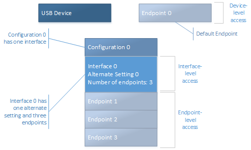
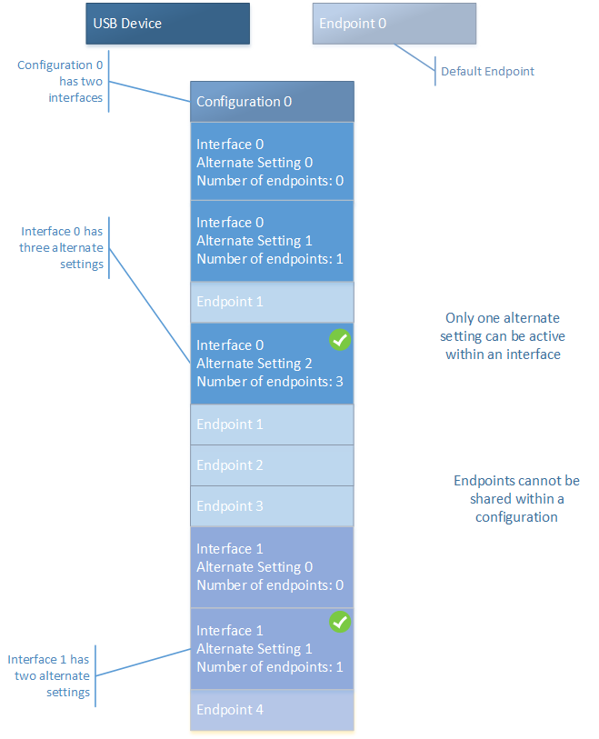

# USB device layout

A Universal Serial Bus (USB) device defines its capabilities and features through configurations, interfaces, alternate settings, and endpoints. This topic provides a high-level overview of those concepts.

A *USB configuration* defines the capabilities and features of a device, mainly its power capabilities and interfaces. The device can have multiple configurations, but only one is active at a time. The active configuration isn't chosen by the USB driver stack, but might be initiated by an application, a driver, the device driver. The device driver selects an active configuration.

A configuration can have one or more *USB interfaces* that define the functionality of the device. Typically, there is a one-to-one correlation between a function and an interface. However, certain devices expose multiple interfaces related to one function. In that case, the device can have an interface association descriptor (IAD). An IAD groups together interfaces that belong to a particular function.

Each interface contains one or more *endpoints*, which are used to transfer data to and from the device. In addition, the interface contains *alternate settings* that define the bandwidth requirements of the function associated with the interface. To sum up, a group of endpoints form an interface, and a set of interfaces constitutes a configuration in the device.

So what does it mean to select an active configuration? During device initialization, the device driver for USB device must select a configuration, one or more or interfaces within that configuration, and an alternate setting for each interface. Most USB devices don't provide multiple interfaces or multiple alternate settings. For example, the OSR USB FX2 Learning Kit device has one interface with one alternate setting and three endpoints. For more information about the learning kit, see [OSR Online](http://www.osronline.com/).

**Single interface device**

This diagram shows the configuration of a device with a single interface:

In this example, the diagram shows Endpoint 0, called the *default endpoint*. All USB devices must have a default endpoint that is used for control transfers (see [USB Control Transfer](usb-control-transfer.md)). Configuration 0 has one interface: Interface 0 with one alternate setting. Alternate Setting 0 uses all three endpoints in the interface.

**Multiple-interfaces device**

For multifunction devices, the device has multiple interfaces. To use a particular function or an interface, the client driver selects the interface and an associated alternate setting. Consider a multi-function USB device such as a webcam. The device has two functions, video-capture (camera) and audio input (microphone). The device defines an endpoint in a video interface that streams video. The device has another endpoint in a separate interface that takes audio input through the microphone. The configuration of the device includes both of these interfaces.

This diagram shows the configuration of the webcam device:

In this example, the diagram shows the default endpoint. Configuration 0 has two interfaces: Interface 0 and Interface 1. Interface 0 has three alternate settings. Only one of the alternate settings is active at any given time. Notice that Alternate Setting 0 doesn't use an endpoint, whereas Alternate Settings 1 and 2 use Endpoint 1. Typically, a video camera uses an *isochronous endpoint* for streaming. For that type of endpoint, when the endpoint is in use, bandwidth is reserved on the bus. When the camera is not streaming video, the client driver can select Alternate Setting 0 to conserve bandwidth. When the webcam is streaming video, the client driver can switch to either Alternate Setting 1 or Alternate Setting 2, which provides increasing levels of quality and consumes increasing bus bandwidth. Interface 1 has two alternate settings. Similar to Interface 0, Alternate Setting 0 doesn't use an endpoint. Alternate Setting 1 is defined to use Endpoint 1.

Endpoints can't be shared between two interfaces within a configuration. The device uses the endpoint address to determine the target endpoint for a data transfer or endpoint operation, such as pipe reset. All those operations are initiated by the host.

Before you start using the device, get information about the device layout. [USBView](https://msdn.microsoft.com/library/windows/hardware/86CB0BEE-0C2E-426E-866A-CECF07837457.aspx) is an application that enables you to browse all USB controllers and the USB devices that are connected to them. For each connected device, you can view the device, configuration, interface, and endpoint descriptors to get an idea about the capability of the device.

Next, see [Standard USB descriptors](standard-usb-descriptors.md).

## Related topics
[Concepts for all USB developers](usb-concepts-for-all-developers.md)  

