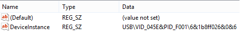
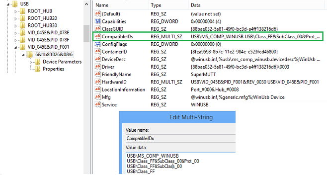

# USB Device Registry Entries

This topic describes the device-specific registry entries.

## Find device information after it enumerates on Windows

**View the device interface GUID, Hardware Id, and device class information about your device**

1. Find this registry key and note the **DeviceInstance** value:

    **HKEY\_LOCAL\_MACHINE\\SYSTEM\\CurrentControlSet\\Control\\DeviceClasses\\**

    

1. Find the device instance registry key and get the device interface GUID:

    **HKEY\_LOCAL\_MACHINE\\SYSTEM\\CurrentControlSet\\Enum\\USB\\&lt;hardware id&gt;\\&lt;instance id&gt;\\Device Parameters**

    

1. Under the device instance key, note the device class, subclass, and protocol codes:

    **HKEY\_LOCAL\_MACHINE\\SYSTEM\\CurrentControlSet\\Enum\\USB**

    

## Registry settings for configuring USB driver stack behavior

The registry entries described in this topic are found under this key:

```cpp
HKEY_LOCAL_MACHINE
   SYSTEM
      CurrentControlSet
         Control
            usbflags
               <VVVVPPPPRRRR>
                  <Device-specific registry entry>
```

In the ***vvvvpppprrrrr*** key,

- ***vvvv*** is a 4-digit hexadecimal number that identifies the vendor
- ***pppp*** is a 4-digit hexadecimal number that identifies the product
- ***rrrr*** is a 4-digit hexadecimal number that contains the revision number of the device.

The vendor ID, product ID, and revision number values are obtained from the [USB device descriptor](usb-device-descriptors.md).
The following table describes the possible registry entries for the ***vvvvpppprrrrr*** key. The USB driver stack considers these entries as read-only values.

<table>
  <thead>
    <tr>
      <th>Registry entry</th>
      <th>Description</th>
      <th>Possible values</th>
    </tr>
  </thead>
  <tbody>
    <tr>
      <td>
        <p><strong>osvc</strong></p>
        <p>REG_BINARY</p>
      </td>
      <td>
        <p>Indicates whether the operating system queried the device for <a href="microsoft-defined-usb-descriptors.md" data-raw-source="[Microsoft-Defined USB Descriptors](microsoft-defined-usb-descriptors.md)">Microsoft-Defined USB Descriptors</a>. If the previously-attempted OS descriptor query was successful, the value contains the vendor code from the OS string descriptor.</p>
      </td>
      <td>
        <ul>
          <li>0x0000: The device did not provide a valid response to the Microsoft OS string descriptor request.</li>
          <li>0x01xx: The device provided a valid response to the Microsoft OS string descriptor request, where xx is the <strong>bVendorCode</strong> contained in the response.</li>
        </ul>
      </td>
    </tr>
    <tr>
      <td>
        <p><strong>IgnoreHWSerNum</strong></p>
        <p>REG_BINARY</p>
      </td>
      <td>
        <p>Indicates whether the USB driver stack must ignore the serial number of the device.</p>
      </td>
      <td>
        <ul>
          <li>0x00: The setting is disabled.</li>
          <li>0x01: Forces the USB driver stack to ignore the serial number of the device. Therefore, the device instance is tied to the port to which the device is attached.</li>
        </ul>
      </td>
    </tr>
    <tr>
      <td>
        <p><strong>ResetOnResume</strong></p>
        <p>REG_BINARY</p>
      </td>
      <td>
        <p>Indicates whether the USB driver stack must reset the device when the port resumes from a sleep cycle.</p>
      </td>
      <td>
        <ul>
          <li>0x0000: The setting is disabled.</li>
          <li>0x0001: Forces the USB driver stack to reset a device on port resume.</li>
        </ul>
      </td>
    </tr>
  </tbody>
</table>

## Related topics

[Microsoft-provided USB drivers](system-supplied-usb-drivers.md)  
