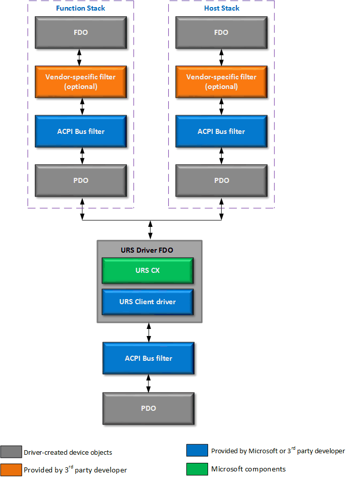

# USB Dual Role Driver Stack Architecture


**Last Updated**

-   November 2015

**Windows version**

-   Windows 10 for desktop editions (Home, Pro, Enterprise, and Education)
-   Windows 10 Mobile

USB Dual Role controllers are now supported in Windows, starting with Windows 10.

## Introduction


The USB Dual Role feature makes it possible for a system to be either a USB *device* or USB *host*. The detailed specification for USB Dual Role can be found on the [usb.org](http://www.usb.org/developers/wusb/docs/presentations/2006/Taipei06_SA_SBD_DRD_Design_Considerations.pdf) website.

The significant point here is that the dual role feature allows a mobile device, such as a phone, a phablet or a tablet, to designate itself as being a device or a host.

When a mobile device is in *function* mode, it is attached to a PC or some other device that acts as a host for the attached mobile device.

When a mobile device is in *host* mode, users can attach their devices, such as a mouse or a keyboard, to it. In this case the mobile device hosts the attached devices.

By providing support for USB dual role in Windows 10, we provide the following benefits:

-   Connectivity to mobile peripheral devices via USB, which offers a larger data bandwidth compared to wireless protocols like Bluetooth.
-   The option of battery charging over USB while connected to and communicating with other USB devices (as long as the required hardware support is present).
-   Enable customers who will most likely own a mobile device, such as a smart phone for all their work. This feature will allow improved productivity in a wired docking scenario, where a mobile device docks and thus hosts peripheral devices.

The following table shows the list of *host* class drivers that are available on desktop and mobile SKUs of Windows.

| USB Host class drivers                                             | Windows 10 Mobile | Windows 10 for desktop editions |
|--------------------------------------------------------------------|-------------------|---------------------------------|
| USB Hubs (USBHUB)                                                  | Yes               | Yes (Since Windows 2000)        |
| HID - Keyboard/Mice (HidClass, KBDCLass, MouClass, KBDHid, MouHid) | Yes               | Yes (Since Windows 2000)        |
| USB Mass Storage (Bulk & UASP)                                     | Yes               | Yes (Since Windows 2000)        |
| Generic USB Host Driver (WinUSB)                                   | Yes               | Yes (Since Windows Vista)       |
| USB Audio in / out (USBAUDIO)                                      | Yes               | Yes (Since Windows XP)          |
| Serial Devices (USBSER)                                            | Yes               | Yes (Since Windows 10)          |
| Bluetooth (BTHUSB)                                                 | Yes               | Yes (Since Windows XP)          |
| Print (usbprint)                                                   | No                | Yes (Since Windows XP)          |
| Scanning (USBSCAN)                                                 | No                | Yes (Since Windows 2000)        |
| WebCam (USBVIDEO)                                                  | No                | Yes (Since Windows Vista)       |
| Media Transfer Protocol (MTP Initiator)                            | No                | Yes (Since Windows Vista)       |
| Remote NDIS (RNDIS)                                                | No                | Yes (Since Windows XP)          |
| IP over USB (IPoverUSB)                                            | No                | Yes (New for Windows 10)        |


The Class drivers in the table were selected based on device class telemetry, and based on key scenarios that were selected for Windows 10. We plan on including a limited number of inbox, 3rd party Host drivers, to support key devices on Windows 10 Mobile. And for Windows 10 for desktop editions, these drivers will be available either on the OEM’s website or via Windows Update (WU).

For Windows 10 Mobile, the 3rd party drivers that are not included inbox will not be available on WU. The disk footprint of the USB Host stack + HID has been kept small. Which is why not all class drivers, and very few 3rd party drivers are included inbox for Windows 10 Mobile. An OEM who wishes to make 3rd party drivers available can use a Board Support Package (BSP) to add them to OS images for their mobile devices. For more information about this policy, see [Driver development for Windows Phone](http://go.microsoft.com/fwlink/p/?LinkId=761246), and scroll down to the section titled *Differences between driver development for Windows Phone and Windows*.

The following table shows the *function* class drivers that are available on mobile SKUs of Windows.

**Note**  Function drivers are *not* available on Windows 10 for desktop editions.


| USB Function class drivers                 | Windows 10 Mobile | Windows 10 for desktop editions | Notes                                                                                                                                  |
|--------------------------------------------|-------------------|---------------------------------|----------------------------------------------------------------------------------------------------------------------------------------|
| Media Transfer Protocol (MTP Responder)    | Yes               | No                              | There are no scenarios for MTP responder on Desktop. P2P scenarios between Desktop systems were enabled via Easy-MigCable over WinUSB. |
| Video Display out (vidstream)              | Yes               | No                              |                                                                                                                                        |
| Generic USB Function Driver (GenericUSBFn) | Yes               | No                              | This will be needed by IPoverUSB and other desktop flashing scenarios.                                                                 |


We will monitor device attachment data, to let us know if we need to provide additional class driver support, as the device class popularity list changes over time.

## Driver implementation


The Microsoft USB Role Switch (URS) driver allows a system implementer to take advantage of the dual-role USB capability of their platform.

The URS driver is intended to provide dual-role functionality for platforms that use a single USB controller that can operate in both host and peripheral roles over a single port. The *peripheral role* is also known as a *function role*. The URS driver manages the current role of the port, and the loading and unloading of the appropriate software stacks, based on hardware events from the platform.

On a system that has a USB micro-AB connector, the driver makes use of hardware interrupts that indicates the state of the ID pin on the connector. This pin is used to detect whether the controller needs to assume the host role or the function role in a connection. For more information, see the [USB On-The-Go specification](http://go.microsoft.com/fwlink/p/?LinkId=698414). On systems with a USB Type-C connector, the OEM implementer is expected to provide a connector client driver by using the [USB Type-C connector driver programming interfaces](https://docs.microsoft.com/windows-hardware/drivers/ddi/content/_usbref/#type-c-driver-reference). The client driver communicates with the Microsoft-provided USB connector Manager class extension (UcmCx) to manage all aspects of the USB Type-C connector, such as CC detection, PD messaging, and others. For role switching, the client driver communicates the state of the USB Type-C connector to the URS driver.

The following diagram shows the USB software driver stack for a dual-role controller that uses the URS driver.



Note that the URS driver will never load the Function and Host stacks shown in the preceding diagram simultaneously. The URS driver will load *either* the Function stack, *or* the Host stack - depending on the role of the USB controller.

## Hardware requirements


If you are developing a platform that will take advantage of the URS driver, to provide dual-role USB functionality, the following hardware requirements have to be met:

-   USB controller

    These drivers are provided by Microsoft as in-box drivers.

    Synopsys DesignWare Core USB 3.0 controller. Inbox INF: UrsSynopsys.inf.

    Chipidea High-Speed USB OTG Controller. Inbox INF: UrsChipidea.inf.

-   ID pin interrupts

    The ID pin interrupt(s) for non-USB Type-C systems may be implemented in one of two ways:

    Two edge-triggered interrupts: one that fires when the ID pin on the connector is grounded, and another one that fires when the ID pin is floating.

    A single active-both interrupt that is at active level when ID pin is grounded.

-   USB controller enumeration

    The USB dual-role controller must be ACPI-enumerated.

-   Software support

    The URS driver expects a software interface that allows control of VBus over the connector. This interface is SoC-specific. Contact your SoC vendor for more details.

These USB OTG features are not supported in Windows:

-   Accessory Charger Adapter detection (ACA).
-   Session Request Protocol (SRP).
-   Host Negotiation Protocol (HNP).
-   Attach Detection Protocol (ADP).

## <a href="" id="acpi"></a>System configuration


In order to use the URS driver, you must create an ACPI definition file for your system. Additionally, there are some driver-related considerations that you must take into account.

Here is a sample ACPI definition for a USB dual-role controller.

```Text
//
// You may name the device whatever you want; we don&#39;t depend on it being called &#39;URS0&#39;.
//
Device(URS0)
{
    //
    // Replace with your own hardware ID. Microsoft will add it to the inbox INF,
    // or you may choose to author a custom INF that uses Needs & Includes directives
    // to include sections from the inbox INF.
    //
    Name(_HID, "ABCD1234")

    Name(_CRS, ResourceTemplate() {
        //
        // The register space for the controller must be defined here.
        //
        Memory32Fixed(ReadWrite, 0xf1000000, 0xfffff)


        //
        // The ID pin interrupts, if you are using two edge-triggered interrupts.
        //
        GpioInt(Edge, ActiveHigh, Exclusive, PullUp, 0, "\\_SB.GPI0", 0, ResourceConsumer, , ){0x1001}
        GpioInt(Edge, ActiveHigh, Exclusive, PullUp, 0, "\\_SB.GPI0", 0, ResourceConsumer, , ){0x1002}

        //
        // Following is an example of a single active-both interrupt.
        //
        // GpioInt(Edge, ActiveBoth, Exclusive, PullUp, 0, "\\_SB.GPI0", 0, ResourceConsumer, , ){0x12}
        //

        //
        // For a Type-C platform, you do not need to specify any interrupts here.
        //
    })

    //
    // This child device represents the USB host controller. This device node is in effect
    // when the controller is in host mode.
    // You may name the device whatever you want; we don&#39;t depend on it being called &#39;USB0&#39;.
    //
    Device(USB0)
    {
        //
        // The host controller device node needs to have an address of &#39;0&#39;
        //
        Name(_ADR, 0)
        Name(_CRS, ResourceTemplate() {

            //
            // The controller interrupt.
            //
            Interrupt(ResourceConsumer, Level, ActiveHigh, Exclusive, , , ){0x10}
        })
    }

    //
    // This child device represents the USB function controller. This device node is in effect
    // when the controller is in device/function/peripheral mode.
    // You may name the device whatever you want; we don&#39;t depend on it being called &#39;UFN0&#39;.
    //
    Device(UFN0)
    {
        //
        // The function controller device node needs to have an address of &#39;1&#39;
        //
        Name(_ADR, 1)
        Name(_CRS, ResourceTemplate() {

            //
            // The controller interrupt (this could be the same as the one defined in
            // the host controller).
            //
            Interrupt(ResourceConsumer, Level, ActiveHigh, Exclusive, , , ){0x11}
        })
    }
}
```

Here are some explanations for the main sections of the ACPI file:

-   URS0 is the ACPI definition for the USB dual-role controller. This is the ACPI device on which the URS driver will load.

-   USB0 and UFN0 are child devices inside the scope of URS0. USB0 and UFN0 represent the two child stacks that will be enumerated by the URS driver, and the host and function stacks respectively. Note that \_ADR is the means by which ACPI matches these device definitions with the device objects that the URS driver creates.

-   If the controller uses the same interrupt for both roles, the same controller interrupt can be described in both child devices. Even in that case, the interrupt can still be described as "Exclusive."

-   You can make additions to this ACPI definition file as needed. For example, you can set any other necessary methods or properties on any of the devices in the ACPI definition file. Such additions will not interfere with the operation of the URS driver. Any additional resources that are required in any of the stacks can also be described in the \_CRS of the appropriate device.

The URS driver assigns Hardware IDs to the host and function stacks. These Hardware IDs are derived from the Hardware ID of the URS device. For example, if you have a URS device whose Hardware ID is ACPI\\ABCD1234, then the URS driver creates Hardware IDs for the host and function stacks as follows:

-   Host stack: URS\\ABCD1234&HOST

-   Function stack: URS\\ABCD1234&FUNCTION

## <a href="" id="inf"></a>Driver installation packages


3rd-party driver packages can take a dependency on this scheme, if necessary.

If you're an IHV or an OEM and you're thinking of providing your own driver package, here are some things to consider:

- URS driver package

  It is expected that the Hardware ID for the dual-role controller on each platform will be added to the inbox INF for URS. However, if for some reason the ID cannot be added, the IHV/OEM may provide a driver package with an INF that Needs/Includes the inbox INF and matches their Hardware ID.

  This is necessary in the case where the IHV/OEM requires a filter driver to be present in the driver stack.

- Host driver package.

  An IHV/OEM-provided driver package that Needs/Includes the inbox *usbxhci.inf* and matches the host device Hardware ID is required. The Hardware ID match would be based on the scheme described in the preceding section.

  This is necessary in the case where the IHV/OEM requires a filter driver to be present in the driver stack.

  There is work in progress to make URS driver assign the XHCI Compatible ID for the host device.

- Function driver package

  An IHV/OEM-provided driver package that Needs/Includes the inbox *Ufxsynopsys.inf* and matches the peripheral device Hardware ID is required. The Hardware ID match would be based on the scheme described in the preceding section.

  The IHV/OEM can also include a filter driver in the driver package.
  ## See Also

[Dual-role controller driver reference](https://docs.microsoft.com/windows-hardware/drivers/ddi/content/_usbref/#dual-role-controller-driver-reference)


