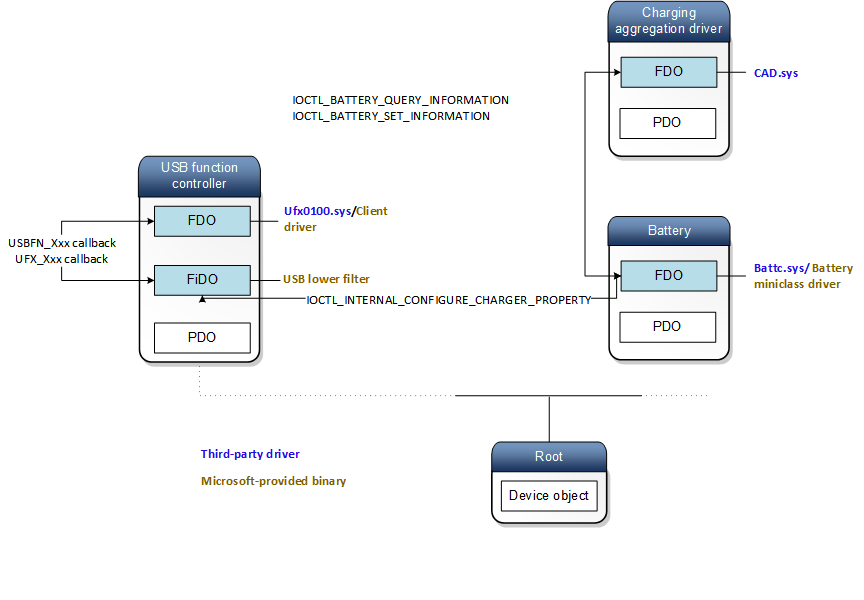

# USB filter driver for supporting USB chargers

Write a filter driver that supports detection of chargers, if the function controller uses the in-box Synopsys and ChipIdea drivers. If you are writing a client driver for a proprietary function controller, charger/attach detection is integrated in the client driver by implementing [EVT_UFX_DEVICE_PROPRIETARY_CHARGER_SET_PROPERTY](https://docs.microsoft.com/windows-hardware/drivers/ddi/content/ufxclient/nc-ufxclient-evt_ufx_device_proprietary_charger_set_property), [EVT_UFX_DEVICE_PROPRIETARY_CHARGER_RESET](https://docs.microsoft.com/windows-hardware/drivers/ddi/content/ufxclient/nc-ufxclient-evt_ufx_device_proprietary_charger_reset), and [EVT_UFX_DEVICE_DETECT_PROPRIETARY_CHARGER](https://docs.microsoft.com/windows-hardware/drivers/ddi/content/ufxclient/nc-ufxclient-evt_ufx_device_proprietary_charger_detect).

The USB function stack allows the device, such as a phone or tablet, to charge when connected to a host and USB charger as defined by the USB Battery Charging (BC) 1.2 specification. 

- There are two types of ports that the device can use for charging. The device can charge from a dedicated charging port (DCP) on a charger that shipped with the device. Alternately, the device can from standard downstream ports or charging downstream ports when the device is connected to a PC. Both of those cases are compliant with the [USB BC 1.2 specification](http://www.usb.org/developers/docs/devclass_docs/USB_Battery_Charging_1.2.pdf). 
- Certain chargers do not follow the specification. USB function stack allows the device to charge from those proprietary USB chargers. 

To support spec-compliant and proprietary chargers, these operations are required. 

- The device is able to detect when a USB host or charger is attached or detached. 
- The device is able to detect the different USB charging ports as defined by the BC 1.2 spec. 
- For USB chargers that are defined by the BC 1.2 spec, the device charges with the maximum amount of current allowed by the BC 1.2 spec. 
- The device is able to detect proprietary USB chargers. 
- For proprietary USB chargers, determine the maximum amount of current that the device can draw. 
- Notify the operating system about the USB port type that is connected. 
- Prevent the device from pulling current over USB in the OS, even if a USB Host is connected and the device has configured itself with the Host. 

Those operations are handled by [USB function class extension (UFX)/client driver](developing-windows-drivers-for-usb-function-controllers.md) pair and a filter driver that is loaded as a lower filter in the USB function device stack. The driver manage USB charging starting from USB port detection to notifying the battery stack when it can begin charging and the maximum amount of current the device can draw. 

Here is an architectural representation of the device stacks.

When a USB port is attached to the device, the client driver gets a notified either by the lower filter driver or an interrupt. At this time, the client driver performs port detection by communicating with the USB hardware and reports the port type to UFX. Alternately, it can request the filter driver. In that case, the filter driver coordinates with the USB hardware to perform USB port detection and returns the detected port type to the client driver and the client driver passes it to UFX. 

Based on the port type, UFX determines the maximum amount of current that the device can draw and sends that information to the Charging Aggregation Driver (CAD). CAD validates the information. If the current is valid, CAD sends a request to the battery class driver to start charging up to the specified maximum current. The battery class driver forwards the charging request to the battery miniclass driver for processing. If the charging request specified that a proprietary charger was attached and the battery miniclass handles proprietary chargers, the miniclass driver can attempt to charge with a maximum current that it determines is appropriate. Otherwise, the battery miniclass can only charge up to the maximum current that is specified by CAD.

