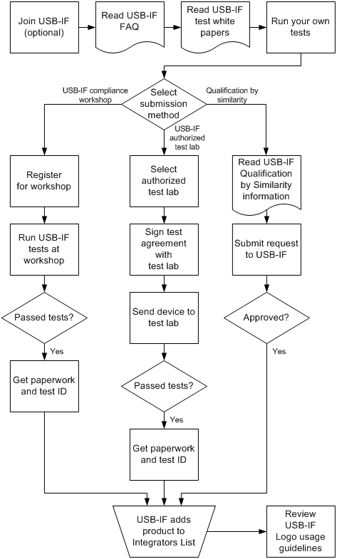

# USB-IF Certification Tests

Guidelines for hardware vendors and device manufacturers to prepare USB devices and host controllers for Windows Hardware Certification Program submission.

## USB-IF Certification Tests

If you manufacture USB hardware, specifically USB device or host controller, your hardware must meet the electrical and mechanical requirements of USB-IF in order to receive Windows Certification. USB-IF certification covers more in-depth testing of USB devices and host controllers and ensures a high-quality implementation.

Earlier versions of the Windows Hardware Certification Kit required hardware manufacturers to submit their devices to the USB-IF for testing. However, that requirement has changed. You are no longer required to submit their devices to the USB-IF for testing.

The new version of the HLK, USB-IF testing requirements allows vendors to download and run tests from the USB-IF website, then assert that these tests have passed in the HLK. If your device has already been certified by the USB-IF, you need to provide the USB-IF Test ID (TID) for the device to the HLK.

Even if USB devices pass current Microsoft Windows Certification Program requirements, many of those devices do not fully comply with the USB specification. Most common examples are:

-   **Hubs**: Commonly fail because they report that they have external power when they actually only have bus power. The false report leads to an invalid voltage condition on the bus.
-   **Hard disk drives**: Commonly fail because they do not enumerate correctly because of excessive power draw from the USB bus. In many situations, these hard disk drives require non-standard cables to work correctly.
-   **Flash drives**: Commonly fail because they do not handle the descriptor requests correctly; this causes the device to hang and fail the Microsoft operating system descriptor.
-   **Card readers**: Commonly fail because they do not enter into the Selective Suspend state.
-   **Printers**: Commonly fail because they do not resume from standby.
-   **Audio**: Commonly fail because they do not resume from standby.

A non-compliant USB device can cause a poor user experience, difficult public relations, product returns and loss of revenue, high product support call volume, and increased costs that are associated with servicing bugs in shipped products.
## Windows HLK requirements for USB-IF tests

-   Devices (**Device.Connectivity.UsbDevices.UsbifCertification)**

    We strongly recommend USB-IF certification; however, the Windows HLK requirement **Device.Connectivity.UsbDevices.UsbifCertification** no longer requires USB-IF certification for USB devices. The requirement states that the device can be either USB-IF certified, or that a subset of the USB-IF’s certification tests can be run on the device.

-   Host controllers (**Device.BusController.UsbController.UsbifCertification**)

    USB host controller manufacturers must obtain full USB-IF certification in order to meet their respective Windows HLK requirements.

-   Hubs (**Device.Connectivity.UsbDevices.UsbifCertification**)

    USB hub manufacturers must obtain full USB-IF certification in order to meet their respective Windows HLK requirements.

System manufacturers should be aware of those requirements when they select USB host controllers to integrate into their systems. These requirements can significantly improve the customer experience with USB devices. They can help to prevent key reasons for crashes and hangs, and reduce the time spent to troubleshoot and debug non-compliance issues.

## Windows Hardware Certification submission options

This image shows the process flow for how to obtain Windows Certification.

You can submit USB devices for Windows Certification qualification to meet the new USB-IF testing requirement by using one of the following methods:

- **USB-IF certification**

  Obtain USB-IF certification from a [USB-IF authorized independent testing lab](http://www.usb.org/developers/compliance/labs/) and then submit the device for Windows Certification qualification. You can select one of the following options to obtain USB-IF certification for device or host controllers:

  -   Submit the device to a USB-IF authorized independent test lab for testing. For information about how to find a lab, see USB-IF authorized independent testing lab.
      **Note**  It usually takes an authorized independent test lab one to two weeks to test a single USB device for compliance to the USB specification.

         

  -   To submit a USB device to an authorized independent test lab for USB-IF certification, the manufacturer must register with the lab and have a valid vendor ID (VID).

  After a device successfully passes the USB-IF certification tests, you have the following privileges for the device:

  -   You can use the USB logo for brochures, packaging, and product information for your device.
  -   You can be listed on the USB-IF Integrators List.
  -   Bring the device to a [USB-IF-sponsored Compliance Workshop](http://www.usb.org/developers/events/compshop/). Each year, four workshops are held in the USA, and one workshop is held in Asia.

  After a device passes the USB-IF certification tests, you receive a Test ID number (TID) from the test lab or workshop. You provide this TID number to the Windows HLK when you run the remainder of the Windows HLK tests for the device.

  The cost of testing and certifying a USB device at an authorized independent test lab can vary from lab to lab. Some authorized independent test labs offer volume discounts or discounts for some affiliated businesses. There is no cost to test and certify a USB device at any USB-IF-sponsored compliance workshop. You must be a member of the USB-IF to attend a USB-IF sponsored compliance workshop.

- **USB-IF self-test**

  Download the USB Command Verifier test tools and the USB interoperability test documents and run the required tests from the [USB-IF](http://www.usb.org/home). Then submit the device for Windows Certification qualification.

  **Note**  USB host controllers and hubs are not eligible for the USB-IF self-testing option and must obtain full USB-IF certification.

  If you decide to use the USB-IF self-test option to obtain Windows Certification, you must at minimum perform the following USB-IF tests:

  -   USB command verifier tests: The USB command verifier tests verify the ability of a device to understand and accept common USB commands.
  -   USB interoperability tests: The USB interoperability tests target the functionality and the ability of a device to coexist with other USB peripherals.

  These tests are downloaded and run outside of the Windows HLK. Note that these tests must be run on the latest version of Windows only (as specified by the USB-IF), even if you are submitting your USB device for Windows Certification qualification for multiple versions of Windows. The test results apply to all Windows Certification submissions for all versions of Windows.

  The following steps describe how to perform the required USB-IF tests to qualify a device for Windows Certification.

  1. Download the USB 3.0 Command Verifier test tool (USB30CV), and the interoperability test documents from [SuperSpeed USB Software and Hardware Tools](http://go.microsoft.com/fwlink/p/?LinkId=623333).
  2. Run the USB-IF tests for the USB hardware as specified in the following tables:

     <table>
     <colgroup>
     <col width="50%" />
     <col width="50%" />
     </colgroup>
     <thead>
     <tr class="header">
     <th>USB version</th>
     <th>USB-IF tests</th>
     </tr>
     </thead>
     <tbody>
     <tr class="odd">
     <td>USB 2.0</td>
     <td>
Attach the device behind an xHCI host controller and run the Chapter 9 Tests [USB 2.0 devices] in the USB 3.0 Command Verifier test tool (USB30CV).

     
Run the interoperability tests as described in the EHCI portion of the Interoperability section of the <a href="http://compliance.usb.org/resources/GoldSuite%20Test%20Procedure.pdf">GoldSuite Test Procedure document</a>. Run these tests twice: one with the device attached behind an EHCI host controller, and then with the device attached behind an xHCI host controller.
</td>
     </tr>
     <tr class="even">
     <td>USB 3.0</td>
     <td>
Attach the device behind an xHCI host controller and run the Chapter 9 Tests [USB 3.0 devices] in the USB 3.0 Command Verifier test tool (USB30CV).

     
Run the interoperability tests as described in the <a href="http://go.microsoft.com/fwlink/p/?LinkId=623335" data-raw-source="[XHCI Interoperability Testing](http://go.microsoft.com/fwlink/p/?LinkId=623335)">XHCI Interoperability Testing</a> document. Run these tests two times: one time with the device attached behind an EHCI host controller, and one time with the device attached behind an xHCI host controller.
</td>
     </tr>
     </tbody>
     </table>
    
  3. If the tests are passing, enter the string "SELFTEST" as the Test ID (TID) input to the USB-IF Certification Validation Test in the HLK.

## Related topics
[Windows Hardware Lab Kit Tests for USB](windows-hardware-certification-kit-tests-for-usb.md)  

