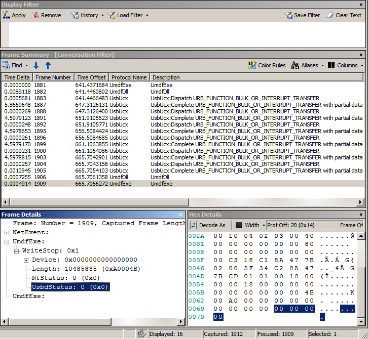

# Using activity ID GUIDs in USB ETW traces


This topic provides information about Activity ID GUIDs, how to add those GUIDs in the event trace providers, and view them in Netmon.

Drivers in the [USB driver stack](usb-3-0-driver-stack-architecture.md) (both 2.0 and 3.0) are ETW event trace providers. In Windows 7, while capturing event traces from the USB driver stack, you can capture traces from other providers, such as other drivers and applications. You can then read the combined log (assuming that you have created a Netmon parser for your provider's event traces).

Starting in Windows 8, you can associate events across providers (from applications, client driver, and the USB driver stack) by using *activity ID GUIDs*. Events from multiple providers can be associated in Netmon when the events have the same activity ID GUID. Based on those GUIDs, Netmon can show you the set of USB events that resulted from an instrumented activity at an upper layer.

While viewing combined event traces from other providers in Netmon, right-click an event from an application and choose **Find Conversations -&gt; NetEvent** to see associated driver events.

This image shows you related events from an application, UMDF driver, and Ucx01000.sys (one of the drivers in the USB driver stack).These events have the same activity ID GUID.



-   [How to add an activity ID GUID in an application](#how-to-add-an-activity-id-guid-in-an-application)
-   [How to set the activity ID GUID in a UMDF driver](#how-to-set-the-activity-id-guid-in-a-umdf-driver)
-   [How to add activity ID GUID in a kernel-mode driver](#how-to-add-activity-id-guid-in-a-kernel-mode-driver)

## How to add an activity ID GUID in an application


An application can include activity ID GUIDs by calling [**EventActivityIdControl**](https://msdn.microsoft.com/library/windows/desktop/aa363720). For more information, see [Event Tracing Functions](https://msdn.microsoft.com/library/windows/desktop/aa363795).

This example code shows how an application can set an activity ID GUID and send it to the ETW provider, a UMDF driver.

```cpp
EventActivityIdControl(EVENT_ACTIVITY_CTRL_CREATE_ID, &activityIdStruct.ActivityId); 
EventActivityIdControl(EVENT_ACTIVITY_CTRL_SET_ID,    &activityIdStruct.ActivityId); 

if (!DeviceIoControl(hRead,
                     IOCTL_OSRUSBFX2_SET_ACTIVITY_ID,
                     &activityIdStruct,         // Ptr to InBuffer
                     sizeof(activityIdStruct),  // Length of InBuffer
                     NULL,                      // Ptr to OutBuffer
                     0,                         // Length of OutBuffer
                     NULL,                      // BytesReturned
                     0))                        // Ptr to Overlapped structure
{         

          wprintf(L"Failed to set activity ID - error %d\n", GetLastError());
}

...

success = ReadFile(hRead, pinBuf, G_ReadLen, (PULONG) &nBytesRead, NULL);

if(success == 0) 
{
          wprintf(L"ReadFile failed - error %d\n", GetLastError());

          EventWriteReadFail(0, GetLastError());

          ...


}
```

In the preceding example, an application calls [**EventActivityIdControl**](https://msdn.microsoft.com/library/windows/desktop/aa363720) to create an activity ID (EVENT\_ACTIVITY\_CTRL\_CREATE\_ID) and then to set it (EVENT\_ACTIVITY\_CTRL\_SET\_ID) for the current thread. The application specifies that activity GUID to the ETW event provider, such as a user-mode driver, by sending a driver-defined IOCTL (described in the next section).

The event provider must publish an instrumentation manifest file (.MAN file). By running the [**message compiler (Mc.exe)**](https://msdn.microsoft.com/library/windows/desktop/aa385638), a header file is generated that contains definitions for the event provider, event attributes, channels, and events. In the example, the application calls EventWriteReadFail, which are defined in the generated header file, to write trace event messages in case of a failure.

## How to set the activity ID GUID in a UMDF driver


A user-mode driver creates and sets activity ID GUIDs by calling [**EventActivityIdControl**](https://msdn.microsoft.com/library/windows/desktop/aa363720) and the calls are similar to the way an application calls them, as described in the previous section. Those calls add the activity ID GUID to the current thread and that activity ID GUID is used whenever the thread logs an event. For more information, see [Using Activity Identifiers](https://msdn.microsoft.com/library/windows/hardware/hh706287).

This example code shows how a UMDF driver sets the activity ID GUID that was created and specified by the application through an IOCTL.

```cpp
VOID
STDMETHODCALLTYPE
CMyControlQueue::OnDeviceIoControl(
    _In_ IWDFIoQueue *FxQueue,
    _In_ IWDFIoRequest *FxRequest,
    _In_ ULONG ControlCode,
    _In_ SIZE_T InputBufferSizeInBytes,
    _In_ SIZE_T OutputBufferSizeInBytes
    )
/*++

Routine Description:


    DeviceIoControl dispatch routine

Aruments:

    FxQueue - Framework Queue instance
    FxRequest - Framework Request  instance
    ControlCode - IO Control Code
    InputBufferSizeInBytes - Lenth of input buffer
    OutputBufferSizeInBytes - Lenth of output buffer

    Always succeeds DeviceIoIoctl
Return Value:

    VOID

--*/
{
    ...

    switch (ControlCode)
    {

        ....

        case IOCTL_OSRUSBFX2_SET_ACTIVITY_ID:
        {
            if (InputBufferSizeInBytes < sizeof(UMDF_ACTIVITY_ID))
            {
                hr = HRESULT_FROM_WIN32(ERROR_INSUFFICIENT_BUFFER);
            }
            else
            {
                FxRequest->GetInputMemory(&memory );
            }

            if (SUCCEEDED(hr)) 
            {
                buffer = memory->GetDataBuffer(&bigBufferCb);
                memory->Release();

                m_Device->SetActivityId(&((PUMDF_ACTIVITY_ID)buffer)->ActivityId);
                hr = S_OK;
            }

            break;
        }
    } 
}

VOID
 SetActivityId(
        LPCGUID ActivityId
        )
    {
        CopyMemory(&m_ActivityId, ActivityId, sizeof(m_ActivityId));
    }


void
CMyReadWriteQueue::ForwardFormattedRequest(
    _In_ IWDFIoRequest*                         pRequest,
    _In_ IWDFIoTarget*                          pIoTarget
    )
{
...
    pRequest->SetCompletionCallback(
        pCompletionCallback,
        NULL
        );

...
    hrSend = pRequest->Send(pIoTarget,
                            0,  //flags
                            0); //timeout

...
    if (FAILED(hrSend))
    {
        contextHr = pRequest->RetrieveContext((void**)&pRequestContext);

        if (SUCCEEDED(contextHr)) {

            EventActivityIdControl(EVENT_ACTIVITY_CTRL_SET_ID, &pRequestContext->ActivityId);

            if (pRequestContext->RequestType == RequestTypeRead)
            {
                EventWriteReadFail(m_Device, hrSend);
            }

            delete pRequestContext;
        }

        pRequest->CompleteWithInformation(hrSend, 0);
    }

    return;
}
```

Let's see how the activity ID GUID that was created by the application gets associated with a [User-Mode Driver Framework](https://msdn.microsoft.com/library/windows/hardware/ff560027) (UMDF) client driver. When the driver receives the IOCTL request from the application, it copies the GUID in a private member. At some point, the application calls [**ReadFile**](https://msdn.microsoft.com/library/windows/desktop/aa365467) to perform a read operation. The framework creates a request and invokes the driver's handler, ForwardFormattedRequest. In the handler, the driver sets the previously stored activity ID GUID on the thread by calling [**EventActivityIdControl**](https://msdn.microsoft.com/library/windows/desktop/aa363720) and EventWriteReadFail to trace event messages.

**Note**  The UMDF driver must also include the header file that is generated through the instrumentation manifest file. The header file defines macros such as EventWriteReadFail that write trace messages.


## How to add activity ID GUID in a kernel-mode driver


In kernel mode, a driver can trace messages on the thread that originates in user mode or a thread that the driver creates. In both those cases, the driver requires the activity ID GUID of the thread.

To trace messages, the driver must obtain the registration handle as an event provider (see [**EtwRegister**](https://msdn.microsoft.com/library/windows/hardware/ff545603)) and then call [**EtwWrite**](https://msdn.microsoft.com/library/windows/hardware/ff545627) by specifying the GUID and the event message. For more information, see [Adding Event Tracing to Kernel-Mode Drivers](https://msdn.microsoft.com/library/windows/hardware/ff541236).

If your kernel- mode driver handles a request that was created by an application or a user-mode driver, the kernel-mode driver does not create and set an activity ID GUID. Instead, the I/O manager handles most of the activity ID propagation. When a user-mode thread initiates a request, the I/O manager creates an IRP for the request and automatically copies the current thread's activity ID GUID into the new IRP. If the kernel-mode driver wants to trace events on that thread, it must get the GUID by calling [**IoGetActivityIdIrp**](https://msdn.microsoft.com/library/windows/hardware/hh439309), and then call [**EtwWrite**](https://msdn.microsoft.com/library/windows/hardware/ff545627).

If your kernel-mode driver creates an IRP with an activity ID GUID, the driver can call [**EtwActivityIdControl**](https://msdn.microsoft.com/library/windows/hardware/ff545578) with EVENT\_ACTIVITY\_CTRL\_CREATE\_SET\_ID to generate a new GUID. The driver can then associate the new GUID with the IRP by calling [**IoSetActivityIdIrp**](https://msdn.microsoft.com/library/windows/hardware/hh439382)and then call [**EtwWrite**](https://msdn.microsoft.com/library/windows/hardware/ff545627).

The activity ID GUID is passed along with the IRP to the next lower drivers. The lower drivers can add their trace messages to the thread.

## Related topics
[USB Event Tracing for Windows](usb-event-tracing-for-windows.md)  


