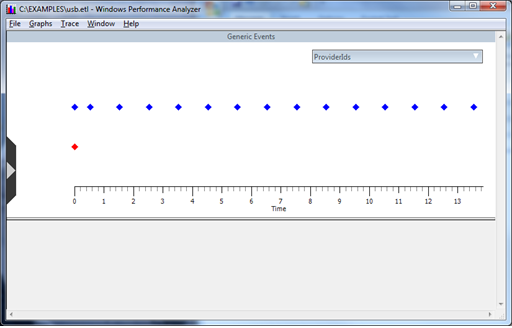
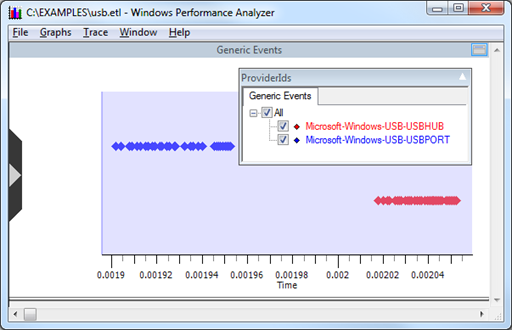
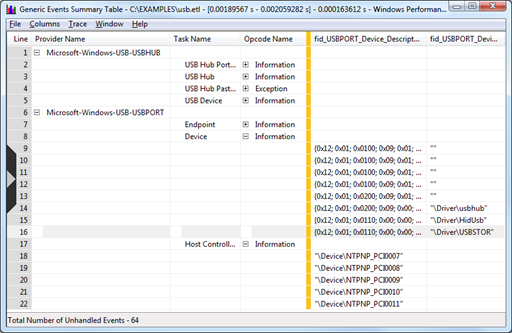

# Viewing a USB Event Trace in Xperf


This topic describes how to view a USB event trace in Xperf.

To analyze performance and timing issues, you can use Xperf to view a USB event trace. For example, if you have an event trace log file that is named usb.etl and you have downloaded the Xperf tool, issue the following command to analyze the trace:

```cpp
xperf usb.etl
```

Xperf displays a view of the events in graphical form. The initial view is a timeline view, in which each diamond represents one or more events in this image. The diamonds are color coded according to the event provider.



The timeline view graphically presents clusters of event activity. In the graphical view, it is easy to see the periodic nature of event activity at 1-second intervals as USB transfer requests that occurred for the USB mass storage device after the device summary events in this example trace.

You can move the mouse pointer across sections of the timeline and zoom in. This image shows zooming in on the device summary events that occur at the very beginning of the trace.



You can display an event summary table, in a spreadsheet form, for the entire trace or for just a selected interval as shown in this image.



To display a summary table, right-click in the **Generic Events** screen and select **Summary Table**.

The event summary table is a very powerful view because you can drag the columns to reorder them and the view pivots the events based on the new column order. To enable you to focus on items of interest, you can expand or collapse items with identical sort order.

Sometimes Netmon presents USB event data in a more readable form than Xperf, but Netmon lacks the Xperf timeline and table views. To analyze the trace’s events at a particular period of time, you can switch between Xperf and Netmon.

## Related topics
[USB Event Tracing for Windows](usb-event-tracing-for-windows.md)  
[Using Xperf with USB ETW](using-xperf-with-usb-etw.md)  


