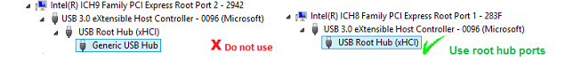

# Windows Hardware Lab Kit (HLK) Tests for USB

The Windows Hardware Lab Kit (HLK) tests can be used for additional testing of Systems, USB host controllers, hubs, and devices. These tests cover basic device functionality, reliability, and compatibility with Windows.

## Prerequisites

Before you start running the logo tests make sure you meet the following requirements:

-   To run these tests you will need at least two computers: a test server and a test client.
-   The test client must have the latest version of Windows.
-   The test client must have EHCI and xHCI controllers, either integrated or as add-in cards. The controllers must expose user-accessible root ports (no integrated hubs).
-   Download the Windows HLK to the test server from [Windows Hardware Lab Kit Downloads](http://go.microsoft.com/fwlink/p/?linkid=285647).

    For detailed information about how to install and use the Windows HLK, see [Windows HLK Getting Started](https://docs.microsoft.com/windows-hardware/test/hlk/getstarted/windows-hlk-getting-started).

## Hardware requirements for running USB tests in the HLK

To run the HLK tests, you need:

-   Your host controller (either integrated or as add-in cards), hubs, or device to certify.

    Open Device Manager on the test client and make sure that the USB controllers that you want to use expose user-accessible root ports (no integrated hubs).

    

-   USB-IF-compliant external SuperSpeed hub to evaluate system compatibility. We have tested HLK tests with these hubs:
    -   [Texas Instruments SuperSpeed (USB 3.0) Hub reference design board (TUSB8040EVM)](http://go.microsoft.com/fwlink/p/?linkid=248509).
    -   SuperMUTT Pack. See [MUTT devices](microsoft-usb-test-tool--mutt--devices.md).
-   [MUTT devices](microsoft-usb-test-tool--mutt--devices.md) as test devices for hub and controller tests.
-   USB-IF certified cables and connectors to avoid signal integrity issues. See [USB-IF list of products](http://go.microsoft.com/fwlink/p/?linkid=617502).

Complete set of requirements are given here:

-   [USB Bus Controller Testing Prerequisites](http://go.microsoft.com/fwlink/p/?linkid=617477)
-   [USB Hub.Connectivity Testing Prerequisites](http://go.microsoft.com/fwlink/p/?linkid=617499)

## HLK test selection for USB

The USB tests that apply to your system, host controller, hub, or device are automatically selected in HLK Studio.

After you follow steps 1-5 in [Windows HLK Getting Started]( https://docs.microsoft.com/windows-hardware/test/hlk/getstarted/windows-hlk-getting-started), make sure that:

-   In step 5,the correct device is selected in the **Selection** tab of HLK Studio.
-   In step 6, all the tests that apply to your device are displayed in the **Tests** tab in HLK studio. To run these tests, you must select the test in the left-hand check box and click **Run Selected**. The tests for USB testing are listed in the following section of this document.

For information about scheduling tests, see steps 2-6 in [Windows HLK Getting Started]( https://docs.microsoft.com/windows-hardware/test/hlk/getstarted/windows-hlk-getting-started).

## Recommended Windows HLK tests

In addition to all of the USB tests that are automatically selected in HLK Studio, we recommend running the Fundamentals tests as well with a MUTT or SuperMUTT connected to system, controller or hub under test. For system submissions, these are the System Fundamentals (SysFund) Tests, for a controller, hub or device submission these are the Device Fundamentals (DevFund) Tests.

-   [System Fundamentals (SysFund)](https://docs.microsoft.com/windows-hardware/test/hlk/testref/system-fundamentals-tests)
-   [Device Fundamentals (DevFund)](https://docs.microsoft.com/windows-hardware/test/hlk/testref/device-devfund-tests)

## Related topics
[Testing USB hardware, drivers, and apps in Windows](usb-driver-testing-guide.md)  

