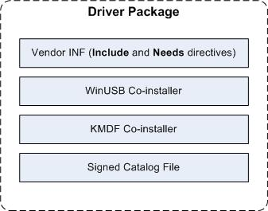

# WinUSB (Winusb.sys) Installation


For certain Universal Serial Bus (USB) devices, such as devices that are accessed by only a single application, you can install [WinUSB](winusb.md) (Winusb.sys) in the device's kernel-mode stack as the USB device's function driver instead of implementing a driver.

This topic contains these sections:

-   [Automatic installation of WinUSB without an INF file](#automatic-installation-of--winusb-without-an-inf-file)
-   [Installing WinUSB by specifying the system-provided device class](#installing-winusb-by-specifying--the-system-provided-device-class)
-   [Writing a custom INF for WinUSB installation](#inf)
-   [How to create a driver package that installs Winusb.sys](#howto)

## <a href="" id="automatic-installation-of--winusb-without-an-inf-file"></a>Automatic installation of WinUSB without an INF file


As an OEM or independent hardware vendor (IHV), you can build your device so that the Winusb.sys gets installed automatically on Windows 8 and later versions of the operating system. Such a device is called a WinUSB device and does not require you to write a custom INF file that references in-box Winusb.inf.

When you connect a WinUSB device, the system reads device information and loads Winusb.sys automatically.

For more information, see [WinUSB Device](automatic-installation-of-winusb.md).

## <a href="" id="installing-winusb-by-specifying--the-system-provided-device-class"></a>Installing WinUSB by specifying the system-provided device class


When you connect your device, you might notice that Windows loads Winusb.sys automatically (if the IHV has defined the device as a WinUSB Device). Otherwise follow these instructions to load the driver:

1.  Plug in your device to the host system.
2.  Open Device Manager and locate the device.
3.  Right-click the device and select **Update driver software...** from the context menu.
4.  In the wizard, select **Browse my computer for driver software**.
5.  Select **Let me pick from a list of device drivers on my computer**.
6.  From the list of device classes, select **Universal Serial Bus devices**.
7.  The wizard displays **WinUsb Device**. Select it to load the driver.

If **Universal Serial Bus devices** does not appear in the list of device classes, then you need to install the driver by using a custom INF.
The preceding procedure does not add a device interface GUID for an app (UWP app or Windows desktop app) to access the device. You must add the GUID manually by following this procedure.

1.  Load the driver as described in the preceding procedure.
2.  Generate a device interface GUID for your device, by using a tool such as guidgen.exe.
3.  Find the registry key for the device under this key:

    **HKEY\_LOCAL\_MACHINE\\SYSTEM\\CurrentControlSet\\Enum\\USB\\&lt;VID\_vvvv&PID\_pppp&gt;**

4.  Under the **Device Parameters** key, add a String registry entry named **DeviceInterfaceGUID** or a Multi-String entry named **DeviceInterfaceGUIDs**. Set the value to the GUID you generated in step 2.
5.  Disconnect the device from the system and reconnect it to the same physical port.
    **Note**  If you change the physical port then you must repeat steps 1 through 4.

     

## <a href="" id="inf"></a>Writing a custom INF for WinUSB installation


As part of the driver package, you provide an .inf file that installs Winusb.sys as the function driver for the USB device.

The following example .inf file shows WinUSB installation for most USB devices with some modifications, such as changing **USB\_Install** in section names to an appropriate *DDInstall* value. You should also change the version, manufacturer, and model sections as necessary. For example, provide an appropriate manufacture's name, the name of your signed catalog file, the correct device class, and the vendor identifier (VID) and product identifier (PID) for the device.

Also notice that the setup class is set to "USBDevice". Vendors can use the "USBDevice" setup class for devices that do not belong to another class and are not USB host controllers or hubs.

If you are installing WinUSB as the function driver for one of the functions in a USB composite device, you must provide the hardware ID that is associated with the function, in the INF. You can obtain the hardware ID for the function from the properties of the devnode in **Device Manager**. The hardware ID string format is "USB\\VID\_vvvv&PID\_pppp".

The following INF installs WinUSB as the OSR USB FX2 board's function driver on a x64-based system.

> Starting in Windows 10, version 1709, the Windows Driver Kit provides [InfVerif.exe](https://docs.microsoft.com/windows-hardware/drivers/devtest/infverif) that you can use to test a driver INF file to make sure there are no syntax issues and the INF file is universal. We recommened that you provide a universal INF. For more information, see [Using a Universal INF File](https://docs.microsoft.com/windows-hardware/drivers/install/using-a-universal-inf-file).

``` syntax
;
;
; Installs WinUsb
;

[Version]
Signature = "$Windows NT$"
Class     = USBDevice
ClassGUID = {88BAE032-5A81-49f0-BC3D-A4FF138216D6}
Provider  = %ManufacturerName%
CatalogFile = WinUSBInstallation.cat
DriverVer=09/04/2012,13.54.20.543

; ========== Manufacturer/Models sections ===========

[Manufacturer]
%ManufacturerName% = Standard,NTamd64

[Standard.NTamd64]
%DeviceName% =USB_Install, USB\VID_0547&PID_1002

; ========== Class definition (for Windows 8 and ealier versions)===========

[ClassInstall32]
AddReg = ClassInstall_AddReg

[ClassInstall_AddReg]
HKR,,,,%ClassName%
HKR,,NoInstallClass,,1
HKR,,IconPath,%REG_MULTI_SZ%,"%systemroot%\system32\setupapi.dll,-20"
HKR,,LowerLogoVersion,,5.2

; =================== Installation ===================

[USB_Install]
Include = winusb.inf
Needs   = WINUSB.NT

[USB_Install.Services]
Include =winusb.inf
Needs   = WINUSB.NT.Services

[USB_Install.HW]
AddReg=Dev_AddReg

[USB_Install.Wdf]
KmdfService=WINUSB, WinUsb_Install

[WinUsb_Install]
KmdfLibraryVersion=1.11

[Dev_AddReg]
HKR,,DeviceInterfaceGUIDs,0x10000,"{9f543223-cede-4fa3-b376-a25ce9a30e74}"

; [DestinationDirs]
; If your INF needs to copy files, you must not use the DefaultDestDir directive here.  
; You must explicitly reference all file-list-section names in this section.

; =================== Strings ===================

[Strings]
ManufacturerName=""
ClassName="Universal Serial Bus devices"
DeviceName="Fx2 Learning Kit Device"
REG_MULTI_SZ = 0x00010000
```
> Only include a ClassInstall32 section in a device INF file to install a new custom device setup class. INF files for devices in an installed class, whether a system-supplied device setup class or a custom class, must not include a ClassInstall32 section. 


Except for device-specific values and several issues that are noted in the following list, you can use these sections and directives to install WinUSB for any USB device. These list items describe the **Includes** and **Directives** in the preceding .inf file.

-   **USB\_Install**: The **Include** and **Needs** directives in the **USB\_Install** section are required for installing WinUSB. You should not modify these directives.
-   **USB\_Install.Services**: The **Include** directive in the **USB\_Install.Services** section includes the system-supplied .inf for WinUSB (WinUSB.inf). This .inf file is installed by the WinUSB co-installer if it isn't already on the target system. The **Needs** directive specifies the section within WinUSB.inf that contains information required to install Winusb.sys as the device's function driver. You should not modify these directives.
    **Note**  Because Windows XP doesn't provide WinUSB.inf, the file must either be copied to Windows XP systems by the co-installer, or you should provide a separate decorated section for Windows XP.

     

-   **USB\_Install.HW**: This section is the key in the .inf file. It specifies the device interface globally unique identifier (GUID) for your device. The **AddReg** directive sets the specified interface GUID in a standard registry value. When Winusb.sys is loaded as the device's function driver, it reads the registry value DeviceInterfaceGUIDs key and uses the specified GUID to represent the device interface. You should replace the GUID in this example with one that you create specifically for your device. If the protocols for the device change, create a new device interface GUID.

    **Note**  User-mode software must call [**SetupDiGetClassDevs**](https://msdn.microsoft.com/library/windows/hardware/ff551069) to enumerate the registered device interfaces that are associated with one of the device interface classes specified under the DeviceInterfaceGUIDs key. **SetupDiGetClassDevs** returns the device handle for the device that the user-mode software must then pass to the [**WinUsb\_Initialize**](https://msdn.microsoft.com/library/windows/hardware/ff540277) routine to obtain a WinUSB handle for the device interface. For more info about these routines, see [How to Access a USB Device by Using WinUSB Functions](using-winusb-api-to-communicate-with-a-usb-device.md).

The following INF installs WinUSB as the OSR USB FX2 board's function driver on a x64-based system. The example shows INF with WDF coinstallers.

``` syntax
;
;
; Installs WinUsb
;

[Version]
Signature = "$Windows NT$"
Class     = USBDevice
ClassGUID = {88BAE032-5A81-49f0-BC3D-A4FF138216D6}
Provider  = %ManufacturerName%
CatalogFile = WinUSBInstallation.cat
DriverVer=09/04/2012,13.54.20.543

; ========== Manufacturer/Models sections ===========

[Manufacturer]
%ManufacturerName% = Standard,NTamd64

[Standard.NTamd64]
%DeviceName% =USB_Install, USB\VID_0547&PID_1002

; ========== Class definition (for Windows 8 and ealier versions) ===========

[ClassInstall32]
AddReg = ClassInstall_AddReg

[ClassInstall_AddReg]
HKR,,,,%ClassName%
HKR,,NoInstallClass,,1
HKR,,IconPath,%REG_MULTI_SZ%,"%systemroot%\system32\setupapi.dll,-20"
HKR,,LowerLogoVersion,,5.2

; =================== Installation ===================

[USB_Install]
Include = winusb.inf
Needs   = WINUSB.NT

[USB_Install.Services]
Include =winusb.inf
Needs   = WINUSB.NT.Services

[USB_Install.HW]
AddReg=Dev_AddReg

[Dev_AddReg]
HKR,,DeviceInterfaceGUIDs,0x10000,"{9f543223-cede-4fa3-b376-a25ce9a30e74}"

[USB_Install.CoInstallers]
AddReg=CoInstallers_AddReg
CopyFiles=CoInstallers_CopyFiles

[CoInstallers_AddReg]
HKR,,CoInstallers32,0x00010000,"WdfCoInstaller01011.dll,WdfCoInstaller","WinUsbCoInstaller2.dll"

[CoInstallers_CopyFiles]
WinUsbCoInstaller2.dll
WdfCoInstaller01011.dll

[DestinationDirs]
; If your INF needs to copy files, you must not use the DefaultDestDir directive here.  
CoInstallers_CopyFiles=11
; ================= Source Media Section =====================

[SourceDisksNames]
1 = %DiskName%

[SourceDisksFiles]
WinUsbCoInstaller2.dll=1
WdfCoInstaller01011.dll=1


; =================== Strings ===================

[Strings]
ManufacturerName=""
ClassName="Universal Serial Bus devices"
DeviceName="Fx2 Learning Kit Device"
DiskName="MyDisk"
REG_MULTI_SZ = 0x00010000
```

-   **USB\_Install.CoInstallers**: This section, which includes the referenced **AddReg** and **CopyFiles** sections, contains data and instructions to install the WinUSB and KMDF co-installers and associate them with the device. Most USB devices can use these sections and directives without modification.
-   The x86-based and x64-based versions of Windows have separate co-installers.

    **Note**  Each co-installer has free and checked versions. Use the free version to install WinUSB on free builds of Windows, including all retail versions. Use the checked version (with the "\_chk" suffix) to install WinUSB on checked builds of Windows.

Each time Winusb.sys loads, it registers a device interface that has the device interface classes that are specified in the registry under the **DeviceInterfaceGUIDs** key.

``` syntax
HKR,,DeviceInterfaceGUIDs, 0x10000,"{D696BFEB-1734-417d-8A04-86D01071C512}"
```

**Note**  If you use the redistributable WinUSB package for Windows XP or Windows Server 2003, make sure that you don't uninstall WinUSB in your uninstall packages. Other USB devices might be using WinUSB, so its binaries must remain in the shared folder.

 

## <a href="" id="howto"></a>How to create a driver package that installs Winusb.sys


To use WinUSB as the device's function driver, you create a driver package. The driver package must contain these files:

-   WinUSB co-installer (Winusbcoinstaller.dll)
-   KMDF co-installer (WdfcoinstallerXXX.dll)
-   An .inf file that installs Winusb.sys as the device's function driver. For more information, see [Writing an .Inf File for WinUSB Installation](#inf).
-   A signed catalog file for the package. This file is required to install WinUSB on x64 versions of Windows starting with Vista.



**Note**  Make sure that the driver package contents meet these requirements:
-   The KMDF and WinUSB co-installer files must be obtained from the same version of the Windows Driver Kit (WDK).
-   The co-installer files must be obtained from the latest version of the WDK, so that the driver supports all the latest Windows releases.
-   The contents of the driver package must be digitally signed with a Winqual release signature. For more info about how to create and test signed catalog files, see [Kernel-Mode Code Signing Walkthrough](http://go.microsoft.com/fwlink/p/?linkid=129409) on the Windows Dev Center - Hardware site.

 

1. [Download the Windows Driver Kit (WDK)](https://docs.microsoft.com/windows-hardware/drivers/download-the-wdk) and install it.
2. Create a driver package folder on the machine that the USB device is connected to. For example, c:\\UsbDevice.
3. Copy the WinUSB co-installer (WinusbcoinstallerX.dll) from the **WinDDK\\**<em>BuildNumber</em>**\\redist\\winusb** folder to the driver package folder.

   The WinUSB co-installer (Winusbcoinstaller.dll) installs WinUSB on the target system, if necessary. The WDK includes three versions of the co-installer depending on the system architecture: x86-based, x64-based, and Itanium-based systems. They are all named WinusbcoinstallerX.dll and are located in the appropriate subdirectory in the **WinDDK\\**<em>BuildNumber</em>**\\redist\\winusb** folder.

4. Copy the KMDF co-installer (WdfcoinstallerXXX.dll) from the **WinDDK\\**<em>BuildNumber</em>**\\redist\\wdf** folder to the driver package folder.

   The KMDF co-installer (WdfcoinstallerXXX.dll) installs the correct version of KMDF on the target system, if necessary. The version of WinUSB co-installer must match the KMDF co-installer because KMDF-based client drivers, such as Winusb.sys, require the corresponding version of the KMDF framework to be installed properly on the system. For example, Winusbcoinstaller2.dll requires KMDF version 1.9, which is installed by Wdfcoinstaller01009.dll. The x86 and x64 versions of WdfcoinstallerXXX.dll are included with the WDK under the **WinDDK\\**<em>BuildNumber</em>**\\redist\\wdf** folder. The following table shows the WinUSB co-installer and the associated KMDF co-installer to use on the target system.

   Use this table to determine the WinUSB co-installer and the associated KMDF co-installer.

   <table>
   <colgroup>
   <col width="33%" />
   <col width="33%" />
   <col width="33%" />
   </colgroup>
   <thead>
   <tr class="header">
   <th>WinUSB co-installer</th>
   <th>KMDF library version</th>
   <th>KMDF co-installer</th>
   </tr>
   </thead>
   <tbody>
   <tr class="odd">
   <td>Winusbcoinstaller.dll</td>
   <td>Requires KMDF version 1.5 or later</td>
   <td><p>Wdfcoinstaller01005.dll</p>
   <p>Wdfcoinstaller01007.dll</p>
   <p>Wdfcoinstaller01009.dll</p></td>
   </tr>
   <tr class="even">
   <td>Winusbcoinstaller2.dll</td>
   <td>Requires KMDF version 1.9 or later</td>
   <td>Wdfcoinstaller01009.dll</td>
   </tr>
   <tr class="odd">
   <td>Winusbcoinstaller2.dll</td>
   <td>Requires KMDF version 1.11 or later</td>
   <td>WdfCoInstaller01011.dll</td>
   </tr>
   </tbody>
   </table>

     

5. Write an .inf file that installs Winusb.sys as the function driver for the USB device.
6. Create a signed catalog file for the package. This file is required to install WinUSB on x64 versions of Windows.
7. Attach the USB device to your computer.
8. Open **Device Manager** to install the driver. Follow the instructions on the **Update Driver Software** wizard and choose manual installation. You will need to provide the location of the driver package folder to complete the installation.

## Related topics
[WinUSB Architecture and Modules](winusb-architecture.md)  
[Choosing a driver model for developing a USB client driver](winusb-considerations.md)  
[How to Access a USB Device by Using WinUSB Functions](using-winusb-api-to-communicate-with-a-usb-device.md)  
[WinUSB Power Management](winusb-power-management.md)  
[WinUSB Functions for Pipe Policy Modification](winusb-functions-for-pipe-policy-modification.md)  
[WinUSB Functions](https://msdn.microsoft.com/library/windows/hardware/ff540046#winusb)  
[WinUSB](winusb.md)  


