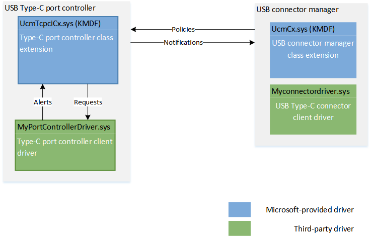

# Write a USB Type-C port controller driver

A USB Type-C (UcmCx) client driver handles the complexity of managing the USB Type-C connector and USB Power Delivery (PD) state machines. In Windows 10, version 1703, the architecture for USB Type-C support has been improved. The PD/Type-C state logic is now built into a new compoment in the operating system, called the Device Policy Manager (DPM). That improvement allows for you to write a lightweight Type-C driver that only communicates with the hardware and reports events to the system. The client-facing end of DPM is a new class extension, called USB Connector Manager Type-C Port Controller Interface Class Extension (UcmTcpciCx). Your client driver only needs to keep class extension informed about the hardware events. That communication is enabled through a set of programming interfaces described in this topic and in the reference section.

**Summary**
- Port controller object used by the class extension and client driver
- Services provided by the UCM class extension
- Expected behavior of the client driver

**Official specifications**
-   [USB Type-C Port Controller Interface Specification]
-   [USB 3.1 and USB Type-C specifications](http://go.microsoft.com/fwlink/p/?LinkId=699515)
-   [USB Power Delivery](http://go.microsoft.com/fwlink/p/?LinkID=623310)

Applies to:

- Windows 10

**WDF version**

-   KMDF version 1.15.
-   UMDF version 2.15

**Last updated:**

-   April 2017

**Important APIs**

[USB Type-C Port Controller Interface driver class extensions reference]

## Before you begin...

-   [Install](http://go.microsoft.com/fwlink/p/?LinkID=623310) the latest Windows Driver Kit (WDK) on your development computer. The kit has the required header files and libraries for writing a UCM client driver, specifically, you'll need:

    -   The stub library, (UcmCxstub.lib). The library translates calls made by the client driver and pass them up to UcmCx.
    -   The header file, UcmCx.h.

    You can write a UCM client driver that runs in user mode or kernel mode. For user mode, it binds with the UMDF 2.x library; for kernel mode it's KMDF 1.15. Programming interfaces are identical for either mode.

    
